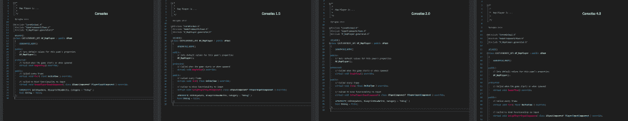

# Visual Studio 中的行距

> 原文：<https://dev.to/alexhajdu/line-spacing-in-visual-studio-45cj>

Visual Studio 不像它的兄弟 VSCode 那样花哨。我没意见，没问题。

**但是嘿，我们到底为什么连行距都设置不了！？**

对我个人来说，行距是一个必须具备的特性——这是迈向代码可读性的一大步。

总之，我们长话短说。在下面的存储库中，您可以下载这个缺失特性的解决方法。你的眼睛会很开心:)

A.

## [alexhajdu](https://github.com/alexhajdu)/[visual-studio-font](https://github.com/alexhajdu/visual-studio-fonts)

### Visual Studio 中缺少行距功能的解决方法。

<article class="markdown-body entry-content container-lg" itemprop="text">

# 关于

Visual Studio 中缺少行距功能的解决方法。

[T2】](https://raw.githubusercontent.com/alexhajdu/visual-studio-fonts/master/Preview.png?raw=true)

</article>

[View on GitHub](https://github.com/alexhajdu/visual-studio-fonts)