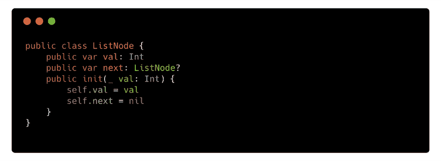
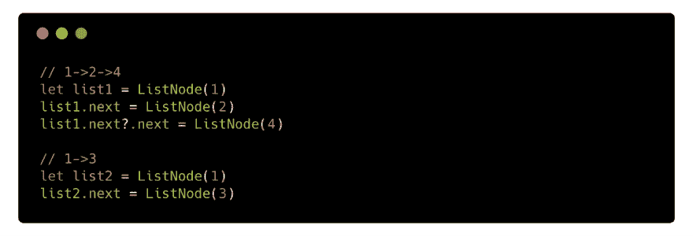
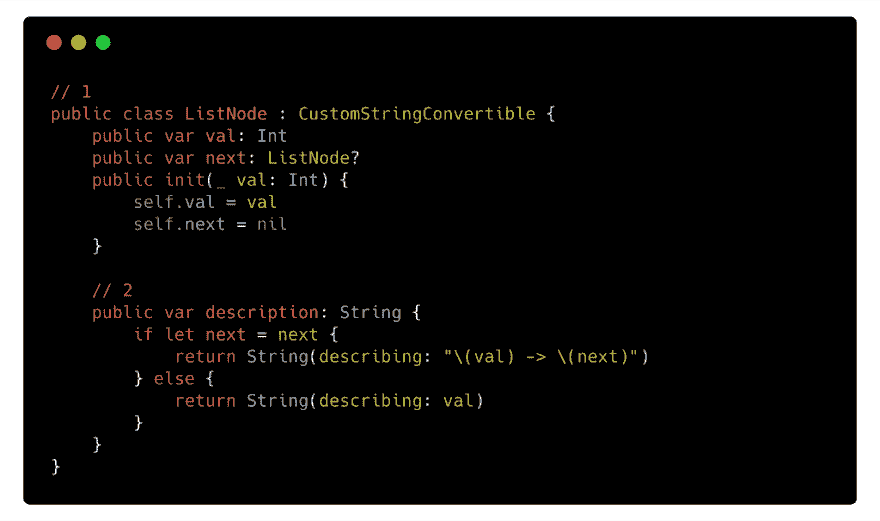
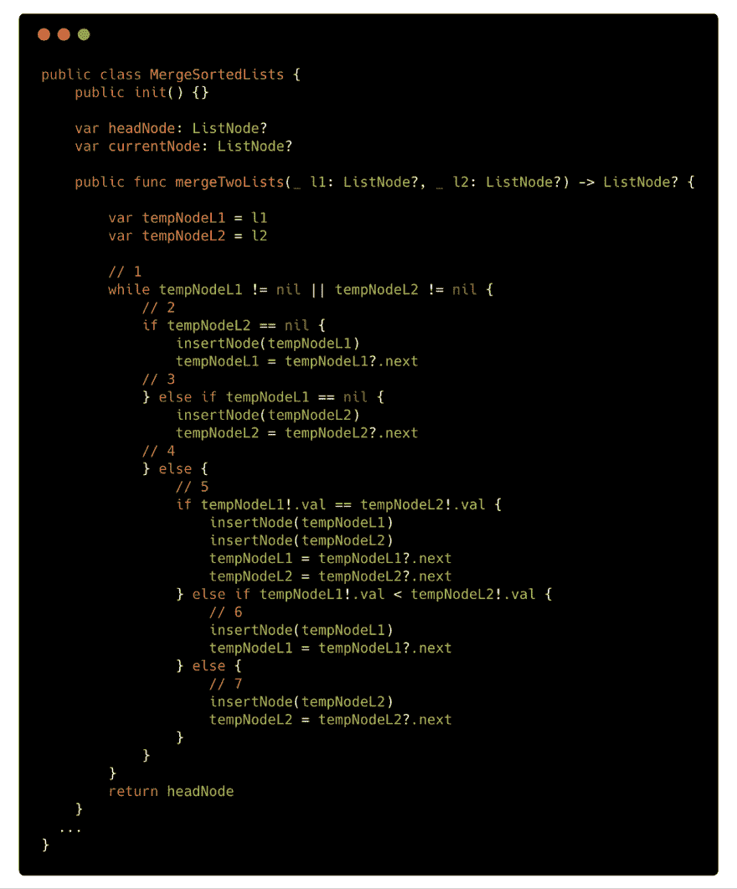
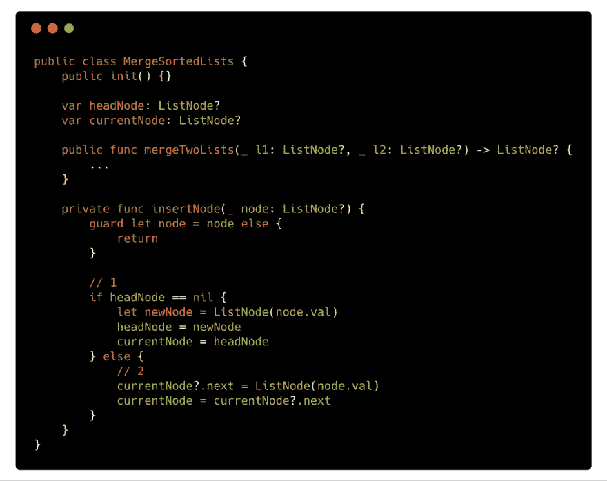

# Swift 中的链表

> 原文：<https://dev.to/tiptopgs/linked-lists-in-swift-21mb>

什么是数据结构？这是一种在内存中存储和组织数据的方式。不同的数据结构(例如，数组、堆栈、队列等。)用不同的方式组织数据。今天，你将从时间和空间的复杂性以及一个例子来看链表。

链表是一种线性数据结构或值的集合，它们都是按顺序存储的。当插入和删除的时间复杂度为 O(1)比 O(n)时，它们比数组更有效。数组中的低效率是由于在插入或删除后移动元素，因此是 O(n)。就空间复杂度而言，无论数组是否包含元素，存储都被数组占用在内存中。当追加到数组末尾并达到容量时，新数组和从现有数组复制的值会使空间加倍。对于链表，空间复杂度也是 O(n ),因为你必须跟踪额外的指针，这些指针占用空间。

现在让我们看一些代码。要创建整数的链表数据结构，它可以是这样的:

 

<figcaption>链表实例</figcaption>

在链表中，你有一个对下一个节点的引用和一个当前节点的值。

要将数据插入 ListNode，可以执行以下操作:

[T2】](https://res.cloudinary.com/practicaldev/image/fetch/s--rWsyBWLH--/c_limit%2Cf_auto%2Cfl_progressive%2Cq_auto%2Cw_880/https://cdn-images-1.medium.com/max/1024/1%2AxXKnFpDd4M3u-A3fZLYDMw.png)

在上面的例子中，您创建了两个列表:list1 和 list2。检查您是否正确地插入了元素是一个好主意。让我们开始吧。最近，我从 Kevin Lau 和 Vincent Ngo 关于 Swift 中的[数据结构和算法的书中，学会了一种打印链表中的值的简洁方法。让我们进入代码，然后我会解释我们做了什么。](https://store.raywenderlich.com/products/data-structures-and-algorithms-in-swift)

 

<figcaption>使用 CustomStringConvertible</figcaption>

在上面的代码中，首先遵循 CustomStringCovertible 协议，然后实现描述。描述实现使用字符串插值来打印节点的值和下一个节点的值。因此，当您将 ListNode 传递给 String(descripting:)初始化器时，print(_:)函数将使用描述返回的值。查看上面的示例，列表打印如下:

T3】打印链表中的元素

让我们扩展这个例子，将两个列表合并成一个排序列表。你可以假设每个列表都是有序的。您将处理三个案例:

1.  两个列表中的元素数量不同
2.  列表中的值相同
3.  列表中的不同值

一种解决方案可能是这样的:

 

<figcaption>将两个排序链表合并成一个排序链表</figcaption>

事情是这样的:

您将创建临时节点来引用这两个排序列表，并执行以下操作:

1.  只要它们中的任何一个包含值或者是非空的，就可以循环遍历列表。
2.  如果第二个列表中的节点是 nil，您将使用 insertNodefunction 将第一个列表中的节点插入到结果链表 headNode 中，稍后您将看到 insertNode 是如何实现的。您将使临时指针前进到第一个列表中的下一个元素。
3.  对第一个列表中的节点重复与步骤 2 相似的检查，并将临时指针指向第二个列表中的下一个元素。
4.  else 将检查两个元素何时都不为零
5.  如果列表中的两个值相等，那么将它们都插入到结果链表中，并将两个临时指针都推进到下一个节点。
6.  如果第一个列表中的节点小于第二个列表中的节点，则插入第一个列表中的节点，并将临时指针前进到下一个节点。
7.  相反，当第二个列表中的节点较小时，您可以执行相反的操作。

insertNode 函数如下所示:

 

<figcaption>将节点插入链表</figcaption>

insertNode 逻辑有两个部分:

1.  headNode 指向结果链表的头元素。因此，如果它是 nil，您将使用给定的值创建一个新节点，并将其插入到结果链表中。当您插入每个新节点时，currentNode 将指向当前节点。
2.  如果 headNode 包含一个节点或者非零，则创建一个具有给定值的新节点，并作为结果链表的下一个节点插入。将当前节点引用推进到下一个节点。

总的来说，插入是 O(1)常数时间。这是通过跟踪最近插入的节点来实现的。最后但同样重要的是，这是合并列表的打印解决方案:

[T2】](https://res.cloudinary.com/practicaldev/image/fetch/s--AciICdaI--/c_limit%2Cf_auto%2Cfl_progressive%2Cq_auto%2Cw_880/https://cdn-images-1.medium.com/max/1024/1%2Ab3_zCjsGUEdZuzh4uSvEiA.png)

### 从这里去哪里？

探索 Kevin Lau 和 Vincent Ngo 关于 Swift 中[数据结构和算法的书中的其他主题。](https://store.raywenderlich.com/products/data-structures-and-algorithms-in-swift)