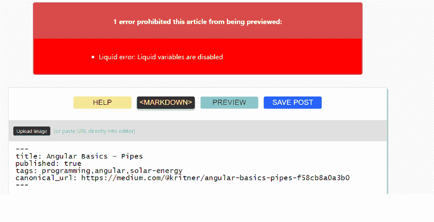

# 液体错误，救命！

> 原文：<https://dev.to/kritner/liquid-error-help-2h1a>

根据来自[约翰·卡罗尔](https://dev.to/johncarroll)的[评论](https://dev.to/johncarroll/comment/5gic)中的建议，我在查看旧帖子，给我的代码块添加语言注释。

这似乎进行得很顺利，直到我看到下面两个帖子:

*   [https://dev.to/kritner/angular-basics-pipes-180](https://dev.to/kritner/angular-basics--pipes-180)
*   [https://dev.to/kritner/angular-basics-结合-5dn8](https://dev.to/kritner/angular-basics--binding-5dn8)

在这两篇文章中，似乎在“预览”编辑内容时，我看到了以下错误:

[T2】](https://res.cloudinary.com/practicaldev/image/fetch/s--6zgSW4Az--/c_limit%2Cf_auto%2Cfl_progressive%2Cq_auto%2Cw_880/https://thepracticaldev.s3.amazonaws.com/i/4hqvo5yng6tv7iuwkop8.png)

这两个帖子的错误似乎是在做预览时(例如编辑前)立即出现的，但我不确定这是否是因为我之前已经保存了我没有考虑的编辑。

有人有什么想法吗？

编辑:

我发现这两种情况下的问题都是由于`{{ ... }}`的非代码片段实例——我想它认为我试图在页面上绑定数据，因为它没有包含在代码片段中？