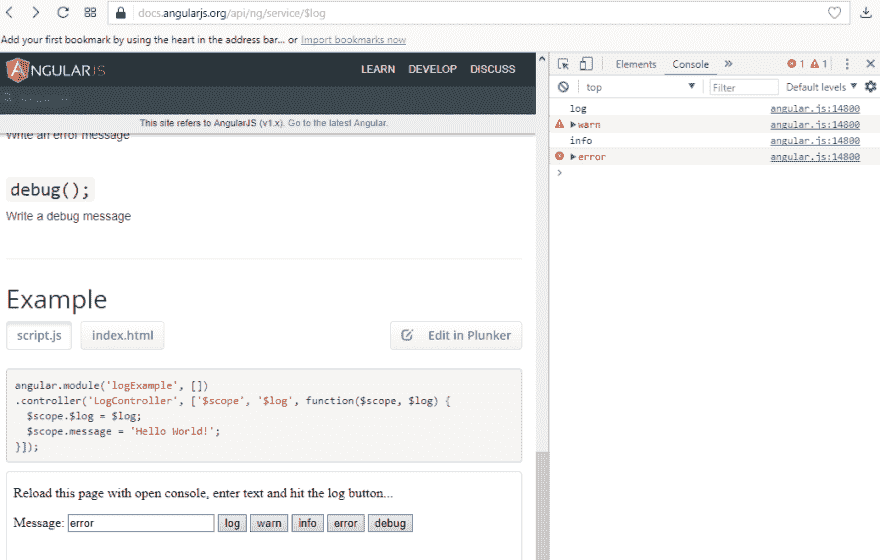
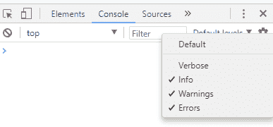

# AngularJS 1.x 中的日志记录

> 原文：<https://dev.to/codeprototype/logging-in-angularjs-1x--3ln>

在代码投入生产之前，很容易被忽略和遗忘。当然，在生产中，控制台要尽可能的干净。但偶尔，为了快速排除故障，临时打开它们也不错。

AngularJS 已经有了一个名为 [`$log`](https://docs.angularjs.org/api/ng/service/%24log) 的服务，但是它的问题是没有显示正确的文件和行号。

[T2】](https://res.cloudinary.com/practicaldev/image/fetch/s--RGTJ1s17--/c_limit%2Cf_auto%2Cfl_progressive%2Cq_auto%2Cw_880/https://thepracticaldev.s3.amazonaws.com/i/dqpn8s67we7go10lgfif.png)

所以我想到了一个快速的解决方法。让我们称这个服务为`loggingService`。它包含一种指示是否启用日志记录的方式。因为即使在用户刷新浏览器之后，服务也必须记住这一点，所以这不能是一个简单的标志。而是必须坚持到`local storage`。下面是这项服务是如何实现的:

```
(function () {
  'use strict';
  angular.module('myapp').
    factory('loggingService', ['$window',
      function ($window) {
        const storage = $window.localStorage;
        const debug = {
          debug: $window.console.debug.bind($window.console, 'debug: %s'),
          log: $window.console.log.bind($window.console, 'log: %s'),          
          info: $window.console.info.bind($window.console, 'info: %s'),
          warn: $window.console.warn.bind($window.console, 'warn: %s'),
          error: $window.console.error.bind($window.console, 'error: %s'),
        };        
        const noOp = {
          debug(){},
          log(){},
          info(){},          
          warn(){},
          error(){},          
        };
        return {
          setEnable(enabled) {            
            storage.setItem('enable_logging', enabled);
          },
          console() {
            return storage.getItem('enable_logging') === 'true' ? debug : noOp;
          },
          getEnable() {
            return storage.getItem('enable_logging') === 'true' ? true : false;
          },
        }
       }
      },
  ]);
})(); 
```

然后在其他的角度服务和控制器中，我只需要注入这个`loggingService`，无论`console.log`在哪里被调用，我只需要用`loggingService.console().log`或`loggingService.console().info`或`loggingService.console().warn`或其他方法替换。它只在文件和行号正确的情况下工作。但是比以前更好的是，在开发人员工具控制台中，我现在还可以过滤这些消息。

[T2】](https://res.cloudinary.com/practicaldev/image/fetch/s--Qv2j22Bp--/c_limit%2Cf_auto%2Cfl_progressive%2Cq_auto%2Cw_880/https://thepracticaldev.s3.amazonaws.com/i/dswsd1cb3h0sjrpvls7q.png)