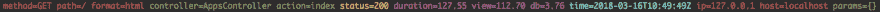

# 用结构和颜色记录 Rails 请求

> 原文：<https://dev.to/rhymes/logging-rails-requests-with-structure-and-colors--ing>

在一篇关于 Flask 和 Python 的[相关文章中，我解释了如何用 Python 构建请求日志。](https://dev.to/rhymes/logging-flask-requests-with-colors-and-structure--7g1)

Rails 已经有了很棒的 [lograge](https://github.com/roidrage/lograge) ，但是我们如何利用它并给字符串添加 ANSI 颜色呢？

幸运的是，lograge 支持定制格式化程序:

```
Rails.application.configure do
  config.lograge.enabled = true
  config.lograge.formatter = YourOwnFormatter.new
end 
```

Enter fullscreen mode Exit fullscreen mode

所以我创建了一个新的格式化程序来添加颜色，就像这样:

```
require 'colorized_string'

class ColorKeyValue < Lograge::Formatters::KeyValue
  FIELDS_COLORS = {
    method: :red,
    path: :red,
    format: :red,
    controller: :green,
    action: :green,
    status: :yellow,
    duration: :magenta,
    view: :magenta,
    db: :magenta,
    time: :cyan,
    ip: :red,
    host: :red,
    params: :green
  }

  def format(key, value)
    line = super(key, value)

    color = FIELDS_COLORS[key] || :default
    ColorizedString.new(line).public_send(color)
  end
end 
```

Enter fullscreen mode Exit fullscreen mode

我承认对每个参数进行颜色编码可能有点过分，但是我觉得很有趣:-D

`require 'colorized_string'`和`ColorizedString`是[着色](https://github.com/fazibear/colorize)库的一部分。

这是结果:

[T2】](https://res.cloudinary.com/practicaldev/image/fetch/s--yzTftAxZ--/c_limit%2Cf_auto%2Cfl_progressive%2Cq_auto%2Cw_880/https://thepracticaldev.s3.amazonaws.com/i/uul3vln56n30ror4ncyi.png)