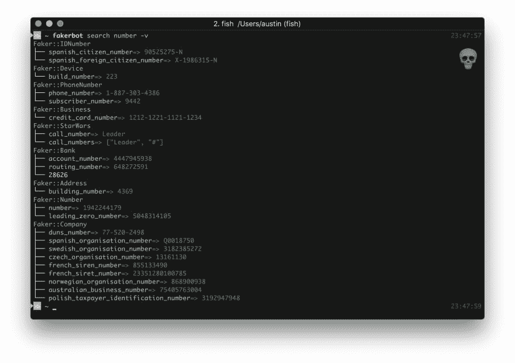
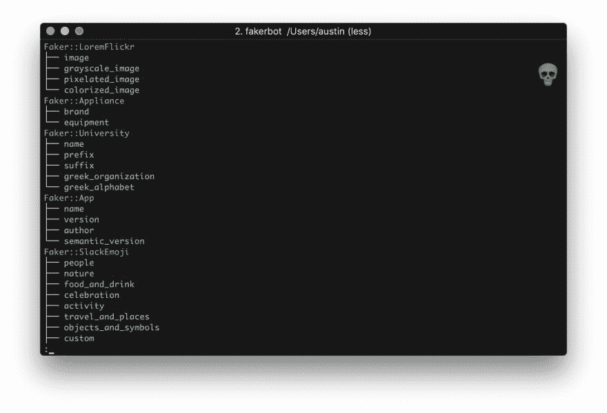

# 在你的终端上查找 faker 方法

> 原文：<https://dev.to/akabiru/look-up-faker-methods-on-your-terminal-2p7f>

我是 Faker Gem 的超级粉丝，我在任何地方都使用它。然而，有时当我不确定一个方法的名称空间或者我不确定有什么可用的时候，我发现自己在翻 Faker 的 ReadMe *(顺便说一句，这很棒)*。

我一直希望我有办法在我的终端上搜索 faker。

> 良好的...`gem install fakerbot`！😉

fakerbot 是一个 cli 工具，可以做到这一点。它反映了 [faker 的](https://github.com/stympy/faker)对象空间暴露查找&列表功能。

说得够多了，让我们来看看实际情况。

```
$ fakebot search number -v 
```

Enter fullscreen mode Exit fullscreen mode

[](https://res.cloudinary.com/practicaldev/image/fetch/s--iCG85ks7--/c_limit%2Cf_auto%2Cfl_progressive%2Cq_auto%2Cw_880/https://thepracticaldev.s3.amazonaws.com/i/w6qas7os5aydm4mnvec0.jpg)T3】

```
$ fakerbot list 
```

Enter fullscreen mode Exit fullscreen mode

[T2】](https://res.cloudinary.com/practicaldev/image/fetch/s--SLJROOQs--/c_limit%2Cf_auto%2Cfl_progressive%2Cq_auto%2Cw_880/https://thepracticaldev.s3.amazonaws.com/i/7fk2yvzsutsi7pj4a8rn.jpg)

*更多[使用说明](https://github.com/akabiru/fakerbot#usage)可以在自述文件上找到。*

如果这看起来让你感兴趣，不要害羞！请访问 [repo](https://github.com/akabiru/fakerbot#usage) ，投稿，建议一个功能，添加测试，✨等

我希望这个工具能让你的开发生活变得简单一点，就像我的一样。干杯！🍺