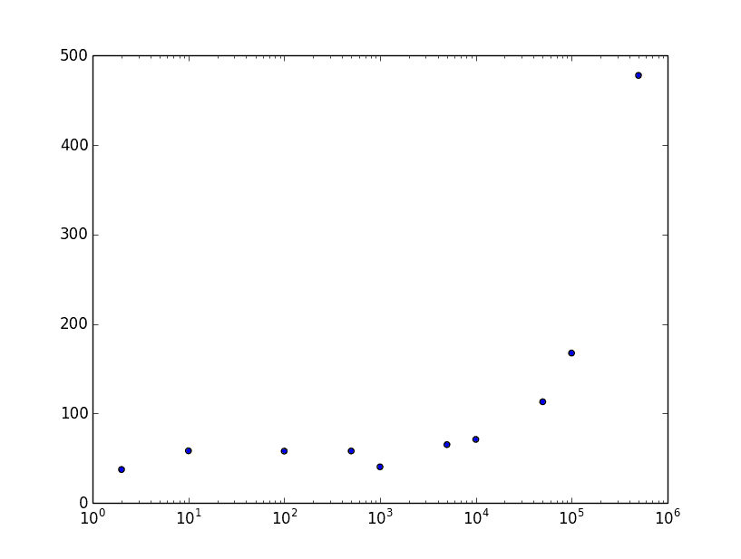

# 幸运数字和科学

> 原文：<https://dev.to/rpalo/lucky-numbers-and-science--46mj>

本周早些时候， [Heiko Dudzus](https://dev.to/heikodudzus) 在 Dev.to 上发布了[这个挑战帖子](https://dev.to/heikodudzus/write-a-program-or-script-to-find-lucky-numbers--23me)，挑战是这样的:

> 用你选择的语言写一个程序或脚本，打印 1 到 n 之间的幸运数字。试着尽可能快地筛选 1 到 100 万之间的幸运数字。(也许测量时间而不打印结果是明智的。)

一个幸运数字被定义为一个能通过约瑟夫斯筛子[的数字。我在这里引用原帖，这样你就明白了。](https://en.wikipedia.org/wiki/Lucky_number)

> 根据定义，1 是幸运的。
> 
> 1 的后继者是 2。因此，每隔一个数字就会被删除:
> 1，3，5，7，9，11，13，15，17，19，21，...
> 
> 下一个数字是 3。现在，每三个数字中就有一个被剔除:1，3，7，9，13，15，19，21，...
> 
> 3 号是幸运的！它的[原文]继任者是 7。现在，每七个数字中就有一个被淘汰。诸如此类。

更多详情请见上面的链接。我建议你在阅读这篇文章的其余部分之前尝试一下这个挑战，因为我将告诉你我的解决方案。

我提出了两个解决方案，但最好的解决方案最终是两者的有趣结合。你会明白我的意思。

## 解决方案 1:天真地运行算法

我喜欢“让它工作，让它正确，让它快速”这句话，据我所知，这是肯特·贝克说的。因此，我的第一个解决方案专注于按照提供的问题编写代码，简单的方法，不管这是不是最快的方法。

```
def lucky_numbers(max)
  possibles = (1..max).to_a
  1.step do |current_index|
    break if current_index >= possibles.size

    step_size = possibles[current_index]
    possibles = reject_every_nth_item(possibles, step_size)

    # If current_index is one of the items to get wiped out
    # the same current index will actually point at the next
    # number.  Reuse this index.
    redo if wiped_out?(ind, step_size)
  end
  possibles
end

def reject_every_nth_item(items, n)
  items.reject.each_with_index do |_, ind|
    ((ind + 1) % n).zero?
  end
end

def wiped_out?(ind, step_size)
  ((ind + 1) % step_size).zero?
end 
```

Enter fullscreen mode Exit fullscreen mode

当我跑的时候，我为自己感到骄傲。然后我用`max = 1_000_000`跑了一下。我坐着。我坐在…

这花的时间太长了！我可以做得更好。

## 解决方案 2:关注被保留者，而不是被拒绝者

当我进行试验和测试时，我注意到，在较高的值`step_size`下，朴素算法只是偶尔拒绝一个数字。所以我对自己说，“如果我们可以把步长从等式中去掉，让每一步花费大致相同的时间，不管它有多少个元素，会怎么样？”因此，我没有检查每一件商品看它是否被拒绝，而是计算出了*未被拒绝的*数字块的大小，并将它们复制到一个`results`数组中，忽略了拒绝而不是显式拒绝它们。

```
def lucky_numbers(max)
  possibles = (1..max).to_a
  1.step do |current_index|
    break if current_index >= possibles.size

    step_size = possibles[current_index]
    possibles = grab_chunks_between_rejects(possibles, step_size)

    redo if wiped_out?(current_index, step_size)
  end
  possibles
end

def grab_chunks_between_rejects(items, n)
  chunk_count = (items.size / n).floor

  # The new array will be the same size minus one reject item
  # for every chunk possible
  result = Array.new(items.size - chunk_count)
  chunk_target_index = 0

  # Some tricky indexing...
  # 1) Select chunks of size n - 1 (so as to not include the reject endpoint)
  # 2) Copy it into the results array
  # 3) Continue, each chunk after the one in front of it.
  (0...items.size).step(n) do |chunk_start|
    chunk = items[chunk_start...(chunk_start + n - 1)]
    result[chunk_target_index...(chunk_target_index + chunk.size)] = chunk
    chunk_target_index += chunk.size
  end
  result
end

def wiped_out?(ind, step_size)
  ((ind + 1) % step_size).zero?
end 
```

Enter fullscreen mode Exit fullscreen mode

这个效果很好！即使在我的小笔记本电脑上，它也运行得相对较快(别担心，基准测试即将到来)。但是有些事情感觉很奇怪。我的程序员感觉很兴奋。

在这一点上，我没有证据，但似乎每个“回合”的第二个数组的所有设置和创建都会导致该算法在小的`step_size` s 时表现不佳。正是在这一点上，这不再是一个代码挑战，而是一个科学实验。

## 方案三:两者结合

> 假设:对于我的两种解决方案，低端和高端之间存在性能权衡。因此，应该有一个两者的组合，它比单独使用任何一个都要快。

如果在两种解决方案之间有*和*的权衡，我将能够运行一些测试并找到最佳的可能组合。我很快更新了我的`lucky_numbers`方法。

```
def lucky_numbers(max, strategy_switch = 10)
  possibles = (1..max).to_a
  1.step do |current_index|
    break if current_index >= possibles.size

    step_size = possibles[current_index]

    # Calculate next round of numbers
    possibles = if step_size <= strategy_switch
                  reject_every_nth_item(possibles, step_size)
                else
                  grab_chunks_between_rejects(possibles, step_size)
                end

    redo if wiped_out?(current_index, step_size)
  end
  possibles
end 
```

Enter fullscreen mode Exit fullscreen mode

现在来收集一些数据！为了清楚起见，我将每个函数包装在一个模块中，以区分它们。

[](https://res.cloudinary.com/practicaldev/image/fetch/s--W1H73Ary--/c_limit%2Cf_auto%2Cfl_progressive%2Cq_66%2Cw_880/https://assertnotmagic.com/img/data-data-data.gif)T3】

```
require "benchmark"

require_relative "lucky_numbers3"

max_nums = 1_000_000
switch_levels = [
  2,
  10,
  100,
  500,
  1000,
  5000,
  10_000,
  50_000,
  100_000,
  500_000,
]

Benchmark.bm do |bm|
  switch_levels.each do |level|
    bm.report(level.to_i) do
      Lucky3::lucky_numbers(max_nums, level)
    end
  end
end

# ▶ ruby optimize_lucky3.rb
#        user     system      total        real
#      2 17.550718  21.655086  39.205804 ( 39.535233)
#     10 18.351711  23.234818  41.586529 ( 42.615220)
#    100 18.443557  22.266405  40.709962 ( 41.178138)
#    500 20.278373  23.325708  43.604081 ( 44.987643)
#   1000 20.725864  22.510307  43.236171 ( 43.617160)
#   5000 27.245503  21.725938  48.971441 ( 49.304915)
#  10000 33.828295  22.476806  56.305101 ( 56.742865)
#  50000 82.069851  37.399753 119.469604 (120.174670)
# 100000 120.410101  23.425739 143.835840 (144.841090)
# 500000 445.835956  31.520488 477.356444 (483.688845) 
```

Enter fullscreen mode Exit fullscreen mode

没有情节的科学实验是不完整的！不幸的是，Ruby 中的数据可视化故事(在 web 之外)没有 Python 中的那么轻松。幸运的是，我找到了 Python 的`matplotlib`的包装器，所以我现在可以留在 Ruby land。请注意，我在 X 轴上使用了基于对数的刻度，以便更好地显示我的结果。

```
# plot_lucky3.rb

require "matplotlib/pyplot"

plt = Matplotlib::Pyplot

xs = [2, 10, 100, 500, 1000, 5000, 10_000, 50_000, 100_000, 500_000]
ys = [
  39.54,
  42.62,
  41.18,
  44.99,
  43.62,
  49.30,
  56.74,
  120.17,
  144.84,
  483.69,
]
ax = plt.gca()
ax.scatter(xs, ys)
ax.set_xscale('log')
plt.show() 
```

Enter fullscreen mode Exit fullscreen mode

[T2】](https://res.cloudinary.com/practicaldev/image/fetch/s--Gdijtfju--/c_limit%2Cf_auto%2Cfl_progressive%2Cq_auto%2Cw_880/https://assertnotmagic.com/img/lucky3-results.png)

这是让我困惑的部分。我已经多次运行这个实验，我总是在 1000 点左右结束。我们一会儿会谈到这一点。下面是直接比较的每个解决方案的基准。

```
require "benchmark"

require_relative "lucky_numbers"
require_relative "lucky_numbers2"
require_relative "lucky_numbers3"

iterations = 1_000_000

Benchmark.bm do |bm|
  bm.report("Version 1") do
    Lucky1::lucky_numbers(iterations)
  end

  bm.report("Version 2") do
    Lucky2::lucky_numbers(iterations)
  end

  bm.report("Version 3") do
    Lucky3::lucky_numbers(iterations, 1000)
  end
end 
```

Enter fullscreen mode Exit fullscreen mode

而结果:

```
▶ ruby lucky_number_timer.rb
          user        system    total      real
Version 1 794.304851  28.946642 823.251493 (826.377494)
Version 2  23.267372  33.858966  57.126338 ( 57.238392)
Version 3  19.517162  20.816684  40.333846 ( 40.470201) 
```

Enter fullscreen mode Exit fullscreen mode

## 结论

> 结论:我的假设得到了支持。这两种解决方案的组合比任何一种解决方案单独使用都要好。但是，这背后的原因很可能不是我最初想的那样。需要进一步的研究来找出这种方法奏效的原因。

我的妻子教中学科学，我刚刚帮她评判他们的科学展，所以我在大脑上做实验。希望这个小实验能让她骄傲！

我确信我的解决方案不是最好的，但是它完成了任务。Ruby 不一定是高吞吐量计算的首选语言([尽管它也不一定是个坏选择](https://blog.heroku.com/ruby-3-by-3))。如果有人能提出一个令人信服的理由来解释为什么我的数据会这样，包括 1000 点的下跌，我会亲自送你一个闪亮的新奖杯表情符号。🏆此外，如果你有比这些更喜欢的解决方案，我想看看。分享一下！(或者分享一个链接，链接到你在 [Heiko 的原帖](https://dev.to/heikodudzus/write-a-program-or-script-to-find-lucky-numbers--23me)上评论的解决方案)。

* * *

*原帖 [`assert_not magic?`](https://assertnotmagic.com/2018/02/15/lucky-numbers-and-science/)*