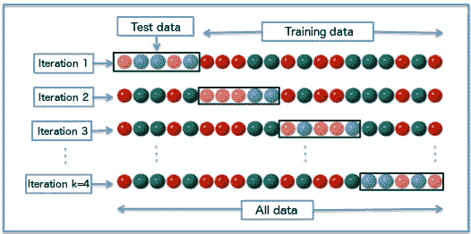

# 懒惰初学者的机器学习

> 原文：<https://dev.to/grahamlyons/machine-learning-for-the-lazy-beginner--3c1>

# 为懒惰的初学者准备的机器学习

这篇文章是由我看到的一条推文引发的，该推文要求对训练机器学习服务进行演练，以识别 3 个不同数据集的新成员。

> @rem:在这里偷懒:我在找一个(机器学习)服务，我可以喂三个独立的数据集(用来训练)，然后我想问:“哪个数据集是*这个*新的一点内容最喜欢的”。
> 
> 是否有这方面的演练/备忘单/服务？

我的第一个想法是，这听起来像一个*分类任务，有 3 组数据的想法应该反过来:有一组数据，该组中的每一项都有 3 个标签中的一个。*

 *我心中没有一个演练，但我知道如何训练一个分类器来执行这个任务，所以这里是我使用 Javascript 对文本文档进行分类的演练。

## 你有足够的监督吗？

机器学习可以分为有监督的和无监督的。后者指的是你馈送给算法的数据没有预定标签的问题。你可能有一堆文本文档，你想找出它们是否可以被分组到相似的类别中——这将是一个 [*聚类*](https://en.wikipedia.org/wiki/Cluster_analysis) 的例子。

监督学习是你已经知道结果的地方。你有一组数据，其中每个成员都属于 *n* 个类别中的一个，例如一组关于你的电子商务平台的客户的数据，根据他们可能感兴趣的产品类别进行标记。你根据这些数据训练你的模型，并用它来预测哪些新客户可能有兴趣购买——这就是分类的一个例子。

## 得到训练

对于分类任务，我们已经说过，我们根据已知标签的数据“训练”一个模型。这意味着我们将数据集中的每个实例输入到分类器中，告诉它应该有哪个标签。然后我们可以给分类器传递一个新的实例，我们不知道它的标签，它会根据之前看到的内容来预测它属于哪个类。

有一个叫做 [`natural`](https://www.npmjs.com/package/natural) 的 Javascript 包，它有几个不同的分类器用于处理文本文档(自然语言)。使用一个是这样的:

```
const { BayesClassifier } = require('natural');
const classifier = new BayesClassifier();

// Feed documents in, labelled either 'nice' or 'nasty'
classifier.addDocument('You are lovely', 'nice');
classifier.addDocument('I really like you', 'nice');
classifier.addDocument('You are horrible', 'nasty');
classifier.addDocument('I do not like you', 'nasty');

// Train the model
classifier.train();

// Predict which label these documents should have
classifier.classify('You smell horrible');
// nasty
classifier.classify('I like your face');
// 'nice'
classifier.classify('You are nice');
// 'nice' 
```

Enter fullscreen mode Exit fullscreen mode

我们添加带标签的数据，训练模型，然后我们可以用它来预测我们以前没有见过的文本类别。万岁！

## 性能分析

用 4 个实例的数据集来训练机器学习模型显然不会非常有用——它在问题领域的经验非常有限。机器学习和大数据在某种程度上是同义的，因为你拥有的数据越多，你就可以更好地训练你的模型，就像某人对某个主题的经验越多，他们就可能越了解它一样。那么我们如何知道我们的模型有多聪明呢？

我们评估监督学习模型的方式是将我们的数据分成训练集和测试集，使用其中一个训练它，使用另一个测试它(我让你猜是哪种方式)。训练集中的数据越多越好。

当我们得到测试数据的预测时，我们可以确定模型是否准确地预测了每个项目所标注的类别。将成功和错误加在一起会给我们一些数字，表明分类器有多好。例如，成功超过处理的总实例是我们的准确性；误差除以总数就是误差率。我们可以通过绘制一个 [*混淆矩阵*](https://en.wikipedia.org/wiki/Confusion_matrix) 来获得更深入的分析，该矩阵显示实际类别与预测的对比:

|  |  | 实际的 |  |
| --- | --- | --- | --- |
|  |  | *好看* | *龌龊* |
| **预测的** | *好看* | Twenty-one | Two |
|  | *龌龊* | one | Ten |

当可以错误地预测一个类而不是另一个类时，这对于评估性能非常有价值。例如，在筛查晚期疾病时，最好是排除假阳性，让医生手动检查图像，而不是错误地给一些患者解除警报。

## 列车上的所有数据

使用尽可能多的数据进行训练的一种方法是使用 [*交叉验证*](https://en.wikipedia.org/wiki/Cross-validation_%28statistics%29) ，在这种情况下，我们取一小部分数据进行测试，其余的用于训练。一种常用的技术是 *k-fold* 交叉验证，其中数据集被分成 *k* 个不同的子集( *k* 可以是任意数目，甚至是数据集中实例的数目)，每个子集被用作测试集，而其余的被用于训练——该过程被重复，直到每个子集都被用于测试，即 *k* 次。

[T2】](https://res.cloudinary.com/practicaldev/image/fetch/s--qpHJ6Ogt--/c_limit%2Cf_auto%2Cfl_progressive%2Cq_auto%2Cw_880/https://upload.wikimedia.org/wikipedia/commons/1/1c/K-fold_cross_validation_EN.jpg)

## 推文数据示例

我用`natural` Javascript 包组合了一个例子。它从 Twitter 获取数据，搜索 3 个不同的标签，然后使用这 3 个标签作为类来训练模型，并评估训练模型的性能。输出如下所示:

```
$ node gather.js
Found 93 for #javascript
Found 100 for #clojure
Found 68 for #python

$ node train.js
{ positives: 251, negatives: 10 }
Accuracy: 96.17%
Error: 3.83% 
```

Enter fullscreen mode Exit fullscreen mode

代码在 Github 上:[分类-js](https://github.com/grahamlyons/classification-js)

## 机器学习有那么容易吗？！

嗯，不。这个例子真的很简单，没有对收集的数据做任何预处理:它没有从文本中去除它搜索的标签(这意味着它可能很难预测一条不包含“#python”的关于 Python 的推文)；它没有删除任何*(没有真正增加任何价值的词，如*一个*或*一个*。事实上，当我们输入文档时，`natural`为我们做了这些，但是我们不知道...);它不会扩展文本中任何缩短的 URL(*learnjavascript.com*肯定比*t.co*更有意义)。在使用之前，我们甚至不看收集的数据，例如用词频图来了解我们得到了什么:是不是一些蛇爱好者的“#python”推文在谈论他们的鱼缸？*

 *引用 Tom Lehrer 的话，机器学习就像一个下水道:你得到什么取决于你放进什么。

## 包装完毕

本文的目的是概述如何训练机器学习模型来执行分类任务。希望对于初学者来说，这可以揭开一些神秘的面纱。

*封面图片作者:[https://www.flickr.com/photos/mattbuck007/](https://www.flickr.com/photos/mattbuck007/)T3】***