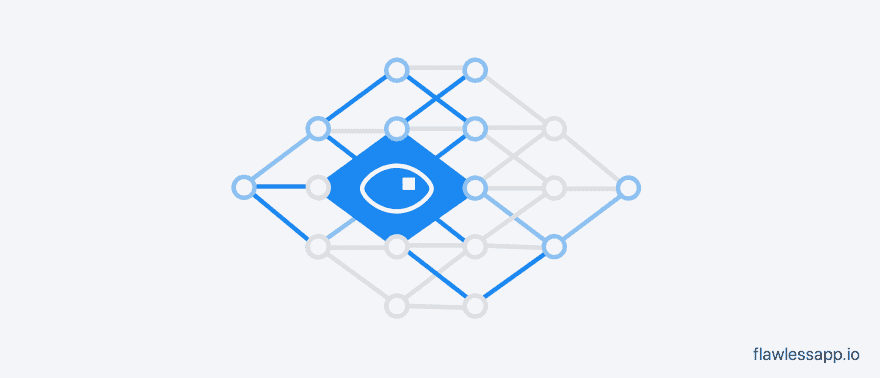
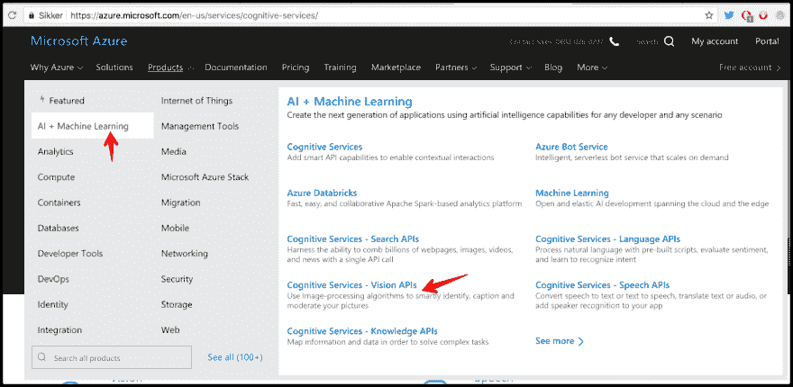
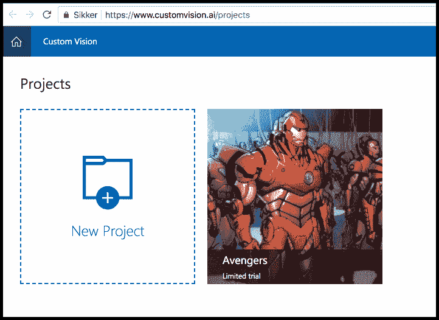
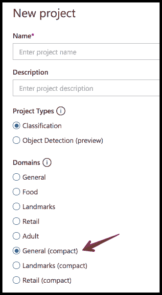
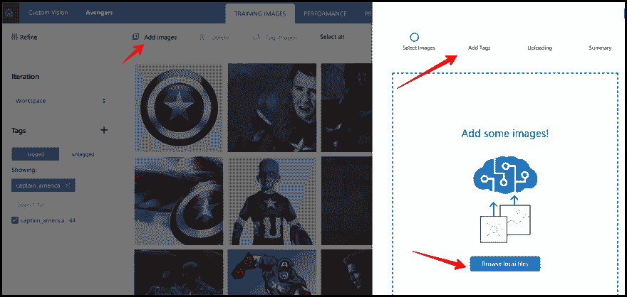
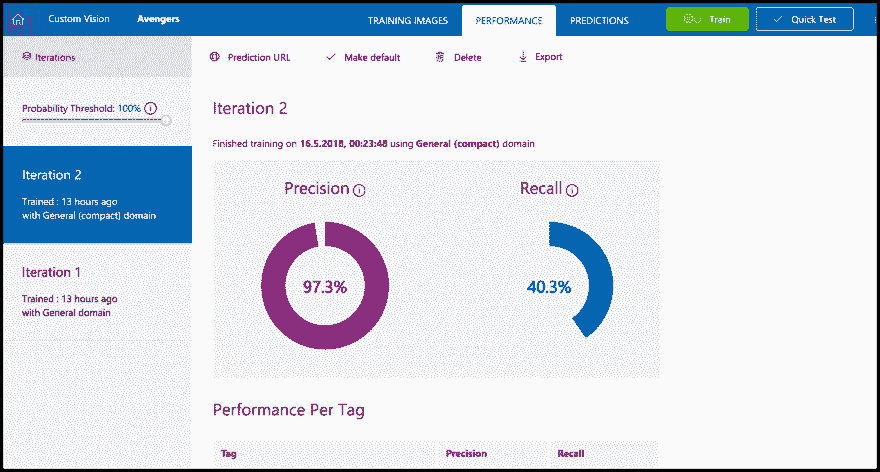
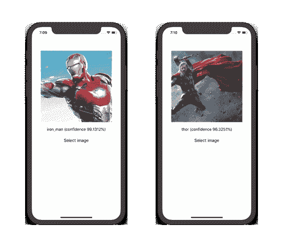

# iOS 中的机器学习:Azure 自定义视觉和 CoreML

> 原文：<https://dev.to/onmyway133/machine-learning-in-ios-azure-custom-vision-and-coreml-3p1n>

[T2】](https://res.cloudinary.com/practicaldev/image/fetch/s--1tKYcf-p--/c_limit%2Cf_auto%2Cfl_progressive%2Cq_auto%2Cw_880/https://cdn-images-1.medium.com/max/4000/1%2A1F9aFan7lNZ6LTqAGY0qDA.png)

你可能看过我之前关于 iOS 中机器学习的文章: [IBM Watson 和 CoreML](https://medium.com/flawless-app-stories/detecting-avengers-superheroes-in-your-ios-app-with-ibm-watson-and-coreml-fe38e493a4d1) 。所以你知道机器学习可能会令人生畏，需要学习大量的[概念](https://www.analyticsvidhya.com/blog/2017/05/25-must-know-terms-concepts-for-beginners-in-deep-learning/)和[框架](http://bigdata-madesimple.com/top-10-machine-learning-frameworks/)，更不用说我们需要理解 Python 中的[算法](https://medium.freecodecamp.org/the-hitchhikers-guide-to-machine-learning-algorithms-in-python-bfad66adb378)。

谈到图像标签，你可能有一堆图像，你想训练机器理解和分类它们。训练自己定制的深度学习模型可能会很有挑战性。最简单的方法是从简单的一步开始，使用一些云服务，这样一开始就不会气馁。想象一下，训练模型的代码已经为你写好了，你所要做的就是标记相关的图片，并得到训练的结果。

在本教程中，我们将看看微软的 Azure Custom Vision 服务，它允许我们构建自定义的图像分类器。

## 微软 Azure 自定义远景

[Custom Vision](https://docs.microsoft.com/en-us/azure/cognitive-services/custom-vision-service/home) 是一项允许我们构建自定义图像分类器的服务，首次在 MSBuild 2017 上宣布，你可以在这里观看主题演讲[。它是 Azure 中 AI +机器学习产品](https://channel9.msdn.com/Events/Build/2017/KEY01#time=2h18m18s)[认知服务](https://azure.microsoft.com/en-us/services/cognitive-services/)中的众多服务之一。其他服务包括语音、语言、搜索、bot 等。

> 自定义视觉服务是一项 Microsoft 认知服务，允许您构建自定义图像分类器。它使得构建、部署和改进图像分类器变得简单而快速。自定义视觉服务提供了一个 REST API 和一个 web 界面来上传您的图像和训练分类器。

[T2】](https://res.cloudinary.com/practicaldev/image/fetch/s--yZM53fZA--/c_limit%2Cf_auto%2Cfl_progressive%2Cq_auto%2Cw_880/https://cdn-images-1.medium.com/max/2610/1%2A6xy1lRi_ZBEChBIBIq6DqA.png)

要开始工作，请转到[自定义视觉主页](https://azure.microsoft.com/en-us/services/cognitive-services/custom-vision-service/)并点击* *开始。* *您应该有一个 Azure 帐户，如果没有，只需在这里免费注册。[免费层](https://azure.microsoft.com/en-us/pricing/details/cognitive-services/custom-vision-service/)足以让我们开始使用该服务，有 2 个项目和每个项目 5000 个训练图像。

使用非常简单。这里是定制视觉的[仪表板](https://www.customvision.ai/projects)，我不能指望它更简单。跟着我做接下来的步骤。

### **第一步:创建新项目**

创建一个名为复仇者联盟的新项目。出于懒惰，也为了便于与其他云服务进行比较，这里我们使用来自 iOS 中的 post [Machine Learning 的相同数据集:IBM Watson 和 CoreML](https://medium.com/flawless-app-stories/detecting-avengers-superheroes-in-your-ios-app-with-ibm-watson-and-coreml-fe38e493a4d1) 。简单回顾一下:上次我们做了一个识别超级英雄的应用程序。自从上一个帖子，人们要求他们想看到更多的超级英雄❤️

[T2】](https://res.cloudinary.com/practicaldev/image/fetch/s--qXlMm4L4--/c_limit%2Cf_auto%2Cfl_progressive%2Cq_auto%2Cw_880/https://cdn-images-1.medium.com/max/2000/1%2AKCQyR4iS1BBL20-fGoPDgw.png)

请注意，在域部分，您需要选择常规(紧凑)。因为这会生成可以在移动设备中使用的轻量级模型，这意味着经过训练的模型可以导出到。mlmodel，CoreML 支持的格式。

[T2】](https://res.cloudinary.com/practicaldev/image/fetch/s--LtUbVUBi--/c_limit%2Cf_auto%2Cfl_progressive%2Cq_auto%2Cw_880/https://cdn-images-1.medium.com/max/2000/1%2A7Tez6qiiMLL9_yWyL95M0Q.png)

### 第二步:添加图片

点击**添加图像**，为每个超级英雄选择图像。命名一个合适的标签。

[T2】](https://res.cloudinary.com/practicaldev/image/fetch/s--qEfkpyZd--/c_limit%2Cf_auto%2Cfl_progressive%2Cq_auto%2Cw_880/https://cdn-images-1.medium.com/max/2820/1%2ACGVtRQGoAxC-SZQlBVUoiQ.png)

关于数据集，这个[定制视觉服务做得好的是什么？](https://docs.microsoft.com/en-us/azure/cognitive-services/custom-vision-service/home)表示:

> 创建分类器或检测器需要很少的图像。每班 50 张图片就足以启动你的原型。Custom Vision Service 使用的方法对差异具有很强的鲁棒性，这使您可以用很少的数据开始原型制作。均值自定义视觉服务不太适合您想要检测细微差异的情况。例如，质量保证场景中的小裂缝或凹痕。

所以我们的图片对于本教程来说已经足够了。

### 第三步:训练

点击**训练**开始训练过程。这应该不会花很长时间，因为自定义视觉使用[转移学习](https://docs.microsoft.com/en-us/azure/machine-learning/desktop-workbench/scenario-image-classification-using-cntk)。

[T2】](https://res.cloudinary.com/practicaldev/image/fetch/s--uH9MFLlk--/c_limit%2Cf_auto%2Cfl_progressive%2Cq_auto%2Cw_880/https://cdn-images-1.medium.com/max/2550/1%2Ah9phVo6_Y48Pp-UcVxoyfg.png)

Azure 允许我们使用预测 API 来基于我们训练好的模型执行预测。但在这种情况下，我们只想让训练好的模型嵌入到我们的 iOS 应用程序中，以便离线运行。所以点击**导出* *并选择**CoreML。**

## 在 iOS app 中使用 CoreML 模型

我们使用与 iOS 中的[机器学习相同的项目:IBM Watson 和 CoreML](https://medium.com/flawless-app-stories/detecting-avengers-superheroes-in-your-ios-app-with-ibm-watson-and-coreml-fe38e493a4d1) 。该项目是在 [GitHub](https://github.com/onmyway133/Avengers) 上，我们使用 CoreML 和 Vision framework 来执行基于我们训练好的模型的预测。

我们将该模型命名为 AzureCustomVision.mlmodel，并将其添加到我们的项目中。Xcode 9 可以为它自动生成一个类，所以我们得到了 AzureCustomVision 这个类。然后我们可以构造视觉兼容模型 VNCoreMLModel 并请求 VNCoreMLRequest，最后将请求发送给 VNImageRequestHandler。代码非常简单:

构建并运行应用程序。选择你的超级英雄，让应用程序告诉你他/她是谁。我们的数据集不是很大，但是你可以看到模型预测得很好，而且可信度很高。目前，我们只有 4 个超级英雄的图像，但你可以根据需要添加更多。

[T2】](https://res.cloudinary.com/practicaldev/image/fetch/s--Pkyk4L_Y--/c_limit%2Cf_auto%2Cfl_progressive%2Cq_auto%2Cw_880/https://cdn-images-1.medium.com/max/2000/1%2AKHg9nWeciRJEsqU9ElWM1w.png)

## 其他云服务呢？

我们已经介绍了 IBM Watson 和微软 Azure 定制愿景。还有其他值得一试的云服务。它们可以像上传图像和训练一样简单，也可以通过自定义 TensorFlow 代码执行或复杂的规则来实现更高级的功能。

*   vize . ai:UI 非常直观，训练的所有步骤都不会花很长时间。

*   [Lobe.ai](https://lobe.ai/) :这就像在一个游乐场里玩耍，我们可以拖放和连接组件来指示机器学习任务。

*   [Amazon Rekognition](https://aws.amazon.com/rekognition/) :它可以执行许多图像和视频分析任务，例如面部识别、图像中的文本、图像检测……但是我看不到训练我们自己的数据集的选项。

*   [Google Cloud Vision](https://cloud.google.com/vision/) :这与 Amazon Rekognition 服务相同，它是通过 API 调用公开的，我们不能指定自定义数据集。有[谷歌云 ML 引擎](https://cloud.google.com/ml-engine/)允许我们使用 TensorFlow 代码进行训练，但这需要一些机器学习的理解。

*   [Google Cloud AutoML](https://cloud.google.com/automl/) :由于本帖时间，还在 alpha 中，但希望新手体验简单。你可以在这里观看[的介绍。](https://www.youtube.com/watch?v=GbLQE2C181U)

这篇文章[比较了来自各种云机器学习服务提供商的机器学习服务](https://medium.com/@tanyathakur6/comparing-machine-learning-ml-services-from-various-cloud-ml-service-providers-63c8a2626cb6)提供了一些流行的机器学习云服务和样本代码，也值得一看。

## 何去何从

以下是一些开始使用云服务的链接，尤其是 Azure Custom Vision:

*   [定制视觉。AI:用于图像分类的无代码自动机器学习](https://azure.microsoft.com/en-us/blog/customvision-ai-code-free-automated-machine-learning-for-image-classification/)。

*   [如何构建具有自定义视觉的分类器](https://docs.microsoft.com/en-us/azure/cognitive-services/custom-vision-service/getting-started-build-a-classifier)。

*   [训练自定义视觉 API 检测屋顶类型](https://www.appliedis.com/training-the-custom-vision-api-to-detect-roof-types/):自定义视觉检测屋顶类型的实际应用。

*   iOS 中的机器学习: [IBM Watson 和 CoreML](https://medium.com/flawless-app-stories/detecting-avengers-superheroes-in-your-ios-app-with-ibm-watson-and-coreml-fe38e493a4d1) (第一部分)。

*   iOS 中的机器学习: [Turi Create 和 CoreML](https://medium.com/flawless-app-stories/machine-learning-in-ios-turi-create-and-coreml-5ddce0dc8e26) (第三部分)。

*   [Cloud ML Engine with Keras 教程](https://www.youtube.com/watch?v=VxnHf-FfWKY):了解如何使用 Cloud ML Engine with Keras(tensor flow 之上的高级 API)来训练定制模型

支持我的应用程序

*   [推送 Hero -测试推送通知的纯 Swift 原生 macOS 应用](https://onmyway133.com/pushhero)
*   [PastePal -粘贴板、便笺和快捷方式管理器](https://onmyway133.com/pastepal)
*   [快速检查-智能待办事项管理器](https://onmyway133.com/quickcheck)
*   [Alias - App 和文件快捷方式管理器](https://onmyway133.com/alias)
*   [我的其他应用](https://onmyway133.com/apps/)

❤️❤️😇😍🤘❤️❤️