# iOS 中的机器学习:IBM Watson 和 CoreML

> 原文：<https://dev.to/onmyway133/machine-learning-in-ios-ibm-watson-and-coreml-2ae8>

[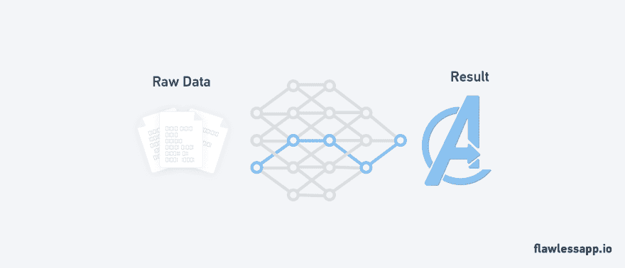T2】](https://res.cloudinary.com/practicaldev/image/fetch/s--vhH-QTPQ--/c_limit%2Cf_auto%2Cfl_progressive%2Cq_auto%2Cw_880/https://cdn-images-1.medium.com/max/4000/1%2AWHxQHcsiU6hSeoljdd6khw.png)

苹果于 2017 年在 WWDC 推出了 [CoreML](https://developer.apple.com/machine-learning/) ，这是一笔很棒的交易。
CoreML 是一个机器学习框架，用于许多苹果产品，如 Siri、相机、键盘听写等。

这是视觉和自然语言处理的基础。CoreML 的酷之处在于它可以使用预先训练好的模型离线工作。苹果已经提供了许多预先训练好的[模型](https://developer.apple.com/machine-learning/)，如 MobileNet、SqueezeNet、Inception v3、VGG16，来帮助我们完成图像识别任务，尤其是检测场景中的主要对象。

CoreML 的工作只是根据模型预测数据。如果提供的训练模型不符合我们的需要，我们可以用自己的数据集训练模型。有像 [Keras](https://keras.io/) 、 [TensorFlow](https://www.tensorflow.org/) 、 [Caffe](http://caffe.berkeleyvision.org/) 或简化的 [turicreate](https://github.com/apple/turicreate) 这样的框架，但这些都需要理解机器学习和计算机能力来训练模型。一种简单(且昂贵)的方法是使用[云](http://machinethink.net/blog/machine-learning-device-or-cloud/)服务，如[谷歌云视觉](https://cloud.google.com/vision/)、 [IBM 沃森](https://www.ibm.com/watson/)、[微软 Azure 认知服务](https://azure.microsoft.com/en-us/services/cognitive-services/)、[亚马逊认知](https://aws.amazon.com/rekognition/)、……来简化任务。这些服务通常托管完整的模型，并对它们进行重新训练，所以我们只需要发出 HTTP 请求来获取关于分类对象的信息。有些提供了扩展模型的能力，允许我们上传数据集和定义分类器。

在本指南中，我们将探索 IBM Watson 服务，尤其是它的视觉识别功能，以帮助我们训练超级英雄图像的自定义数据集，然后通过 CoreML 在我们的 iOS 应用程序中使用训练好的模型。

## IBM 沃森服务

就在最近，苹果宣布与 IBM Watson 合作，这使得机器学习更容易上手。

> 你可以在 iPhone 和 iPad 上开发利用 Watson 模型的应用程序，即使是在离线状态下。您的应用程序可以快速分析图像，准确分类视觉内容，并使用 Watson 服务轻松训练模型

所以还是先试试吧，看看效果如何。电影《复仇者联盟无限战争》现在在电影院很受欢迎，超级英雄们仍然在我们的脑海中穿梭。也许你的一些朋友认不出电影中的那些超级英雄。因此，让我们通过构建一个可以帮助识别超级英雄的应用程序来度过一段有趣的时光。

玩云服务很简单。我们为这项服务支付一些钱，上传超级英雄的照片，在云上训练，将训练好的模型放到应用程序中，享受这种魔力😎。

我已经阅读了一些文章并尝试了 IBM Cloud，但不知何故，我仍然感到困惑。主要是因为它提供了许多服务、术语变化、废弃的测试工具、通向同一位置的路径、服务和资源的互换使用、应用和项目。在这篇文章中，我会试着根据我的理解来澄清一些事情。欢迎反馈。

[* * Bluemix vs IBM Cloud](https://www.ibm.com/cloud/info/bluemix-now-ibm-cloud)
[* * Bluemix](https://en.wikipedia.org/wiki/Bluemix)是一个云平台即服务，帮助在云上构建和运行应用。截至 2017 年 10 月，Bluemix 是 IBM Cloud，尽管我们仍然需要与这个域[https://console.bluemix.net](https://console.bluemix.net/developer/watson/dashboard)合作。IBM Cloud 提供许多[产品](https://www.ibm.com/cloud/products/)，用于安全、分析、存储、人工智能等领域

> IBM 的一站式云计算商店提供您需要的所有云解决方案和 **IBM cloud** 工具。

[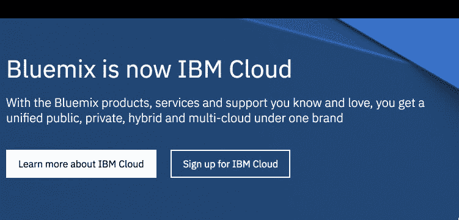T2】](https://res.cloudinary.com/practicaldev/image/fetch/s--RKo3iidG--/c_limit%2Cf_auto%2Cfl_progressive%2Cq_auto%2Cw_880/https://cdn-images-1.medium.com/max/2000/1%2AHfxsqbCIuka0hQYKzYKhkg.png)

* *数据科学和沃森工作室
* *运行在 IBM Cloud 上的众多产品之一是用于自然语言处理、视觉识别和机器学习的 [IBM Watson](https://medium.com/ibm-watson/introducing-ibm-watson-studio-e93638f0bb47) 。我们将使用[沃森工作室](https://www.ibm.com/cloud/watson-studio)在一个单一的集成环境中“构建、训练、部署和管理人工智能模型，并准备和分析数据。”最初叫做[数据科学](https://datascience.ibm.com/)。可以把它想象成一个前端网页，里面有很多与 Watson 服务交互的工具。我们开始吧！

> Watson Studio 是一个免费的工作空间，您可以在其中无缝地创建、评估和管理您的定制模型。

[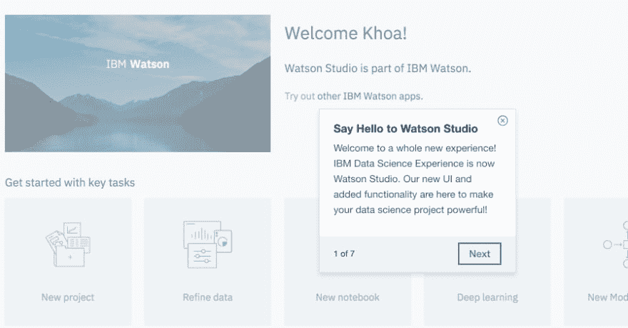T2】](https://res.cloudinary.com/practicaldev/image/fetch/s--RdHqsVJf--/c_limit%2Cf_auto%2Cfl_progressive%2Cq_auto%2Cw_880/https://cdn-images-1.medium.com/max/2000/1%2A1cWgM-F6FnpFwZN2XqNJZw.png)

### 第一步:注册 IBM 云

进入 [IBM Cloud](https://www.ibm.com/cloud/) ，点击[按钮注册 IBM Cloud](https://console.bluemix.net/registration/) 。

[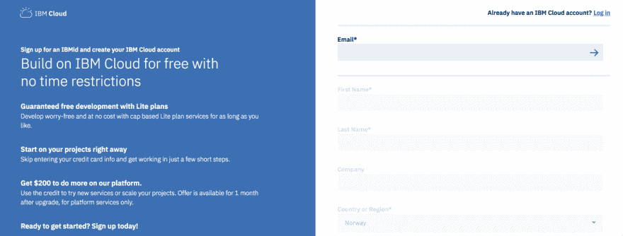T2】](https://res.cloudinary.com/practicaldev/image/fetch/s--IVjLdfsO--/c_limit%2Cf_auto%2Cfl_progressive%2Cq_auto%2Cw_880/https://cdn-images-1.medium.com/max/2832/1%2A5dqP4i6LqAfgaWB6Bsh3Pg.png)

成功注册后，前往 [Watson Studio](https://www.ibm.com/cloud/watson-studio) 并点击登录。

[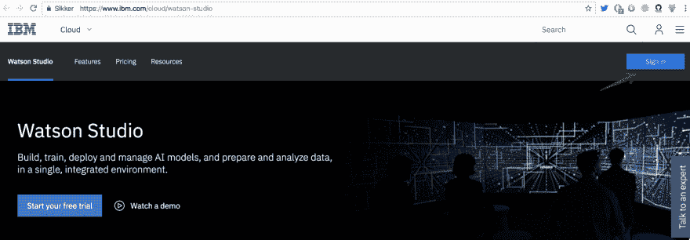T2】](https://res.cloudinary.com/practicaldev/image/fetch/s--tSAk5lc3--/c_limit%2Cf_auto%2Cfl_progressive%2Cq_auto%2Cw_880/https://cdn-images-1.medium.com/max/2852/1%2AM3fnjggeCL_zLRiRGP-_Yw.png)

它会带你去 https://dataplatform.ibm.com/home。我认为由于历史原因，域名和产品名称不匹配🙄。

[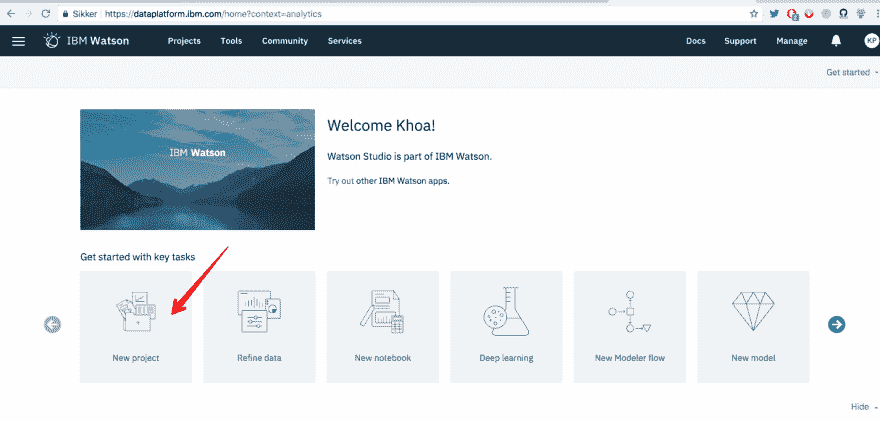T2】](https://res.cloudinary.com/practicaldev/image/fetch/s--9Q51LGxe--/c_limit%2Cf_auto%2Cfl_progressive%2Cq_auto%2Cw_880/https://cdn-images-1.medium.com/max/2850/1%2AF5vD5dDyCUtPXfRvEYDTWA.png)

### 第二步:为视觉识别创建新项目

点击**新建项目**，选择工具[视觉识别](https://www.ibm.com/watson/services/visual-recognition/)，这就是我们对超级英雄图片做分类所需要的。

> 使用机器学习快速准确地标记、分类和训练视觉内容。

[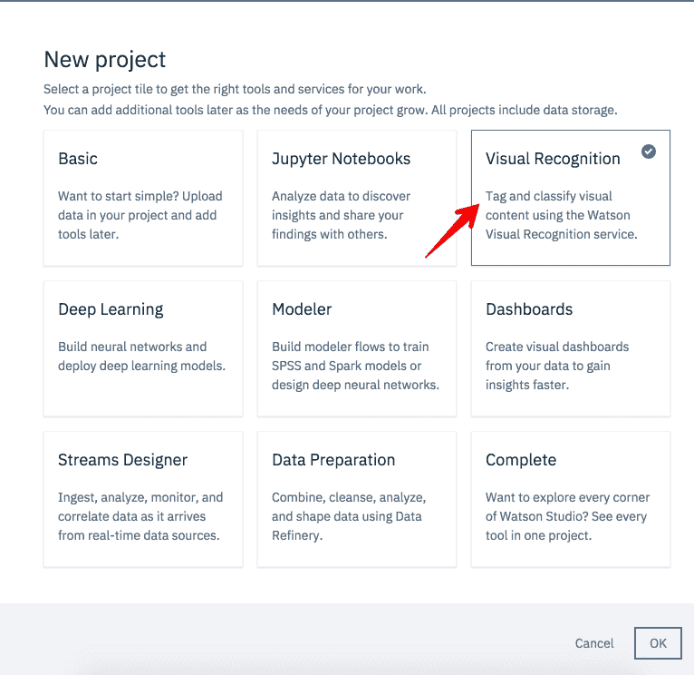T2】](https://res.cloudinary.com/practicaldev/image/fetch/s--VN7jdihu--/c_limit%2Cf_auto%2Cfl_progressive%2Cq_auto%2Cw_880/https://cdn-images-1.medium.com/max/2000/1%2AguyThKfCxZN2ZJEFx1ocQQ.png)

一个项目包含一组工具和服务。就叫复仇者吧。它配有储物空间。

[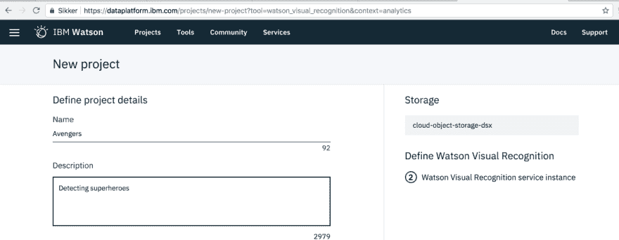T2】](https://res.cloudinary.com/practicaldev/image/fetch/s--kWGUml2A--/c_limit%2Cf_auto%2Cfl_progressive%2Cq_auto%2Cw_880/https://cdn-images-1.medium.com/max/2494/1%2A24eBxhgDK5FXYY1QAm9v2g.png)

### 第三步:创建服务

对我来说，在创建新项目之后，它会转到页面**默认定制模型**，并告诉我该项目需要与一个服务相关联。我认为项目应该创建一个服务，并在默认情况下与它相关联🙄

[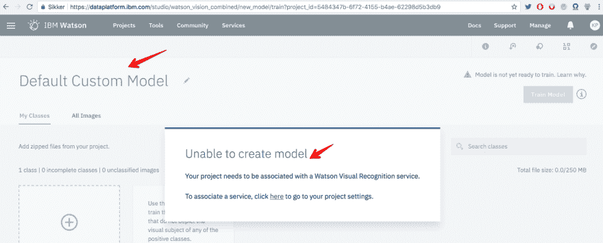T2】](https://res.cloudinary.com/practicaldev/image/fetch/s--YMNcqE2p--/c_limit%2Cf_auto%2Cfl_progressive%2Cq_auto%2Cw_880/https://cdn-images-1.medium.com/max/2854/1%2APt9ALUvl_vWjWA3D5ulffQ.png)

回到[首页](https://dataplatform.ibm.com/home?context=data)，从**项目**菜单中选择你的**复仇者联盟**项目，进入**设置**选项卡。

[T2】](https://res.cloudinary.com/practicaldev/image/fetch/s--CP4YGWRR--/c_limit%2Cf_auto%2Cfl_progressive%2Cq_auto%2Cw_880/https://cdn-images-1.medium.com/max/2000/1%2AOGeJhh9Q6uyihsn9sa-xrQ.png)

向下滚动到**关联服务* *部分，然后单击 Watson。在下一个屏幕中，我们可以看到有许多服务用于许多目的:文本到语音，语音到文本，语言翻译器，声调分析器等。在我们的案例中，我们需要* *视觉识别**服务。对于 Lite 计划，我们每个服务只能有 1 个实例，如果您试图添加更多，您将得到以下警告。

> Service broker 错误:每个服务只能有一个 Lite 计划实例。要创建新实例，请删除现有的 Lite plan 实例或选择付费计划。

[T2】](https://res.cloudinary.com/practicaldev/image/fetch/s--ofF3Xk4T--/c_limit%2Cf_auto%2Cfl_progressive%2Cq_auto%2Cw_880/https://cdn-images-1.medium.com/max/2802/1%2AgZfNBaHYq-3jIbXp8ht1lw.png)

Watson 项目、工具和服务之间的联系令人困惑，可能是因为有大量的功能我们还没有使用。把项目想象成一包工具和服务。对于 Lite plan，我们只能使用每个服务的 1 个实例，而工具是我们用来与服务交互的前端。

### 步骤 4:删除现有服务(如果有)

要删除现有服务，请返回到[主页](https://dataplatform.ibm.com/)，从**服务**菜单中选择**沃森服务**。在这里，我们可以启动该服务的工具或删除它。

[T2】](https://res.cloudinary.com/practicaldev/image/fetch/s--b2am0KGh--/c_limit%2Cf_auto%2Cfl_progressive%2Cq_auto%2Cw_880/https://cdn-images-1.medium.com/max/2862/1%2ACabdXO5XsJutP7vGyHrr7w.png)

删除现有服务后，返回步骤 3，为该项目**复仇者联盟的服务**视觉识别**配置新实例。**

### 第五步:创建视觉识别模型

进入你的**复仇者联盟**项目，点击**资产**标签，前往**视觉识别模型部分。* *对于本教程的有趣部分，我将我们的自定义模型命名为* *复仇者模型🤘。**

[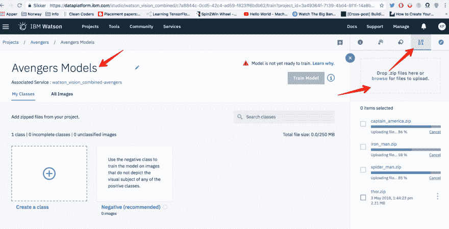T2】](https://res.cloudinary.com/practicaldev/image/fetch/s--iFOndEKl--/c_limit%2Cf_auto%2Cfl_progressive%2Cq_auto%2Cw_880/https://cdn-images-1.medium.com/max/2844/1%2AYtyMJfgPcAaFuXB7sJx0eg.png)

我们可以为每个英雄创建职业，或者上传一个包含每个英雄图片的 zip 文件。请注意，zip 文件的名称对应于类名。负类用于不属于任何预期类的图像。在本教程中，我们将讨论钢铁侠、蜘蛛侠、美国队长和雷神，因为他们是我的最爱😅。

我们上传的图片越多，模型就越正确。此外，你应该在不同的角度和光线下使用更多不同的角色。请注意，我们应该在每个文件夹中放置正确的图像，因为垃圾进去就是垃圾出来。

选择右上角的按钮**查找并添加图像**添加图像。

### 第六步:数据集

我们可以从谷歌下载一些免费的图片作为我们的数据集。你可以在我的 [GitHub repo](https://github.com/onmyway133/Avengers) 上获取数据集，也可以自己准备数据集。手动下载图片不好玩，还是用脚本吧。我不知道有什么好的工具，但是谷歌搜索显示这个工具[谷歌图片下载](https://github.com/hardikvasa/google-images-download)。我们很懒，让我们节省时间。

在这个帖子里，每个英雄 50 张图片应该是好的。让我们压缩它们并上传到 Watson。上传完成后，将这些资产添加到模型中。

[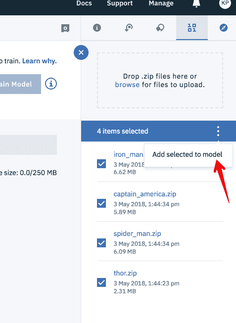T2】](https://res.cloudinary.com/practicaldev/image/fetch/s--3ExMOsrk--/c_limit%2Cf_auto%2Cfl_progressive%2Cq_auto%2Cw_880/https://cdn-images-1.medium.com/max/2000/1%2AoH0goGCQvOUPtN-MUgpURA.png)

### 第七步:训练模型

这一步需要你所有剩余的力量点击那个**训练模式**开始训练过程。这需要一些时间，具体取决于您的数据集。对于本教程中的数据集，它应该不到 10 分钟。

之所以需要这么短的时间是因为我们的数据集非常小。我认为另一个原因是因为视觉识别使用了一种叫做[迁移学习](https://developer.ibm.com/code/2018/02/13/object-detection-ai-vision-getting-easier-developers/)的技术

> 今天，你可以使用“迁移学习”，即使用现有的图像识别模型，并用你自己的数据集重新训练它。

[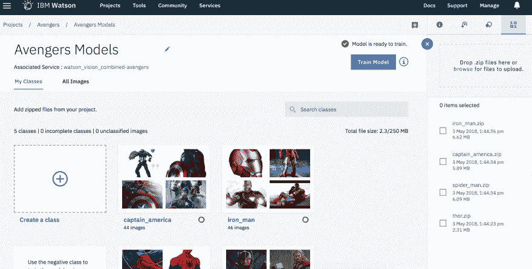T2】](https://res.cloudinary.com/practicaldev/image/fetch/s--aNfX5KTQ--/c_limit%2Cf_auto%2Cfl_progressive%2Cq_auto%2Cw_880/https://cdn-images-1.medium.com/max/2762/1%2AO_Wow5fDLf5z7_6ZFSsUmQ.png)

培训完成后，进入**实施**选项卡，然后选择 **Core ML** 下载 Core ML 兼容模型。文件是 13MB。

[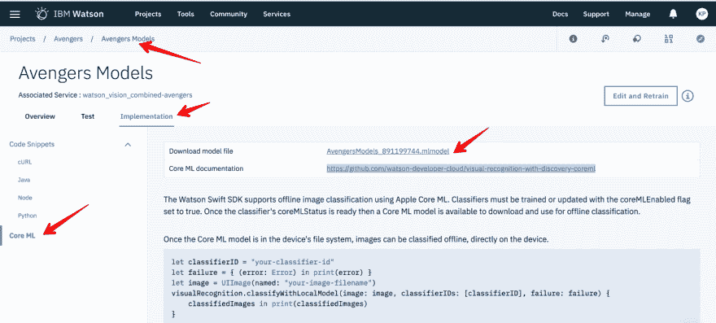T2】](https://res.cloudinary.com/practicaldev/image/fetch/s--HuRfliH0--/c_limit%2Cf_auto%2Cfl_progressive%2Cq_auto%2Cw_880/https://cdn-images-1.medium.com/max/2880/1%2AQCUZZcOU7ehepwO_dDWLBw.png)

## 在 iOS app 中使用 CoreML 模型

通过沃森训练的模型，有两种方式在应用程序中使用它。最简单的方法是使用包装 CoreML 的 Watson SDK。第二种方法是单独使用 CoreML，这是我们将在这里展示的方法，因为它很容易理解。

### 沃森 SDK

如果你仔细看看上面的截图，有**分类 ID** ，这是你的定制模型的 ID。沃森有一个演示[视觉识别 coreml](https://github.com/watson-developer-cloud/visual-recognition-coreml/) ，展示如何使用[沃森 SDK](https://github.com/watson-developer-cloud/swift-sdk) 来简化与 coreml 模型的集成。SDK 允许我们管理所有下载的模型，并在用新数据集重新训练时下载模型的更新版本。

只是让你知道这个 SDK 的存在，我们不会在本教程中使用任何框架😎。

### 使用普通 CoreML 模型

在我们的指南中，我们只需下载经过训练的 CoreML 模型，并在我们的应用程序中使用它。当我们不使用任何额外的不必要的框架时，我们学得最多。该项目位于 GitHub 上。

* *在模拟器
上运行* *该项目使用 UIImagePickerController 和 controller.sourceType =。相机，所以在设备上构建、拍摄一些照片和预测是很棒的。你也可以在模拟器上运行它，只是要记住将 sourceType 指向 photoLibrary，因为模拟器中没有摄像头😅。

### 第一步:将模型添加到项目中

这个模型是我们用来做预测的。我们只需要将它拖到项目中，并将其添加到应用程序目标中。正如从[阅读集成一个核心 ML 模型到你的应用](https://developer.apple.com/documentation/coreml/integrating_a_core_ml_model_into_your_app)我们可以只使用生成的类 AvengersModels。

> Xcode 还使用关于模型输入和输出的信息来自动生成模型的自定义编程接口，您可以使用该接口在代码中与模型进行交互。

### 第二步:设想

据[维基](https://en.wikipedia.org/wiki/Vision_(Marvel_Comics)):

> **幻象**是一个虚构的[超级英雄](https://en.wikipedia.org/wiki/Superhero)，出现在由[漫威漫画](https://en.wikipedia.org/wiki/Marvel_Comics)出版的[美国漫画书](https://en.wikipedia.org/wiki/American_comic_book)中，是一个[机器人](https://en.wikipedia.org/wiki/Android_(robot))，也是首次出现在[*复仇者联盟](https://en.wikipedia.org/wiki/The_Avengers_(comic))* # 57(1968 年 10 月)中的[复仇者联盟](https://en.wikipedia.org/wiki/Avengers_(comics))的成员

开玩笑😅 [Vision](https://developer.apple.com/documentation/vision/classifying_images_with_vision_and_core_ml) 是一个与 CoreML 一起工作的框架，“将分类模型应用于图像，并对这些图像进行预处理，以使机器学习任务更容易、更可靠”。

你一定要看 WWDC 2017 视频[视觉框架:建立在核心 ML](https://developer.apple.com/videos/play/wwdc2017/506/) 上，了解这个框架的一些其他功能，如检测人脸，计算面部标志，跟踪物体，…

用生成的 AvengersModels()。模型我们可以构造视觉兼容模型 VNCoreMLModel 并请求 VNCoreMLRequest，然后最终将请求发送到 VNImageRequestHandler。代码非常简单:

预测操作可能需要时间，所以最好将它发送到后台队列，并在得到结果时更新 UI。

[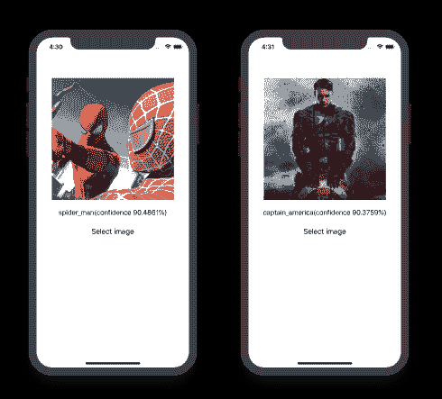T2】](https://res.cloudinary.com/practicaldev/image/fetch/s--efWkY7Rx--/c_limit%2Cf_auto%2Cfl_progressive%2Cq_auto%2Cw_880/https://cdn-images-1.medium.com/max/2000/1%2AVyCMO-_CEC01EGg9C_0hrg.png)

构建并运行应用程序。如果你在 iPhone 上构建它，拍一张超级英雄的照片，如果这是我们在本教程中训练的 4 个超级英雄之一，那么 CoreML 将能够根据训练来预测他是谁。mlmodel

## 何去何从

IBM Watson 中还有许多其他很酷的服务值得探索，比如语音、文本、推荐。下面是一些帮助你开始机器学习之旅的好链接:

*   iOS 中的机器学习: [Azure 自定义视觉和 CoreML](https://medium.com/flawless-app-stories/machine-learning-in-ios-azure-custom-vision-and-coreml-645e93f35eee) 。

*   iOS 中的机器学习: [Turi Create 和 CoreML](https://medium.com/flawless-app-stories/machine-learning-in-ios-turi-create-and-coreml-5ddce0dc8e26) 。

*   [使用 Watson 构建独特的视觉识别应用:4 种简单的入门方法](https://www.ibm.com/blogs/watson/2017/04/build-unique-visual-recognition-apps-watson-4-easy-ways-get-started/):许多关于如何利用视觉识别提供的所有功能的注释。

*   Matthijs Hollemans 有很多关于 CoreML 和机器学习的很酷的文章，我真的很喜欢。

*   [奇妙的机器学习](https://github.com/onmyway133/fantastic-machine-learning):我还整理了一些有趣的机器学习资源，最好是用 Swift 和 CoreML。

*   [Watson 视觉识别的 25+资源](https://medium.com/ibm-watson/25-resources-for-watson-visual-recognition-3d83a0b14202):包含大量与 Watson 合作的有用资源。

*   [如何通过简单的预处理增强 Watson 视觉识别结果](https://www.ibm.com/blogs/bluemix/2017/03/sharpen-watson-visual-recognition-results/):准备好准确的图像非常重要，这显示了图像预处理的技巧。

原帖[https://medium . com/无瑕-app-stories/detecting-Avengers-super heroes-in-your-IOs-app-with-IBM-Watson-and-coreml-Fe 38 e 493 a4 d 1](https://medium.com/flawless-app-stories/detecting-avengers-superheroes-in-your-ios-app-with-ibm-watson-and-coreml-fe38e493a4d1)