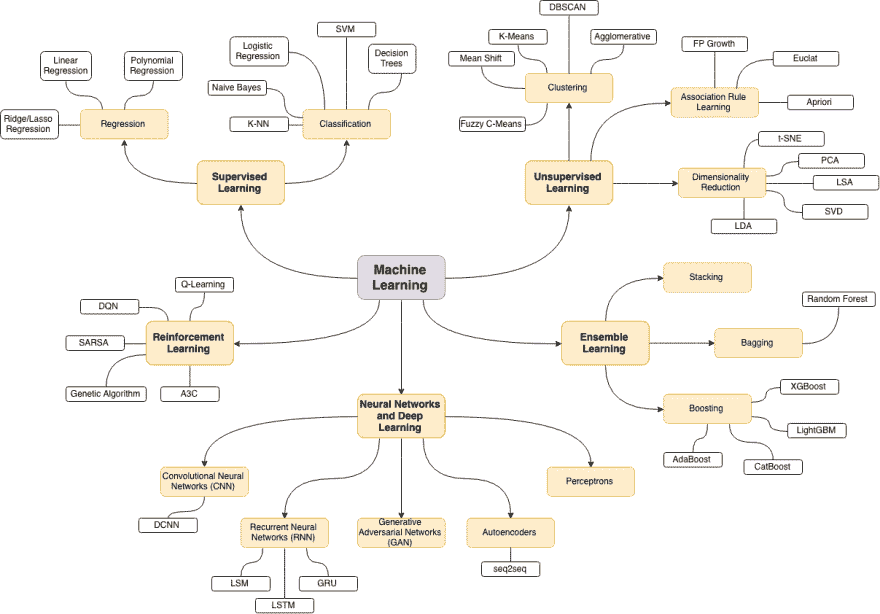
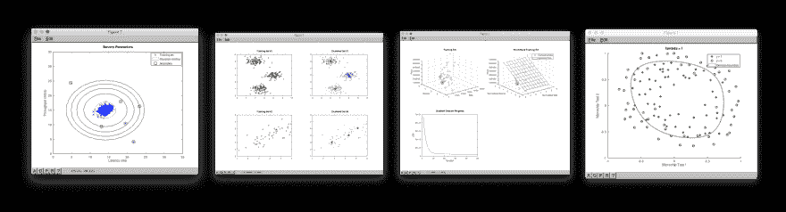

# MatLab/Octave 中的机器学习

> 原文：<https://dev.to/trekhleb/machine-learning-in-matlaboctave-1lg>

[T2】](https://res.cloudinary.com/practicaldev/image/fetch/s--t0L04SCl--/c_limit%2Cf_auto%2Cfl_progressive%2Cq_auto%2Cw_880/https://thepracticaldev.s3.amazonaws.com/i/ytf8dvmvevqrmj057pmc.jpeg)

读者你好！

最近，我在 Octave 资源库中创建了 **[机器学习，其中包含了流行的机器学习算法的 MatLab/Octave 示例，并解释了它们背后的代码示例和数学。](https://github.com/trekhleb/machine-learning-octave)**

这个库的目的不是使用第三方库或 Octave/MatLab“一行程序”来实现机器学习算法，而是练习和更好地理解每个算法背后的数学。在大多数情况下，解释是基于这个伟大的机器学习课程。

这是我为自己学习一些机器学习主题(在下面的“思维导图”中有描述)的尝试。由于这个主题可能会引起其他人的兴趣，我决定对其进行一点组织，并将其公之于众。

[T2】](https://res.cloudinary.com/practicaldev/image/fetch/s--tX09KGPv--/c_limit%2Cf_auto%2Cfl_progressive%2Cq_auto%2Cw_880/https://thepracticaldev.s3.amazonaws.com/i/wqg36do0ks3kcp871yud.png)

以下机器学习话题图的来源是[这篇精彩的博文](https://vas3k.ru/blog/machine_learning/)。

目前涵盖了以下主题:

## 监督学习

在监督学习中，我们有一组训练数据作为输入，一组标签或每个训练集的“正确答案”作为输出。然后，我们正在训练我们的模型(机器学习算法参数)，以正确地将输入映射到输出(进行正确的预测)。最终目的是找到这样的模型参数，即使对于新的输入示例，该模型参数也将成功地继续正确的输入→输出映射(预测)。

### 回归

在回归问题中，我们做真实值预测。基本上我们尝试沿着训练样本画一条线/平面/n 维平面。

*使用实例:股票价格预测、销售分析、任意数的依赖等。*

🤖[线性回归](https://github.com/trekhleb/machine-learning-octave/blob/master/linear-regression) —举例:房价预测。

### 分类

在分类问题中，我们根据某些特征来划分输入样本。

用法示例:垃圾邮件过滤器、语言检测、查找相似文档、手写字母识别等。

🤖[逻辑回归](https://github.com/trekhleb/machine-learning-octave/blob/master/logistic-regression) —示例:微芯片适应性检测、使用一对一方法的手写数字识别。

## 无监督学习

无监督学习是机器学习的一个分支，它从没有被标记、分类或归类的测试数据中学习。无监督学习不是对反馈做出反应，而是识别数据中的共性，并根据每个新数据中是否存在这种共性做出反应。

### 聚类

在聚类问题中，我们通过未知特征来分割训练样本。算法本身决定使用什么特征进行分割。

*使用示例:市场细分、社交网络分析、组织计算集群、天文数据分析、图像压缩等。*

🤖 [K-means 算法](https://github.com/trekhleb/machine-learning-octave/blob/master/k-means) —举例:将数据分割成三个聚类。

### 异常检测

异常检测(也称为异常值检测)是对罕见项目、事件或观察结果的识别，这些项目、事件或观察结果因与大多数数据显著不同而引起怀疑。

使用示例:入侵检测、欺诈检测、系统健康监控、从数据集中删除异常数据等。

🤖[使用高斯分布的异常检测](https://github.com/trekhleb/machine-learning-octave/blob/master/anomaly-detection) —示例:检测过载的服务器。

## 神经网络

神经网络本身不是一种算法，而是许多不同的机器学习算法共同工作和处理复杂数据输入的框架。

*使用示例:作为其他所有算法的一般替代，图像识别、语音识别、图像处理(应用特定风格)、语言翻译等。*

🤖[神经网络:多层感知器(MLP)](https://github.com/trekhleb/machine-learning-octave/blob/master/neural-network) —例子:手写数字识别。

## 演示

上面描述的每个机器学习算法文件夹都包含 demo.m 文件，用户可以从 Octave 控制台或 MatLab 启动该文件。演示脚本将向控制台输出一些有用的信息，并可视化相关算法的工作结果。

[T2】](https://res.cloudinary.com/practicaldev/image/fetch/s--rPRHvLU7--/c_limit%2Cf_auto%2Cfl_progressive%2Cq_auto%2Cw_880/https://thepracticaldev.s3.amazonaws.com/i/gtjqutpt3bq68dc73vmq.png)

我希望这个库对你有用，并帮助你在机器学习的道路上多走一步。编码快乐！