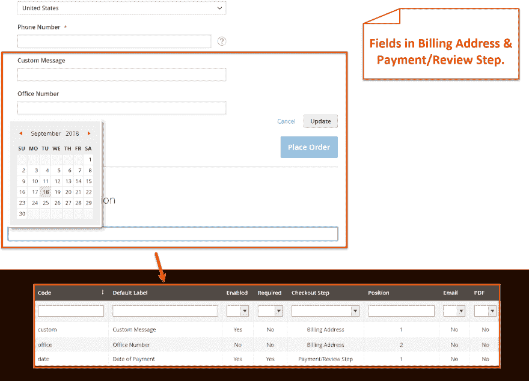

# Magento 2 自定义结帐字段管理器

> 原文：<https://dev.to/simonwalkerfme/magento-2-add-fields-to-checkout-extension-by-fme--2nno>

[T2】](https://res.cloudinary.com/practicaldev/image/fetch/s--WE06OxH0--/c_limit%2Cf_auto%2Cfl_progressive%2Cq_auto%2Cw_880/https://thepracticaldev.s3.amazonaws.com/i/2jw2nmm09e9j7if5l9e9.png)

Magento 2 自定义结帐字段和订单属性扩展帮助您快速添加自定义字段到结帐页面的任何步骤。Magento 2 自定义结帐字段可帮助您从各种字段类型中进行选择，包括文本字段、文本区域、日期以及带有是/否、多选、下拉、单选按钮和复选框的选项。借助 Magento 2 订单属性，设置输入验证以从用户处获取准确数据。在电子邮件和 PDF 中显示附加签出属性。将字段限制在特定的商店视图和客户群中。显示特定结帐步骤的属性，并通过 Magento 2 订单属性添加工具提示。令人惊叹的因素是，它符合完整的 Magento 标准，并提供免费的终身升级和支持。

**主要特征**

向结账页面添加自定义字段

在电子邮件和 PDF 中显示附加字段

在任何结账步骤中启用字段

从多种字段类型中选择

配置现场数据验证

**了解更多详情和演示-** [收银台经理 Magento 2](https://www.fmeextensions.com/custom-checkout-fields-order-attributes-extension-magento-2.html)

**截图**

[T2】](https://res.cloudinary.com/practicaldev/image/fetch/s--hcNTJXgq--/c_limit%2Cf_auto%2Cfl_progressive%2Cq_auto%2Cw_880/https://thepracticaldev.s3.amazonaws.com/i/o9ypp5cbtvhba7vhzgru.png)

[T2】](https://res.cloudinary.com/practicaldev/image/fetch/s--kp9T8fh9--/c_limit%2Cf_auto%2Cfl_progressive%2Cq_auto%2Cw_880/https://thepracticaldev.s3.amazonaws.com/i/v8fd2z4g8ly59gg7b46s.png)

[T2】](https://res.cloudinary.com/practicaldev/image/fetch/s--7yQrYqCq--/c_limit%2Cf_auto%2Cfl_progressive%2Cq_auto%2Cw_880/https://thepracticaldev.s3.amazonaws.com/i/fbeonw0x93rkzayg4b5m.png)

[T2】](https://res.cloudinary.com/practicaldev/image/fetch/s--4WU7nxEc--/c_limit%2Cf_auto%2Cfl_progressive%2Cq_auto%2Cw_880/https://thepracticaldev.s3.amazonaws.com/i/9gh41d29ihpaunzpj7c4.png)