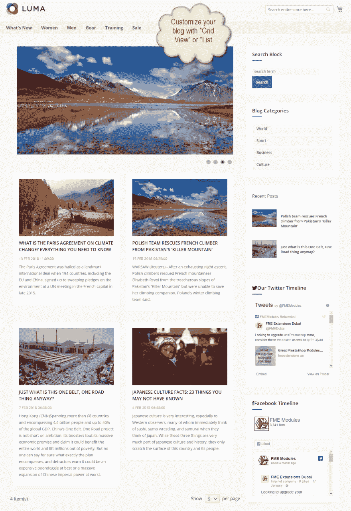
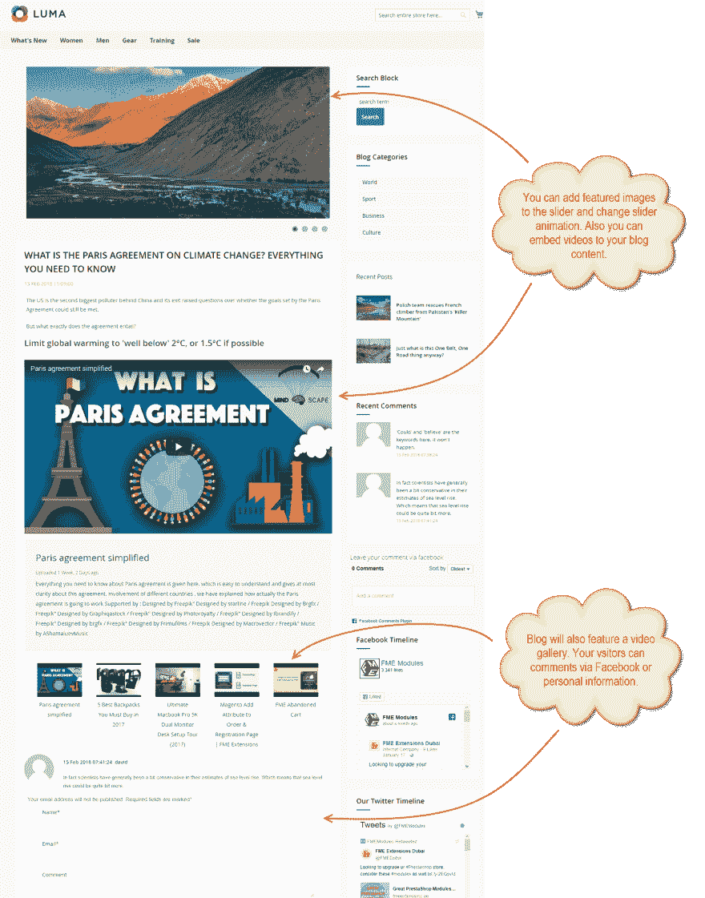

# FME 的 Magento 2 博客扩展

> 原文：<https://dev.to/simonwalkerfme/magento-2-blog-extension-by-fme-pc4>

使用 FME 的 Magento 2 博客扩展创建有响应性和吸引力的博客。创建类别并发布文章、图像、视频、富媒体集、产品指南等。在你的博客里。使用这个扩展，你可以在一个地方管理你的博客和电子商务商店。使用所见即所得编辑器，您可以轻松地编写、编辑和发布文章以及富媒体文件。配置搜索引擎优化设置，启用博客水泥，脸书评论，并防止垃圾邮件使用谷歌验证码。

**主要特性:**

*   创建一个功能丰富的搜索引擎友好的博客
*   创建无限的博客类别
*   向博客文章添加图像和视频库
*   为帖子和类别配置元详细信息
*   给每个岗位分配相关的产品和文章
*   为最近的帖子和反馈评论启用阻止

更多细节和演示在这里: [Magento 2 博客](https://www.fmeextensions.com/seo-friendly-blog-articles-magento-2.html)

**前端截图:**

[T6】](https://res.cloudinary.com/practicaldev/image/fetch/s--KzVSR0Rx--/c_limit%2Cf_auto%2Cfl_progressive%2Cq_auto%2Cw_880/https://www.fmeextensions.com/media/catalog/product/cache/1/thumbnail/9df78eab33525d08d6e5fb8d27136e95/3/_/3_advance_articles_extension.png)