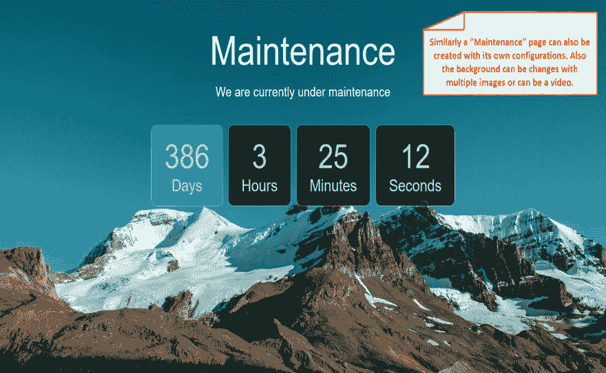
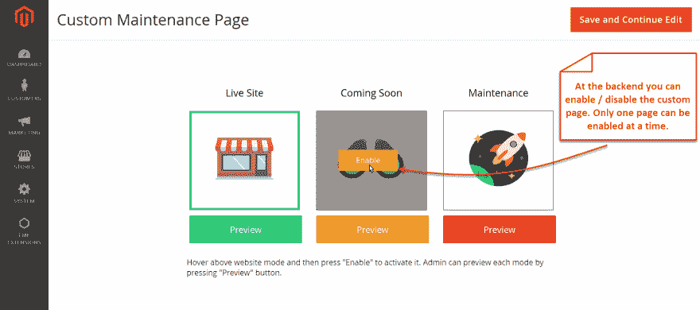
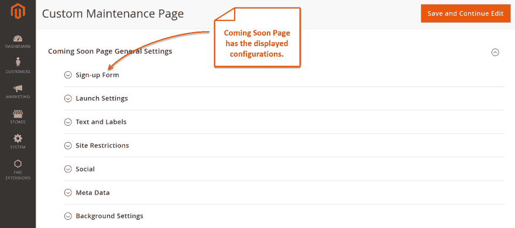

# Magento 2 即将推出，维护模式扩展

> 原文：<https://dev.to/simonwalkerfme/magento-2-coming-soon-and-maintenance-mode-extension-1cn6>

[T2】](https://res.cloudinary.com/practicaldev/image/fetch/s--93uFwTNH--/c_limit%2Cf_auto%2Cfl_progressive%2Cq_auto%2Cw_880/https://thepracticaldev.s3.amazonaws.com/i/qktl60ix5go04hjflbos.png)

Magento 2 维护模式和即将推出的页面扩展为您在网站上创建维护页面和即将推出的页面提供了便利。这个 Magento 2 即将推出的扩展基本上提供了 3 个网站模式，现场，即将推出和维护。另一方面，维护模式由倒计时定时器激活。
**主要功能:**
【在即将推出的页面和维护模式页面中添加和删除媒体】
【根据 IP 地址将网站流量列入白名单】
【即将推出的页面让忠诚的客户继续等待近期的新货。
·维护模式防止用户访问临时维护的网站。
访问

**更多详情和演示:** [Magento 即将推出页面](https://www.fmeextensions.com/coming-soon-maintenance-mode-extension-magento-2.html)

**截图:**

