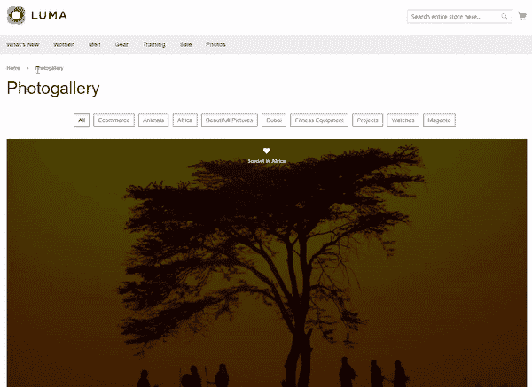
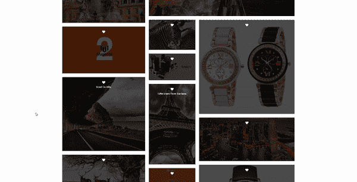
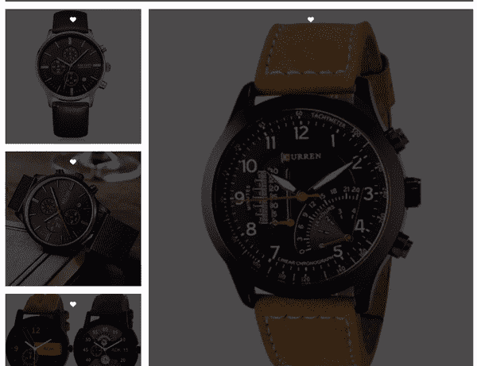
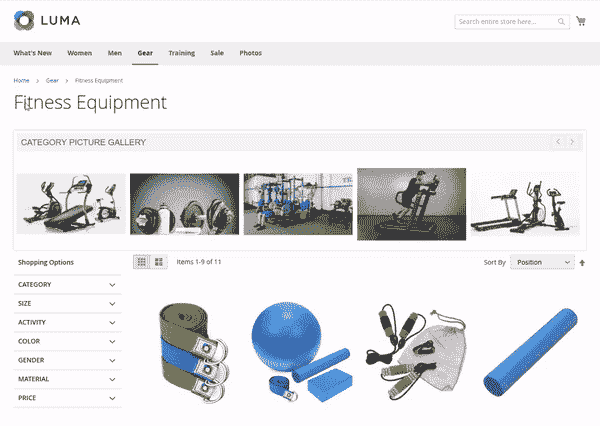

# Magento 2 图像库扩展

> 原文：<https://dev.to/simonwalkerfme/magento-2-image-gallery-extension-5c29>

Magento 2 图像库扩展使您能够在产品、CMS 和类别页面上显示图像。您可以创建图片库，相册和显示在一个适当的层次结构单独的画廊页面。参观者可以在一个反应灵敏的灯箱中观看所有的图像。您可以配置缩略图、图像滑块和框架设置。使用这个万磁王 2 图像库扩展，您可以在不同的布局和显示过滤器选项显示图像。

**特点**:

*   创建单独的图像库页面
*   在产品页面上显示相册
*   在类别页面上显示相册
*   在吸引人的灯箱中显示图像
*   通过 AJAX 加载图像
*   在社交媒体上分享图片
*   同时上传多个图像
*   按商店视图限制图片库

看看演示，看看它看起来怎么样- [Magento 2 图片库](https://www.fmeextensions.com/photo-image-gallery-magento-2.html)

**截图** :
**图片库页面**:

[T2】](https://res.cloudinary.com/practicaldev/image/fetch/s--KvafRgtL--/c_limit%2Cf_auto%2Cfl_progressive%2Cq_66%2Cw_880/https://www.fmeextensions.com/skin/frontend/default/fme_nimg/photo_gallery_m2/create-photo-gallery-page.gif)

**灯箱**

**在社交媒体上分享**

**类别页面上的图片滑块**
