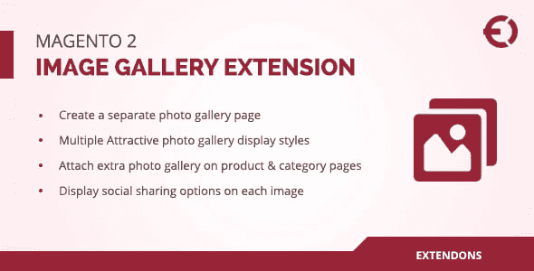
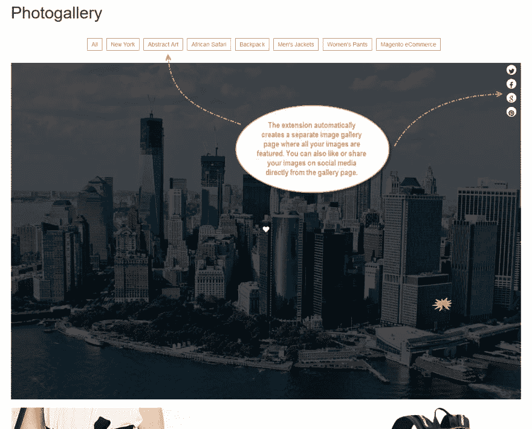
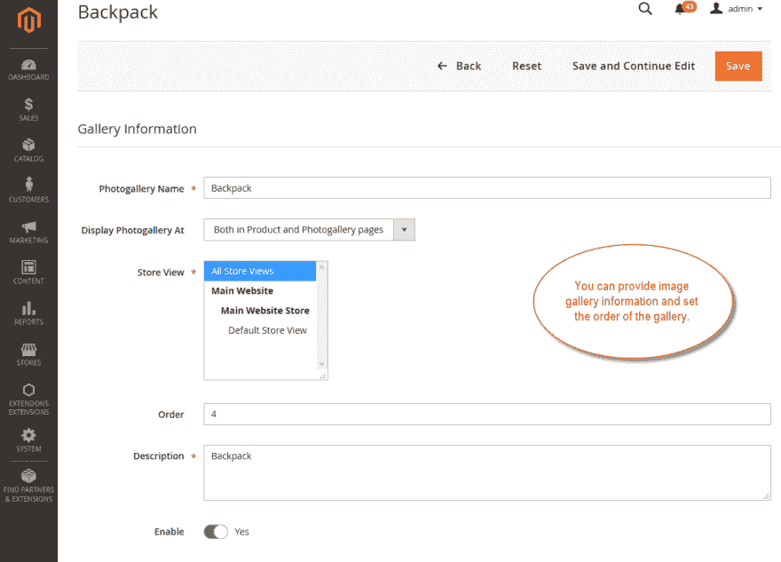
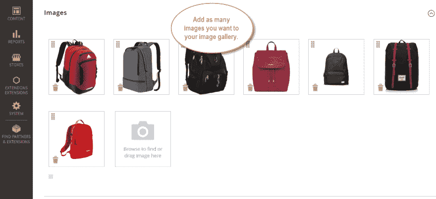
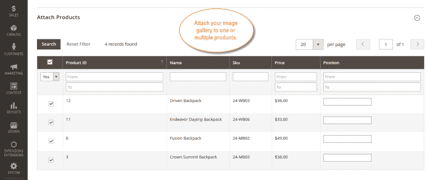

# Magento 2 照片库扩展

> 原文：<https://dev.to/bobhert_bob/magento-2-photo-gallery-extension-42bj>

[T2】](https://res.cloudinary.com/practicaldev/image/fetch/s--rOdfOuW2--/c_limit%2Cf_auto%2Cfl_progressive%2Cq_auto%2Cw_880/https://thepracticaldev.s3.amazonaws.com/i/u68uzerv3hym0vm2jei4.png)

您可以使用 Magento 2 照片库扩展创建单独的照片库页面。客户可以在灯箱和弹出窗口中看到图像，也可以在社交平台上分享图像。 **[Magento 2 照片库](https://codecanyon.net/item/magento-2-image-gallery-product-photo-gallery-extension/21680228)** 扩展还可以让你将照片库附加到特定的产品、类别和子类别上。您可以配置滑块设置，以在漂亮的滑块中显示图库图像。您也可以为照片库进行 SEO 设置，如标题、URL、元关键字等。它只花了你 69 美元。

**截图:**

[T2】](https://res.cloudinary.com/practicaldev/image/fetch/s--3iJ22B_v--/c_limit%2Cf_auto%2Cfl_progressive%2Cq_auto%2Cw_880/https://thepracticaldev.s3.amazonaws.com/i/knz1s60gzawrgnf0k83u.png)

[T2】](https://res.cloudinary.com/practicaldev/image/fetch/s--OY5zYeu2--/c_limit%2Cf_auto%2Cfl_progressive%2Cq_auto%2Cw_880/https://thepracticaldev.s3.amazonaws.com/i/rb1icxy19g6ntdk3qscs.png)

[T2】](https://res.cloudinary.com/practicaldev/image/fetch/s--X8Wikmis--/c_limit%2Cf_auto%2Cfl_progressive%2Cq_auto%2Cw_880/https://thepracticaldev.s3.amazonaws.com/i/wvfsz5lxwjmln9qaggx2.png)

[T2】](https://res.cloudinary.com/practicaldev/image/fetch/s--CrJN_lpT--/c_limit%2Cf_auto%2Cfl_progressive%2Cq_auto%2Cw_880/https://thepracticaldev.s3.amazonaws.com/i/3dr3fm1u0po8jazox3cp.png)