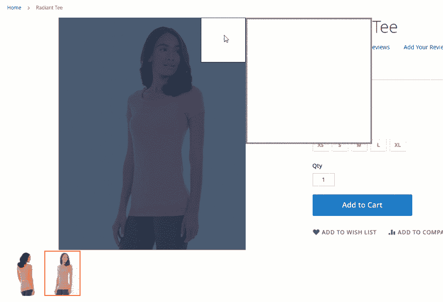
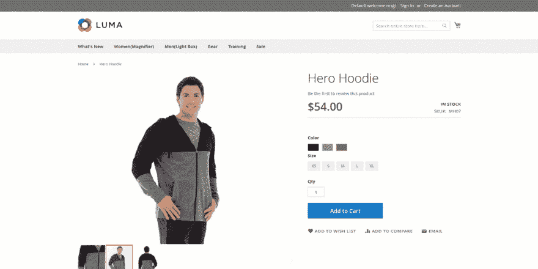

# Magento 2 产品图像缩放扩展

> 原文：<https://dev.to/simonwalkerfme/magento-2-product-image-zoom-extension--2a0a>

Magento 2 产品缩放添加缩放放大镜到产品图像。客户可以在鼠标悬停时在一个响应灯箱中查看图像。使用 Magento 2 图像缩放扩展，管理员可以选择和定制不同类型的放大镜。在 lightbox 中显示产品图像，带有下一个/上一个箭头，支持旋转，配置过渡效果和持续时间。该扩展还允许您为移动视图配置 Magento 产品图像缩放。

**主要特点**:

*   为产品图像添加缩放放大镜
*   允许用户在 lightbox 中查看图像
*   自定义灯箱
*   创建缩放特定产品的规则
*   配置移动视图设置

不同的放大镜类型如下所述:

*   基本缩放
*   色彩
*   内部缩放
*   镜头变焦
*   淡入/淡出
*   松开
*   鼠标滚轮缩放
*   窗口位置
*   定制设计

更多详情和演示- [Magento 2 产品变焦](https://www.fmeextensions.com/product-image-zoom-magento-2.html)

**前端截图**:

[T2】](https://res.cloudinary.com/practicaldev/image/fetch/s--EPo6pcxf--/c_limit%2Cf_auto%2Cfl_progressive%2Cq_66%2Cw_880/https://www.fmeextensions.com/skin/frontend/default/fme_nimg/product_zoom_m2/Add-Zoom-Magnifier-to-Product-Images%2520.gif)

[T2】](https://res.cloudinary.com/practicaldev/image/fetch/s--dMGqmrL2--/c_limit%2Cf_auto%2Cfl_progressive%2Cq_66%2Cw_880/https://www.fmeextensions.com/skin/frontend/default/fme_nimg/product_zoom_m2/Display-Product-Images-in-Lightbox.gif)