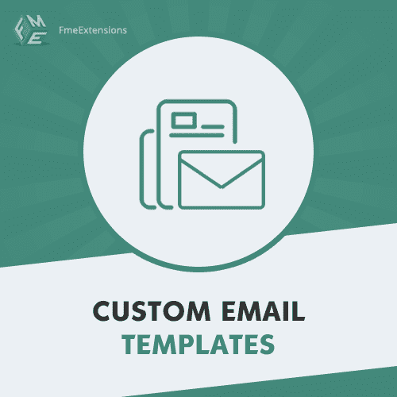
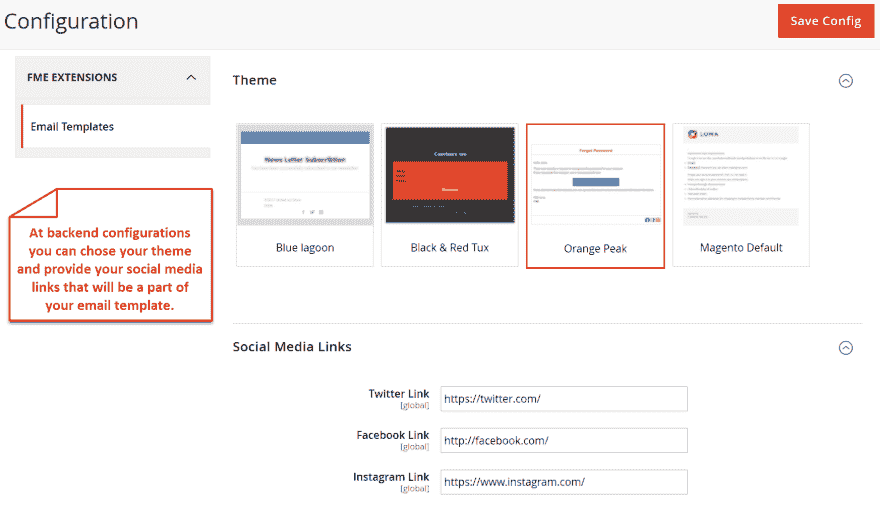
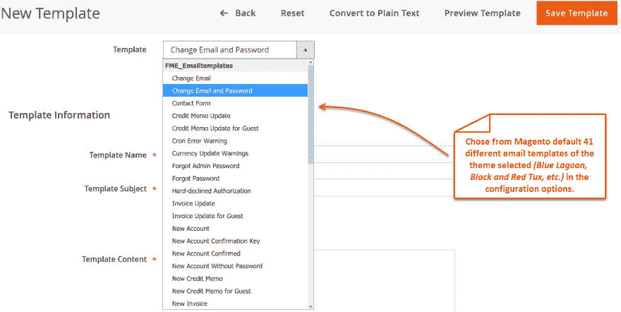
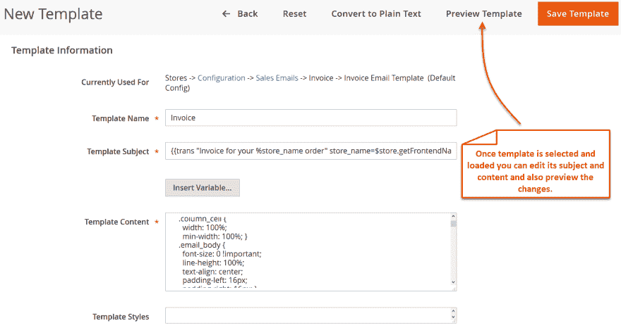

# Magento 2 响应电子邮件模板扩展

> 原文：<https://dev.to/simonwalkerfme/magento-2-responsive-e-mail-template-extension-by-fme-245i>

[T2】](https://res.cloudinary.com/practicaldev/image/fetch/s--CRxIWYVX--/c_limit%2Cf_auto%2Cfl_progressive%2Cq_auto%2Cw_880/https://thepracticaldev.s3.amazonaws.com/i/8e8ebk295yxv5tc2cmhm.png)

使用 Magento 2 电子邮件模板，实现 41 个 Magento 默认电子邮件模板的移动响应，以获得更好的显示和演示效果。选择美化交易邮件的 3 个主题中的任何一个。你可以选择蓝色泻湖，白色和红色燕尾服，或橙峰。您可以提供社交媒体链接，将您的企业简介包含在电子邮件内容中，以获得最大的曝光率。在 Magento 电子邮件模板中，移动响应主题进一步提高了电子邮件的可读性。

**主要特征**

免费终身支持和终身升级
将传统电子邮件模板转变为移动响应模板
借助吸引人的主题为交易电子邮件增添魅力
通过在电子邮件内容中添加社交链接最大限度地提高社交媒体曝光率
酷炫悦目的主题使区分各种电子邮件变得更加容易

**更多详情和演示-** [Magento 2 交易邮件](https://www.fmeextensions.com/responsive-email-templates-extension-magento-2.html)

**截图**

