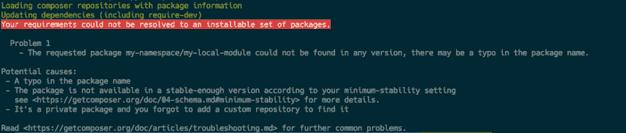
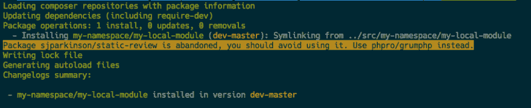

# magento-root 之外的 Magento2 模块

> 原文：<https://dev.to/mwltr/magento2-modules-outside-of-magento-root-3hbb>

*本帖最初发表于:* [https://www.mwltr.de](https://www.mwltr.de/blog/2018/magento2-external-modules/)

最近我发布了一个模块，可以让你在 magento-root 之外拥有 Magento2 模块。

液体错误:内部

如果你错过了，这里是 github 上模块的链接[mwr/ext-magento 2-mwltr-file system-file driver](https://github.com/mwr/ext-magento2-mwltr-filesystem-filedriver)

这篇文章意在跟进，向你展示如何实现一个带有外部本地模块的设置，以及如何使用这个模块。

# 先决条件

让我们假设您想要实现以下 git 存储库目录布局:

```
my-project
    ├── magento
    |   └── composer.json
    └── src
        └── namespace
            └── my-module
                └── composer.json 
```

Enter fullscreen mode Exit fullscreen mode

这个设置需要您在项目根目录`my-project`的 magento 子目录中运行`composer install`。

这可以从项目根通过执行`composer -d=magento install`来完成。

结果将是 magento 把它的文件复制到 magento 子目录中。

# 从 src 添加模块

要包含 magento-root `my-project/magento`之外的模块，您必须执行以下步骤。

## 添加本地知识库

通过添加本地存储库，让 composer 知道在哪里搜索本地模块。

您可以通过向 repositories 数组添加一个 json 对象来实现这一点，该对象的类型是`path`并且`url`是模块的相对路径。

```
"repositories":  [  {  "type":  "path",  "url":  "../src/*/*"  },  {  "type":  "composer",  "url":  "https://repo.magento.com/"  }  ], 
```

Enter fullscreen mode Exit fullscreen mode

您可以在 [composer 文档](https://getcomposer.org/doc/05-repositories.md#path)中找到更多关于 path 类型存储库的信息

## 添加模块要求

在添加了存储库之后，您需要添加您想要的本地模块的 composer 包名称。

```
"require":  {  ["..."],  "my-namespace/my-local-module":"*"  } 
```

Enter fullscreen mode Exit fullscreen mode

如果您现在运行`composer -d=magento update`，您可能会遇到一个错误，指出找不到合适的版本。

[T2】](https://res.cloudinary.com/practicaldev/image/fetch/s--GZOgUwLZ--/c_limit%2Cf_auto%2Cfl_progressive%2Cq_auto%2Cw_880/https://thepracticaldev.s3.amazonaws.com/i/uryn73l01ti0r7j0fne2.png)

在这种情况下，你可能不得不调整`minimum-stability`设置为`dev`，当你这样做的时候，我也建议设置`prefer-stable`标志。

```
"minimum-stability":  "dev",  "prefer-stable":  true, 
```

Enter fullscreen mode Exit fullscreen mode

现在执行`composer -d=magento update`，模块`my-namespace/my-local-module`将被 composer 检测到。

[T2】](https://res.cloudinary.com/practicaldev/image/fetch/s--390V73cQ--/c_limit%2Cf_auto%2Cfl_progressive%2Cq_auto%2Cw_880/https://thepracticaldev.s3.amazonaws.com/i/ryp6byq1cpjrdx58gymk.png)

Composer 将在`vendor/my-namespace`目录中创建一个到本地模块的符号链接。

```
my-local-module -> ../../../src/my-namespace/my-local-module 
```

Enter fullscreen mode Exit fullscreen mode

## 带有观点或主题的问题

如果像这样，从后端的角度来看，模块本身将会工作。但是，如果您将带有布局更新和模板的视图添加到您的模块中，由于`\Magento\Framework\Filesystem\Driver\File`中 getRelativePath 方法的限制，这将会失败。

这就是我的模块 [`mwltr/ext-magento2-mwltr-filesystem-filedriver`](https://github.com/mwr/ext-magento2-mwltr-filesystem-filedriver) 发挥作用的地方。
该模块修复了`getRelativePath`-实现并生成了一个有效的相对路径。这有点棘手，因为 di.xml 不能用于`\Magento\Framework\Filesystem\Driver\File`类。
如果你想知道更多为什么会这样，看看模块的 [README.md](https://github.com/mwr/ext-magento2-mwltr-filesystem-filedriver/blob/master/README.md) 。

该模块发布在[packagist.org](https://packagist.org/packages/mwltr/ext-magento2-mwltr-filesystem-filedriver)上，因此需要添加一个 require 语句:

```
"require":  {  ["..."],  "mwltr/ext-magento2-mwltr-filesystem-filedriver":  "^1.0.1",  "my-namespace/my-local-module":"*"  } 
```

Enter fullscreen mode Exit fullscreen mode

现在再次运行`composer -d=magento update`以便安装模块。

您也可以运行
`composer -d=magento require "mwltr/ext-magento2-mwltr-filesystem-filedriver"`
来代替手动更新所需部分。

从现在开始，你可以按照你所知道的方式安装 magento，或者在升级现有的 magento 安装时，马上添加一个带有视图部件的模块。

# 总结

使用这种技术，您可以将项目特定的实现从 magento-root 中分离出来，也可以从任何本地路径中包含外部模块。一定要考虑从事该项目的其他开发人员，因为他们在自己的机器上也需要完全相同的路径，绝对路径或相对路径。不要引用存储库根目录之外的目录可能是个好主意，这样可以防止一系列新的问题；-).

这篇文章中描述的设置可以在 github 上找到:[mwr/demo-magento 2-external-modules-simple](https://github.com/mwr/demo-magento2-external-modules-simple)

我正在为我的项目使用一个类似的、稍微优化的设置，它运行得相当好。