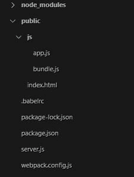

# 亲手制作一个反应式开发环境

> 原文：<https://dev.to/andercodes/make-a-react-dev-environment-with-your-own-hands-2l0i>

你好 React 黑客。在这篇文章中，我将解释如何为 ReactJS 创建一个开发环境。这个环境的创建可以自动完成，只需安装这个包:`create-react-app`但是如果你像我一样，喜欢绝对控制你的应用程序，并且你想从核心开始学习。让我们开始吧。

> 注意:本文假设您的终端中有 npm 和 nodejs

对于我们的 dev-env，我们需要一些依赖项:

*   反应
*   反应范围
*   网络包
*   巴别塔

我们还需要一些朋友(插件和预置)，我将在下面解释几行。

## 第 1 部分-依赖关系

### 0 -起动

创建一个根文件夹，你可以随意命名。名字是你决定的，我准备给它取名`reactenv`。在文件夹中，生成`package.json`文件

```
C:\users\anderson\desktop\reactenv > npm init 
```

Enter fullscreen mode Exit fullscreen mode

你可以随意回答关于该模块的问题。

### 1 -反应

让我们继续我们的主要依赖之一。反应和反应-Dom。react 包包含定义、创建和利用 react 组件的必要函数，因此我们可以稍后在 DOM 中呈现它们。
另一方面，react-dom 包将是 react 和 dom 之间的通信器，它有 React 组件作为目标渲染。

让我们安装这两个:

```
C:\users\anderson\desktop\reactenv > npm install react react-dom --save 
```

Enter fullscreen mode Exit fullscreen mode

### 2 -网袋

[Webpack](https://webpack.js.org/) 是一个可以为 web apps 打包资源的工具。可以管理 HTML，CSS，JS，甚至像萨斯或 JSX 那样需要改造的。
在这种情况下，我们将使用它来打包 react 文件和模块。
因此，我们需要 webpack 和 webpack-cli，我们将使用最后一个 webpack-CLI 向 web pack 发送选项和参数，以制作软件包。

```
C:\users\anderson\desktop\reactenv > npm install webpack webpack-cli --save 
```

Enter fullscreen mode Exit fullscreen mode

### 3 -巴别塔

Babel 只是一个 javascript 编译器，它允许我们将现代 javascript 代码转换成兼容浏览器的 javascript 代码。

我们将需要以下与巴别塔相关的依赖项:
`babel-core`:只是编译器核心
`babel-loader`:允许使用 webpack
`babel-preset-env`传输 javascript 代码:是在 ES5
`babel-preset-react`中翻译 ES2015+的预设:包括与 react 一起工作的功能，其中最重要的一项是将 JSX 代码转换为浏览器可理解的 JS

```
C:\users\anderson\desktop\reactenv > npm install babel babel-core babel-loader babel-preset-env babel-preset-react --save 
```

Enter fullscreen mode Exit fullscreen mode

搞定了。我们已经准备好了我们的附属品。让我们继续配置。

## 第二部分-配置

要开始配置，我们需要在文件夹中创建一个文件结构。文件结构如下:

[T2】](https://res.cloudinary.com/practicaldev/image/fetch/s--f7l1PuSl--/c_limit%2Cf_auto%2Cfl_progressive%2Cq_auto%2Cw_880/https://i.imgur.com/h8Wm6cC.jpg)

让我们开始配置我们的 webpack。让我们添加下一段代码:

`.\reactenv\webpack.config.js`

```
const path = require('path');

module.exports = {
  entry: './public/js/app.js', // Entry point to pack
  output: {
    path: path.resolve('public/js'),
    filename: 'bundle.js' // Output usable to add in our index.html
  },
  mode: 'development',
  module: {
   rules: [
     {
       test: /\.js$/, // Send any .js file (excluding node_modules) to babel compiler
       exclude: /node_modules/,
       use: {
         loader: "babel-loader"
       }
     }
   ]
 } 
}; 
```

Enter fullscreen mode Exit fullscreen mode

知道我们的代码将在`.\js\bundle.js`中，我们可以将它添加到我们的`index.html`中，它将包含一个简单的标记来证明我们的环境正在工作。

这就是我们的 index.html 应该有的样子
`.\reactenv\public\index.html`

```
<!DOCTYPE html>
<html>
   <head>
      Hey React
   </head>
   <body>
      <div id = "content"></div>
      <script src = 'js/bundle.js'></script>
   </body>
</html> 
```

Enter fullscreen mode Exit fullscreen mode

简单。现在我们来看看我们文件中的巴别塔的配置`.babelrc`
`.\reactenv\.babelrc`

```
{
   "presets":["env", "react"]
} 
```

Enter fullscreen mode Exit fullscreen mode

我们只是定义了在编译我们的代码时哪些预置将使用巴别塔

现在终于。让我们从 javascript/react 文件开始

`.\reactenv\public\js\app.js`

```
import React, { Component } from 'react';
import ReactDOM from 'react-dom';

class Hello extends Component {
  render() {
    return(
      <div>
        <h1>Hello react</h1>
      </div>
    );
  }
} 

ReactDOM.render(
  <Hello />,
    document.getElementById('content')
); 
```

Enter fullscreen mode Exit fullscreen mode

通过我们所做的一切，我们的 react 应用程序应该可以工作了。让我们看看。
在编译我们的 React/JSX 代码之前，让我们把下一个脚本添加到我们的`package.json`

```
 "scripts": {
    "test": "echo \"Error: no test specified\" && exit 1",
 ++ "build": "webpack --mode production"
  } 
```

Enter fullscreen mode Exit fullscreen mode

我们跑吧

```
C:\users\anderson\desktop\reactenv > npm run build
> webpack --mode production

Hash: 36a78e225a265111c0fb
Version: webpack 4.19.1
Time: 16609ms
Built at: 2018-09-26 17:53:25
    Asset     Size  Chunks             Chunk Names
bundle.js  103 KiB       0  [emitted]  main
Entrypoint main = bundle.js
[3] ./public/js/app.js 2.71 KiB {0} [built]
    + 7 hidden modules 
```

Enter fullscreen mode Exit fullscreen mode

瞧啊

[T2】](https://res.cloudinary.com/practicaldev/image/fetch/s--M0kwBU1Z--/c_limit%2Cf_auto%2Cfl_progressive%2Cq_auto%2Cw_880/https://i.imgur.com/PFkmJJg.png)

我们不希望每次更改应用程序时都运行`npm run build`,所以让我们创建一个服务器来自动化这个过程。

让我们将这段代码添加到`server.js`

`.\reactenv\server.js`

```
const child_process = require('child_process');
const http = require('http');
const fs = require('fs');

const base = 'public/';

const server = http.createServer();

// Request event
server.on('request', function(request, response) {
  const path = base + request.url;
  // check the status of file requested
  fs.stat(path, (err, stats) => {
      if(err) { // if not exist 404
        console.log('ERROR 404 on file: ' + path);
        response.end('error 404');
      } else { // if exist read it and show it
        fs.readFile(path, (err, data) => {
          console.log('200 OK! file: ' + path);
          response.write(data);
          response.end();
        });
      }
  });
});

// localhost port
server.listen(3000);
console.log('server running on 3000');

// variable to prevent multiple calls
let webpackRunning = false;
function runWebpack() {

  // if webpack is already running don't call it again
  if(webpackRunning) {
    return;
  }
  console.log('app.js changed | running webpack...');

  webpackRunning = true;
  // create a new node process with webpack path and arguments
  const nodeProcess = child_process.fork('node_modules\\webpack\\bin\\webpack.js', ['--mode', 'production'] );

  nodeProcess.on('error', (error) => {
    throw error;
  });

  nodeProcess.on('exit', (code) => {
    console.log('Exit-code: ' + code);
    webpackRunning = false;
  });
}

// if our app.js file change then run web pack
fs.watch('public\\js\\app.js', (eventType, filename) => {
  if(eventType === 'change') {
    runWebpack();
  }
}); 
```

Enter fullscreen mode Exit fullscreen mode

一旦服务器代码准备好了，让我们把它添加到 npm 脚本中

```
 "scripts": {
    "test": "echo \"Error: no test specified\" && exit 1",
    "build": "webpack --mode production",
 ++ "start": "node server.js"
  } 
```

Enter fullscreen mode Exit fullscreen mode

让我们试试。如果一切顺利，我们会看到这样的东西:

```
C:\users\anderson\desktop\reactenv > npm start

> node server.js

server running on 3000 
```

Enter fullscreen mode Exit fullscreen mode

如果我们在浏览器中转到 localhost:3000，我们会看到“Hello react”消息。让我们在`app.js`中做一个改变来检查自动编译:

`.\reactenv\public\js\app.js`

```
class Hello extends Component {
  render() {
    return(
      <div>
        <h1>Hello react</h1>
     ++ <p>Let's Code</p>
      </div>
    );
  }
} 
```

Enter fullscreen mode Exit fullscreen mode

当我们保存文件时，我们会在终端上看到这个:

```
app.js changed | running webpack...
Hash: ada89837b72385fcf901
Version: webpack 4.19.1
Time: 10672ms
Built at: 2018-09-26 18:15:06
    Asset     Size  Chunks             Chunk Names
bundle.js  103 KiB       0  [emitted]  main
Entrypoint main = bundle.js
[3] ./public/js/app.js 2.75 KiB {0} [built]
    + 7 hidden modules
Exit-code: 0 
```

Enter fullscreen mode Exit fullscreen mode

这意味着我们的文件编译成功。让我们检查一下本地主机。
[T3】](https://res.cloudinary.com/practicaldev/image/fetch/s--CcgWMmLs--/c_limit%2Cf_auto%2Cfl_progressive%2Cq_auto%2Cw_880/https://i.imgur.com/qDaK1fv.png)

有用！这样，我们就有了自己创造的反应环境！如果你有任何问题或疑问，不要犹豫，留下你的评论。感谢您阅读！