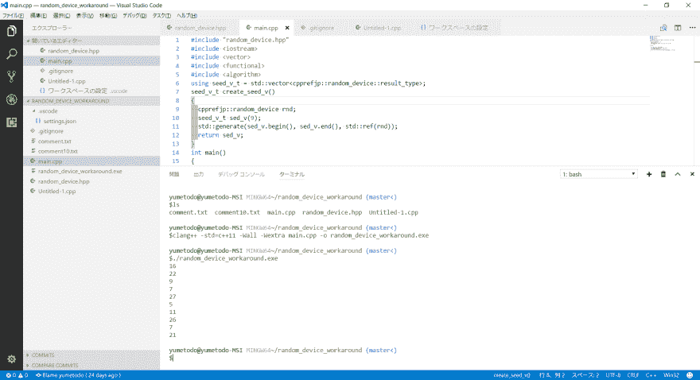

# 把 Visual Studio 代码的集成外壳做成 MSYS2 的 bash

> 原文：<https://dev.to/yumetodo/make-the-integrated-shell-of-visual-studio-code-to-bash-of-msys2-5eao>

# 通知

本文是下面这篇用日语写的帖子的翻译:

[将 Visual Studio Code 15.1 的集成 shell 转换为 MSYS2 的 bash 的- Qiita](https://qiita.com/yumetodo/items/42132a1e8435504448aa)

# 目标 Visual Studio 代码版本

15.1 或更高版本

# 以前的研究

首先，当你谷歌这个故事时，使用 msys2 的 git 的故事变得混杂，没有可谷歌性。

嗯，首先你可以找到这个帖子:

codeのintegratedterminalでmsys2のzshを视觉工作室使う - 備忘録β版
[http://yami-beta.hateblo.jp/entry/2016/06/08/000000](http://yami-beta.hateblo.jp/entry/2016/06/08/000000)

然后，下面有这样的信息:

> 因为好像有 mattn 的执行模块，所以使用那边好像比较好。 (参见注释栏)
> ( en ) there seems to be an execution module by matt n，so it seems good to use it.( see comment field )
> [vist2】](https://gist.github.com/mattn/000735084394601b225a861af4afd35e)

所以，我认为:

> 在 go 构建`bash-login.go`后，将完成的`exe`指定为如下。
> ( en ) After buildin `bash-login.go`with go，specify the completed `exe`as follows。

良好的...用 go 构建...？即使只需要构建一次，我也觉得很懒。

一边看着好像还有其他的信息，

Codeの视觉工作室統合シェルをMSYS2のBashにしたら.bash_profileが読み込 http://qiita.com/catfist/items/ea925fb9e0ba5c0ba9f3

虽然可以找到。然而，他们说:

> 不要将工作区作为工作目录打开

而且用 VSCode 扩展来解决也很可笑。WTF！

# 将 Visual Studio 代码的集成外壳制作成 MSYS2 的 bash 的方式

在`setting.json`中写下:

```
{  "terminal.integrated.shell.windows":  "C:\\msys64\\usr\\bin\\bash.exe",  "terminal.integrated.env.windows":  {  "MSYSTEM":  "MINGW64",  "CHERE_INVOKING":  "1"  },  "terminal.integrated.shellArgs.windows":  [  "--login"  ],  "terminal.integrated.cursorStyle":  "line"  } 
```

Enter fullscreen mode Exit fullscreen mode

`terminal.integrated.cursorStyle`是可选的。

# 解释

## `terminal.integrated.shell.windows`

为 bash 指定完整路径。注意不要指定不属于 msys2 的 bash(例如 git-bash 的 bash)。

## `terminal.integrated.env.windows`

您可以在创建进程时设置环境变量。

### `MSYSTEM`

每个 MSYS2 用户都会知道，MSYS2 有 3 种模式，MSYS，MINGW32，MINGW64，`$PATH`也是(`/usr/bin`，`/mingw32/bin`，`/mingw64/bin`)。

`MSYS`几乎只用于创建 msys2 包。

`MINGW32`是基于 gcc 认为例外型号是矮人，而不是 SEH，由于 Borland 的专利，为 i686。

`MINGW64`主要是环境。

### `CHERE_INVOKING`

对于决定在登录 bash 时是否将工作目录设置为环境变量`$HOME`的路径的标志，将其设置为 1 会阻止移动。

在下面的帖子里:
codeの视觉工作室統合シェルをMSYS2のBashにしたら.bash_profileが読み込 http://qiita.com/catfist/items/ea925fb9e0ba5c0ba9f3
他们说不能将工作区目录作为当前目录打开。原因是他们忘记设置这个标志。不需要像 [@catfist](https://qiita.com/catfist) 那样的 VSCode 扩展

嗯，`msys2_shell.cmd`的代码太难读了，所以他们不理解是不可避免的。

参考:

*   [Cygwin 导入&某种程度的日语化( Cygwin-JE 未使用)|mizuk6n 的【公开备忘录】](https://ameblo.jp/mizuk6n/theme-10002628249.html)

## `terminal.integrated.shellArgs.windows`

通过`--login`、`-l`效果相同。

现在，我们来读读`man bash`。

```
BASH(1)                                                      General Commands Manual                                                     BASH(1)

NAME
       bash - GNU Bourne-Again SHell
OPTIONS
       -l        Make bash act as if it had been invoked as a login shell (see INVOCATION below).

       --login
              Equivalent to -l.

       --noprofile
              Do  not  read  either  the  system-wide  startup  file  /etc/profile  or any of the personal initialization files ~/.bash_profile,
              ~/.bash_login, or ~/.profile.  By default, bash reads these files when it is invoked as a login shell (see INVOCATION below). 
```

Enter fullscreen mode Exit fullscreen mode

> 参见下面的调用

请你自己看。

综上所述，如果没有通过`-l`或`--login`，`~/.Bash_profile`将不会被加载。

更详细的，那是关于登录外壳和交互外壳。请看下文:

*   [登录 shell、交互 shell 和~/.bashrc 们的关系- Qiita](http://qiita.com/incep/items/7e5760de0c2c748296aa)
*   [bash 的登录 shell 和互动 shell|kanon Ji 的博客](http://kanonji.info/blog/2013/06/20/bash%E3%81%AE%E3%83%AD%E3%82%B0%E3%82%A4%E3%83%B3%E3%82%B7%E3%82%A7%E3%83%AB%E3%81%A8%E3%82%A4%E3%83%B3%E3%82%BF%E3%83%A9%E3%82%AF%E3%83%86%E3%82%A3%E3%83%96%E3%82%B7%E3%82%A7%E3%83%AB/)

## `terminal.integrated.cursorStyle`

**optional** .

指定终端光标的样式。默认为`"block"`。我喜欢线条风格，所以指定`"line"`。

# 结果

[T2】](https://res.cloudinary.com/practicaldev/image/fetch/s--cSlgmbp7--/c_limit%2Cf_auto%2Cfl_progressive%2Cq_auto%2Cw_880/https://thepracticaldev.s3.amazonaws.com/i/y9s5s7q9oq06n4q1xswq.png)