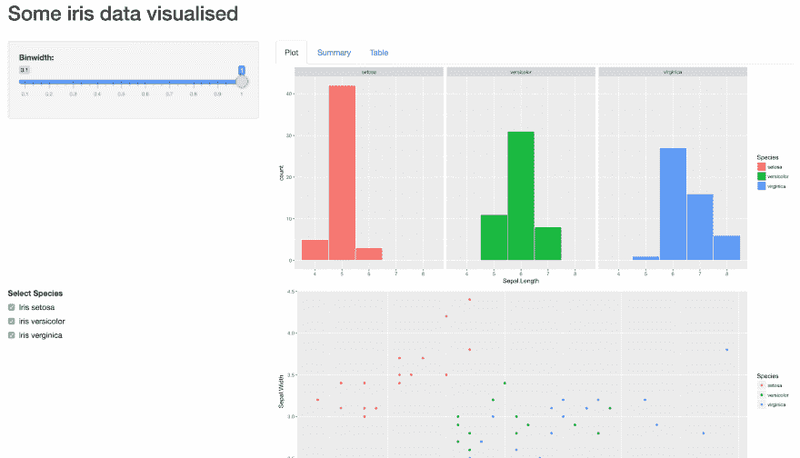

# 让你的代码闪闪发光

> 原文：<https://dev.to/bettyes/make-your-code-shiny--598d>

我最近写了一个简单闪亮的应用程序的非常基本的初学者指南。在这里可以找到

目的是我有一组想要比较的结果(不同之处在于一个输入变量的值)。经过一些令人厌烦的重新运行模型和绘制比较结果后，我决定让整个过程快一点。

由于输入值的闪亮调整，在瞬间产生结果，使整个互动和更有趣的介绍。

听起来不错？好，我们开始吧:

一些非常基本的介绍来构建你的闪亮的应用程序。

## 开始使用...

启动 install.packages(“闪亮”)。您的第一个闪亮应用程序的两个主要组件是 ui(用户界面)和服务器(包含服务器端逻辑——服务器功能)。基本上，您负责 ui 中的所有设计，并在服务器中添加所有功能(用户输入== >输出)。现在有两个选择:
1-将文件单独存放在一个文件夹中作为 ui。r 和服务器。r
2-将它们存储在一个文件中(在这种情况下，确保在最后添加 shinyApp(ui = ui，
server = server)。

```
library(shiny)
ui <- fluidPage()
server <- function(input, output) {}
shinyApp(ui = ui, server = server) 
```

Enter fullscreen mode Exit fullscreen mode

我认为从我目前在其他地方(python，java)看到的情况来看，shiny 在创建具有大量功能和漂亮外观的 web 应用程序方面似乎非常容易。尽管我还没有尝试过这些语言，而且对构建 python 或 java webapps 信心不足。

为了创建一个漂亮的用户界面，shiny 提供了一些易于使用(HTML 派生)的命令:
h1()添加第一个标题——使用 h2、h3、h4、h5、h6 添加更多的标题，
strong()用于粗体文本，
em()用于斜体文本，
br()添加换行符，
a()添加超链接，
img()添加图像，
code()显示，
hr()用于水平标尺。

查看[此处](https://shiny.rstudio.com/articles/tag-glossary.html)了解更多选项。

## 布局

有几个布局选项:

### 1-默认布局...

...有一个输入侧边栏和一个输出主面板(ui 中的 sidebarpanel(input)，mainbarpanel(output))

```
library(shiny)
library(ggplot2)
ui <- fluidPage(
h1("Some iris data visualised"),br(),

  sidebarLayout(position="left",

     sidebarPanel(
        sliderInput("bin", "Binwidth:",min = 0.1, max = 1, value = 1)
      ),

     mainPanel(plotOutput("IrisPlot"))
  )
)

server <- function(input, output) {
  output$IrisPlot <- renderPlot({
     ggplot(iris)+geom_histogram(aes(Sepal.Length, fill=Species),
          binwidth=input$bin, colour="white")+facet_wrap(~Species)
  })
}

shinyApp(ui = ui, server = server) 
```

Enter fullscreen mode Exit fullscreen mode

### 双网格布局...

...使用 fluidrow()、columns()和 wellpanel()。这一页分为 12 列，所以一定要加起来。wellpanel()创建一个灰色背景的面板。要创建与上述相同的图像，请使用:

```
library(shiny)
library(ggplot2)
ui <- fluidPage(
h1("Some iris data visualised"),br(),

  fluidRow(
     column(4,
       wellPanel(
         sliderInput("bin", "Binwidth:",min = 0.1, max = 1, value = 1)
       )
     ),

     column(8,
       plotOutput("IrisPlot")
      )
  )
)

server <- function(input, output) {
 output$IrisPlot <- renderPlot({
   ggplot(iris)+geom_histogram(aes(Sepal.Length, fill=Species),
      binwidth=input$bin, colour="white")+facet_wrap(~Species)
 })
} 
```

Enter fullscreen mode Exit fullscreen mode

请查看第[页](https://shiny.rstudio.com/articles/layout-guide.html#grid-layouts-in-depth)，了解更多关于网格布局的信息。

### 3 层布局...

...使用 tabsetPanel()和 navlistPanel()

```
library(shiny)
library(ggplot2)
ui <- fluidPage(
  h1("Some iris data visualised"),br(),
  fluidRow(
   column(4,
      wellPanel(
        sliderInput("bin", "Binwidth:",
          min = 0.1, max = 1, value = 1)
    )),

   column(8,
     tabsetPanel(
       tabPanel("Plot",plotOutput("IrisPlot")),
       tabPanel("Summary",verbatimTextOutput("IrisSummary")),
       tabPanel("Table",tableOutput("IrisTable"))
    ))
 )
)
server <- function(input, output) {
 output$IrisPlot <- renderPlot({
     ggplot(iris)+geom_histogram(aes(Sepal.Length,         fill=Species),binwidth=input$bin, colour="white")+facet_wrap(~Species)
  })
 output$IrisSummary <- renderPrint({summary(iris)})
 output$IrisTable <-renderTable(iris)
}
shinyApp(ui = ui, server = server) 
```

Enter fullscreen mode Exit fullscreen mode

如果你有很多标签，navlistPanel 可能会派上用场，在你闪亮的应用程序中添加侧栏而不是标签。代码同上，只是用 navlistPanel 替换了 tabsetPanel。

### 4-多页布局...

...navbarPage()将完成这个任务。“只要”把你的 fluidPage()替换成 navbarPage()，嗯...，我承认不是全部。您将不得不进行一些调整，如下所示:

```
library(shiny)
library(ggplot2)
ui <-navbarPage("Iris data: ",
 tabPanel("Plot",
    sidebarLayout(position="left",
      sidebarPanel(
        sliderInput("bin", "Binwidth:",min = 0.1, max = 1, value = 1)
      ),
      mainPanel(
         plotOutput("IrisPlot")
      ))
 ),
 tabPanel("Summary",
    verbatimTextOutput("IrisSummary")),
 tabPanel("Table",
    tableOutput("IrisTable"))
 )

server <- function(input, output) {
     output$IrisPlot <- renderPlot({
        ggplot(iris)+geom_histogram(aes(Sepal.Length, fill=Species),
            binwidth=input$bin, colour="white")+facet_wrap(~Species)
     })
 output$IrisSummary <- renderPrint({summary(iris)})
 output$IrisTable <-renderTable(iris)
}

shinyApp(ui = ui, server = server) 
```

Enter fullscreen mode Exit fullscreen mode

### 闪亮搞定

随意添加更多的小工具(请看这里的[这里的](https://shiny.rstudio.com/gallery/widget-gallery.html)有大量的选择)然后你就可以开始使用你的第一个基本的 ***闪亮的应用***

[T2】](https://res.cloudinary.com/practicaldev/image/fetch/s--Qga6Rs_n--/c_limit%2Cf_auto%2Cfl_progressive%2Cq_auto%2Cw_880/https://thepracticaldev.s3.amazonaws.com/i/0kjv1xovo602nu1onx35.png)

下面的代码...

想了解更多信息，请看一下这个非常好的[教程](https://deanattali.com/blog/building-shiny-apps-tutorial/)(非常有用)。

```
library(shiny)
library(ggplot2)
ui <- fluidPage(
 h1("Some iris data visualised"),br(),
  fluidRow(
    column(4,
        wellPanel(
          sliderInput("bin", "Binwidth:",
            min = 0.1, max = 1, value = 1)
    )),
    column(8,
      tabsetPanel(
        tabPanel("Plot",plotOutput("IrisPlot")),
        tabPanel("Summary",verbatimTextOutput("IrisSummary")),
        tabPanel("Table",tableOutput("IrisTable"))
    ))
 ),
 fluidRow(
    column(4,
      checkboxGroupInput("Species", label = "Select Species",
        choices = list("Iris setosa" = "setosa", 
          "iris versicolor" = "versicolor",
          "iris verginica" = "virginica"),
          selected = 1)),
    column(8,plotOutput("IrisPlot2"))
 )
)

   server <- function(input, output) {
     output$IrisPlot <- renderPlot({
        ggplot(iris)+geom_histogram(aes(Sepal.Length,     fill=Species),binwidth=input$bin, colour="white")+facet_wrap(~Species)
     })
 output$IrisSummary <- renderPrint({summary(iris)})
 output$IrisTable <-renderTable(iris)

output$IrisPlot2 <- renderPlot({
   ggplot(iris[iris$Species==input$Species,])+geom_point(aes(Sepal.Length,     Sepal.Width,color=Species))
 })
}

shinyApp(ui = ui, server = server) 
```

Enter fullscreen mode Exit fullscreen mode