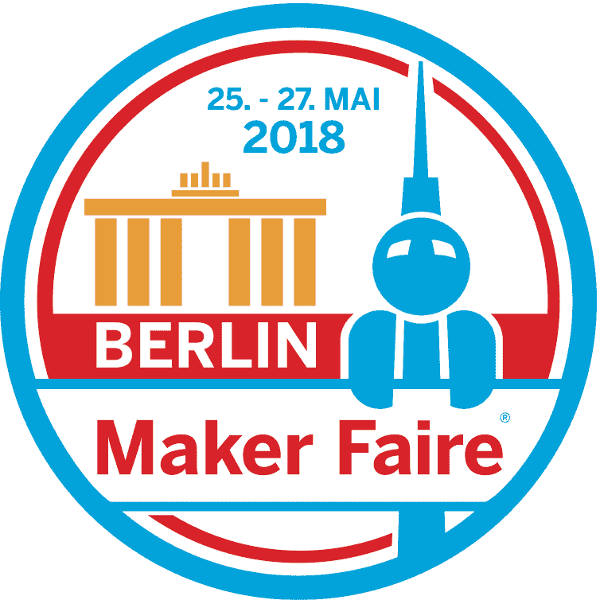
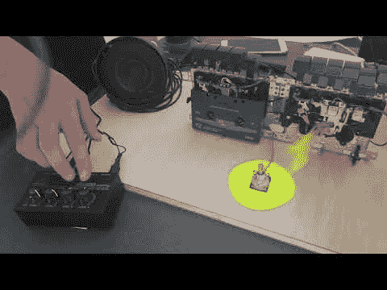
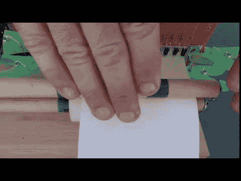
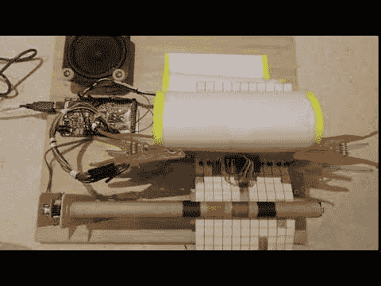

# 2018 年柏林创客博览会

> 原文：<https://dev.to/guergana/maker-faire-berlin-2018-2lep>

对于今年柏林的 Maker Faire，我们提出了恢复旧音乐媒体的想法，并做了一个很酷的项目。我们最终选择了音乐盒和盒式磁带来进行两种完全不同的音乐实验。

[T2】](https://res.cloudinary.com/practicaldev/image/fetch/s--ovS7-ep8--/c_limit%2Cf_auto%2Cfl_progressive%2Cq_auto%2Cw_880/https://thepracticaldev.s3.amazonaws.com/i/9clja149iei4i54nnplz.png)

其中一个实验是盒式磁带混音器。您可以听到两盒磁带同时播放，并用混音器选择输出音量。

盒式混合器:

[T2】](http://www.youtube.com/watch?v=4jQXFzW5YX8)

我做的第二个项目是一个合成器，它可以像旧钢琴卷帘窗一样从纸上读取音符。我的主要想法是使音乐存储媒体可读和可理解，因为自从磁性媒体的引入，媒体技术的创造者和消费者之间的距离变得非常大，所有媒体就像一个黑盒子，如果不使用媒体技术的生产者创造的非常复杂的机器，就无法解码。这使得消费者几乎没有办法使用他们的存储介质，而不依赖于大型(该死的资本家)机器。在这个实验中，你可以在一张纸上画画，这张纸同时也是你的存储介质和笔记，你可以像机器一样理解它们。从而使用户更接近他/她的创作(当然，包括写作)，弥合了一个很大的差距，如果你知道我的意思。

我想进一步阐述这个想法，我在考虑建造一台机器，它可以读取纸条上的颜色，并产生音乐，利用联觉的概念进行游戏。

[T2】](http://www.youtube.com/watch?v=gJl-_CWCea8)

 。

从 Maker Faire 官方网站链接到项目描述。