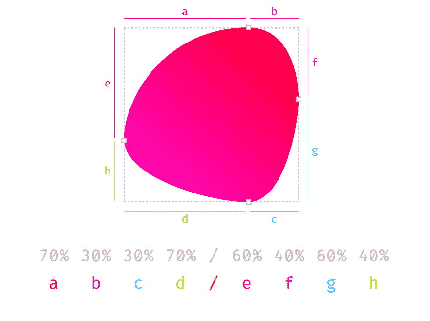

# 制作 CSS blob

> 原文：<https://dev.to/equinusocio/making-a-css-blob-37nb>

几天前，我试图用 CSS 制作一个动画斑点作为个人实验和研究。斑点的最大问题是弯曲的形状应该随着缓慢的动画随机变形。

我发现进行这种转换的唯一方法是使用多步`border-radius`值，它允许你对元素的边缘有更多的控制。

 
图片来自[中的](https://medium.com/9elements/css-border-radius-can-do-that-d46df1d013ae)

首先，我需要阅读更多关于多步边框半径的信息，而[这篇](https://css-tricks.com/almanac/properties/b/border-radius/) css-tricks 文章非常完美。所以我开始写代码准备所有的东西，但我立即注意到，处理多值边界半径并不像我预期的那么容易。在谷歌搜索了一下之后，我看到了[这篇文章](https://medium.com/9elements/css-border-radius-can-do-that-d46df1d013ae)和他们令人敬畏的工具。这帮助我更多地了解了这种方法和生成`border-radius`属性的值。

通过添加一些运动和颜色，我得到了我想要的。您可以在这里查看最终结果。

[https://codepen.io/equinusocio/embed/jezBdZ?height=600&default-tab=result&embed-version=2](https://codepen.io/equinusocio/embed/jezBdZ?height=600&default-tab=result&embed-version=2)

> # [T2】关注我获取更多半铸钢ˌ钢性铸铁(Cast Semi-Steel)招数！](#follow-me-to-get-more-about-css-tricks)
> 
> ### [https://equinsuocha。io](https://equinsuocha.io)