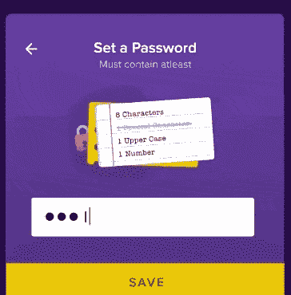
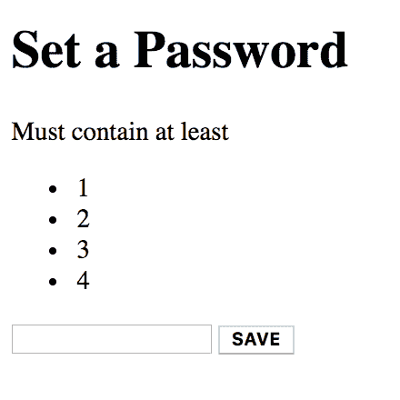
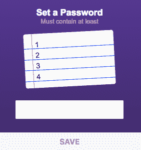
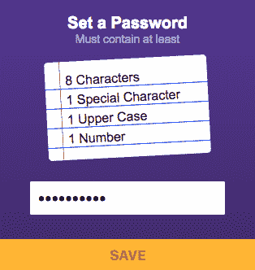

# 制作一个交互式密码验证器- WotW

> 原文：<https://dev.to/ederchrono/making-an-interactive-password-validator---wotw-1md0>

欢迎来到“每周小部件”系列，在这里我拍摄了令人敬畏的 UI/UX 组件的 gif 或视频，并用代码将它们赋予生命。

今天，我们将创建一个密码提交表单，实时验证用户输入。
灵感来自于[ramykhufash](https://uimovement.com/user/10/ramykhuffash/)创作的[投稿](https://uimovement.com/ui/5852/password-guide/)，看起来是这样的:

[T2】](https://res.cloudinary.com/practicaldev/image/fetch/s--RKgmSYzc--/c_limit%2Cf_auto%2Cfl_progressive%2Cq_66%2Cw_880/https://thepracticaldev.s3.amazonaws.com/i/ndrrt14o1g8l6bnjo6ng.gif)

### 制剂

对于今天的小部件，我们将使用 [Vue.js](https://vuejs.org/) ，对于一些动画，我们将使用 [TweenMax](https://greensock.com/tweenmax) 。

如果你想继续，你可以派生这个已经有依赖关系的 [codepen 模板](https://codepen.io/ederdiaz/pen/gzyxWv)。

### 标记

我总是试图尽可能地匹配设计，但在这种情况下，有些图形无法完成，除非我花几个小时使用矢量编辑程序来生成它们，所以我会匹配最重要的交互和动画元素。

让我们首先为我们的主 div 设置一个`app-container`类，因为我们需要对它进行样式化。下面我们应该有一个`title`和`subtitle`来对应我们的小部件
的指令

```
<div id="app" class="app-container">

  <h1 class="title">Set a Password</h1>
  <p class="subtitle">Must contain at least</p> 
```

Enter fullscreen mode Exit fullscreen mode

现在，对于规则列表，我们将创建一个`rules-container`，然后为`pink-line`创建一个空的 div，这将使它看起来像一个笔记本。

```
 <div class="rules-container">
    <div class="pink-line"></div> 
```

Enter fullscreen mode Exit fullscreen mode

接下来，我们将为我们的`rules-list`使用一个无序列表，它将包含四个`rules-items`,每个都有一个用于标签的`rule-text`和一个空的`green-line`,当满足时将越过规则。

```
 <ul class="rules-list">
      <li class="rule-item">
        <div>
          <span class="rule-text">1</span>          
        </div>
        <div class="green-line"></div>
      </li>

      <li class="rule-item">
        <div>
          <span class="rule-text">2</span>          
        </div>
        <div class="green-line"></div>
      </li>

      <li class="rule-item">
        <div>
          <span class="rule-text">3</span>          
        </div>
        <div class="green-line"></div>
      </li>

      <li class="rule-item">
        <div>
          <span class="rule-text">4</span>          
        </div>
        <div class="green-line"></div>
      </li>
    </ul>
  </div> <!-- rules-container --> 
```

Enter fullscreen mode Exit fullscreen mode

最后，我们将制作一个包含密码输入和提交按钮的表单:

```
 <form>
    <input class="password-input" type="password">
    <button class="save-button" type="submit">
      <strong>SAVE</strong>
    </button>
  </form>

</div> <!-- app-container --> 
```

Enter fullscreen mode Exit fullscreen mode

我们应该有一个非常基本的无样式表单，就像这样:

[T2】](https://res.cloudinary.com/practicaldev/image/fetch/s--A3m0hmyp--/c_limit%2Cf_auto%2Cfl_progressive%2Cq_auto%2Cw_880/https://thepracticaldev.s3.amazonaws.com/i/eih68pw4vzdr72m5vobi.png)

### 让它看起来漂亮

我们还有很多工作要做，现在我们的小部件看起来一点也不像最初的帖子。

让我们从`app-container`开始。
我将宽度固定为`320px`并居中。此外，我将设置文本的白色和字体。然后只是一个渐变的背景色来匹配参考。

```
.app-container {
  width: 320px;
  margin: 0 auto; /* center */
  color: white;
  font-family: Arial, Helvetica, sans-serif;
  background: linear-gradient(#553096, #40266D); /* purple gradient background */
} 
```

Enter fullscreen mode Exit fullscreen mode

下一步是设计文本标题的样式。这实际上非常简单，我们只需要将它们居中并调整大小、边距和填充。

```
.title {
  text-align: center;
  padding-top: 20px;
  font-size: 20px;
  margin-bottom: 0;
}
.subtitle {
  text-align: center;
  color: rgba(255, 255, 255, 0.5); /* semitransparent */
  font-size: 14px;
  margin: 0;
} 
```

Enter fullscreen mode Exit fullscreen mode

`rules-container`将是我们的“纸页”,所以它应该有一个白色的背景色，一些`border-radius`用于圆角，固定宽度的`200px`,也将居中。它还应该有一个轻微的角度，`transform: rotate`应该能行:

```
.rules-container {
  width: 200px;
  margin: 0 auto; /* center */
  margin-bottom: 30px;
  color: #2A1E49;
  background-color: white;
  border-radius: 5px;
  transform: rotate(-3deg);
} 
```

Enter fullscreen mode Exit fullscreen mode

现在对于规则，我们将使用填充和边距来设置间距。我们不想看到默认列表的要点，所以`list-style-type: none`会处理好。蓝色的`border-bottom`也有助于笔记本的线条。

```
.rules-list {
  padding: 15px 0 10px 0;
}
.rule-item {
  position: relative;
  list-style-type: none; /* remove bullets */
  width: 100%;
  margin-bottom: 5px;
  border-bottom: solid blue 1px;
}
.rule-text {
  /* set text beside the pink line */
  margin-left: 25px;
} 
```

Enter fullscreen mode Exit fullscreen mode

现在对于线条，两者都有一个绝对位置，因为它们需要自由地放置在元素之上。对于粉红色的线，高度是一种尝试和错误，因为它取决于规则的数量，所以如果您计划添加或删除规则，您应该改变它。
绿线是不同的，因为它出现在每个规则中，应该准备好穿过它们，在这种情况下，我们将从没有穿过的规则开始，因此默认宽度将是`0`。

```
/* pink left line to make the list look like a notebook sheet */
.pink-line {
  position: absolute;
  border-left: solid #f84194 1px;
  height: 120px; /* depends on container height */
  left: 18px;
}
/* line that croses each rule */
.green-line {
  position: absolute;
  background-color: #32B997;
  height: 3px;
  top: 8px;
  left: 22px;
  transform: rotate(2deg);
  width: 0; /* starting width so it doesn't show */
} 
```

Enter fullscreen mode Exit fullscreen mode

为了完成我们组件的样式，我们需要设置`password-input`和`save-button`的样式。它们有一些非常简单的规则，比如删除这些元素的默认边框和轮廓，计算中心，字体大小等等。最有趣的部分是`save-button`，它有一个能够动画背景颜色的过渡属性，以及一个`valid`类规则，当表单被验证并且没有问题时，该规则应该被更改。

```
 .password-input {
  width: 220px;
  outline: none;
  border: none;
  padding: 8px 10px 10px;
  border-radius: 2px;
  margin-bottom: 30px;
  margin-left: calc(50% - 120px);
  font-size: 20px;
}

.save-button {
  outline: none;
  border: none;
  width: 100%;
  padding: 10px;
  color: rgba(0, 0, 0, 0.4);
  font-size: 17px;
  background-color: #EDEDED;
  transition: background-color .3s; /* will animate the backround color when the class changes*/
}
.save-button.valid {
  background-color: #F9B800;
  cursor: pointer;
} 
```

Enter fullscreen mode Exit fullscreen mode

我们现在应该有一个好看的小部件，像这样:
[](https://res.cloudinary.com/practicaldev/image/fetch/s--UOErNJDl--/c_limit%2Cf_auto%2Cfl_progressive%2Cq_auto%2Cw_880/https://thepracticaldev.s3.amazonaws.com/i/916cuvu4cw5mzjr5vqmp.png)

### 互动

现在有趣的部分来了，让我们编码小部件交互，但是在进入 Vue 实例之前，我将创建一个对象来帮助我们使用密码验证规则。

在原始 gif 中，密码需要 8 个字符长，并且有 1 个特殊字符、1 个大写字母和 1 个数字。第一条规则可以很容易地通过比较密码字符串的长度来检查，但是其余的规则需要一些*正则表达式*来容易地检测密码是否包含这些字符。

```
const specialCharsRegex = /[!@#$%^&*()_+\-=\[\]{};':"\\|,.<>\/?]/
const upperCaseRegex = /[A-Z]/
const numberRegex = /[0-9]/

const validationRules = [
  {
    label: '8 Characters', 
    validate: input => input.length>=8,
    labelWidth: 100 // this depends on the label length
  },
  {
    label: '1 Special Character', 
    validate: input => specialCharsRegex.test(input),
    labelWidth: 150
  },
  {
    label: '1 Upper Case', 
    validate: input => upperCaseRegex.test(input),
    labelWidth: 110
  },
  { 
    label: '1 Number', 
    validate: input => numberRegex.test(input),
    labelWidth: 80
  }
] 
```

Enter fullscreen mode Exit fullscreen mode

我们也可以使用一种方法来遍历每个字符并进行比较，但 RegEx 有更好的性能，我们需要在用户输入密码时进行实时比较。

现在我们有了一个带有验证器的规则列表，我们可以开始将它们绑定到 Vue，并使用它们来填充 HTML 规则:

```
new Vue({
  el: '#app',
  data: {
    password: ''
  },
  computed: {
    rules () {
      return validationRules.map(rule => {
        return {
          label: rule.label,
          isValid: rule.validate(this.password),
          labelWidth: rule.labelWidth
        }
      })
    }
  }
}) 
```

Enter fullscreen mode Exit fullscreen mode

如你所见，我们只声明了一个`password`属性，它将保存用户输入的内容。之后，我们创建一个计算的`rules`属性，它基本上采用了我们在上一步中使用的`validationRules`，并将验证器应用于`password`属性。

为了反映这些变化，我们需要将`rules-list`替换为绑定到新的 Vue 计算属性的属性:

```
 <ul class="rules-list">

      <li v-for="(rule, index) in rules" :key="index" class="rule-item">
        <div :ref="`label_${index}`">
          <span class="rule-text">{{rule.label}}</span>          
        </div>
        <div class="green-line" :ref="`line_${index}`"></div>
      </li>

    </ul> 
```

Enter fullscreen mode Exit fullscreen mode

可能你已经注意到，除了循环浏览规则之外，我还为标签和绿线声明了几个`refs`,它们将在以后制作动画时有用。

现在我们只需要另一个计算属性来知道表单是否有效，以及一个存根方法，当表单有效并被提交时将调用该方法。

```
 // computed...
    validForm () {
      // returns false if at least one rule is invalid
      return !this.rules.some(rule => !rule.isValid)
    }
  },
  methods: {
    submitForm() {
      if(this.validForm) {
        console.info('TODO: connect to your back-end');        
      }
    }
  } 
```

Enter fullscreen mode Exit fullscreen mode

在 HTML 代码中，我们可以像这样将它们绑定到我们的表单:

```
 <form @submit.prevent="submitForm">
    <input class="password-input" type="password" v-model="password">
    <button class="save-button" :class="{'valid': validForm}" type="submit">
      <strong>SAVE</strong>
    </button>
  </form> 
```

Enter fullscreen mode Exit fullscreen mode

注意`@submit.prevent`部分，这是一个避免编写方法`event.preventDefault()`的捷径，帮助我们在不刷新页面的情况下触发`submitForm`方法。

我们就快成功了，实际上，如果您设置了一个满足所有这些要求的密码，您可以看到“保存”按钮会改变颜色:

[T2】](https://res.cloudinary.com/practicaldev/image/fetch/s--6jgE8RYK--/c_limit%2Cf_auto%2Cfl_progressive%2Cq_auto%2Cw_880/https://thepracticaldev.s3.amazonaws.com/i/qec2fbbspo2yen89dlbw.png)

### 动画

所以从技术上来说，这个小部件功能齐全，但是它仍然缺少动画来告诉你在输入密码时已经检查了哪条规则。

首先，我们将创建一个方法，它将接受任何规则，并根据它是否有效来激活它。当有效时，绿线应该增加其宽度以穿透文本，同时文本应该具有一些透明度并水平移动一点。当它无效时，它应该恢复正常。

```
 // methods ...
    animateRule(index, isValid) {
      const rule = this.rules[index]
      const greenLine = this.$refs[`line_${index}`]
      const ruleText = this.$refs[`label_${index}`]

      const greenLineWidth = isValid ? rule.labelWidth : 0
      const textOpacity = isValid ? 0.6 : 1
      const textPositionX = isValid ? 7 : -7

      // animate green line's width to strike element
      TweenLite.to(greenLine, 0.3, {
        width: greenLineWidth
      })

      // animate text transparency
      TweenLite.to(ruleText, 0.3, {
        opacity: textOpacity
      })

      // move the text to the side a little bit and then get back
      TweenLite.to(ruleText, 0.15, {
        x: textPositionX,
        onComplete: () => { // when the animation finishes, get it back
          TweenLite.to(ruleText, 0.15, {
            x: 0
          })
        }
      })
    }, 
```

Enter fullscreen mode Exit fullscreen mode

基本上，我在那个方法中所做的是通过引用获得动画元素(还记得我们之前声明的“refs”吗？)，然后计算出他们每个人的最终状态。
之后，使用 TweenLite，我只是将所需的属性补间到最终状态，或者在文本水平移动的情况下，通过在`onComplete`方法中设置另一个 TweenLite 补间来来回移动。

要做到这一点，我们只需要为发生变化的规则触发动画，但是我们如何“检查”我们的规则，看看哪些是无效的，哪些是有效的，或者相反？

我们可以用观察者来做。

观察器是一种方法，您可以在每次应用程序数据发生变化时执行它，它接收特定属性的旧值和新值。

让我们创建一个比较规则值的观察器，如果它们的`isValid`属性发生了变化，那么我们可以调用我们的`animateRule`方法，只动画显示发生变化的规则:

```
 watch: {
    // method that triggers when computed rules change
    rules: function (newRules, oldRules) {
      newRules.forEach((newRule, index) => {
        const oldRule = oldRules[index]
        if(newRule.isValid !== oldRule.isValid) {
          // rule changed its valid property
          this.animateRule(index, newRule.isValid)
        }
      })
    }
  }, 
```

Enter fullscreen mode Exit fullscreen mode

而现在最后的结果！

[https://codepen.io/ederdiaz/embed/LBLVXb?height=600&default-tab=result&embed-version=2](https://codepen.io/ederdiaz/embed/LBLVXb?height=600&default-tab=result&embed-version=2)

这就是本周的**小部件。**

如果你想知道更多，你可以去看看其他的 WotW:

*   [动画滑块控件](https://dev.to/ederchrono/making-an-animated-slider---wotw-mkj)
*   [3D facing widget](https://dev.to/ederchrono/making-a-3d-facing-widget---wotw-1700)
*   [卡片悬停动画](https://dev.to/ederchrono/cards-hover-animation---wotw-273f)

另外，如果你想看下周的某个小部件，可以在评论区发表。