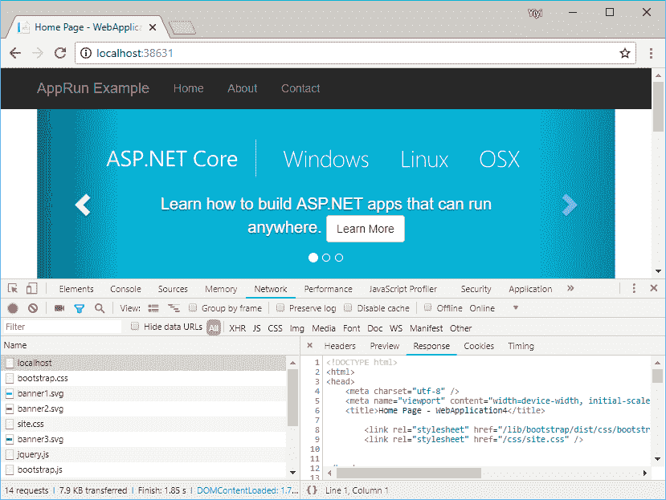
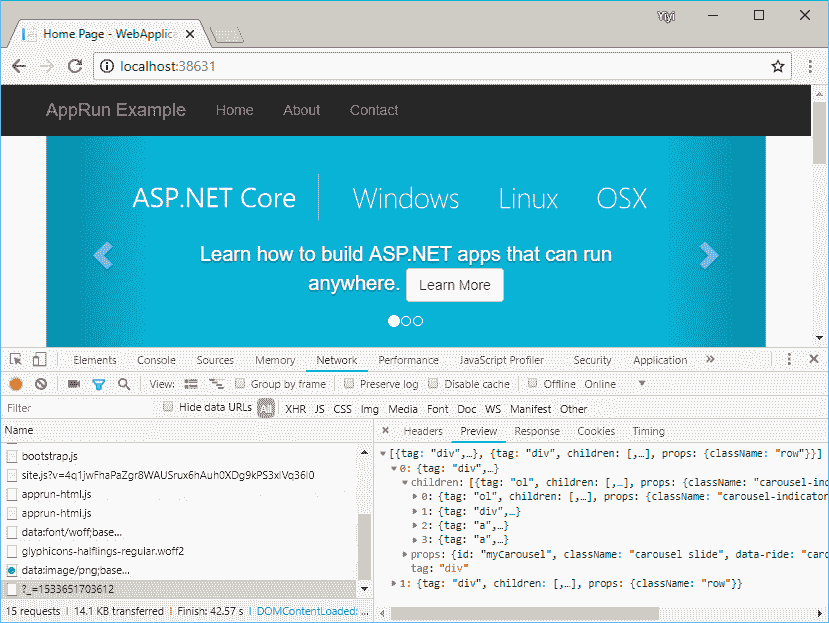
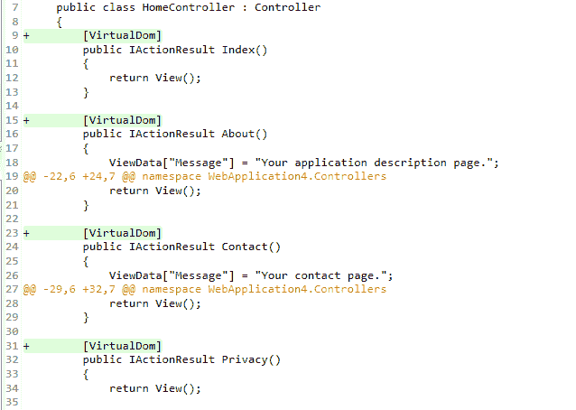
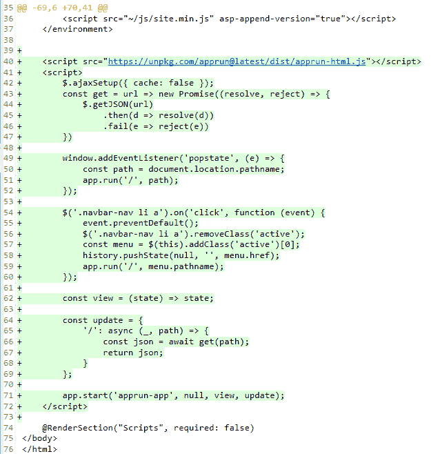

# 使用 AppRun 将 ASP.NET 核心 MVC 应用程序制作成单页应用程序

> 原文：<https://dev.to/yysun/making-aspnet-core-mvc-apps-into-single-page-apps-using-apprun-56hh>

单页应用程序(SPA)是一种 web 应用程序或网站，它通过动态重写当前页面而不是从服务器加载整个新页面来与用户进行交互。这种方法避免了连续页面之间用户体验的中断，使应用程序的行为更像桌面应用程序。
—来自维基百科

如果你已经使用服务器端技术投资和构建了应用程序，如 ASP.NET MVC 和 ASP.NET 核心 MVC，你可能知道很难使服务器端渲染的应用程序成为单页应用程序。您需要将服务器端路由更改为以 JSON 格式返回数据的 Web API。您还需要开发客户端模板和状态管理来处理 JSON 数据。这就像重新开发应用程序。完成这些工作后，您就有了一个单页应用程序。然而，你会发现现在你缺少了服务器端的渲染能力来改善首次加载时间和支持 SEO。

我给你带来了好消息。使用 [AppRun](https://github.com/yysun/apprun) 。

AppRun 是一个 3K 库，用于使用 elm 启发的架构、事件和组件开发应用程序。

AppRun 可以让服务器端渲染的应用瞬间变成单页应用，就像撒了一点小魔法。

# 它是如何工作的？

当用户第一次访问应用程序的页面时，应用程序会返回服务器端呈现的 HTML。

[T2】](https://res.cloudinary.com/practicaldev/image/fetch/s--JmeSwKC8--/c_limit%2Cf_auto%2Cfl_progressive%2Cq_auto%2Cw_880/https://cdn-images-1.medium.com/max/1600/1%2AkRnYJayBjJOyrA-ewjcLeQ.png)

一旦应用程序被加载，客户端 AppRun 应用程序将应用程序切换到单页应用程序模式。当用户点击页面链接时，应用程序从服务器返回虚拟 DOM。客户端 AppRun 将虚拟 DOM 渲染为真实 DOM。

[T2】](https://res.cloudinary.com/practicaldev/image/fetch/s--43S1YcZT--/c_limit%2Cf_auto%2Cfl_progressive%2Cq_auto%2Cw_880/https://cdn-images-1.medium.com/max/1600/1%2A1ZtgK-R4YDb8P4ahLq60Hg.png)

# 如何制作？

首先，我们在项目中包含了虚拟 DOM 过滤器属性。然后，我们将过滤器属性应用于服务器端路由。

 
然后，我们给 _Layout.cshtml 添加一个客户端 AppRun app

[T2】](https://res.cloudinary.com/practicaldev/image/fetch/s--nOi_wAnl--/c_limit%2Cf_auto%2Cfl_progressive%2Cq_auto%2Cw_880/https://cdn-images-1.medium.com/max/1600/1%2A_jpY9GrOqqs3zo3mnEYeyw.png)

最后，我们用 div 元素

包装页面容器，供客户端应用程序呈现页面。

 
这就是你需要的所有魔法！

总而言之，服务器端虚拟 DOM 属性进行内容协商。当请求是 JSON 请求时，它将页面转换成虚拟 DOM。否则，它返回页面的 HTML。客户端应用程序通过将导航菜单的行为从超链接更改为 JSON 请求，将应用程序切换到 SPA 模式。当服务器返回虚拟 DOM 时，客户端应用程序会将虚拟 DOM 转换为真实 DOM。

这是一个用服务器端 MVC 应用程序构建 spa 的简单解决方案。不需要数据 API 或客户端模板。最重要的是，它不会破坏您现有的应用程序逻辑。

# 源代码

自己下载试试。[https://github.com/yysun/apprun-ssr-aspnet-core](https://github.com/yysun/apprun-ssr-aspnet-core)

此外，如果您有 ASP.NET MVC 5 . x 应用程序的非核心版本，您也可以这样做。[https://github.com/yysun/apprun-ssr-aspnet](https://github.com/yysun/apprun-ssr-aspnet)

我计划创建一个 NuGet 包来使它更容易使用，但是我迫不及待地想和那些可能感兴趣的人分享这个想法。

# 结论

AppRun 是一个强大的客户端框架。它可以立即将服务器呈现的应用程序变成单页应用程序。

同样的想法也适用于使用其他服务器端技术的应用程序。我已经成功地将这个概念应用到 Wordpress 应用程序中。我正在做 express.js (Node.js)和 Laravel (PHP)的例子。以后我会写关于他们的帖子。敬请关注。

有关 AppRun 的更多信息，请访问[https://github.com/yysun/apprun](https://github.com/yysun/apprun)。

玩得开心！