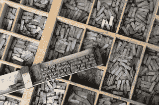

# 理解数字字体

> 原文：<https://dev.to/huijing/making-sense-of-digital-fonts-19f0>

我对语言、书写系统和印刷术的兴趣让我花了几个小时在兔子洞里寻找“这是如何/为什么发生的”的答案随机出现在我脑海中的问题。我可能有一个“容易分心”的问题，但是我们今天不讨论这个😈。

去年，当我为[You got Love Frontend](https://yougottalovefrontend.com/)润色我的演讲时，我开始钻研数字字体格式。当时，我正试图为字体提出一个易于解释的定义。我遇到了一些很好的例子，它们经常在字体和字体之间形成对比，来自[和](http://fontfeed.com/archives/font-or-typeface/) [Yves Peters](https://twitter.com/baldcondensed) 的这篇文章。

> …字母、数字、符号等集合的物理体现。(无论是一箱金属件还是电脑文件)都是一个**字体**。
> 
> ——[马克·西蒙森](https://twitter.com/marksimonson)
> 
> **字体**是你用的，**字样**是你看到的。
> 
> - [诺贝特·弗洛伦多](http://www.typophile.com/node/13593)

但是在弄清楚字体到底是什么之后，我想知道数字字体是如何工作的。我最终还是完成了我的演讲，只是在这个过程中我稍微偏离了主题。这将是另一个“脑残”帖子。你已经被警告了。

**TLDR** : *数字字体格式只是另一种类型的数据格式，它根据每种格式各自的规范存储关于字体的信息。*

## 增加抽象层次

在我看来，数字是短暂的，它是对电子信号的编码和处理。随着数字技术的不断进步(恕我直言，是以极快的速度)，我们越来越看不到它的实际物理表现。

看看这台由鹪鹩多萝西·杜·布瓦松(左)和埃尔西·布克(右)操作的辉煌巨像 Mark 2 计算机。 

作为一个对事物如何在引擎盖下工作以及为什么事情会以某种方式发展感到好奇的人，我发现像《梦想机器》、《T2，巫师熬夜的地方》和《T4，当电脑是人类的时候》这样的书以及像[互联网历史播客](http://www.internethistorypodcast.com/)这样的播客特别有趣。

就在不久前，计算机包围了人类(像巨像或 ENIAC ),计算速度虽然很快，但人眼还是能看到。

在过去的几十年里，处理器的尺寸呈指数级缩小，而速度却呈指数级增长。如果你给 19 世纪的人看你的智能手机，他们可能会认为这是魔法(或者叫你女巫，我不知道，时代不同了)。

我也不认为我现在这样说我们大多数人是错的。也许我们并不认为这本身就是魔术，但大多数人甚至不知道他们的电脑是如何工作的(也许只要它工作就不在乎)。

## 模拟字体

在数字化之前，当我们谈论字体时，我们通常指的是金属排版，其中字体是用于排版整页文本的一整套金属类型。直到今天，这些都被使用了数百年，用于活版印刷。

<figcaption>由日兴铸造厂排版</figcaption>

<figcaption>作曲棒装载着各种类型</figcaption>

我们也有类似这样的字体:

<figcaption>博多尼加粗为 Linofilm V-I-P</figcaption>

<figcaption>Ben Franklin Bold for lino film V-I-P</figcaption>

这些被用于照相排版。它们充当了模拟和数字之间的桥梁，因为在某种程度上，字体是物理对象，但使用这些字体需要数字显示。

所以问题是，我们是如何从可以握在手中的字体发展到只能以比特和字节形式存在的字体的？

## 关于比特和字节的一点

如今，计算机无处不在，你不必成为工程师或计算机科学家就能使用它。曾经有一段时间，计算机是一个利基领域，只有拥有操作计算机的技术知识的爱好者和爱好者感兴趣。快进到今天，许多计算机用户可能不知道他们的机器下面发生了什么。

随着 GUI 变得越来越流行和完善，在不知道什么是文件系统或者数据存储在哪里的情况下完成所有任务是完全可能的。但是让我们稍微研究一下数字数据的概念。我认为[计算机科学速成班系列](https://www.youtube.com/playlist?list=PL8dPuuaLjXtNlUrzyH5r6jN9ulIgZBpdo)在解释许多基本计算概念方面做得非常好，我将参考该视频系列中的信息。

如果你想一想，用数字术语来说，文件到底是什么？这有助于回到硬件和用户界面之间抽象层次较少的时代。

<figcaption>哈佛马克 I 由 IBM</figcaption>

哈佛 Mark I 是 IBM 在第二次世界大战期间为盟军建造的，它由 765，000 个组件，3，000，000 个连接和 800 公里长的电线组成。一根由 5 马力马达驱动的 15 米长的轴被用来保持其内部结构同步。所有的计算基本上都是由机械开关控制的，在开和关之间切换。

<figcaption>非常早期的实验点接触晶体管由 IBM(图片鸣谢:美国计算机博物馆)</figcaption>

分分合合。1 和 0。比特和字节。这就是二进制对于电子和计算机如此重要的原因。计算机运行在数十亿个电子开关上，当电流将它们切换到开或关状态时，这些开关存储二进制数。计算机以二进制数字的形式存储和处理每一种数据格式。数字，懂吗？我的大脑回答，是的，知道了。)

<figcaption>拥有 48 亿个晶体管的 AMD Zeppelin</figcaption>

文件格式是对信息进行编码以便存储的标准方法。它们通常附有详细的说明，准确描述了在电子介质中如何使用比特对信息进行编码。这些规范可以免费获得(开源)或者是专有的，因为有时它们被认为是商业秘密。

对数据进行编码是一回事，但将它们呈现在图形显示器上则完全是另一回事。图形终端和打印设备等硬件的发展与光栅化算法和页面描述语言等软件的进步齐头并进。

如果你仔细想想，在屏幕上看到的任何东西都与计算机图形领域有关。而数字排版确实是一个跨学科的领域，涉及技术工程、美学设计和数学精度。

## 了解字体格式

[Yannis Haralambous](http://perso.telecom-bretagne.eu/yannisharalambous/) 写了一本非常全面的书，叫做[字体&编码](http://www.worldcat.org/title/fonts-encodings/oclc/150365997)，对我理解数字字体有很大帮助。数字字体格式的基本要点解释如下:

> 字体是字形的容器。为了设置一系列字形，软件通过操作系统调用一种字体，并询问它需要的字形。描述字形的方式取决于字体格式:PostScript、TrueType 或许多其他格式中的任何一种，它们都非常不同。

这就回避了字形是什么的问题。幸运的是，这本书也包含了这些定义:

> 字形是书写系统(字母表、音节表、一组表意文字等)中使用的符号的图像。)或记数系统(如音乐、数学、制图学等)。).>字符是对一类等价字形的简单描述，主要是语言或逻辑描述。

字符和字形的问题并不像大多数人认为的那样简单，如果你对亚洲语言有所了解，这一点可能会更加明显。如果你对这个话题感兴趣，我推荐阅读[由](https://www.researchgate.net/publication/228985177_Surface_or_Essence_Beyond_the_Coded_Character_Set_Model) [Shigeki Moro](https://hanazono.academia.edu/ShigekiMoro) 撰写的《表面或本质:超越编码字符集模型》。

字体格式的不同之处在于每个字符或符号的字形存储在各自的字体资源文件中的方式不同。字体包含字符模式和间距信息，字符模式的内容取决于设想的表示。(Kohen，1989 年)。

### 位图字体

位图由称为像素的规则矩形网格组成，每个像素包含一个颜色值。位图的相关信息是像素数和每个像素的颜色深度。位图格式仅仅是**一个位图信息列表**，一个字节一个字节，一行一行。这种方法会产生很大的文件，因此压缩非常重要。

最早的字体是位图字体或光栅字体，它们将每个字形存储为一个像素数组。可以把它们想象成字形的光栅图像的集合。这些字形由黑色或白色像素描述。这在当时的低分辨率屏幕上运行良好，每个字形包含大约一百个像素。

但是对于高分辨率打印，这种方法将导致单个字形需要数千个像素才能清晰地呈现。您可以想象由此产生的文件大小。此外，每一种新的字体大小都需要一套新的字符模式，这使得它们相对不灵活。位图字体的局限性引发了轮廓字体的发展。

### 轮廓字体

轮廓字体或矢量字体是矢量图像的集合，它们将字形描述为一组直线和曲线。以这种方式存储字体信息的优点是可以在不影响分辨率的情况下缩放字体。

但是，与位图字体相比，这样做需要更多的处理能力，并且根据所使用的渲染引擎和所需的输出大小，最终结果可能会有所不同。但是轮廓字体的最大问题是大多数渲染它们的屏幕都是光栅显示器。

#### PostScript fonts

约翰·沃诺克，Adobe 的创始人，开发了 [PostScript](https://www.adobe.com/content/dam/acom/en/devnet/actionscript/articles/PLRM.pdf) ，这是一种使用数学结构描述整个打印页面的编程语言。这种语言包含了一种至今仍被广泛使用的字体格式: *Type 1 字体*，通过 PostScript 语言用数学结构描述字形。

该规范用 111 页的篇幅解释了 1 型字体的来龙去脉，所以我想，只有你感兴趣的时候才可以阅读🤷。1 型字体表示为用 PostScript 语言编写的计算机程序。

该程序是一个描述字符形状的程序的有组织的集合，它由一个明文(ASCII)部分和一个编码和加密部分组成。与*3 型字体*相反，1 型字体允许提示，尽可能精确地表示各种设备和像素密度。

我想借此机会大声喊出[汉字纪录片](https://www.hanzithemovie.com/)，这是一部围绕汉字书写系统的字体设计、视觉文化和身份的优秀作品。

我还了解到宋丽(儷宋)是世界上第一个中文 PostScript 字体，现在的宋丽 Pro(儷宋 Pro)基于 Sammy Or ( [)在 1989 年创建的第一代产品柯熾堅](https://web.archive.org/web/20180211093711/https://www.bnext.com.tw/article/36509/BN-2015-06-12-133122-36)老師).

#### Truetype fonts

*TrueType* 是苹果和微软在上世纪 80 年代对 Adobe 字体垄断的回应，并成为 Macintosh 和 Windows 操作系统最常见的格式。TrueType 表面上并不比 Type 1 字体更好或更差，只是不同而已。

TrueType 字体文件由**一系列串联的表格**组成。这些表中的第一个被称为字体目录，它提供了访问其他表中的数据所需的所有信息。表名最多可以有 4 个字母。

如果您参考 [TrueType 参考手册](https://developer.apple.com/fonts/TrueType-Reference-Manual/)，您可以看到字体表的完整列表，但其中有 9 个是必需的表，即`cmap`。`glyf`、`head`、`hhea`、`hmtx`、`loca`、`maxp`、`name`和`post`。

TrueType 导致了其他几种格式的发展，~~包括*多主*字体，它允许在用户的控制下修改字形的形状，这是我们最近经常听到的可变字体的前身~~。苹果曾致力于 TrueType 的扩展，最终成为*苹果高级排版* (AAT)。

*更新:[大卫·莱蒙](https://twitter.com/typenerd1)指出多主是 Type 1 的扩展而不是 TrueType。下面关于可变字体的部分已经做了相应的更新。*

#### Opentype fonts

*更新: [Tiro Typeworks](https://twitter.com/TiroTypeworks/status/963089470110154753) 指出是 Adobe 接洽微软并加入 OpenType 的工作。微软已经在 1994 年创建了 TrueType Open(T4 ), Adobe 在 1996 年加入了这些努力，增加了对他们在自己的 Type 1 字体中使用的字形轮廓技术的支持。*

Adobe ~~微软~~最终转向以前的竞争对手，微软 ~~Adobe~~ ，他们一起想出了 *OpenType* 作为对 AAT 的回应。这让我想起了幼儿园时的操场联盟，只是说🤷。无论如何，OpenType 也是 TrueType 的扩展，支持 PostScript 字体数据。

同样，OpenType 文件格式包含表格格式中的**数据。OpenType 字体可以包括 OpenType 布局表，这使得字体制造商在设计国际字体或具有印刷功能的高端字体时有更多的选择。这些表格包含有关字形替换、字形定位、对齐和基线定位的信息，使文本处理应用程序能够改进文本布局。**

可变字体最近越来越受关注，有些人可能会将其视为多主字体格式的继承者。多重母版是 1991 年引入的 Type 1 的扩展，它允许在用户的控制下修改字形的形状。

可变字体是 1.8 版本中 OpenType 规范的一个补充，并引入了`fvar`或字体变化表，它描述了该字体使用的变化轴。除了这个表之外，还有一个`STAT`或样式属性表，描述了关于每个变化轴及其值的更多细节。

新推出的变异表有:轴变异(`avar`)、CVT(控制值表)变异(`cvar`)、字体变异(`fvar`)、字形变异(`gvar`)、水平度量变异(`HVAR`)、度量变异(`MVAR`)、垂直度量变异(`VVAR`)。对于所有的信息，这里有一个到 [OpenType 规范](https://www.microsoft.com/en-us/Typography/OpenTypeSpecification.aspx)的链接。

## 包装完毕

这就像一个兔子洞，我想我几乎没有触及所有字体格式的表面，只是触及了我以前使用过的字体格式。但至少现在我有了某种关于字体信息如何在不同类型的字体中存储的心理模型，这是整个练习的出发点。

但是这项研究激发了我对中文字体的发展和数字化的兴趣，所以可能会有后续的文章。保持关注，我的朋友们🤓。

## 进一步阅读

*   [字体的数字格式](https://www.worldcat.org/title/digital-formats-for-typefaces/oclc/256540917&referer=brief_results)
*   光栅成像和数字印刷:国际会议录
*   [字体&编码](https://www.worldcat.org/title/fonts-et-encodings-translation-of-fontes-et-codages-title-from-title-screen-from-unicode-to-advanced-typography-and-everything-in-between-cover-covers-postscript-truetype-opentype-aat-metafont-and-more-cover/oclc/873851541&referer=brief_results)
*   字体和字样这两个术语应该互换使用吗？
*   位图初学者指南
*   [低分辨率下的光栅悲剧](https://web.archive.org/web/20090201063221/http://www.microsoft.com/typography/tools/trtalr.aspx)
*   [重新审视低分辨率下的光栅悲剧](http://rastertragedy.com/)
*   [字体渲染:字体轮廓和文件格式](https://blog.typekit.com/2010/12/08/type-rendering-font-outlines-and-file-formats/)
*   [起源&施乐 PARC 公司和 Adobe 系统公司早期开发 PostScript 和可缩放数字字体(1975-1989)](http://www.historyofinformation.com/expanded.php?id=1213#stq=&stp=0)
*   TEX 和 Metafont(1977–1979)
*   [微软排版规范](https://www.microsoft.com/en-us/Typography/SpecificationsOverview.aspx)

*最初发布于[www.chenhuijing.com](https://www.chenhuijing.com/blog/making-sense-of-digital-fonts/)2018 年 2 月 11 日。*