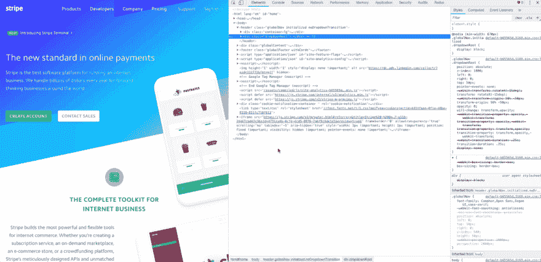
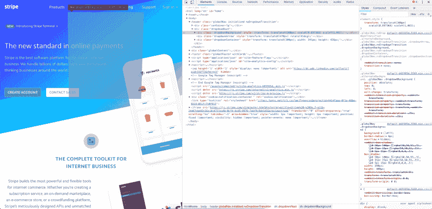

# 制作网页动画

> 原文：<https://dev.to/kyleparisi/making-web-animations-9ng>

# 最有可能的应用就是这样。

没有。有大量的原型工具，其中大多数都与设计工具密切相关。我是一名开发人员，设计是 99%已经为我目前的项目实施。

## 动画库呢？

绝对的。我遇到过几个库，但是它们都是动画，我从来没有认真地使用过。将两个动画融合成一个流畅的动作似乎也很难。因为我们试图给用户一个有意义的体验，我们需要制作自己的自定义动画。

## 我们假设你知道基础知识。

编写 CSS 动画在概念上是容易的，但是以一种看起来流畅和预期的方式组合它们是非常困难的。我们来看看高级的。当我研究这个话题时，我看到有人在分析 stripe.com 导航下拉菜单。下拉菜单不可能那么高级，对吧？我开始做我自己的分析，男人有一堆知识包装在一个“简单”的下拉菜单中。我从未听说过`will-change`或`transition-property` css 属性。另一件难倒我的事是下拉列表看起来像是“滚下”了。

[T2】](https://res.cloudinary.com/practicaldev/image/fetch/s--QtpC9kGs--/c_limit%2Cf_auto%2Cfl_progressive%2Cq_66%2Cw_880/https://thepracticaldev.s3.amazonaws.com/i/i6lps4kn2qosz26lxdcx.gif)

<figcaption>It's subtle, but it's there</figcaption>

这是怎么回事？这花了我一段时间，但我意识到我可以改变动画时间来真正看到它。

[T2】](https://res.cloudinary.com/practicaldev/image/fetch/s--i7JXvU4b--/c_limit%2Cf_auto%2Cfl_progressive%2Cq_66%2Cw_880/https://thepracticaldev.s3.amazonaws.com/i/xpm6hym6agzpew9rpxg5.gif)

<figcaption>There! You can see the bottom grows!</figcaption>

好吧，他们是怎么做到的？我继续往下挖。

[T2】](https://res.cloudinary.com/practicaldev/image/fetch/s--j8wzssQh--/c_limit%2Cf_auto%2Cfl_progressive%2Cq_auto%2Cw_880/https://thepracticaldev.s3.amazonaws.com/i/ivjhhvy6rl9hlwihi8ny.png)

<figcaption>Ah ha! The element starts off skewed.</figcaption>

如果我能找到导致倾斜的 css 属性，我就能把它和动画联系起来。我切换 css 属性，直到我发现`transform: rotateX(-15deg);`正在消除倾斜。干净利落。但是我不明白。*谷歌 rotateX。我发现自己在 codepen...

[https://codepen.io/kyleparisi/embed/GYyLYE?height=600&default-tab=result&embed-version=2](https://codepen.io/kyleparisi/embed/GYyLYE?height=600&default-tab=result&embed-version=2)

好吧，管它呢？我在 CSS 中挖掘了更多...

[https://codepen.io/kyleparisi/embed/vVpMQg?height=600&default-tab=result&embed-version=2](https://codepen.io/kyleparisi/embed/vVpMQg?height=600&default-tab=result&embed-version=2)

答对了。成功了。又一个我从未使用过的 CSS 属性。那么，元素是如何失去透视效果并产生一个正常的矩形的呢？`transform: none;`。

*呼吸沉重*

*   `will-change`是针对浏览器的渲染优化。浏览器可以对变化进行一些计算，使其更加流畅。
*   `transition-property`是应该在`transition-duration`上改变的属性
*   `perspective`"确定 z=0 平面和用户之间的距离，以便给 3D 定位的元素一些透视效果"

## 哇

所有这些都是为了一个下拉菜单。但这正是我在动画中寻找的细节。我最初的想法是，元素应该从最终位置->变换到动画起点->回到最终位置来制作动画。这阐明了从一个变形的位置开始，然后在动画中*移除变形的想法。*

还有更多要学的！祝你好运！