# 使用 Vuex 管理多个中央商店

> 原文：<https://dev.to/bnevilleoneill/managing-multiple-central-stores-with-vuex-62p>

[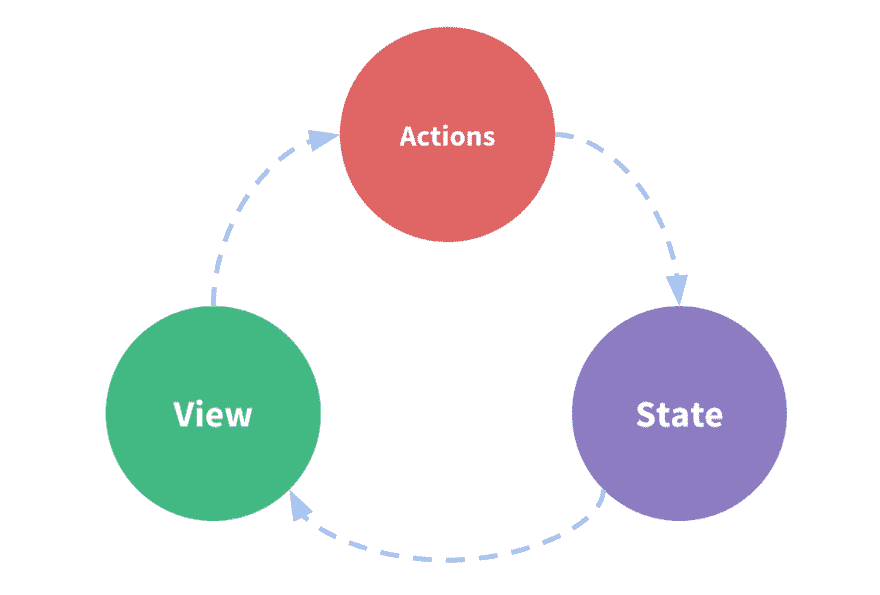](https://vuex.vuejs.org/)

<figcaption>[https://vuex.vuejs.org/](https://vuex.vuejs.org/)</figcaption>

#### 简介

在构建应用程序时，最佳实践之一是通过使用“关注点分离”概念来驱动您的应用程序架构组件。这也适用于使用 Vue 构建应用程序。

当您遵循组件驱动架构时，在某个时间点，您将需要在这些组件之间共享数据。

我们如何在一个 **Vue** 应用程序的这些组件之间共享数据呢？

[T2】](https://logrocket.com/signup/)

#### 为什么是 Vuex？

在一个只有几个组件的简单 Vue 应用中，可以使用 [**【道具】**](https://vuejs.org/v2/guide/components-props.html)**[**自定义事件**](https://vuejs.org/v2/guide/components-custom-events.html) **来实现数据共享。****

 **当您的组件开始逐渐增长时，建议引入一个**中央事件总线**来提供一个独立的服务，用于管理应用程序中跨组件的数据。

最终，你的组件将建立起来形成一个树，其中将有父母，孩子，兄弟姐妹，相邻的兄弟姐妹等。

例如，注册页面有三个不同的阶段。我们可能会提出四个组件——3 个用于处理各个阶段，1 个用于协调和管理整体操作。你马上就会明白我的意思。

管理父组件和子组件(以及其他嵌套组件)之间的数据将变得棘手，并且在使用前述共享数据的方式时可能很容易出错— [**道具**](https://vuejs.org/v2/guide/components-props.html) 和 [**自定义事件**](https://vuejs.org/v2/guide/components-custom-events.html)

那么，在嵌套组件之间共享数据的最佳方式是什么呢？

[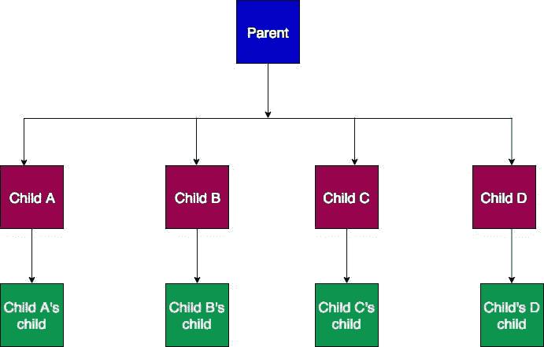](https://res.cloudinary.com/practicaldev/image/fetch/s--bWlGQgoJ--/c_limit%2Cf_auto%2Cfl_progressive%2Cq_auto%2Cw_880/https://cdn-images-1.medium.com/max/691/1%2A4WmNM3B-R8zy555cr68AVA.jpeg) 

<figcaption>具有嵌套组件的系统</figcaption>

在这些类型的组件中处理数据的最佳方式是在您的应用程序中引入 **Vuex** 。

```
Vuex can also be considered as a library implementation tailored specifically for Vue.js to take advantage of its granular reactivity system for efficient updates 
```

从概念上讲，Vuex 可以被描绘成一桶水，根据其内容向任何需要的人供水。

你不能清空一个还没装满的桶。

Vuex 的作用或多或少像是应用程序中所有组件的中央**存储库**——一个你可以从中汲水的水桶。无论应用程序中有多少(嵌套的)组件，任何组件都可以访问**存储**。

[](https://res.cloudinary.com/practicaldev/image/fetch/s--omprGrhn--/c_limit%2Cf_auto%2Cfl_progressive%2Cq_auto%2Cw_880/https://cdn-images-1.medium.com/max/199/1%2AaEbrLamj4nefAMavaDNt0w.jpeg) 

<figcaption>Vuex 抽象😃</figcaption>

让我们来看看 Vuex 背后的架构。如果架构图看起来有点混乱，请放松。你绝对被覆盖了！

[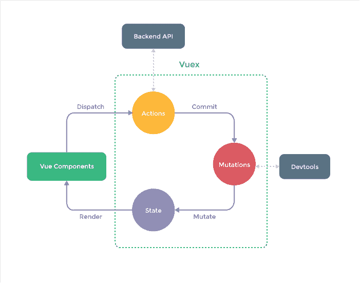](https://res.cloudinary.com/practicaldev/image/fetch/s--Xy6WSfzc--/c_limit%2Cf_auto%2Cfl_progressive%2Cq_auto%2Cw_880/https://cdn-images-1.medium.com/max/701/1%2AKIoNyRO6s_52W68Y-0usJw.png) 

<figcaption>Vuex 架构—来自[文档](https://vuex.vuejs.org)</figcaption>

本文解释了该架构的不同模块。我们将使用一个熟悉的例子:*一个增加或减少计数器状态*的计数器系统。

#### 入门

使用以下任一选项，可以轻松地将 Vuex 添加到项目中:

1.  **内容分发网络**

```
Vuex is installed automatically immediately Vue is added 
```

```
<script src="/path/to/vue.js"></script>
<script src="/path/to/vuex.js"></script> 
```

**2。NPM**
(节点数据包管理器)

```
npm install --save vuex 
```

**3。纱线**

```
yarn add vuex 
```

在我们可以访问 Vuex 的属性之前，Vue 需要知道外部资源 Vuex，然后我们才能使用它。

```
import Vue from 'vue'
import Vuex from 'vuex' 
```

```
Vue.use(Vuex) 
```

#### **Vuex 碎片**

对于有一些 React.js 背景的人来说， *`Vuex`* 有点类似于一个 Redux 或者一个 Flux 实现。这些都是基于同一个总体思路。

根据前面显示的体系结构图，我们将讨论以下模块:

#### **1。状态**

Vuex 主要致力于商店的概念——属于商店的物品可以很容易地被分享。这个**中央存储器**保存应用程序的状态，并且该状态可以由应用程序中的任何组件进行*修改*、*访问或检索*。

一个状态也可以被认为是一个观察者，它监视一个属性的生命周期。在本文中，我们监视的属性称为 counter。

[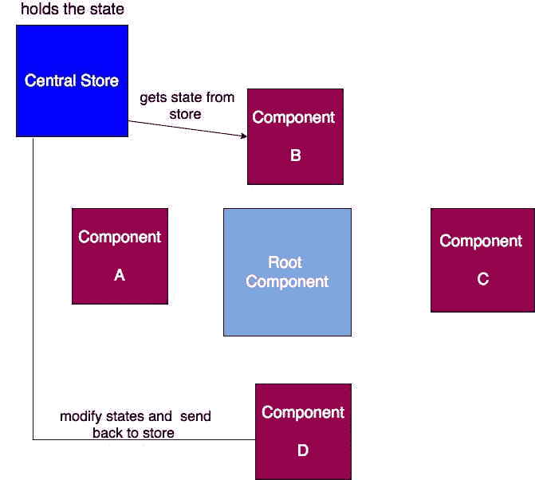](https://res.cloudinary.com/practicaldev/image/fetch/s--M4JcLlE---/c_limit%2Cf_auto%2Cfl_progressive%2Cq_auto%2Cw_880/https://cdn-images-1.medium.com/max/671/1%2ATOa1pW9i1sjhP6Cro78mLg.jpeg)

让我们创建一个简单的应用程序，它有两个子组件(**计数器和显示器**)和一个**主组件**。计数器组件有两个按钮，**增加**使计数器属性加 1，**减少**使计数器减 1。显示组件显示计数器的当前结果，而**主**组件*将两者组合成一个组件。*

[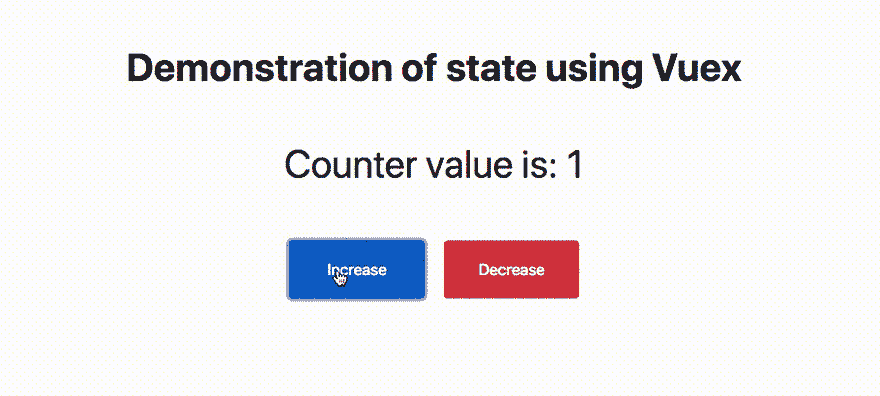](https://res.cloudinary.com/practicaldev/image/fetch/s--ph7KF50G--/c_limit%2Cf_auto%2Cfl_progressive%2Cq_66%2Cw_880/https://cdn-images-1.medium.com/max/910/1%2AgYcNKpodp9VjRvDNPKU_kQ.gif) 

<figcaption>访问计数器状态</figcaption>

这里的目标是要么**更新** ( *增加或减少*)计数器，要么**获取**(显示)计数器属性的当前值。**状态**保存应用程序拥有的所有属性。在这种情况下，它有一个计数器属性，该属性最初设置为 0。

```
import Vue from 'vue';
import Vuex from 'vuex';

Vue.use(Vuex);

export const store = new Vuex.Store({

    state: {
        counter: 0
    }
}); 
```

*使用中央存储器的状态模式*

计数器组件如何访问中央存储？

因为我们已经让 *Vue* 知道了 *Vuex* 。我们现在可以在不发出警报的情况下访问 Vuex 属性:)

```
<template>
  <div>
    <button class="btn btn-primary" @click="increase">Increase</button>
    <button class="btn btn-danger" @click="decrease">Decrease</button>
  </div>
</template>

<script>
  export default {
    name: "app-counter",
    methods: {
      increase() {
        this.$store.state.counter++;
      },
      decrease() {
        this.$store.state.counter--;
      }
    }
  };
</script> 
```

*计数器组件*

从上面的代码片段来看， **$store** 是来自 ***Vuex*** 的属性，它提供了对**中央商店的访问。**这是我们访问计数器状态的方式。

还定义了两种方法。_ 增加方法*将计数器的当前状态增加 1，而减少方法*将计数器的当前状态减少 1。** 

```
<template>
    <p>
        Counter value is: {{ counter }} </p>
</template>

<script>
    export default {
        name: 'appResult',
        computed: {
            counter() {
                return this.$store.state.counter;
            }
        }
    }
</script> 
```

*显示组件*

在上面显示的显示组件中，使用 [*computed*](https://vuejs.org/v2/guide/computed.html) 属性用当前计数器状态更新计数器属性，以在计数器改变时显示结果。

尽管上面的*状态模式*很简单，但是当需要修改当前状态并跨多个组件显示时，它很容易变得混乱。

[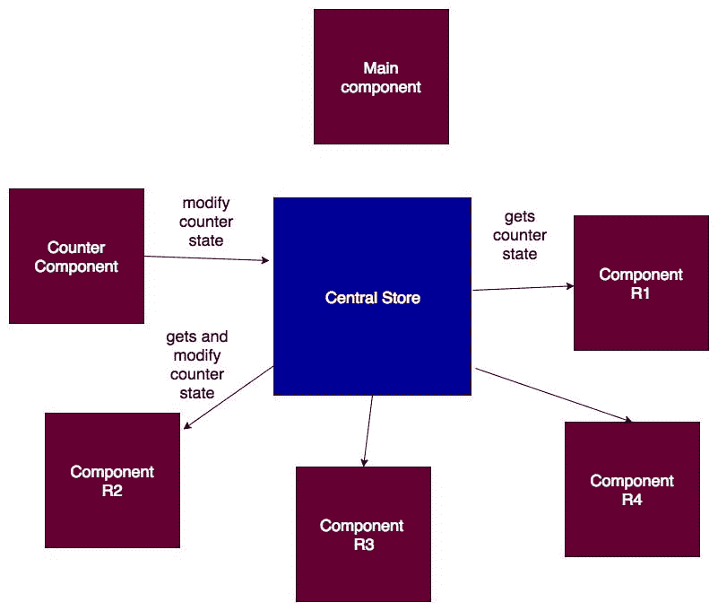](https://res.cloudinary.com/practicaldev/image/fetch/s--Wa3KwiBi--/c_limit%2Cf_auto%2Cfl_progressive%2Cq_auto%2Cw_880/https://cdn-images-1.medium.com/max/801/1%2AVvac8-CcGymFoUE2VvI2Eg.jpeg) 

<figcaption>状态模式的下行</figcaption>

在上图中，计数器状态被修改并分别显示在组件 R2、R3 和 R4 中。假设修改是相同的，同一段代码将在三个组件中重复。例如，在显示在组件中之前向计数器状态添加货币符号，货币符号将在所有三(3)个组件中重复。

在访问跨组件的修改状态时，我们如何坚持 DRY(不要重复自己)的概念？

我们要研究的另一个片段是 *getters，*它与 Javascript 中的 **get** 概念相同，它返回 fed 对象。

#### **2。吸气剂**

Getters 返回中央存储中的状态。这确保了不会直接从存储中访问状态。在应用程序中的任何组件访问状态之前，修改状态也更容易。

[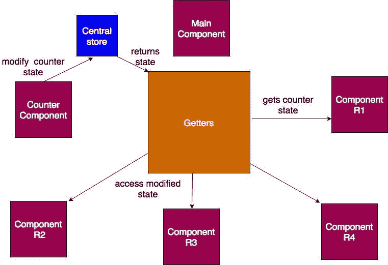](https://res.cloudinary.com/practicaldev/image/fetch/s--nRufCf5G--/c_limit%2Cf_auto%2Cfl_progressive%2Cq_auto%2Cw_880/https://cdn-images-1.medium.com/max/761/1%2AZSIf178JMeR126x3IQkCYQ.jpeg) 

<figcaption>接入态或用吸子修改态</figcaption>

```
import Vue from 'vue';
import Vuex from 'vuex';

Vue.use(Vuex);

export const store = new Vuex.Store({

    state: {
        counter: 0
    },

    getters: {
        /**
         * access counter in state from the paramater 
         */
        addCurrencyToCounter: function (state) {
            return `$ ${state.counter} (dollars)`;
        }
    }
}); 
```

*带吸气剂的中央存储器*

让我们添加一个货币符号来对抗显示组件中显示的货币符号，并看看 *getters* 是如何工作的。**addCurrencyToCounter**(上面代码片段中 getters 的*方法)被 *display* 组件访问，以获取计数器的当前状态。*

为了访问计数器，在被称为 **getters** 的 **$store** 的对象中访问 *addCurrencyToCounter* 。

```
<template>
    <p>
        Counter value is: {{ counter }} </p>
</template>

<script>
    export default {
        name: 'appResult',
        computed: {
            counter() {
                return this.$store.getters.addCurrencyToCounter;
            }
        }
    }
</script> 
```

*显示组件到显示计数器*

如果 getter 对象中有很多方法，代码片段会变得不必要的大吗？

肯定是的！ ***mapGetters*** 是一个助手对象，它将所有的 *getters* 函数映射到一个属性名。

```
mapGetters({
    propertyName: 'methodName'
}) 
```

```
<template>
    <div>
        <p> Counter value is: {{ counter }} </p>
        <p> Counter incremental value is: {{ increment }} </p>
    </div>
</template>

<script>
    import {
        mapGetters
    } from 'vuex';

    export default {
        name: 'appResult',

        /**
         * map the method(s) in getters to a property
         */
        // computed: mapGetters({
        //     counter: 'addCurrencyToCounter',
        //     increment: 'incrementCounterByTen'
        // })

        /**
         * **** using spread operator ****
         * This is useful when other properties are to be 
         * added to computed proptery
         */
        computed: {
            ...mapGetters({
                counter: 'addCurrencyToCounter',
                increment: 'incrementCounterByTen'
            })
        }
    }
</script> 
```

*地图获取者*

我们如何知道修改状态的组件？

允许组件直接修改状态而不跟踪哪个组件修改了当前状态是不理想的。一个例子是具有结帐组件、支付组件等的电子商务应用程序。假设付款组件修改了 itemPrice(状态属性),但没有跟踪哪个组件修改了状态。这可能会导致不可预见的损失。

#### **3。突变**

变异使用了**中的*设置器方法*和**概念中的【获取器和设置器】。在我们访问一个属性之前，它必须已经被设置。计数器状态最初被设置为 0。在计数器需要设置新值的情况下，*突变*开始起作用。它更新存储中的**(提交)**状态。

> 由**突变**完成的更新状态现在反映在访问应用程序中的 getters 的所有组件中。

[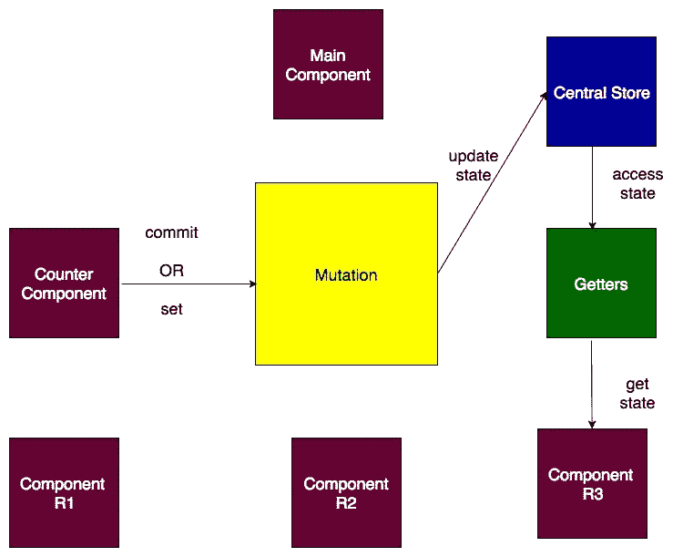](https://res.cloudinary.com/practicaldev/image/fetch/s--fxUZiJ6X--/c_limit%2Cf_auto%2Cfl_progressive%2Cq_auto%2Cw_880/https://cdn-images-1.medium.com/max/739/1%2AK_5RIpTXZaUxhiujPfHVFw.jpeg) 

<figcaption>突变</figcaption>

让我们通过使用突变提交来自计数器组件的更改来修改上面的示例。

```
import Vue from 'vue';
import Vuex from 'vuex';

Vue.use(Vuex);

export const store = new Vuex.Store({

    state: {
        counter: 0
    },

    getters: {
        /**
         * access counter in state from the paramater 
         */
        addCurrencyToCounter: function (state) {
            return `$ ${state.counter} (dollars)`;
        },

        incrementCounterByTen: function(state) {
            return state.counter + 10
        }
    },

    mutations: {
        increase: function(state) {
            state.counter ++;
        },

        decrement: function(state) {
            state.counter++;
        }
    }
}); 
```

*突变*

在上面的代码片段中，可以从函数的参数中访问状态的属性。状态更新现在可以集中在中央存储中。即使组件是父组件的第 100 个子组件，它也可以更新状态，并且不同父组件的子组件也可以访问状态。

```
<template>
  <div>
    <button class="btn btn-primary" @click="increase">Increase</button>
    <button class="btn btn-danger" @click="decrease">Decrease</button>
  </div>
</template>

<script>
  export default {
    name: "app-counter",
    methods: {
      // increase() {
      //   this.$store.state.counter++;
      // },
      // decrease() {
      //   this.$store.state.counter--;
      // }

      increase() {
        this.$store.commit('increase');
      },

      decrease() {
        this.$store.commit('decrement');
      }
    }
  };
</script> 
```

*提交变异方法*

还可以从$store 访问 **commit** 属性，将状态设置为其当前值。除了用于将 getters 中的方法映射到属性名的**map getter**之外，还有使用相同概念的 **mapMutations** 。

```
mapMutations({
    propertyName: 'methodName'
}) 
```

如果 Mutation 同时支持同步和异步操作，那它就太完美了。到目前为止，我们观察到的方法在操作上是同步的。

*突变没有寒意。*它只关心立即运行任务，并确保状态可以立即访问。

随着 web 应用程序变得越来越大，您可能希望连接到远程服务器。该操作肯定会被视为异步操作，因为我们无法判断请求何时完成。如果通过突变直接处理，状态的更新将超出预期的结果

[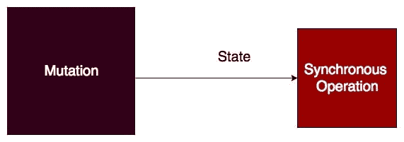](https://res.cloudinary.com/practicaldev/image/fetch/s--pBHvkpuk--/c_limit%2Cf_auto%2Cfl_progressive%2Cq_auto%2Cw_880/https://cdn-images-1.medium.com/max/571/1%2A9xBT5N1oqkkg_tuk6lkBUQ.jpeg) 

<figcaption>变异处理同步活动</figcaption>

在处理突变时，我们如何处理异步操作？

因为突变不会在不扰乱状态的情况下运行异步操作，所以最好不要让它参与进来。我们总是可以在变异之外处理它，并在操作完成时提交到变异环境中的状态。这就是*动作*发挥作用的地方。

#### **4。动作**

*动作*是 Vuex 的另一个片段。我们或多或少可以称**行动**为帮手。这是一个函数，在让突变知道已经做了什么之前，运行任何类型的操作。它的**从组件中分派**，并提交(更新)突变的状态。

[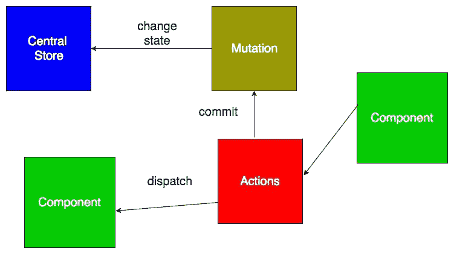](https://res.cloudinary.com/practicaldev/image/fetch/s--HpgIJHnc--/c_limit%2Cf_auto%2Cfl_progressive%2Cq_auto%2Cw_880/https://cdn-images-1.medium.com/max/751/1%2Arv5er-3AbPQag2qQDNVERw.jpeg) 

<figcaption>动作如何工作</figcaption>

既然**动作**处理了操作，组件就不需要像我们之前做的那样与**突变**交互。组件只需要直接处理**动作。**组件可以使用 **$store** 的对象调用 **dispatch** 来访问中央存储中的动作。

让我们快速看一下**动作**是如何放置在中央商店中的。

行动不会完全消除突变的功能。只要我们想要运行的操作本质上不是异步的，**突变**总是可以承担这项工作。

```
import Vue from 'vue';
import Vuex from 'vuex';

Vue.use(Vuex);

export const store = new Vuex.Store({

    state: {
        counter: 0
    },

    getters: {
        /**
         * access counter in state from the paramater 
         */
        addCurrencyToCounter: function (state) {
            return `$ ${state.counter} (dollars)`;
        },

        incrementCounterByTen: function(state) {
            return state.counter + 10
        }
    },

    mutations: {
        increase: function(state) {
            state.counter ++;
        },

        decrement: function(state) {
            state.counter++;
        }
    },

    actions: {
        /**
         * destruct the context, get the commit and call on the appropriate mutation
         */
        increase: function({ commit }) {
            commit('increase')
        },

        decrease: function({ commit }) {
            commit('decrement');
        },

        /**
         * demonstrate an async task
         */
        asyncIncrement: function({ commit }) {
            setTimeout(function(){
                /**
                 * am done, kindly call appropriate mutation
                 */
                commit('increment')
            }, 3000);
        }
    }
}); 
```

*中央商场的行动*

计数器组件现在如何访问操作？

```
increase() {this.$store.dispatch('increase');} 
```

属于**突变**的*提交*被简单地替换为属于**动作的*分派*。**

就像我们有 *mapGetters* 和 *mapMutations* 一样，还有 **mapActions** ，它被映射到中央存储中 *actions* 下的所有方法。

```
...mapActions({
    increase: 'increase',
    decrease: 'decrease' 
})

OR
...mapActions([
    //this an es6 alternative for increment: 'increment'
   'increase',
   'decrease'
]) 
```

到目前为止，我们所做的是单向数据传输。中央存储一直将数据分发到不同的组件。

我们现在如何处理**中央商店**和**组件**之间的双向数据流？

从组件中获取数据，可以很容易地将数据添加到动作名称旁边。

```
this.$store.dispatch('actionName', data); 
```

第二个参数是发送到商店的**数据**(有效负载)。可以是**任何**类型，如*弦*、*号*等。我建议有效载荷总是以对象的形式存在，以确保一致性。这也提供了同时传入多个数据的机会。

```
payload = {objValueA, objValueB, .... } 
```

考虑下面代码片段中的一个异步操作 ***asyncIncrement*** ，它从组件接受一个值，并将其传递给变异(提交)以更新状态。

```
import Vue from 'vue';
import Vuex from 'vuex';

Vue.use(Vuex);

export const store = new Vuex.Store({

    state: {
        counter: 0
    },

    getters: {
        /**
         * access counter in state from the paramater 
         */
        addCurrencyToCounter: function (state) {
            return `$ ${state.counter} (dollars)`;
        },

        incrementCounterByTen: function(state) {
            return state.counter + 10;
        }
    },

    mutations: {
        increase: function(state) {
            state.counter ++;
        },

        decrement: function(state) {
            state.counter++;
        },

        asyncIncrement: function(state, incrementalObject) {
            const { incrementalValue } = incrementalObject;
            state.counter += incrementalValue;
        }
    },

    actions: {
        /**
         * destruct the context, get the commit and call on the appropriate mutation
         */
        increase: function({ commit }) {
            commit('increase')
        },

        decrease: function({ commit }) {
            commit('decrement');
        },

        /**
         * demonstrate an async task
         */
        asyncIncrement: function({ commit }, incrementalObject) {
            setTimeout(function(){
                /**
                 * am done, kindly call appropriate mutation
                 */
                commit('asyncIncrement', incrementalObject)
            }, 3000);
        }
    }
}); 
```

*中央商场*

让我们添加一个新的*按钮*来模拟异步过程，方法是在操作完成时将计数器状态加 5。

```
<template>
<div>
    <button class="btn btn-primary" @click="increase">Increase</button>
    <button class="btn btn-danger" @click="decrease">Decrease</button>
    <button class="btn btn-info" @click="asyncIncrease(5)">Async Increase by 5</button>
</div>
</template>

<script>
import {
    mapActions
} from 'vuex';
export default {
    name: "app-counter",
    methods: {

        ...mapActions({
            increase: 'increase',
            decrease: 'decrease'
        }),

        asyncIncrease(incrementalValue) {
            const objectValue = {
                incrementalValue
            }

            this.$store.dispatch('asyncIncrement', objectValue);
        }

    },
};
</script> 
```

[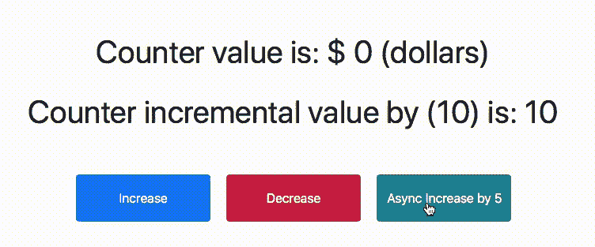](https://res.cloudinary.com/practicaldev/image/fetch/s--gbUbnZfF--/c_limit%2Cf_auto%2Cfl_progressive%2Cq_66%2Cw_880/https://cdn-images-1.medium.com/max/752/1%2Aj8wfHl9KIqJwRqjROkkd-A.gif)

<figcaption>3 ms 后计数器增加 5</figcaption>

#### 结论

Vuex 让您可以根据项目结构的类型灵活地管理多个中央存储。您还可以将商店分成[个模块](https://vuex.vuejs.org/guide/modules.html)。这些模块就像一个容器，将多个中央存储组合在一起。这有助于正确管理属于不同组的商店。此外，建议将在突变、动作和 getters 中创建的方法名分组到一个对象中。

这个项目的源代码可以在这里找到。

注意:大多数方框图中的主要部件没有连接起来，以便更集中于一点。

* * *

## Plug: [LogRocket](https://logrocket.com/signup/) ，一款适用于网络应用的 DVR

[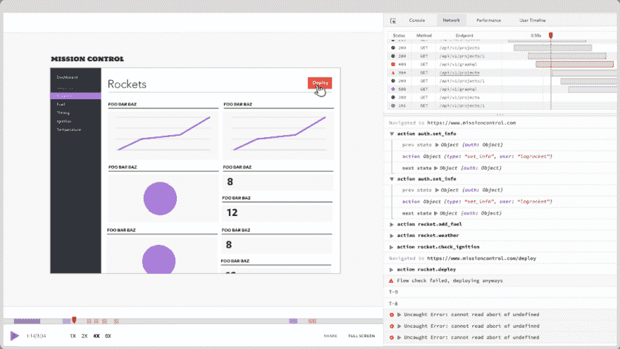](https://res.cloudinary.com/practicaldev/image/fetch/s--6FG5kvEL--/c_limit%2Cf_auto%2Cfl_progressive%2Cq_auto%2Cw_880/https://i2.wp.com/blog.logrocket.com/wp-content/uploads/2017/03/1d0cd-1s_rmyo6nbrasp-xtvbaxfg.png%3Fresize%3D1200%252C677%26ssl%3D1)

[log rocket](https://logrocket.com/signup/)是一个前端日志工具，让你重放问题，就像它们发生在你自己的浏览器中一样。LogRocket 不需要猜测错误发生的原因，也不需要向用户询问截图和日志转储，而是让您重放会话以快速了解哪里出错了。它可以与任何应用程序完美配合，不管是什么框架，并且有插件可以记录来自 Redux、Vuex 和@ngrx/store 的额外上下文。

除了记录 Redux 动作和状态，LogRocket 还记录控制台日志、JavaScript 错误、stacktraces、带有头+体的网络请求/响应、浏览器元数据、自定义日志。它还使用 DOM 来记录页面上的 HTML 和 CSS，甚至为最复杂的单页面应用程序重新创建像素级完美视频。

[免费试用](https://logrocket.com/signup/)。

* * *

用 Vuex 管理多个中央商场的帖子[最早出现在](https://blog.logrocket.com/managing-multiple-central-stores-with-vuex-74cc44646043/)[博客](https://blog.logrocket.com)上。**