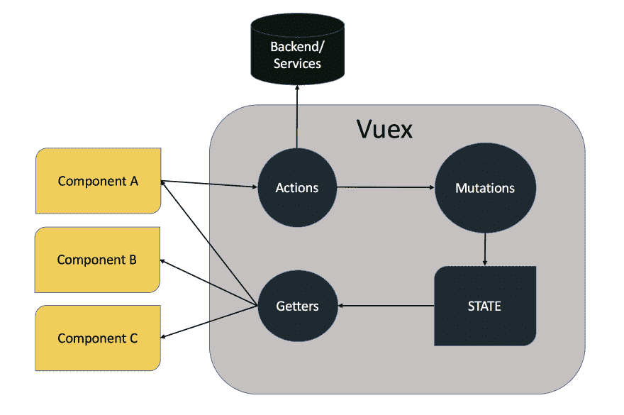

# 用 Vuex 管理国家——我希望拥有的指南

> 原文：<https://dev.to/decoeur_/managing-state-with-vuex---the-guide-i-wish-id-had-28h>

**TL；DR:** 查看 [vuex 流程](#vuex-flow)和/或[跳过查看代码](#tldr)。

近年来，前端应用程序的功能越来越丰富。“这是为了网络”不再是拒绝类似桌面功能请求的恰当理由。与此同时，前端正在从传统的 MVC 模式向更加组件化的结构转变，对固态管理模式的需求已经出现。毕竟，组件之间的交互是任何更大的应用程序的重要组成部分。

Flux 是脸书发布的一种设计模式，旨在构建基于组件的客户端应用程序。有许多通量模式的实现，但在这篇文章中，我们将重点放在一个:Vuex。这是我第一次用 Vuex 阅读状态管理时希望拥有的指南。会有代码的！

### 概念

Vuex 的关键概念是:状态、动作、突变和 getters。state 对象包含应用程序状态，由所有组件共享。突变改变了状态——而且它们是改变状态的唯一方法。动作提交突变，关键的区别在于突变不能是异步的。我们应该调用异步动作，当异步代码完成时，异步动作提交突变。所有的状态突变必须是同步的！最后，getters 返回状态的特定部分供组件使用。

<figure>

[T2】](https://res.cloudinary.com/practicaldev/image/fetch/s--WjTqEV3---/c_limit%2Cf_auto%2Cfl_progressive%2Cq_auto%2Cw_880/https://thepracticaldev.s3.amazonaws.com/i/wu1dtt6firtg4ln5tn61.png)

<figcaption>The flow of data inside store: components create actions which commit mutations, mutations alter the state and getters return parts of it.</figcaption>

</figure>

您可以选择不使用上面描述的一些步骤，但是为了完整起见，我将按照它被设计使用的方式来介绍这个流程。

### 示例 app

我们将查看一些代码，这些代码为一个属性创建存储，对其进行变异，然后返回给组件。示例应用程序是某种活动计算器的概念。基本的想法是，你将选择一项你正在进行的运动，然后加上完成的运动量，比如爬楼梯、跑的距离或做的俯卧撑。本例中的应用程序由两个组件组成:一个用于选择练习，另一个使用所选的练习，并允许您标记已完成的“重复次数”,并将数据发送到后端服务进行进一步处理。

### 带上代码

让我们开始编写代码——我确实使用了 vue-cli 简单 webpack 设置来启用 ES6 特性。首先，让我们创建 Vuex 商店。

#### store . js 内部的状态

存储内部的状态只是另一个对象，它可以包含你想要的任何东西。

<figure>

```
//store.js
import Vue from 'vue'
import Vuex from 'vuex'
Vue.use(Vuex)

const state = {
  selectedExercise: undefined
}
// ... 
```

Enter fullscreen mode Exit fullscreen mode

<figcaption>We have the state object in store.js, it contains the selectedExercise which we'll mutate in a little while.</figcaption>

</figure>

#### 动作

然后我们有了 action 方法，它们将上下文作为第一个参数，将可能的负载作为第二个参数。该操作通过使用变异的名称调用 context.commit 并传递可能的有效负载来创建变异。

<figure>

```
//store.js
const actions = {
  selectActiveExercise(context, exercise){
    console.log('selecting exercise action, ' + exercise.name)
    context.commit('selectExercise', exercise);
  }
}
// ... 
```

Enter fullscreen mode Exit fullscreen mode

<figcaption>Actions commit mutations</figcaption>

</figure>

#### 突变

然后是突变。变异将状态作为第一个参数，可选的有效负载作为第二个参数。上一步中的操作提交了一个调用 selectExercise 方法的突变，该方法进而将状态更改为 real。

<figure>

```
//store.js
const mutations = {
  selectExercise(state, exercise){
    console.log('selecting exercise mutation, ' + exercise.name)
    state.selectedExercise = exercise
  }
}
// ... 
```

Enter fullscreen mode Exit fullscreen mode

<figcaption>Mutations altering the state</figcaption>

</figure>

#### 吸杂

最后缺失的部分——存储暴露的 getters。您可以从任何组件中调用 selectedExercise getter，它将返回您状态的特定部分。

<figure>

```
//store.js
const getters = {
  selectedExercise(state){
    console.log('getting selected exercise')
    return state.selectedExercise
  }
}
// ... 
```

Enter fullscreen mode Exit fullscreen mode

<figcaption>Getter returning a part of the state</figcaption>

</figure>

#### 导出 Vuex 商店

建立商店并将其导出，以便我们可以使用它。

```
//store.js
export default new Vuex.Store({
  state,
  actions,
  mutations,
  getters
}) 
```

Enter fullscreen mode Exit fullscreen mode

#### 导入商店并在你的应用中使用

向商店初始化应用程序。

<figure>

```
// your app.js/main.js, some code omitted
import store from './store/store.js'

new Vue({
  el: '#app',
  store: store,
  router: router,
  template: '<App/>',
  components: { App }
}) 
```

Enter fullscreen mode Exit fullscreen mode

<figcaption>We're importing the store from newly-created store.js and assigning it as a store to our app.</figcaption>

</figure>

### 使用存储在里面的组件

#### 运行动作和变异状态

现在我们已经建立了商店，我们可以在我们的组件中使用它。首先是练习选择器组件，它通过运行选择练习动作来触发为我们的上下文选择活动练习的动作，选择练习动作又会运行将更改提交到状态的变异。

<figure>

```
import { mapActions } from 'vuex'
export default {
  name: "exercise-selector",
  methods: {
    ...mapActions( {
      selectActiveExercise: 'selectActiveExercise'
    } )
  }
// code omitted... 
} 
```

Enter fullscreen mode Exit fullscreen mode

<figcaption>Exercise selector vue component, it maps the selectActiveExercise action for use in our Vue component</figcaption>

</figure>

<figure>

```
<template>
    <li class="exercise-row" @click="selectActiveExercise" role="button">
      <div class="name">{{ exercise.name }}</div>
      <div class="pointsPerUnit">
        <span>{{ exercise.pointsPerUnit }} points per {{ exercise.unit }}</span>
      </div>
    </li>
</template> 
```

Enter fullscreen mode Exit fullscreen mode

<figcaption>Using the mapped "selectActiveExercise" method inside the template</figcaption>

</figure>

#### 吸杂

在改变状态之后，我们将把存储中定义的 getters 映射到我们的其他组件。这有效地为组件创建了一个名为“selectedExercise”的计算 getter 方法。

<figure>

```
import { mapGetters } from 'vuex'
export default {
  name: "exercise-input",
  computed: {
  ...mapGetters([
    'selectedExercise'
   ])
  },
//... 
} 
```

Enter fullscreen mode Exit fullscreen mode

<figcaption>Mapping the getter "selectedExercise" from vuex store for use as computed properties</figcaption>

</figure>

当 getter 在组件的上下文中时，我们可以在模板中使用它，如下所示。

<figure>

```
<div v-if="selectedExercise">
  <h2>Add exercise</h2>
  <div class="input-container">
    <div class="input-selected-name">{{ selectedExercise.name }}</div>
    <in-put class="input-number" v-on:keyup.enter="addExercise" type="number" placeholder="0" v-model="units"></in-put>
    <div class="input-unit">{{ selectedExercise.unit }}</div>
    <div class="input-details">Points {{ selectedExercise.pointsPerUnit}} per {{ selectedExercise.unit }}</div>
    <button @click="addExercise">Add to your exercises record<span class="forward"></span></button>
  </div>
</div> 
```

Enter fullscreen mode Exit fullscreen mode

<figcaption>Mapping the getter "selectedExercise" from vuex store for use as a computed property</figcaption>

</figure>

所以我们在模板中使用映射的 getter 方法。这有效地从 store 中获取数据，并在任何组件提交更改所选练习的变异时自动更新。

就这样，只有几行代码的 Vuex。

### 后记

几周前，在与同事聚会时，我加入了 Vuex。起初，所有关于动作和突变的讨论似乎有点混乱和复杂，但是在几行代码中看到它就变得非常清楚和容易理解了。最后，随着应用程序变得越来越大，使用集中状态确实使应用程序开发变得更容易。当状态变化反应性地呈现在每个组件中时，您可以将注意力集中在改变状态的关键特性上，而不是像发出事件或手动更新视图这样的事情。

我喜欢它，它击败了我以前见过的所有手动脚本和基于事件的解决方案。差了一英里！