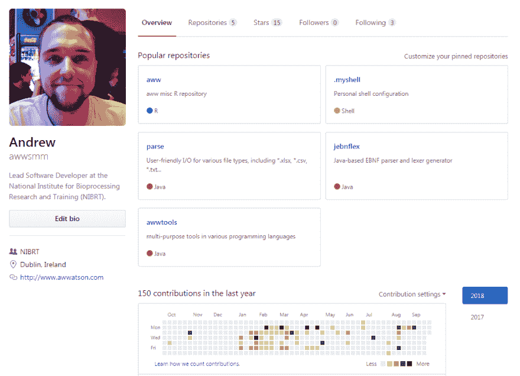
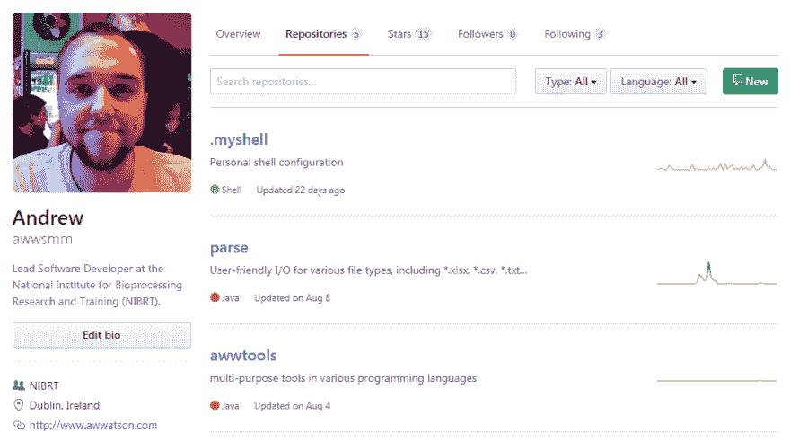
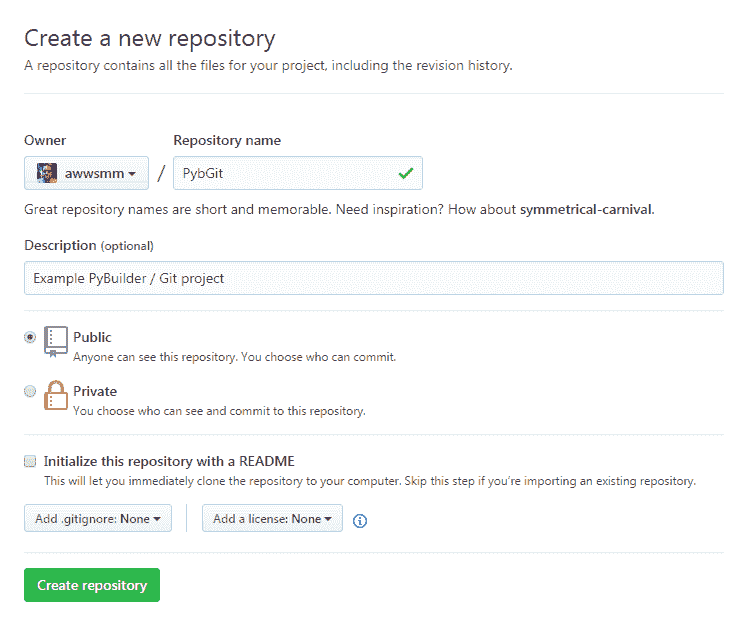
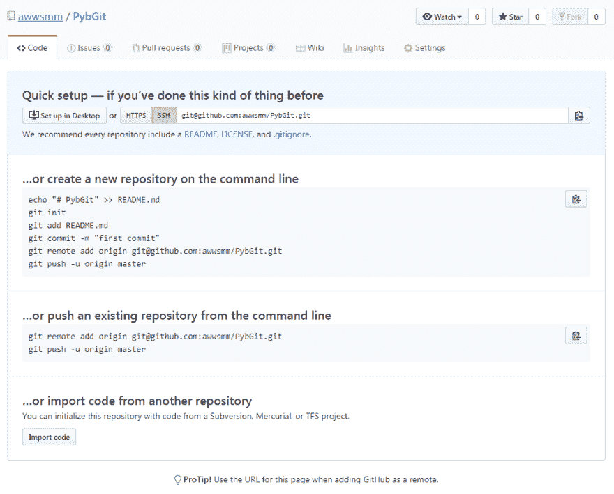
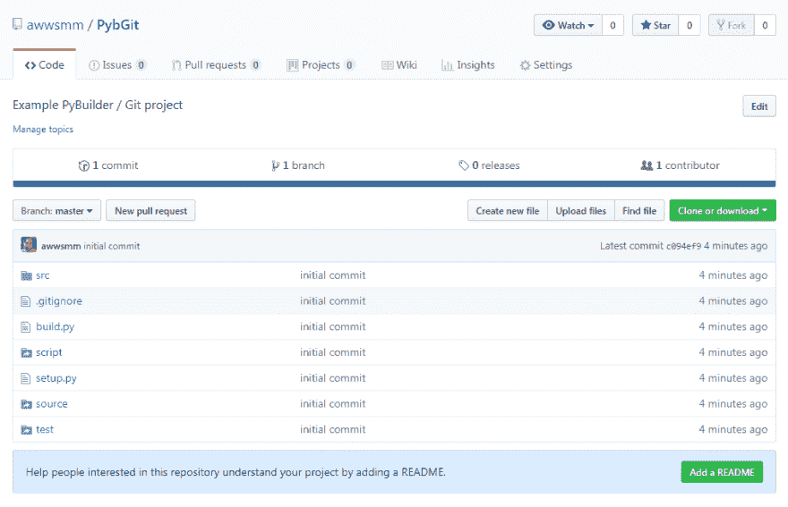
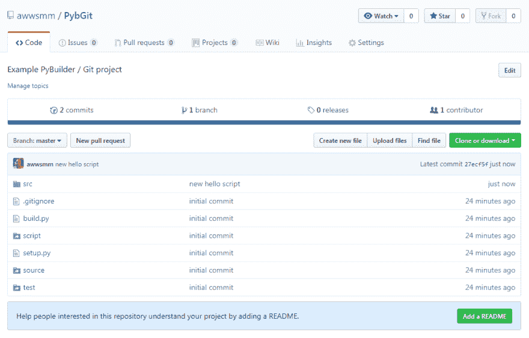

# 用 Git 和 PyBuilder 管理您的 Python 项目

> 原文：<https://dev.to/awwsmm/managing-your-python-project-with-git-and-pybuilder-21if>

# 简介

我最近的大部分工作都是用 Java 完成的，这是一种提供了很多项目管理工具的语言。这其中最著名的大概就是 [Maven](https://maven.apache.org/index.html) 了。Maven 帮助您组织代码和依赖项，并使编译和打包代码变得容易。

也许是因为 Java 往往是一种更加冗长的语言(因此需要特殊的工具来帮助它提交)，或者也许是因为很多人使用 Python 来编写小脚本和辅助函数，但是当我用 Python 编码时，我很难找到一个类似 Maven 的程序来使用。最近，我努力组织了一个新的 Python 项目，并且发现了我认为管理大型 Python 项目的最佳解决方案:PyBuilder + Git。

## PyBuilder

PyBuilder 是一个主要针对 Python 的项目管理工具。它用一致的目录结构组织你的代码(用于源代码、脚本和测试)，管理单元测试和代码覆盖，并且可以打包你的代码以便于共享或上传到 Python 包索引( [PyPI](https://pypi.org/) )。使用 [pydoc](https://docs.python.org/3/library/pydoc.html) ，我们还可以向可用特性列表中添加适当的文档。关于 PyBuilder 的完整介绍可以在[这里](http://pybuilder.github.io/documentation/tutorial.html)找到。

## 去吧

Git 可能是目前最流行的版本控制系统(VCS)。通过伪文件系统而不是其他 VCSes 的基于增量的方法来管理版本控制，Git 项目的每个副本(“克隆”)都是提交给该存储库的所有代码的完整备份。像 Git 这样的分布式 VCS 也非常能抵抗故意伪造和硬件故障，并允许极其灵活的协作环境。关于 Git 的完整介绍可以在[这里](https://git-scm.com/book/en/v2)找到。

## 为什么两者都有？

Git 不关心你的项目是什么样子的。它可以有一个非常严格的目录结构，或者它可以是一个目录充满了千兆的猫迷因。通过将 PyBuilder 的组织能力和项目管理与 Git 的版本控制相结合，我们得到了一个易于导航、易于管理、易于深入和开始参与的 Python 项目。

注意，PyBuilder 和 Git 都可以(也确实)有关于它们的书籍。本教程并不是对这两个软件的详尽介绍，而是更适合那些试图组织自己的 Python 项目、对 Git 有所了解，并且希望忽略我在这一点上遇到的所有陷阱的人。我们走吧！

# 设置 Git

在安装 PyBuilder 之前，我们必须设置 Git。我正在一个干净的、最小安装的 [Ubuntu (18.04.1 LTS)](https://www.ubuntu.com/download/desktop) 虚拟机上运行这个教程，所以我将从头开始做所有的事情。

## 安装 Git

要查明您是否已经安装了 Git(如果您忘记了或者您在一个新系统上)，运行命令

```
andrew@ubuntuvm:~$ whereis git 
```

Enter fullscreen mode Exit fullscreen mode

如果你已经安装了 Git，它应该会返回类似于
的结果

```
git: /usr/bin/git /use/share/man/man1/git.1.gz 
```

Enter fullscreen mode Exit fullscreen mode

我的新虚拟机没有安装 Git，所以我们将从那里开始。Ubuntu 是一个基于 Debian 的类 Unix 操作系统，所以它有高级打包工具`apt`。Git 可以通过`apt` :
轻松安装在 Ubuntu 上

```
andrew@ubuntuvm:~$ sudo apt-get install git 
```

Enter fullscreen mode Exit fullscreen mode

我们可以通过获取 Git 版本来验证安装:

```
andrew@ubuntuvm:~$ git --version
git version 2.17.1 
```

Enter fullscreen mode Exit fullscreen mode

## 设置新的 Git 存储库

Git 存储库可以被*克隆*——也就是说，从现有的存储库中复制——或者从头开始创建。对于本教程，我将假设您的计算机上有一些 Python 代码，您希望将这些代码组装到一个新的 Git 存储库中。要做到这一点，让我们首先创建一个目录，所有代码都将存放在其中，然后`init`初始化一个新的 git repo:

```
andrew@ubuntuvm:~$ mkdir MyProject
andrew@ubuntuvm:~$ cd MyProject
andrew@ubuntuvm:~/MyProject$ git init
Initialized empty git repository in /home/andrew/MyProject/.git 
```

Enter fullscreen mode Exit fullscreen mode

`.git/`目录包含 Git 管理文件所需的所有信息:

```
andrew@ubuntuvm:~/MyProject$ sudo apt-get install tree 
andrew@ubuntuvm:~/MyProject$ tree .git/

.git/
|-- HEAD
|-- branches
|-- config
|-- description
|-- hooks
|   |-- applypatch-msg.sample
|   |-- commit-msg.sample
|   |-- post-update.sample
|   |-- pre-applypatch.sample
|   |-- pre-commit.sample
|   |-- pre-push.sample
|   |-- pre-rebase.sample
|   |-- prepare-commit-msg.sample
|   `-- update.sample
|-- info
|   `-- exclude
|-- objects
|   |-- info
|   `-- pack
`-- refs
    |-- heads
    `-- tags 
```

Enter fullscreen mode Exit fullscreen mode

但是大多数时候，你不需要担心里面有什么，你可以通过`git`命令与 Git 交互。在我们学习这些之前，让我们用 PyBuilder 来组织我们的项目。

# 设置 PyBuilder

使用 PyBuilder 的推荐方式是使用 [pip](https://pypi.org/project/pip/) 在虚拟环境中安装。首先，让我们建立虚拟环境。

## 设置虚拟环境

因为我在 Ubuntu 系统上运行本教程，所以我已经安装了 Python(我假设你也安装了，因为你正在阅读本教程，学习如何组织你的 Python 项目)。如果你没有，Python 软件基金会有关于如何下载 Python 的指导，这样你就可以在你的系统上使用它。

下一步涉及到一个叫做`pip`的工具，它是[，不同的操作系统和不同版本的 Python](https://www.makeuseof.com/tag/install-pip-for-python/) 上安装的不同。在我的例子中，我将使用命令
安装`pip`

```
andrew@ubuntuvm:~/MyProject$ sudo apt-get install python3-pip 
```

Enter fullscreen mode Exit fullscreen mode

...然后确保 pip 是最新的:

```
andrew@ubuntuvm:~/MyProject$ python3 -m pip install --user --upgrade pip 
```

Enter fullscreen mode Exit fullscreen mode

注意，我使用的是`python3`命令而不是`python`，因为 Ubuntu 18 默认设置为使用 Python 3.6.6。接下来，我可以使用 pip 来安装`virtualenv` :

```
andrew@ubuntuvm:~/MyProject$ python3 -m pip install --user virtualenv 
```

Enter fullscreen mode Exit fullscreen mode

如果你得到类似
的警告

```
The script virtualenv is installed in `/home/andrew/.local/bin` which is not on PATH.
Consider adding this directory to PATH or, if you prefer to suppress this warning, use --no-warn-script-location. 
```

Enter fullscreen mode Exit fullscreen mode

您可以通过将标注的位置添加到系统的`$PATH`变量:
来解决这个问题

```
andrew@ubuntuvm:~/MyProject$ export PATH=$PATH:/home/andrew/.local/bin
andrew@ubuntuvm:~/MyProject$ echo $PATH
/usr/local/sbin:/usr/local/bin:/usr/sbin:/usr/bin:/sbin:/bin:/usr/games:
/usr/local/games:/snap/bin:/home/andrew/.local/bin 
```

Enter fullscreen mode Exit fullscreen mode

最后，用
创建一个虚拟环境

```
andrew@ubuntuvm:~/MyProject$ virtualenv env 
```

Enter fullscreen mode Exit fullscreen mode

这只是在`MyProject`目录中创建了`env`目录。你可以用命令
进入虚拟环境

```
andrew@ubuntuvm:~/MyProject$ source env/bin/activate
(env) andrew@ubuntuvm:~/MyProject$ 
```

Enter fullscreen mode Exit fullscreen mode

命令提示符前的`(env)`表示您在虚拟环境中。您可以随时使用命令
退出虚拟环境

```
(env) andrew@ubuntuvm:~/MyProject$ deactivate
andrew@ubuntuvm:~/MyProject$ 
```

Enter fullscreen mode Exit fullscreen mode

注意`(env)`不再出现在命令提示符的开头。

## 安装 PyBuilder

PyBuilder 确实很容易安装。进入虚拟环境`pip install` :

```
andrew@ubuntuvm:~/MyProject$ source env/bin/activate
(env) andrew@ubuntuvm:~/MyProject$ pip install pybuilder 
```

Enter fullscreen mode Exit fullscreen mode

我们可以用
开始一个空白的 PyBuilder 项目

```
(env) andrew@ubuntuvm:~/MyProject$ pyb --start-project 
```

Enter fullscreen mode Exit fullscreen mode

您可以点击`Enter` / `Return`来接受所有的默认设置(如果您愿意，可以更改这些设置，但是为了简单起见，我们将在这里使用默认设置)。注意，我们不必输入冗长的`pybuilder`，而只需输入`pyb`。你现在应该有一个类似于
的`MyProject`目录

```
(env) andrew@ubuntuvm:~/MyProject$ ls
build.py  docs  env  setup.py  src 
```

Enter fullscreen mode Exit fullscreen mode

...其中`docs`、`env`和`src`都是目录。您的`src`目录应该看起来像:

```
(env) andrew@ubuntuvm:~/MyProject$ tree src/
src/
|-- main
|   |-- python
|   `-- scripts
`-- unittest
    `-- python

5 directories, 0 files 
```

Enter fullscreen mode Exit fullscreen mode

接下来要做的是给`src/main/python`添加一些源代码，给`/src/main/scripts`添加一些脚本，给`/src/unittest/python`添加一些单元测试。为了让自己的事情变得简单，我喜欢在这样的环境中制作软链接:

```
(env) andrew@ubuntuvm:~/MyProject$ ln -s src/main/python/ source
(env) andrew@ubuntuvm:~/MyProject$ ln -s src/main/scripts/ script
(env) andrew@ubuntuvm:~/MyProject$ ln -s src/unittest/python test
(env) andrew@ubuntuvm:~/MyProject$ ls
build.py  docs  env  script  setup.py  source  src  test 
```

Enter fullscreen mode Exit fullscreen mode

现在我不需要记得目录是`src/main/script`还是`src/python/scripts`或者单元测试是在`src/unittests`还是`src/python/main/unittest`或者其他什么地方。一切都在主目录中，一切都是单数(即。`test`而不是`tests`。

## 管理 PyBuilder 项目

像许多其他项目管理框架一样，PyBuilder 基于“构建生命周期”的思想，其中有您想要反复运行的常见任务，如“编译”、“运行”、“文档”等。作为一种解释型语言，Python 在其构建生命周期中没有“编译”阶段，但它有大多数主要的阶段。PyBuilder 定义了许多不同的生命周期阶段，但是最常见的是

*   `pyb publish`和
*   `pyb clean`

*“单元测试呢？”*你哭了。*“代码覆盖率怎么样？”你痛苦地尖叫。它们在`publish`下，别担心。在我们向项目添加任何代码之前，让我们看一下`build.py` :* 

```
from pybuilder.core import use_plugin, init

use_plugin("python.core")
use_plugin("python.unittest")
use_plugin("python.install_dependencies")
use_plugin("python.flake8")
use_plugin("python.coverage")
use_plugin("python.distutils")

name = "MyProject"
default_task = "publish"

@init
def set_properties(project):
    pass 
```

Enter fullscreen mode Exit fullscreen mode

定义将在构建生命周期中使用的插件、设置、任务等等。让我们在这里添加一些东西，比如描述、作者和一些项目属性(很难在网上找到这些的列表，但是[如果你在 PyBuilder 的`core.py`代码](https://github.com/pybuilder/pybuilder/blob/master/src/main/python/pybuilder/core.py)中搜索`self.home_page`，这个列表非常接近可用的内容):

```
from pybuilder.core import use_plugin, init, Author

use_plugin("python.core")
use_plugin("python.unittest")
use_plugin("python.install_dependencies")
use_plugin("python.flake8")
use_plugin("python.coverage")
use_plugin("python.distutils")

name    = "MyProject"
version = "1.0"

summary = "Example PyBuilder / Git project"
url     = "https://github.com/awwsmm/PybGit"

description = """An example PyBuilder / Git project for project management
and file version control. See blog post at http://bit.ly/2QY65wO for a
more through explanation."""

authors      = [Author("Andrew Watson", "andrew.watson@nibrt.ie")]
license      = "None"
default_task = "publish"

@init
def initialize(project):
    project.build_depends_on("mockito")

@init
def set_properties(project):
    pass 
```

Enter fullscreen mode Exit fullscreen mode

注意，我们必须将`Author`添加到导入列表中，以便将作者列表添加到项目中。其他一切都是不言自明的；请特别注意，GitHub URL 不需要与我们保存项目的目录名相匹配。我们还添加了对`mockito`的依赖，我们将使用它进行一些单元测试。那么`default_task`呢？这定义了当我们在命令提示符下输入`pyb`时，PyBuilder 应该做什么，没有额外的参数。现在让我们试试:

```
(env) andrew@ubuntuvm:~/MyProject$ pyb
PyBuilder version 0.11.17
Build started at 2018-09-25 12:45:38
------------------------------------------------------------
[INFO]  Building MyProject version 1.0
[INFO]  Executing build in /home/andrew/MyProject
[INFO]  Going to execute task publish
[INFO]  Running unit tests
[INFO]  Executing unit tests from Python modules in /home/andrew/MyProject/src/unittest/python
[WARN]  No unit tests executed.
[INFO]  All unit tests passed.
[INFO]  Building distribution in /home/andrew/MyProject/target/dist/MyProject-1.0
[INFO]  Copying scripts to /home/andrew/MyProject/target/dist/MyProject- 1.0/scripts
[INFO]  Writing setup.py as /home/andrew/MyProject/target/dist/MyProject-1.0/setup.py
[INFO]  Collecting coverage information
[WARN]  coverage_branch_threshold_warn is 0 and branch coverage will not be checked
[WARN]  coverage_branch_partial_threshold_warn is 0 and partial branch coverage will not be checked
[INFO]  Running unit tests
[INFO]  Executing unit tests from Python modules in /home/andrew/MyProject/src/unittest/python
[WARN]  No unit tests executed.
[INFO]  All unit tests passed.
Coverage.py warning: No data was collected. (no-data-collected)
[INFO]  Overall coverage is 100%
[INFO]  Overall coverage branch coverage is 100%
[INFO]  Overall coverage partial branch coverage is 100%
------------------------------------------------------------
BUILD FAILED - No data to report.
------------------------------------------------------------
Build finished at 2018-09-25 12:45:38
Build took 0 seconds (619 ms) 
```

Enter fullscreen mode Exit fullscreen mode

我们得到错误消息`BUILD FAILED - No data to report.`,因为我们在项目中还没有任何文件。再补充几个吧。

在`/src/main/python/example_hello.py`(又名。`source/example_hello.py` ):

```
import sys

"""Prints \"Hello World!\" to the given output stream."""
def hello_world(out):
    """
    Prints \"Hello World!\".
    >>> import sys
    >>> hello_world(sys.stdout)
    Hello World!\n """
    out.write("Hello World!\n")

"""

Below:

 > Required in order to run the documentation checker on this code.

 > The comment
     pragma: no cover
   means that this block of code will not be checked for unit test
   coverage by the `coverage` module.

"""

if __name__ == "__main__": # pragma: no cover
    import doctest
    doctest.testmod() 
```

Enter fullscreen mode Exit fullscreen mode

接下来，我们需要为这个源代码添加一些单元测试。将以下文本添加到`test/example_hello_tests.py` :

```
from mockito import mock, verify
import unittest

from example_hello import hello_world

class HelloWorldTest(unittest.TestCase):

    def test_correct_message(self):
        out = mock()
        hello_world(out)
        verify(out).write("Hello World!\n") 
```

Enter fullscreen mode Exit fullscreen mode

按照惯例(以及 PyBuilder 的要求)，`source/abcd.py`的单元测试将在`test/abcd_tests.py`中进行。注意，在上面，我们同时使用了[标准 Python 单元测试包`unittest`](https://docs.python.org/3/library/unittest.html) 以及[模拟对象包`mockito`](https://pypi.org/project/mockito/) 。对于单元测试来说，Mockito 并不是绝对必要的，但是它可以使事情变得更快更容易。

我们还从文件`example_hello`中导入方法`hello_world`(没有`.py`)。PyBuilder 知道在哪里可以找到这些文件，一切都“正常工作”。让我们尝试用`pyb` :
再次构建我们的包

```
(env) andrew@ubuntuvm:~/MyProject$ pyb
PyBuilder version 0.11.17
Build started at 2018-09-25 14:22:11
------------------------------------------------------------
[INFO]  Building MyProject version 1.0
[INFO]  Executing build in /home/andrew/MyProject
[INFO]  Going to execute task publish
[INFO]  Running unit tests
[INFO]  Executing unit tests from Python modules in /home/andrew/MyProject/src/unittest/python
[INFO]  Executed 1 unit tests
[ERROR] Test has error: unittest.loader._FailedTest.example_hello_tests
------------------------------------------------------------
BUILD FAILED - There were 1 error(s) and 0 failure(s) in unit tests
------------------------------------------------------------
Build finished at 2018-09-25 14:22:11
Build took 0 seconds (318 ms) 
```

Enter fullscreen mode Exit fullscreen mode

发生了什么事？让我们使用`-v`(详细)标志:
再次运行`pyb`

```
(env) andrew@ubuntuvm:~/MyProject$ pyb -v
PyBuilder version 0.11.17
Build started at 2018-09-25 14:22:21
------------------------------------------------------------
[INFO]  Building MyProject version 1.0
[INFO]  Executing build in /home/andrew/MyProject
[INFO]  Going to execute task publish
[INFO]  Running unit tests
[INFO]  Executing unit tests from Python modules in /home/andrew/MyProject/src/unittest/python
[INFO]  Executed 1 unit tests
[ERROR] Test has error: unittest.loader._FailedTest.example_hello_tests
ImportError: Failed to import test module: example_hello_tests
Traceback (most recent call last):
  File "/usr/lib/python3.5/unittest/loader.py", line 153, in loadTestsFromName
    module = __import__(module_name)
  File "/home/andrew/MyProject/src/unittest/python/example_hello_tests.py", line 1, in <module>
    from mockito import mock, verify
ImportError: No module named 'mockito'

------------------------------------------------------------
BUILD FAILED - There were 1 error(s) and 0 failure(s) in unit tests
------------------------------------------------------------
Build finished at 2018-09-25 14:22:21
Build took 0 seconds (312 ms) 
```

Enter fullscreen mode Exit fullscreen mode

哦！这是因为我们忘记安装包含在`build.py`(即 Mockito)中的依赖项。让我们现在就做:

```
(env) andrew@ubuntuvm:~/MyProject$ pyb install_dependencies
PyBuilder version 0.11.17
Build started at 2018-09-25 14:25:13
------------------------------------------------------------
[INFO]  Building MyProject version 1.0
[INFO]  Executing build in /home/andrew/MyProject
[INFO]  Going to execute task install_dependencies
[INFO]  Installing all dependencies
[INFO]  Processing batch dependency 'mockito'
------------------------------------------------------------
BUILD SUCCESSFUL
------------------------------------------------------------
Build Summary
             Project: MyProject
             Version: 1.0
      Base directory: /home/andrew/MyProject
        Environments:
               Tasks: install_dependencies [3247 ms]
Build finished at 2018-09-25 14:25:16
Build took 3 seconds (3259 ms) 
```

Enter fullscreen mode Exit fullscreen mode

是的，真的很简单。我们现在可以再次运行`pyb`，最后得到一个`BUILD SUCCESSFUL`:

```
(env) andrew@ubuntuvm:~/MyProject$ pyb
PyBuilder version 0.11.17
Build started at 2018-09-25 14:25:19
------------------------------------------------------------
[INFO]  Building MyProject version 1.0
[INFO]  Executing build in /home/andrew/MyProject
[INFO]  Going to execute task publish
[INFO]  Running unit tests
[INFO]  Executing unit tests from Python modules in /home/andrew/MyProject/src/unittest/python
[INFO]  Executed 1 unit tests
[INFO]  All unit tests passed.
[INFO]  Building distribution in /home/andrew/MyProject/target/dist/MyProject-1.0
[INFO]  Copying scripts to /home/andrew/MyProject/target/dist/MyProject-1.0/scripts
[INFO]  Writing setup.py as /home/andrew/MyProject/target/dist/MyProject-1.0/setup.py
[INFO]  Collecting coverage information
[WARN]  coverage_branch_threshold_warn is 0 and branch coverage will not be checked
[WARN]  coverage_branch_partial_threshold_warn is 0 and partial branch coverage will not be checked
[INFO]  Running unit tests
[INFO]  Executing unit tests from Python modules in /home/andrew/MyProject/src/unittest/python
[INFO]  Executed 1 unit tests
[INFO]  All unit tests passed.
[INFO]  Overall coverage is 100%
[INFO]  Overall coverage branch coverage is 100%
[INFO]  Overall coverage partial branch coverage is 100%
[INFO]  Building binary distribution in /home/andrew/MyProject/target/dist/MyProject-1.0
------------------------------------------------------------
BUILD SUCCESSFUL
------------------------------------------------------------
Build Summary
             Project: MyProject
             Version: 1.0
      Base directory: /home/andrew/MyProject
        Environments:
               Tasks: prepare [248 ms] compile_sources [0 ms] run_unit_tests [40 ms] package [3 ms] run_integration_tests [0 ms] verify [401 ms] publish [516 ms]
Build finished at 2018-09-25 14:25:20
Build took 1 seconds (1222 ms) 
```

Enter fullscreen mode Exit fullscreen mode

在向`build.py`文件添加任何新的依赖项之后，不要忘记总是运行`pyb install_dependencies`。注意 PyBuilder 运行了我们在`example_hello_tests.py`中定义的单元测试。只要您将测试放在正确的目录中，PyBuilder 就知道在哪里可以找到它们以及如何处理它们。让我们添加另一个稍微复杂一点的例子。创建一个名为`source/example_primes.py`的新文件，并添加以下文本:

```
import math
import itertools

"""Returns a list of N primes, beginning with [2, 3, 5...]."""
def first_N_primes(N):
    """
    Returns a list of N primes, beginning with [2, 3, 5...]. Returns an empty
    list if the user supplies a non-positive number. Floating point numbers
    are rounded up.
    >>> first_N_primes(0)
    []
    >>> first_N_primes(3.14)
    [2, 3, 5, 7]
    >>> first_N_primes(-42)
    []
    >>> first_N_primes(10)
    [2, 3, 5, 7, 11, 13, 17, 19, 23, 29]
    """
    if (N <= 0):
        return []

    primes = [2]
    prime  = (x for x in itertools.count(2) if not any ([x%y==0 for y in range(2, int(math.ceil(math.sqrt(x)))+1)]))

    for n in range(1, int(math.ceil(N))):
        primes.append(next(prime))

    return primes

if __name__ == "__main__": # pragma: no cover
    import doctest
    doctest.testmod() 
```

Enter fullscreen mode Exit fullscreen mode

请注意，我们再次在这段源代码的底部添加了这个“doctest”块...为什么？它允许我们验证我们编写的文档(示例用法，从`>>>`开始)实际上像宣传的那样工作:

```
(env) andrew@ubuntuvm:~/MyProject$ python3 source/example_primes.py -v
Trying:
    first_N_primes(0)
Expecting:
    []
ok
Trying:
    first_N_primes(3.14)
Expecting:
    [2, 3, 5, 7]
ok
Trying:
    first_N_primes(-42)
Expecting:
    []
ok
Trying:
    first_N_primes(10)
Expecting:
    [2, 3, 5, 7, 11, 13, 17, 19, 23, 29]
ok
1 items had no tests:
    __main__
1 items passed all tests:
   4 tests in __main__.first_N_primes
4 tests in 2 items.
4 passed and 0 failed.
Test passed. 
```

Enter fullscreen mode Exit fullscreen mode

我不知道你怎么想，但我觉得这很酷。验证我们的文档示例实际上产生了我们所说的输出。如果您只想查看文档，您可以使用:

```
(env) andrew@ubuntuvm:~/MyProject$ python3 -i source/example_primes.py
>>> help(first_N_primes) 
```

Enter fullscreen mode Exit fullscreen mode

...或者只是

```
(env) andrew@ubuntuvm:~/MyProject$ pydoc ./source/example_primes.py 
```

Enter fullscreen mode Exit fullscreen mode

注意，您也可以通过添加上面的`-w`标志来获得格式良好的 HTML 帮助。让我们为`example_primes`添加另一组单元测试。在`test/example_primes_tests.py`中，添加下面几行代码:

```
import unittest

from example_primes import first_N_primes

class FirstNPrimesTest(unittest.TestCase):

    """ test negative float input """
    def test_negFloatInput(self):
        self.assertEqual(first_N_primes(-14.3), [])

    """ test positive integer input """
    def test_posIntInput(self):
        self.assertEqual(first_N_primes(6), [2, 3, 5, 7, 11, 13]) 
```

Enter fullscreen mode Exit fullscreen mode

再次运行`pyb`验证我们有 3 个单元测试(都通过了)并且我们有 100%的代码覆盖率！成功！

## py builder 中的 Python 脚本

关于 PyBuilder 的介绍，还有一点值得一提的是*脚本*的想法。保持代码整洁的一个好方法是将方法和类定义保存在`source/`中，将使用这些方法和类的可运行脚本保存在`script/`中。让我们写一个简短的脚本，使用在`source/example_primes.py`中定义的单一方法。创建一个名为`script/example_primes_script.py`的文件，并向其中添加以下代码:

```
#!/usr/bin/env python import sys

from example_primes import first_N_primes

N = 10
print("The first",N,"primes are:")

for n in first_N_primes(N):
    print(n)
print() 
```

Enter fullscreen mode Exit fullscreen mode

然后我们用`pyb`重新发布代码，我们可以用命令
在本地(在虚拟环境中)安装这个包

```
(env) andrew@ubuntuvm:~/MyProject$ pip install target/diest/MyProject-1.0/dist/MyProject-1.0.tar.gz 
```

Enter fullscreen mode Exit fullscreen mode

这使得我们可以在命令行上使用项目中的所有脚本。简单写:

```
(env) andrew@ubuntuvm:~/MyProject$ example_primes_script.py
The first 10 primes are:
2
3
5
7
11
13
17
19
23
29 
```

Enter fullscreen mode Exit fullscreen mode

哒哒！同样，PyBuilder 知道脚本在哪里，并使它们可供使用。如果您更改了任何代码，请确保使用`pyb`重新发布，并使用上面的`pip install`命令重新安装。这将使您的代码可以在虚拟环境中自由使用。

# 用 Git 管理事物

正如我前面所说的，这并不试图以任何方式介绍 Git，但是这里有一些命令我们可以查看，这将有助于我们维护这个项目。首先，让我们看看自从我们在本教程开始时用`git init`初始化所有东西以来发生了什么变化:

```
(env) andrew@ubuntuvm:~/MyProject$ git status
On branch master

Initial commit

Untracked files:
  (use "git add <file>..." to include in what will be committed)

        .coverage
        __pycache__/
        build.py
        env/
        script
        setup.py
        source
        src/
        target/
        test

nothing added to commit but untracked files present (use "git add" to track) 
```

Enter fullscreen mode Exit fullscreen mode

...好吧，一切。一个好的`.gitignore`文件可能是合适的，因为我们不希望我们的 repo 被我们的虚拟环境目录`env`中的数百个文件阻塞。很可能，我们只想提交我们的源代码、单元测试、脚本和关于我们的构建环境的信息(也可能是我们的软链接)。让我们`gitignore`别的一切。创建一个名为`.gitignore`的文件，并在其中添加以下几行:

```
.coverage
__pycache__
env
target 
```

Enter fullscreen mode Exit fullscreen mode

如果将目录添加到`.gitignore`中，那么当我们运行`git status`时，该目录和其中的所有内容都将被忽略。让我们看看我们还剩下什么:

```
(env) andrew@ubuntuvm:~/MyProject$ git status

On branch master

Initial commit

Untracked files:
  (use "git add <file>..." to include in what will be committed)

        .gitignore
        build.py
        script
        setup.py
        source
        src/
        test

nothing added to commit but untracked files present (use "git add" to track) 
```

Enter fullscreen mode Exit fullscreen mode

好吧！只有代码，软链接，和一些配置文件。让我们将所有这些添加到我们的初始提交中:

```
(env) andrew@ubuntuvm:~/MyProject$ git add .gitignore

(env) andrew@ubuntuvm:~/MyProject$ git add * 
```

Enter fullscreen mode Exit fullscreen mode

注意，这里你可能会得到一个关于一些文件被忽略的警告——这没什么，我们故意把那些文件放在`.gitignore`中，因为我们想忽略它们。让我们将这些文件提交给我们的本地 git repo:

```
(env) andrew@ubuntuvm:~/MyProject$ git commit -am "initial commit" 
```

Enter fullscreen mode Exit fullscreen mode

我们已经提交了我们已经暂存的所有(`-a`)文件，并添加了一条消息(`-m`)，表明这是我们对该回购的第一次提交。接下来，如果你有 GitHub(或者其他类似的账号比如 BitBucket 等。)，您可以轻松地创建一个远程 repo 来托管您的代码。

## 创建 GitHub 资源库

要在 GitHub 上创建远程存储库，只需进入您的个人资料页面:

[T2】](https://res.cloudinary.com/practicaldev/image/fetch/s--ioFO_SiT--/c_limit%2Cf_auto%2Cfl_progressive%2Cq_auto%2Cw_880/https://thepracticaldev.s3.amazonaws.com/i/hlyvcrh4ktr88bej7qad.PNG)

单击顶部的“存储库”链接:

[T2】](https://res.cloudinary.com/practicaldev/image/fetch/s--SnBU8ijh--/c_limit%2Cf_auto%2Cfl_progressive%2Cq_auto%2Cw_880/https://thepracticaldev.s3.amazonaws.com/i/ekcwyrapxyxjkb4n1cmy.PNG)

然后点击右边的绿色“新建”按钮:

[T2】](https://res.cloudinary.com/practicaldev/image/fetch/s--_piZcoTE--/c_limit%2Cf_auto%2Cfl_progressive%2Cq_auto%2Cw_880/https://thepracticaldev.s3.amazonaws.com/i/bxotj4in6qd8qjmjjcfj.PNG)

给你的回购命名，给它一个描述...

[T2】](https://res.cloudinary.com/practicaldev/image/fetch/s--D2oCjhJU--/c_limit%2Cf_auto%2Cfl_progressive%2Cq_auto%2Cw_880/https://thepracticaldev.s3.amazonaws.com/i/rcjmfuenl7sdmbgaz0qi.PNG)

...并按照说明操作！我们希望“从命令行推送一个现有的存储库”，因为我们已经弄清楚了目录结构，并添加了文件等。确保您已经[将您的 ssh 密钥添加到 GitHub](https://jdblischak.github.io/2014-09-18-chicago/novice/git/05-sshkeys.html) 中，这样您就可以推送到您的远程 repo，并运行以下两个命令(按照说明的要求):

```
(env) andrew@ubuntuvm:~/MyProject$ git remote add origin git@github.com:awwsmm/PybGit.git

(env) andrew@ubuntuvm:~/MyProject$ git push -u origin master 
```

Enter fullscreen mode Exit fullscreen mode

就是这样！现在您已经有了一个 Git/PyBuilder 项目，它包含版本控制、单元测试、文档和一个良好的、有组织的目录结构:

[T2】](https://res.cloudinary.com/practicaldev/image/fetch/s--x_Zypo_U--/c_limit%2Cf_auto%2Cfl_progressive%2Cq_auto%2Cw_880/https://thepracticaldev.s3.amazonaws.com/i/usojnbbre9nv17zpkrsr.PNG)

## 哦等等，还有一件事

假设我们忘记向远程回购添加文件，或者我们已经更改了某些内容并希望更新它。别担心。现在我们已经启动并运行了远程回购，这非常容易。让我们创建一个名为`script/example_hello_script.py`的新文件，并在其中添加以下代码:

```
#!/usr/bin/env python import sys

"""
Writes "Hello from a script!" to stdout.
"""

sys.stdout.write("Hello from a script!\n") 
```

Enter fullscreen mode Exit fullscreen mode

这里没什么特别的。但是我们需要经历几个步骤。首先，用`pyb publish`(或者只是`pyb`)重新发布项目，就像我们一直在做的那样，因为我们已经在`build.py`文件中将`default_task`设置为“发布”:

```
(env) andrew@ubuntuvm:~/MyProject$ pyb 
```

Enter fullscreen mode Exit fullscreen mode

然后，在我们的虚拟环境中重新安装软件包:

```
(env) andrew@ubuntuvm:~/MyProject$ pip install target/dist/MyProject-1.0/dist/MyProject-1.0.tar.gz 
```

Enter fullscreen mode Exit fullscreen mode

在将我们的新脚本提交给本地回购之前，验证它是否有效:

```
(env) andrew@ubuntuvm:~/MyProject$ example_hello_script.py
Hello from a script! 
```

Enter fullscreen mode Exit fullscreen mode

是的，酷。如果我们运行`git status`，我们可以看到存储库已经改变——我们有了一个新的未跟踪的文件。

```
(env) andrew@ubuntuvm:~/MyProject$ git status
On branch master
Your branch is up-to-date with 'origin/master'.
Untracked files:
  (use "git add <file>..." to include in what will be committed)

        src/main/scripts/example_hello_script.py

nothing added to commit but untracked files present (use "git add" to track) 
```

Enter fullscreen mode Exit fullscreen mode

用:
将它添加到 Git(确保它被跟踪)

```
(env) andrew@ubuntuvm:~/MyProject$ git add src/main/scripts/example_hello_script.py 
```

Enter fullscreen mode Exit fullscreen mode

(注意，我们不能在这里使用软链接来缩短这个命令。)用
将我们的更改提交到本地存储库

```
(env) andrew@ubuntuvm:~/MyProject$ git commit -am "new hello script" 
```

Enter fullscreen mode Exit fullscreen mode

...并使用
将它们推送到远程设备

```
(env) andrew@ubuntuvm:~/MyProject$ git push 
```

Enter fullscreen mode Exit fullscreen mode

我们可以看到，这个提交已经被推送到远程 repo(现在有两个提交，而不是一个):

[T2】](https://res.cloudinary.com/practicaldev/image/fetch/s--1QEqFqke--/c_limit%2Cf_auto%2Cfl_progressive%2Cq_auto%2Cw_880/https://thepracticaldev.s3.amazonaws.com/i/9nlaep3840vyy4pnimxh.PNG)

# 结论

仅此而已。希望本指南已经帮助您避免了我在启动和运行 PyBuilder/Git 项目时犯的一些错误。如有任何问题，欢迎在下方评论或私信我！

这篇文章中的所有代码都可以在

## [awwsmm](https://github.com/awwsmm)/[PybGit](https://github.com/awwsmm/PybGit)

### PyBuilder / Git 项目示例

<article class="markdown-body entry-content container-lg" itemprop="text">

# PybGit

PyBuilder / Git 项目示例请参见位于 [Dev 的博文。至](https://dev.to/_awwsmm/managing-your-python-project-with-git-and-pybuilder-21if)

</article>

[View on GitHub](https://github.com/awwsmm/PybGit)