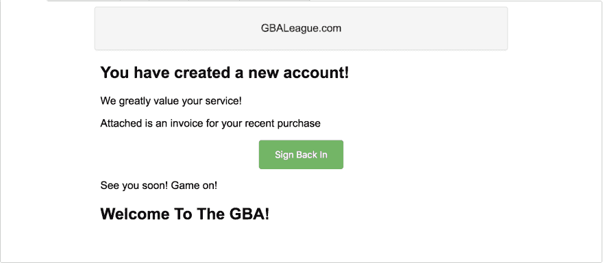
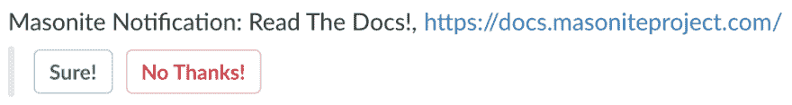

# Masonite 通知

> 原文：<https://dev.to/masonite/masonite-notifications-4445>

# 简介

Masonite 是一个很棒的 Python web 框架，自从 Masonite 2.0 发布以来，在过去的几个月里，它的速度已经加快了很多。

[Masonite](https://github.com/masoniteframework/masonite) 通知可以轻松地为您的 Masonite 项目添加新的通知发送语义。这些通知可能是发送电子邮件或延期消息。这个软件包被设计得非常简单和模块化，因此允许通过第三方集成向它添加新的通知功能。

# 安装

为了开始使用 Masonite 通知，我们首先必须 pip 安装它:

```
$ pip install masonite-notifications 
```

Enter fullscreen mode Exit fullscreen mode

然后将提供商添加到我们的提供商列表:

```
from notifications.providers import NotificationProvider
...
​
PROVIDERS = [
    ...
    NotificationProvider,
    ...
] 
```

Enter fullscreen mode Exit fullscreen mode

就是这样！让我们看看它是如何工作的！

# 用法

我们需要介绍几个概念，以便您能够完全理解通知是如何工作的。首先，我们将涵盖高层次的东西，然后慢慢地工作到较低层次的实现。出于本文档的目的，我们将介绍如何设置欢迎通知，以便在用户注册时发送电子邮件。

# 创建通知

为了使用它，我们可以创建一个通知类。我们可以简单地用一个新的飞船指令来做这件事。

```
$ craft notification WelcomeNotification 
```

Enter fullscreen mode Exit fullscreen mode

这将在`app/notifications`目录中创建一个通知。不过，你可以随意把它移到你喜欢的任何地方。

这将创建一个类似这样的类:

```
''' A WelcomeNotification Notification '''
from notifications import Notifiable
​
class WelcomeNotification(Notifiable):
​
    def mail(self):
        pass 
```

Enter fullscreen mode Exit fullscreen mode

# 建立我们的邮件通知

现在让我们来看一下如何构建一个通知，以便我们可以将电子邮件发送给我们的用户。

因为我们的通知继承自 Notifiable，所以我们可以使用一些方法来构建通知。我们将展示最终产品的外观，因为它非常简单，但我们将在之后浏览它

```
from notifications import Notifiable
import os
​
​
class WelcomeNotification(Notifiable):
​
    def mail(self):
        return self.subject('New account signup!') \
            .driver('smtp') \
            .panel('GBALeague.com') \
            .heading('You have created a new account!') \
            .line('We greatly value your service!') \
            .line('Attached is an invoice for your recent purchase') \
            .action('Sign Back In', href="http://gbaleague.com") \
            .line('See you soon! Game on!') \
            .view('/notifications/snippets/mail/heading',
                  {'message': 'Welcome To The GBA!'}) 
```

Enter fullscreen mode Exit fullscreen mode

注意这里我们调用了一些方法，比如`driver`、`panel`、`line`等等。如果我们发送此消息，它看起来会像:

[T2】](https://res.cloudinary.com/practicaldev/image/fetch/s--nBJFiXJ8--/c_limit%2Cf_auto%2Cfl_progressive%2Cq_auto%2Cw_880/https://thepracticaldev.s3.amazonaws.com/i/94ldezlnbtap06p0o97y.png)

还不错。我们可以使用这个逻辑简单地将电子邮件建立成一个好的格式。

## 选项

要查看完整的通知列表，请前往官方文档页面查看漂亮的表格。

# 发送通知

现在我们已经在上面构建了通知，我们可以在我们的控制器(或者任何我们喜欢的地方)中发送它:

```
from app.notifications.WelcomeNotification import WelcomeNotification
...
​
def show(self, Notify):
​
    Notify.mail(WelcomeNotification, to='user@gmail.com') 
```

Enter fullscreen mode Exit fullscreen mode

注意，这里我们只是在参数列表中指定了 Notify 类，并且我们能够将令人敬畏的新 WelcomeNotification 传递到 mail 方法中。

* * *

注意:您应该在 notify 类上使用的方法应该与 notification 类上的方法相对应。例如，如果我们想对 WelcomeNotification 执行 slack 方法，那么我们应该调用:

```
Notify.slack(WelcomeNotification) 
```

Enter fullscreen mode Exit fullscreen mode

您调用的方法应该与您希望在通知类上调用的方法相同。Notify 类实际上不包含任何方法，但是它将调用 Notify 类上的相同方法。

* * *

# 建邺懈怠通知

开箱即用，Masonite 通知还带有 slack 支持，以防我们想要向特定的 Slack 组发送消息。

* * *

注意:为了充分利用这个特性，您需要从 Slack 生成一个令牌。这个令牌至少应该有通道:read，chat:write:bot，chat:write:user 和 files:write:user 权限范围。如果您的令牌没有这些范围，则此功能的某些部分将不起作用。

* * *

回到我们的 WelcomeNotification，我们可以简单地指定一个名为 slack 的新方法。

```
class WelcomeNotification(Notifiable):
​
    def mail(self):
        return self.subject('New account signup!') \
            .driver('smtp') \
            .panel('GBALeague.com') \
            .heading('You have created a new account!') \
            .line('We greatly value your service!') \
            .line('Attached is an invoice for your recent purchase') \
            .action('Sign Back In', href="http://gbaleague.com") \
            .line('See you soon! Game on!') \
            .view('/notifications/snippets/mail/heading',
                  {'message': 'Welcome To The GBA!'})

      def slack(self):
          pass 
```

Enter fullscreen mode Exit fullscreen mode

请注意底部的新松弛方法。我们将使用这种方法来构建我们的时差通知。我们将再次向您展示一个完整的示例，然后运行所有的方法:

```
class WelcomeNotification(Notifiable):
​
    def mail(self):
        return self.subject('New account signup!') \
            .driver('smtp') \
            .panel('GBALeague.com') \
            .heading('You have created a new account!') \
            .line('We greatly value your service!') \
            .line('Attached is an invoice for your recent purchase') \
            .action('Sign Back In', href="http://gbaleague.com") \
            .line('See you soon! Game on!') \
            .view('/notifications/snippets/mail/heading',
                  {'message': 'Welcome To The GBA!'})

    def slack(self):
        return self.token(os.getenv('BOT')) \
            .text('Masonite Notification: Read The Docs!, https://docs.masoniteproject.com/') \
            .channel('#bot') \
            .as_user('Masonite Bot') \
            .icon(':fire:') \
            .button('Sure!', "https://docs.masoniteproject.com/")
            .button('No Thanks!', "https://docs.masoniteproject.com/" style='danger') 
```

Enter fullscreen mode Exit fullscreen mode

这将返回如下结果:

[T2】](https://res.cloudinary.com/practicaldev/image/fetch/s--239WQ39q--/c_limit%2Cf_auto%2Cfl_progressive%2Cq_auto%2Cw_880/https://thepracticaldev.s3.amazonaws.com/i/7vt0gcyz9hn4attsauuw.png)

## 时差选项

要查看完整的通知列表，请前往官方文档页面查看漂亮的表格。

# 发送时差通知

现在我们已经在上面构建了通知，我们可以在我们的控制器(或者任何我们喜欢的地方)中发送它:

```
from app.notifications.WelcomeNotification import WelcomeNotification
...
​
def show(self, Notify):
​
    Notify.slack(WelcomeNotification) 
```

Enter fullscreen mode Exit fullscreen mode

注意，这里我们简单地在参数列表中指定了 Notify 类，并且我们能够将令人敬畏的新 WelcomeNotification 传递到 slack 方法中。

# 建筑集成

Notifiable 类是非常模块化的，如果你愿意，你可以非常简单地构建定制的集成。在这一节中，我们将介绍如何创建所谓的组件。

# 什么是组件？

组件是可以添加到扩展通知行为的通知类中的类。事实上，可通知类只是两个不同组件的简单抽象。让我们来看看我们继承的类的签名。

```
from notifications.components import MailComponent, SlackComponent
​
​
class Notifiable(MailComponent, SlackComponent):
    pass 
```

Enter fullscreen mode Exit fullscreen mode

组件类是包含我们一直在使用的方法的类。如果你想看这些组件的源代码，你可以在 GitHub 上查看，从较低的层面了解它们是如何工作的。

# 创建一个组件

让我们通过创建 MailComponent 的简化版本来简单介绍一下我们是如何创建它的。首先让我们创建一个简单的类:

```
class MailComponent:
    pass 
```

Enter fullscreen mode Exit fullscreen mode

现在让我们给它添加一行和一个主题方法:

```
class MailComponent:

    def line(self, message):
        pass

    def subject(self, subject)
        pass 
```

Enter fullscreen mode Exit fullscreen mode

而且让我们用这两种方法来构建一个模板属性

```
class MailComponent:
​
    template = ''

    def line(self, message):
        self.template += template
        return self

    def subject(self, subject)
        self._subject = subject
        return self 
```

Enter fullscreen mode Exit fullscreen mode

因为我们返回了 self，所以我们可以像以前一样继续追加到通知类中。

实际的`MailComponent`类要比这个复杂一些，但是出于解释的目的，我们将保持简单。

# 火法

每当我们将通知插入 Notify 类:

```
Notify.mail(WelcomeNotification) 
```

Enter fullscreen mode Exit fullscreen mode

这将调用通知类上的 mail 方法(或者我们在通知类上调用的任何其他方法)。

一旦返回，它将调用您将在组件中指定的`fire_mail`方法。

如果您已经创建了一个不一致通知，那么您应该在您的组件上有一个`fire_discord`方法，您将使用:
调用它

```
Notify.discord(WelcomeNotification) 
```

Enter fullscreen mode Exit fullscreen mode

由于我们想在它上面调用 mail 方法，我们将创建一个`fire_mail`方法:

```
class MailComponent:
​
    template = ''

    def line(self, message):
        self.template += template
        return self

    def subject(self, subject)
        self._subject = subject
        return self

    def fire_mail(self):
        pass 
```

Enter fullscreen mode Exit fullscreen mode

## 受保护成员

有时你会想把数据传入`fire_mail`方法。为了保持简单和模块化，传递给`Notify`类的任何关键字参数都将在通知类上设置为受保护的成员。举个例子，如果我们有这个:

```
Notify.mail(WelcomeNotification, to='admin@site.com') 
```

Enter fullscreen mode Exit fullscreen mode

在我们使用`fire_x`方法之前，它将在通知类上设置一个`_to`属性。

所以使用上面的例子我们将能够做:

```
def fire_mail(self):
    self._to # admin@site.com 
```

Enter fullscreen mode Exit fullscreen mode

我们可以使用这个行为将信息传递到`fire_mail`方法中，同时保持一切都是干净的。

## 发送邮件

好了，我们终于有足够的信息来发送实际的电子邮件了。容器解析了`fire_mail`方法，因此我们可以简单地从参数列表中指定发送电子邮件所需的内容。

我们的通知类将类似于:

```
from your.package import MailComponent
​
class WelcomeNotification(Notifiable, MailComponent):
​
    def mail(self):
        return self.subject('New account signup!') \
            .line('We greatly value your service!') 
```

Enter fullscreen mode Exit fullscreen mode

我们的通知类将类似于:

```
Notify.mail(WelcomeNotification, to='admin@site.com') 
```

Enter fullscreen mode Exit fullscreen mode

而我们的火法看起来会是:

```
class MailComponent:
​
    template = ''

    def line(self, message):
        self.template += template
        return self

    def subject(self, subject)
        self._subject = subject
        return self

    def fire_mail(self, Mail):
        Mail.to(self._to) \
            .subject(self._subject) \
            .send(self.template) 
```

Enter fullscreen mode Exit fullscreen mode

还记得来自于`Notify`类中的关键字参数的`_to`类属性。

* * *

如果你对赞助这个项目感兴趣，请发送电子邮件至[joe@masoniteproject.com](mailto:joe@masoniteproject.com)了解更多信息。

一定要在 [GitHub](https://github.com/masoniteframework/masonite) 页面给个星或者加入 [Slack](http://slack.masoniteproject.com) 频道。