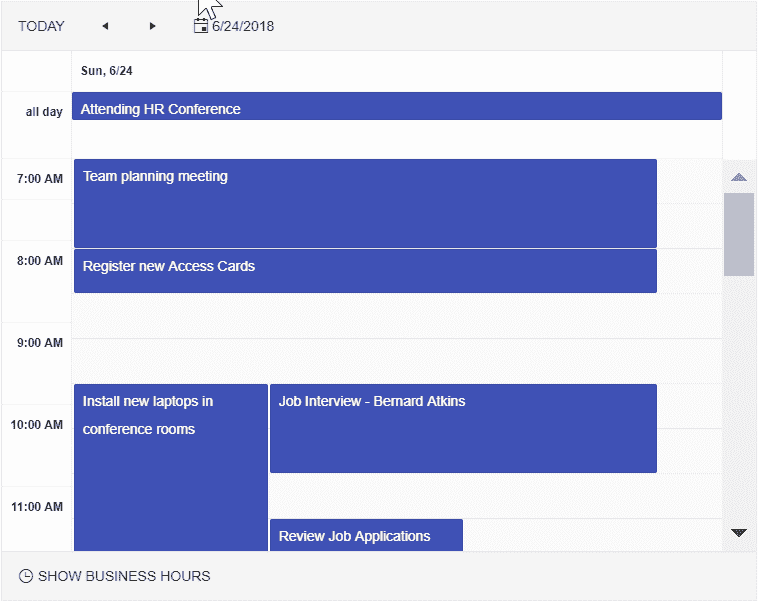
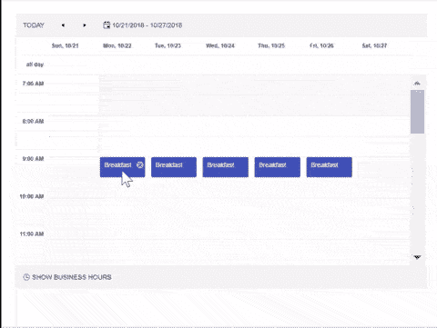
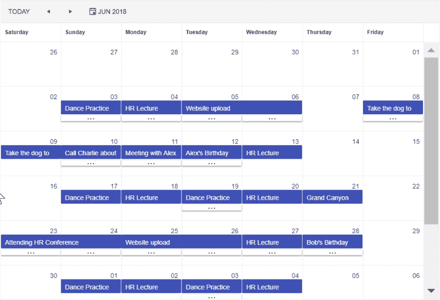
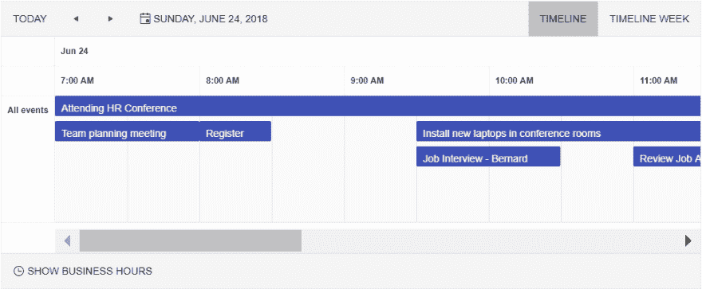
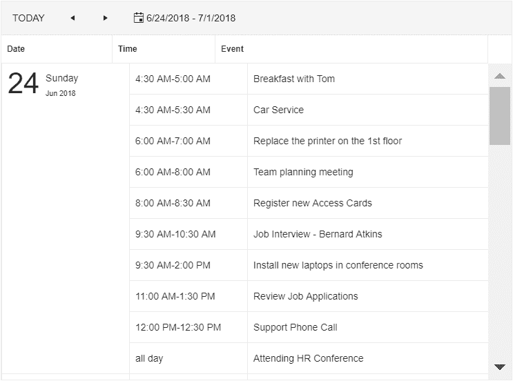

# 角度调度器的剑道用户界面主时间

> 原文：<https://dev.to/progresstelerik/master-time-with-the-kendo-ui-for-angular-scheduler-4746>

Angular 的剑道 UI 的调度器已经到了。今天就来看看你能用这个新组件做些什么，并让我们知道你希望它下一步发展到哪里。

能够输入这些文字，我兴奋不已:**Angular 调度器组件的[剑道 UI 终于来了！](https://www.telerik.com/kendo-angular-ui)**我知道你们中的许多人已经等待这个组件有一段时间了，现在终于有一天你可以开始在你的 Angular 应用程序中内置调度功能了！

关于这个组件有很多要讨论的，所以我想提供一个调度器的介绍，它会给你一个关于这个组件到底能做什么的想法，以及我们希望在将来给它添加什么。

让我们马上开始吧！

[T2】](https://res.cloudinary.com/practicaldev/image/fetch/s--P7ehKmJN--/c_limit%2Cf_auto%2Cfl_progressive%2Cq_auto%2Cw_880/https://d585tldpucybw.cloudfront.net/sfimages/default-source/default-album/001-scheduler-in-action.png%3Fsfvrsn%3D6a369308_1)

## 基础数据绑定

有几种方法可以绑定到调度程序，但是所有方法的核心是`SchedulerEvent`类。虽然 Scheduler 组件可以很容易地处理日期，但我们确实需要更多关于事件的信息，而不仅仅是提供一组 JavaScript 日期。这就是我们创建`SchedulerEvent`类的原因。在更多地讨论绑定之前，让我们稍微讨论一下这个类。

### 调度事件类

[schedule event 类](https://www.telerik.com/kendo-angular-ui/components/scheduler/api/SchedulerEvent/)是一个助手类，它允许我们与像调度程序这样高级的东西进行交互。`SchedulerEvent`是一组简单的字段，旨在确保调度程序正确运行。

> **注意:**对于那些使用过我们 [jQuery 组件库](https://www.telerik.com/kendo-jquery-ui)中的[调度器](https://demos.telerik.com/kendo-ui/scheduler/index)的人来说，这看起来很熟悉，因为我们在那里也有一个为事件调度准备的类。

我建议查看[文档](https://www.telerik.com/kendo-angular-ui/components/scheduler/api/SchedulerEvent/)以了解更多细节，但这里有一个可用字段的快速纲要:

**必需的**

*   结束
*   是一整天
*   开始
*   标题

**非必需的**

*   描述
*   结束时区
*   身份证明（identification）
*   递归异常
*   递归 Id
*   复发规则
*   开始时区

这些字段的名称透露了它们的用途，但是当您遵循[schedule event API 文档](https://www.telerik.com/kendo-angular-ui/components/scheduler/api/SchedulerEvent/)时，很容易看到如何为自己构建这些字段。

在 Scheduler 的未来版本中，我们将有一个在组件配置中映射模型字段的选项，但是在这个初始版本中，您将不得不以更加手动的方式设置您的事件。

作为一个快速有用的提示，如果您有一个想要用来绑定到调度器的现有模型，您可以简单地从您的模型映射到一个调度事件数组，比如[这个示例来自我们的文档](https://www.telerik.com/kendo-angular-ui/components/scheduler/data-binding/#toc-binding-to-models) :

```
import { SchedulerEvent } from '@progress/kendo-angular-scheduler';

const events = model.map(dataItem => (
  <SchedulerEvent> {
    id: dataItem.TaskID,
    start: dataItem.Start,
    end: dataItem.End,
    isAllDay: dataItem.IsAllDay,
    title: dataItem.Title,
    // Optional fields
    startTimezone: dataItem.startTimezone,
    endTimezone: dataItem.endTimezone,
    description: dataItem.Description,
    recurrenceRule: dataItem.RecurrenceRule,
    recurrenceId: dataItem.RecurrenceID,
    recurrenceException: dataItem.RecurrenceException
  }
)); 
```

### 装订

一旦我们熟悉了如何设置单个事件，让我们继续实际绑定到调度器！现在有两种方法，使用[内置指令](https://www.telerik.com/kendo-angular-ui/components/scheduler/data-binding/#toc-using-built-in-directive)或[手动绑定](https://www.telerik.com/kendo-angular-ui/components/scheduler/data-binding/#toc-using-manual-binding)。

#### 内置指令

```
import { Component } from '@angular/core';
import { SchedulerEvent } from '@progress/kendo-angular-scheduler';

@Component({
  selector: 'my-app',
  template: `
    <kendo-scheduler [kendoSchedulerBinding]="events [selectedDate]="selectedDate" style="height: 600px;">
      <kendo-scheduler-week-view startTime="07:00">
      </kendo-scheduler-week-view>
    </kendo-scheduler>
  `
})

export class AppComponent {
  public selectedDate: Date = new Date('2018-10-22');
  public events: SchedulerEvent[] = [{
    id: 1,
    title: 'Breakfast',
    start: new Date('2018-10-22T09:00:00'),
    end: new Date('2018-10-22T09:30:00'),
    recurrenceRule: 'FREQ=DAILY;COUNT=5;'
  }];
} 
```

这很容易设置。一旦我们定义了我们的`SchedulerEvent`对象数组，我们就可以使用`[kendoSchedulerBinding]`属性并将我们的事件传递给这个属性。这种方法将过滤超出当前视图范围的事件，并扩展内存中的重复序列。

#### 手动绑定

```
import { Component } from '@angular/core';
import { SchedulerEvent } from '@progress/kendo-angular-scheduler';

@Component({
  selector: 'my-app',
  template: `
    <kendo-scheduler [events]="events [selectedDate]="selectedDate" style="height: 600px;">
      <kendo-scheduler-week-view startTime="07:00">
      </kendo-scheduler-week-view>
    </kendo-scheduler>
  `
})

export class AppComponent {
  public selectedDate: Date = new Date('2018-10-22');
  public events: SchedulerEvent[] = [{
    id: 1,
    title: 'Breakfast',
    start: new Date('2018-10-22T09:00:00'),
    end: new Date('2018-10-22T09:30:00'),
  }];
} 
```

对于手动绑定，我们在绑定到事件时使用`[events]`属性。如前所述，您需要做一些额外的工作，内置的循环引擎将不会被使用，但它给了您一些灵活性，以确保调度程序适合您的应用程序。

## 编辑

当前编辑是使用反应指令`kendoSchedulerReactiveEditing`完成的。这是一个[反应模型驱动的表单](https://angular.io/guide/reactive-forms)，这是截至撰写这篇博文(2018 年 11 月)时唯一支持的编辑这些项目的方式。然而，未来我们还将增加对[模板驱动表单](https://angular.io/guide/forms)的支持。用户双击事件也可以进行编辑，因为拖动/调整事件大小还不可用。顺便说一句，这是我们在接下来的几周内要解决的第一个问题，所以一旦它在组件的未来版本中可用，我们会尽快添加它！

[T2】](https://res.cloudinary.com/practicaldev/image/fetch/s--OYMiHYLo--/c_limit%2Cf_auto%2Cfl_progressive%2Cq_66%2Cw_880/https://d585tldpucybw.cloudfront.net/sfimages/default-source/default-album/002-angular-editing.gif%3Fsfvrsn%3Db5f6b592_1)

正如您所看到的，我们可以编辑单个事件和我们希望围绕重复设置的规则，这是一组现成的功能。

我建议查看自动编辑文档文章中的[，以了解如何在您自己的调度器实现中启用编辑。](https://www.telerik.com/kendo-angular-ui/components/scheduler/editing/editing-directives/)

## 视图

作为其初始版本的一部分，角度调度器支持以下视图。

#### 日和周视图

[T2】](https://res.cloudinary.com/practicaldev/image/fetch/s--GZyjbwBX--/c_limit%2Cf_auto%2Cfl_progressive%2Cq_auto%2Cw_880/https://d585tldpucybw.cloudfront.net/sfimages/default-source/default-album/003-scheduler-views-day.png%3Fsfvrsn%3D869ee034_1)

#### 月视图

[T2】](https://res.cloudinary.com/practicaldev/image/fetch/s--ZHe4b9vH--/c_limit%2Cf_auto%2Cfl_progressive%2Cq_auto%2Cw_880/https://d585tldpucybw.cloudfront.net/sfimages/default-source/default-album/004-scheduler-views-month.png%3Fsfvrsn%3D6be1629_1)

#### 时间线视图

[T2】](https://res.cloudinary.com/practicaldev/image/fetch/s--XInwr_SE--/c_limit%2Cf_auto%2Cfl_progressive%2Cq_auto%2Cw_880/https://d585tldpucybw.cloudfront.net/sfimages/default-source/default-album/005-scheduler-views-timeline.png%3Fsfvrsn%3D3ee920a8_1)

#### 议程视图

[T2】](https://res.cloudinary.com/practicaldev/image/fetch/s--KArADiwS--/c_limit%2Cf_auto%2Cfl_progressive%2Cq_auto%2Cw_880/https://d585tldpucybw.cloudfront.net/sfimages/default-source/default-album/006-scheduler-views-agenda.png%3Fsfvrsn%3D66284ce3_1)

如你所见，有很多不同的方式来表示你预定的事件！

## 时区&全球化

当然，当我们处理日程安排时，我们必须包括对处理时区的支持！默认情况下，当没有设置时区时，调度程序将选择浏览器的本地时区，这意味着每个用户都可以在他们的本地时区中查看所有保存的事件。

为了确保一个时区在你的 Angular Scheduler 的所有实例中是固定的，你必须使用 Kendo UI 数据和数学库[，如这里所述](https://www.telerik.com/kendo-angular-ui/components/scheduler/timezones/#toc-fixed-timezones)。你所做的就是设置 timezone 属性，所以这是一个快速的导入过程，你可以开始比赛了！

如上所述，事件也可以有自己的时区信息，这为处理位于不同时区的资源提供了另一种方式。

说到时区，由于人们在不同的国家，您很可能需要为各种国际化和全球化场景设置调度程序。幸运的是，这非常容易，因为 Angular Scheduler 通过剑道 UI `kendo-intl`包支持[国际化](https://www.telerik.com/kendo-angular-ui/components/scheduler/globalization/#toc-internationalization)，并且还能让你[创建自定义消息](https://www.telerik.com/kendo-angular-ui/components/scheduler/globalization/#toc-custom-messages)并替换任何默认呈现的字符串。

## 但是等等，还有！

我在这里介绍的内容让您对 Angular Scheduler 的新剑道 UI 有了一个大概的了解，但是在组件中肯定还有更多工作要做！浏览一下[调度器文档](https://www.telerik.com/kendo-angular-ui/components/scheduler/),以获得更多代码示例和 API 参考。

## 未来

正如您在我们的文档页面上看到的，我们认为这个初始版本是测试版，因为它没有我们在 jQuery 等价物中看到的完整特性集。也就是说，我想给每个人一些关于我们正在为 Angular Scheduler 的[剑道 UI 的未来版本所做的工作的见解。我们将要开发的一些主要功能包括:](https://www.telerik.com/kendo-angular-ui)

*   使用资源
*   事件的大小调整和重新排序

我们的最终目标是改进调度程序，使其与 jQuery 版本中的特性集重叠，因此我们期待更多的东西来形成这个组件！

请告诉我们您对该组件的看法！我很高兴终于能够将这个巨大的组件带到 Angular 开发者社区，我相信你已经有很多地方可以使用它了！

我们迫不及待地想听听你的想法。如果您发现组件的未来版本中缺少您希望看到的任何内容，您可以随时向我们的[公众反馈门户](http://kendoui-feedback.telerik.com/forums/555517-kendo-ui-for-angular-feedback)提交您的反馈，或者在下面留下评论。

当然，如果你还没有尝试过 Angular 的剑道 UI，你可以通过今天开始的[30 天免费试用](https://www.telerik.com/download-trial-file/v2/kendo-angular-ui)来使用调度器和更多功能。