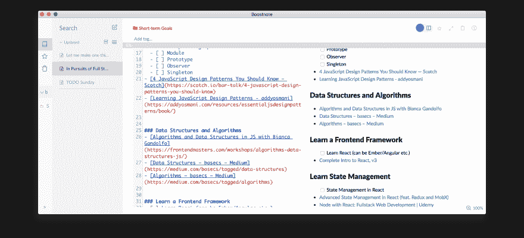

# 用 Javascript 的超能力掌握全栈

> 原文：<https://dev.to/siwalikm/mastering-full-stack-with-javascripts-superpowers-oin>

当我在大学期间作为一名自由职业的全栈开发人员时，我经常会发现自己在实践的上下文切换和 javascript 与 php 的不同语法之间进退两难。尽管我赚了不少外快，也有一群开心的客户，但我写的代码并不出色，因为同时精通 web 开发的各个方面似乎很难。

作为 JS 的铁杆粉丝和界面的狂热爱好者，我决定只专注于前端，在做了几个月的自由职业后，我加入了一家初创公司，担任前端开发人员。我满足于我在前沿的学习和冒险...直到昨天偶然发现这个~

> 设计和开发 web 解决方案所需的角色需要在视觉设计、[前端开发](https://github.com/kamranahmedse/developer-roadmap#-front-end-roadmap)和[后端开发](https://github.com/kamranahmedse/developer-roadmap#-back-end-roadmap)领域具有深厚的
> 技能和丰富的经验。
> 在专业水平上，任何能够胜任这四个角色中的一个或多个的人都是极其罕见的。
> 
> 然而，鉴于 JavaScript 已经渗透到一个
> 技术栈的所有层(例如 React、node.js、express、couchDB、gulp.js
> 等...)找到一个能够编写前端
> 和后端代码的全栈 JS 开发者变得不那么神秘了。- [前端手册
> 18 年](https://frontendmasters.com/books/front-end-handbook/2018/practice/myth.html)

所以我开始想，为什么不呢？我已经知道了前端，我也设法用 php 为我的副业项目写了一些(蹩脚但)有用的后端代码，为什么不利用我的 javascript 知识，成为一名全栈 javascript 开发人员，只是通过将点点滴滴联系起来和一点点的学习？

说到学习，我们大多数计划失败的原因是因为。任何没有适当计划的决心或目标都注定会失败！所以我从那里开始，开始计划。有趣的事实:这也是我们新年决心失败的原因！]

第二天，我研究了一些主题和资源，在这个旅程中，要成为一名全栈开发人员，只需利用 Javascript 的超强能力。所以我创建了一个待办事项列表，从 javascript 的最基础开始，逐步发展到更高级的概念，涵盖了所有的技术。

[T2】](https://res.cloudinary.com/practicaldev/image/fetch/s--WxbFOFeT--/c_limit%2Cf_auto%2Cfl_progressive%2Cq_auto%2Cw_880/https://i.imgur.com/YgBfkWW.png)

如果你是一名前端开发人员，期待着*提升你的游戏水平*，或者你已经是一名全栈开发人员，想要为面试或下一个项目提高技能，我敢肯定，这将对你有所帮助。

我把名单贴在了 Github 上，你可以在这里查看。

为了保持动力和跟踪你的进展，随着你的进展，从 Github 分叉我的待办事项列表，并提交给你划掉项目的 repo。

```
git clone https://github.com/siwalikm/Prep-for-Full-Stack-JS.git 
```

Enter fullscreen mode Exit fullscreen mode

附注:记住:关键是保持动力。

如果可能的话，开始和朋友一起学习，也许可以在这个过程中一起建立一些东西。如果你是一个人学习，当你遇到困难时，向别人寻求帮助，试着记录你的学习。

你可以(在 [@siwalik](https://twitter.com/siwalikm) )发推特给我，告诉我你在这次旅程中的收获和冒险，或者只是说声“嗨”！

祝你好运！