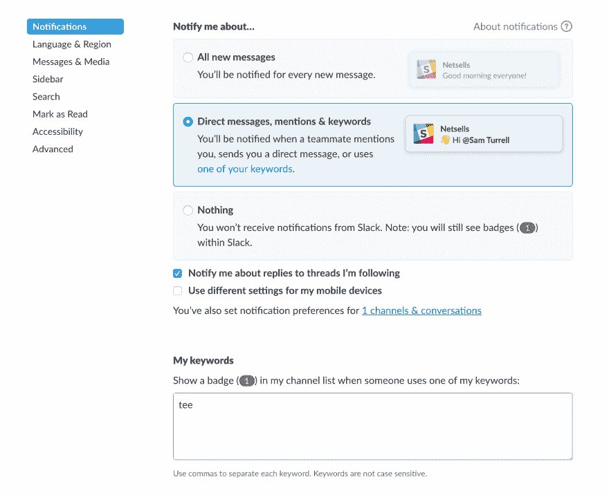
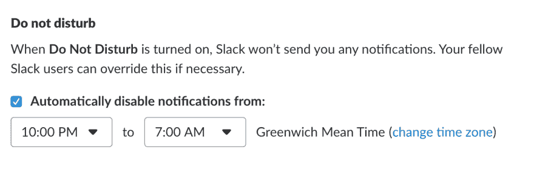
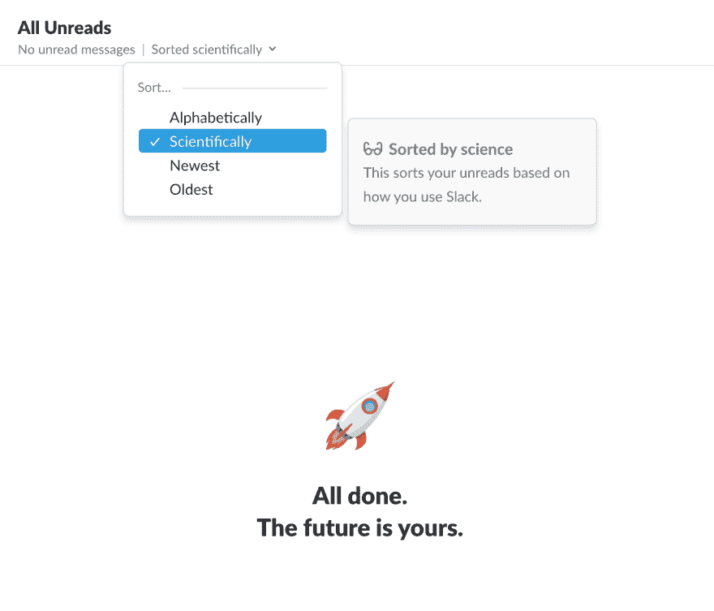
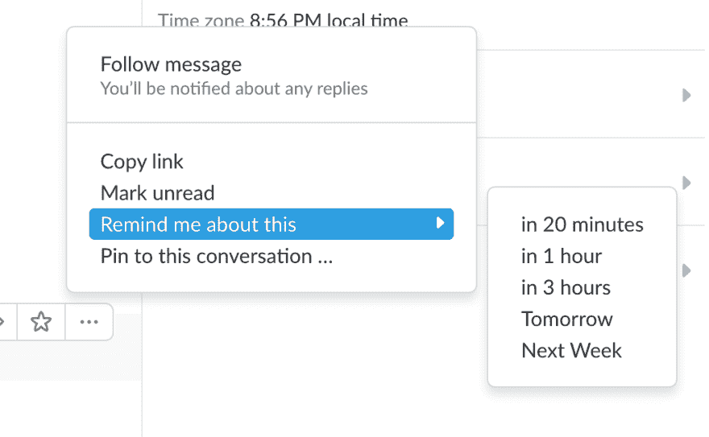

# 利用空闲时间最大化生产率

> 原文：<https://dev.to/samturrell/maximising-productivity-with-slack--e89>

在开发领域，您可能会在日常活动中大量使用 Slack。这是一种非常有用的交流方式，它的用途可以从讨论工作问题到发送搞笑的 gif。所以一整天都有大量的消息。

对于一个小团队来说，这还不错，但是如果你是大团队中多个工作空间的一部分，你可能会发现不断的通知和不相关的闲聊会很快成为一种阻碍和干扰。

这里有一些小贴士可以改善你的空闲时间，让你一天更有效率。

## 寂静嘈杂的频道

你是否处于不一定是其中一员，但需要随时待命的渠道中？也许您已经有了自动化的构建/部署工具，这些工具会通知特定的成功渠道，除此之外别无其他。尝试使用`/mute`命令使这些通道静音。这将使您的频道列表中的频道变灰，并禁止任何和所有通知，甚至提及。如果你被提及，你会在侧边栏的频道上得到标准的通知号码，但你不会被通知。

## 设置通知首选项

Slack 非常有用，但是一天中可能会有很多消息，其中大部分是 gif，可能并不太重要。不幸的是，Slack 会发送所有这些通知，不管你是否被提到。

但是有解决的办法！通知首选项！Slack 在这里提供了三个主要设置:

*   所有新消息-所有新消息都会通知您
*   直接信息、提及和关键词-当队友提及你、向你发送直接信息或使用你的关键词时，你会收到通知
*   什么都没有-您不会收到 Slack 的通知

如果你想要完全的无线电静默，最后一个选项是你想要的，但是在大多数情况下这可能是多余的。您通常只想过滤掉所有非直接干扰，这是第二种选择。

[T2】](https://res.cloudinary.com/practicaldev/image/fetch/s--DMIFMFIl--/c_limit%2Cf_auto%2Cfl_progressive%2Cq_auto%2Cw_880/https://samturrell.github.img/slack-notifications.png)

## 将自己设置为“请勿打扰”

如果你特别忙，正在处理一件令人恼火的事情，或者总的来说只是想让别人离你远点，你可以把自己设置为“请勿打扰”。这有一个额外的好处，那就是向团队的其他成员表明，此时你不希望被分散注意力。

只需在 slack 中输入`/dnd`，你就可以开启或关闭“请勿打扰”状态。或者提供时间描述，Slack 将在该时间段结束时自动删除您的免打扰状态。

您也可以在“通知”偏好设置中指定自动“请勿打扰”时段。

[T2】](https://res.cloudinary.com/practicaldev/image/fetch/s--k13ID-Ci--/c_limit%2Cf_auto%2Cfl_progressive%2Cq_auto%2Cw_880/https://samturrell.github.img/slack-dnd.png)

## 预留时间叙旧

试着将你的空闲时间限制在一天中的特定时刻，以弥补你可能错过的东西。也许当你发现自己正在过渡到一项新的工作时，或者你发现自己在一个麻烦的逻辑中挣扎，需要让你的大脑休息一下。这样，你就不会因为检查每一条消息而不断地被从编码思维中拉出来，并且可以专注于解决真正的问题。

## 带星号的频道

把重要的和不重要的分开。将单个频道和直接消息标上星号，将它们从侧边栏的主频道列表中分离出来。这样更容易看到最重要的渠道。

## 分组未读消息

Slack 为您提供了一种便捷的方式，让您可以在一个列表视图中查看未读邮件。您需要在“侧边栏”部分下的工作区设置中启用它。

[T2】](https://res.cloudinary.com/practicaldev/image/fetch/s--SYzbKNmV--/c_limit%2Cf_auto%2Cfl_progressive%2Cq_auto%2Cw_880/https://samturrell.github.img/slack-group-unreads.png)

你可以选择如何按字母顺序排列信息，最老的优先，最新的优先，或者把它留给 Slacks 魔法算法的“科学”选项。我不知道那是什么意思，但听起来很酷，是吧？

[T2】](https://res.cloudinary.com/practicaldev/image/fetch/s--OWzwH39q--/c_limit%2Cf_auto%2Cfl_progressive%2Cq_auto%2Cw_880/https://samturrell.github.img/slack-scientific-sort.png)

## 将邮件标记为已读

如果你离开了一段时间，并且没有通过提及/突出显示得到明确通知，为什么不干脆清除单个频道或所有频道的所有未读消息？通过提供的便捷键盘快捷键，您可以按下按钮快速清除未读内容。

[T2】](https://res.cloudinary.com/practicaldev/image/fetch/s--CylenGRj--/c_limit%2Cf_auto%2Cfl_progressive%2Cq_auto%2Cw_880/https://samturrell.github.img/slack-shortcuts.png)

## 使用螺纹

试着养成使用线程回复消息的习惯。这可以让你关注具体的讨论，并减少整个团队的噪音。双赢！

## 延期可诉

有时候你可能被要求做一些事情，但是你没有时间跳出你正在做的事情去处理它。在这些情况下，你可以简单地放松一下，在更方便的时候提醒你。

[T2】](https://res.cloudinary.com/practicaldev/image/fetch/s--I8a62KHR--/c_limit%2Cf_auto%2Cfl_progressive%2Cq_auto%2Cw_880/https://samturrell.github.img/slack-remind.png)

上面提到的大多数首选项都是在每个工作区的基础上定义的，所以如果您是多个团队的一部分，您可能想要仔细检查并将这些设置应用到每个活动的工作区。

我经常使用以上的方法，它真的很有帮助。它们让我专注于重要的事情，并过滤掉多个频道和工作空间的一般噪音。