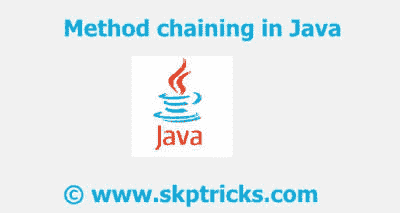

# Java 中的方法链接

> 原文：<https://dev.to/skptricks/method-chaining-in-java-9o3>

帖子链接:[https://www . skptricks . com/2018/08/method-chaining-in-Java . html](https://www.skptricks.com/2018/08/method-chaining-in-java.html)

术语方法链指的是设计和约定。每个方法返回一个对象，允许调用在一个语句中链接在一起。链接是一种语法糖，它消除了对中间变量的需要。方法链也称为火车残骸，因为当更多的方法被链接在一起时，即使方法之间经常添加换行符，在同一行中一个接一个出现的方法的数量也会增加。

[T2】](https://res.cloudinary.com/practicaldev/image/fetch/s--eAj5Cunh--/c_limit%2Cf_auto%2Cfl_progressive%2Cq_auto%2Cw_880/https://3.bp.blogspot.com/-gt6lGPNtdJI/W4OIOz9kntI/AAAAAAAAB1c/9ze1u9CiyjolRVdqCf_mnjDJFcI4djp-wCLcBGAs/s400/me.jpg)

类别用户{

私有字符串名称；
private int age；

//除了设置相关属性的副作用之外，
//设置器返回“this”(当前的 Person 对象)，以允许进一步的链接方法调用。

公共用户 setName(字符串名){
this . name = name；
退回本；
}

公共用户 setAge(int age){
this . age = age；
退回本；
}

public void getuser details(){
system . out . println("用户名为"+ name +"，"+ age +"岁。");
}

//用法:
public static void main(String[]args){
User User = new User()；

user.setName("skptricks ")。setAge(22)。getuser details()；
}
}

输出:
用户名是 skptricks，22 岁。