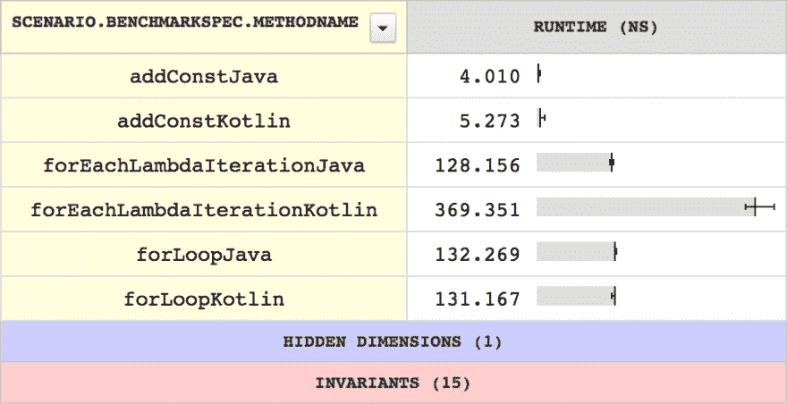

# Android 上的微基准测试

> 原文：<https://dev.to/brightdevs/microbenchmarking-on-android-4hb3>

由于 Kotlin 变得越来越受欢迎，尤其是在 Android 开发人员中(并且它得到了 Google 的官方支持)，一些人决定将它的运行时性能与 Java 进行比较。读了几篇文章后，我想亲自测试一下，现在我准备分享一些我的观察和经验。

# 关于什么的？

微基准测试只是微尺度的基准测试:-)它是关于测量一些真正“小”的东西的性能，可能只需要几微秒或几纳秒，比如调用一个函数或迭代一个集合。

我非常推荐阅读 GitHub 上的这个 wiki 页面，因为它总结了微基准测试的几个非常重要的方面，包括它的易错性和一些您可能会考虑这么做的原因。它还解释了为什么您实际上应该避免编写微基准测试，因为这样做只有几个合理的借口(主要是当您开发性能关键的库或框架时)。

[T2】](https://res.cloudinary.com/practicaldev/image/fetch/s--EJYQ1K_w--/c_limit%2Cf_auto%2Cfl_progressive%2Cq_auto%2Cw_880/https://thepracticaldev.s3.amazonaws.com/i/z622rj221c16kueidyli.jpg)

# 我该如何开始？

编写微基准测试可以简单到在循环中运行一段代码并测量时间。你也可以使用一个现有的框架，它有一些有用的特性，比如可以很容易地配置你的基准的执行方式。

不幸的是，如果你愿意在 Android 上执行测试，你可能无法使用最先进的库， [JMH](http://openjdk.java.net/projects/code-tools/jmh/) ，因为它使用了 Android API 中没有的 Java API 的一部分。这一事实可能会阻止你使用 Android 平台进行基准测试，但你应该记住 ART 和 Dalvik 与 JVM 有着显著不同的特征，因此为 JVM 优化代码可能会使其与 Android 类似(看看 Gson 库中的[这一提交)。](https://github.com/google/gson/commit/084047d80b582317f382536604373cafa14583a4)

## 手动测量

测量某个代码块的执行时间的最简单的方法是在如下所示的循环中多次调用它:

```
fun measure() {
    val reps: Long = 1_000_000

    var sum: Long = 0L

    val callFuncBegin = System.nanoTime()

    for (i in 0 until reps) {
        sum += addConst(i)
    }

    val callFuncEnd = System.nanoTime()
    val callFuncDiff = Math.abs(callFuncEnd - callFuncBegin)

    println(sum)

    val result = callFuncDiff / reps

    println(result)
}

fun addConst(number: Long): Long {
    return 5 + number
} 
```

Enter fullscreen mode Exit fullscreen mode

在这个例子中，我们对`addConst`函数进行了基准测试。如果您是微基准测试的新手，我敢打赌您有几个问题。

首先，出于一些原因，我们需要多个`addConst`调用，例如因为`System.nanoTime()`并不需要像您想象的那样精确。文件上说得很清楚:

> 该方法提供纳秒精度，但不一定提供纳秒分辨率(即值更改的频率)——除了分辨率至少与 currentTimeMillis()一样好之外，不做任何保证。

另一个原因是为了获得更有把握的结果，因为测试环境(智能手机)非常复杂，每次执行肯定会花费不同的时间。

同样重要的是要记住，`System.nanoTime()`在执行时间方面可能相对昂贵，所以我们绝对不应该将它放在与被测量函数相同的循环中，除非我们想要测量的只是`System.nanoTime()`本身(去过那里，做过那件事:-)。所以这是我们需要多次调用所需函数的另一个原因——以补偿`System.nanoTime()`开销。

另一个方面是，我们需要一个具有一些可观察效果的函数，例如，返回一个累积然后打印出来的结果。否则，编译器可能会删除要测量的代码(参见:[编译器可能会优化掉您的基准测试吗？](https://github.com/google/caliper/wiki/JavaMicrobenchmarkReviewCriteria))。

## 扳手

另一种测试代码的方法是使用专用框架，如 [Spanner](https://github.com/cmelchior/spanner) 。这是一个面向 Android 的类似于[卡尺](https://github.com/google/caliper)的库，可以让这个任务变得更容易。尽管它还处于初级阶段，但它非常有用，值得一试。

将配置问题放在一边，基准函数可能是这样的:

```
@Benchmark
fun addConstTest(reps: Long): Long {
    var sum = 0L
    for (i in 0 until reps) {
        sum += addConst(i)
    }
    return sum
}

fun addConst(number: Long): Long {
    return 5 + number
} 
```

Enter fullscreen mode Exit fullscreen mode

如你所见，框架给了我们所需的重复次数作为参数，我们的工作就是在循环中实际运行代码。

*边注:当前的 Spanner 版本(截至 2018 年 2 月 2 日)要求基准类和方法修饰符必须精确到`java.lang.reflect.Modifier.PUBLIC`，所以如果没有额外的`open`修饰符，你就不能运行默认最终的 Kotlin 代码。这就是为什么我使用我的[分叉版本](https://github.com/azabost/spanner)与此行为相应改变。*

Spanner 还可以匿名或使用给定的 API 密钥将您的基准测试结果上传到[https://microbenchmarks.appspot.com](https://microbenchmarks.appspot.com)。

[T2】](https://res.cloudinary.com/practicaldev/image/fetch/s--cVFYQvY0--/c_limit%2Cf_auto%2Cfl_progressive%2Cq_auto%2Cw_880/https://thepracticaldev.s3.amazonaws.com/i/5twnqn6clug50uhwpfhs.png)

# 可能会出什么差错？

非常容易得到可怕的误导性结果，尤其是如果你在编写微基准时没有遵循一些规则。例如，[Julien Page 的这篇文章](http://www.oracle.com/technetwork/articles/java/architect-benchmarking-2266277.html)展示了 JVM 如何优化基准测试，使得结果变得毫无意义。在 [this Caliper wiki 页面](https://github.com/google/caliper/wiki/JavaMicrobenchmarkReviewCriteria)上也定义了一些好基准的标准。在[这个例子](https://github.com/melix/jmh-gradle-example/blob/master/src/jmh/java/org/openjdk/jmh/samples/JMHSample_11_Loops.java)中，塞德里克·尚波证明了为什么使用正确的工具进行测量如此重要(比如 JMH)。

当然，可能会发生更多问题，例如:

*   测量期间发生的垃圾收集，
*   其他应用程序暂时增加了 CPU 使用率，
*   JIT 编译器使你的代码每次都运行得更快，
*   不可避免的 CPU 节流。

# 结论

微基准测试是一个有趣的话题，我很高兴能够亲自实践并了解它。正如我已经提到的，这不是你应该每天都做的事情，但我仍然认为值得阅读并尝试一下，只是为了扩大你的视野。

最初发布于 [brightinventions.pl](https://brightinventions.pl/blog/)

作者 Andrzej Zabost，光明发明
[博客](https://azabost.com/)，[电子邮件](//andrzej.zabost@brightinventions.pl)的安卓开发者