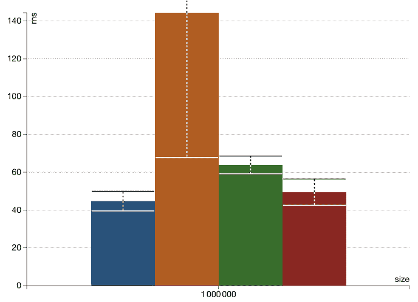
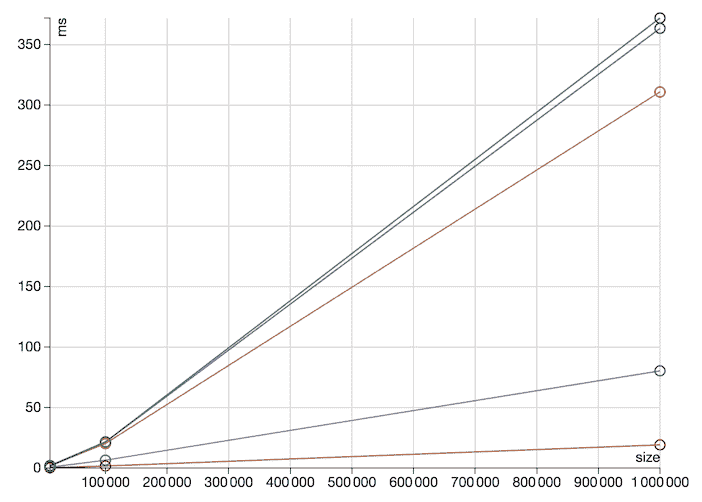
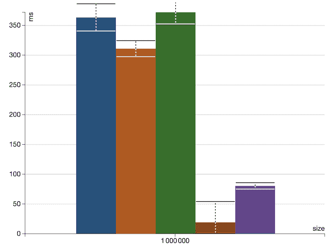
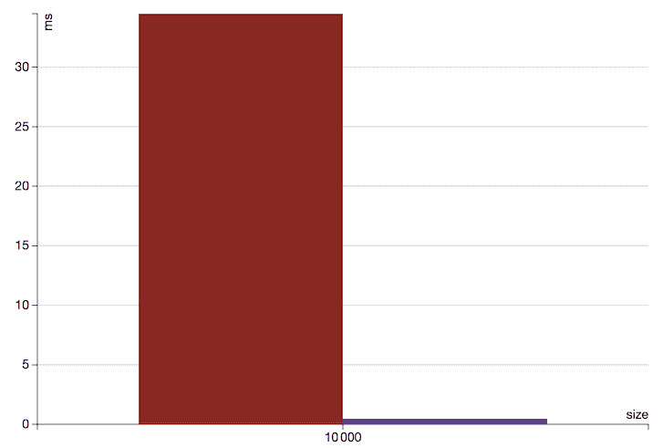
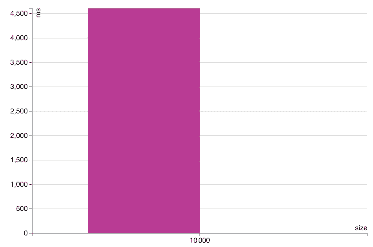
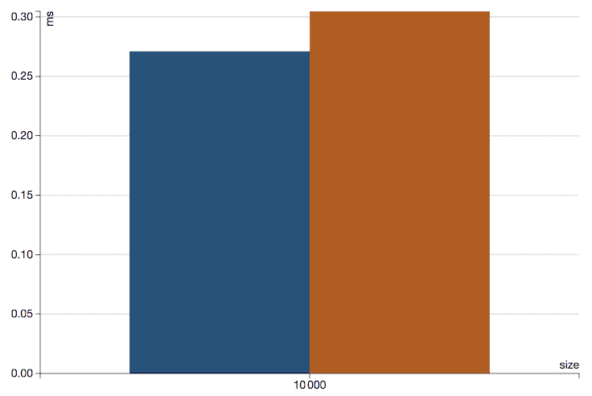

# 微基准测试您的 Scala 代码

> 原文：<https://dev.to/frosnerd/microbenchmarking-your-scala-code-4885>

# 动机

[T2】](https://res.cloudinary.com/practicaldev/image/fetch/s--GzJwaxCt--/c_limit%2Cf_auto%2Cfl_progressive%2Cq_66%2Cw_880/https://inlviv.in.ua/wp-content/themes/inlvimg/loading_spinner.gif)

我相信你认识这个装载旋转图标。我不知道有谁喜欢等电脑。然而，在编写软件时，比起速度，我更喜欢可读性、可维护性和可扩展性。我同意 Donald Knuth 的观点，过早的优化通常会导致比它解决的问题更多的问题。

尽管如此，在某些时候，您还是要编写性能很重要的代码，或者至少糟糕的性能会造成伤害。在这种情况下，查看代码的性能特征可能会很有用。我个人喜欢结合两种方法:

*   复杂性分析
*   运行时基准

在这篇博文中，我只想关注运行时基准测试，特别是微基准测试。下一节将建立一些理论基础。之后，我们将看看 Scala 中的自动化性能测试工具。最后一节包含几个例子，比较不同实现的运行时性能。我们通过总结要点来结束博文。这些例子将用 Scala 编写，并且与 Scala 编程语言相关，但是对任何有一点函数式编程知识的人来说应该是可以理解的。

如果你想了解更多关于如何分析你的算法的复杂性，我可以推荐一本令人惊叹的书《算法导论》[1]。

# 微基准测试

在计算中，基准测试是运行一个计算机程序、一组程序或其他操作的行为，目的是评估一个对象的相对性能，通常是通过对它进行大量的标准测试和试验。[2]

在 bechmarking 中，有不同的粒度级别，类似于功能测试中的系统测试、集成测试和单元测试。*微基准测试*通常指个别方法的独立基准测试，例如 API 调用。

类似于单元测试，拥有自动化的微基准并不能给你任何保证。结果在很大程度上取决于所选的输入，并且不考虑架构的不同组件之间的交互影响。然而，它们是比较不同实现的相对性能的有用工具。它们也可以用于回归测试。

# 标量

“ScalaMeter 是一个用于 JVM 平台的微基准测试和性能回归测试框架，它允许以一种既简单又简洁的方式表达性能测试。”[3]

一个简单的基准测试如下所示:[4]

```
import org.scalameter.api._

object RangeBenchmark
extends Bench.LocalTime {
  val sizes = Gen.range("size")(300000, 1500000, 300000)

  val ranges = for {
    size <- sizes
  } yield 0 until size

  performance of "Range" in {
    measure method "map" in {
      using(ranges) in {
        r => r.map(_ + 1)
      }
    }
  }
} 
```

Enter fullscreen mode Exit fullscreen mode

它分别生成从 0 到 300.000、600.000、900.000、1.200.000 和 1.500.000 的整数范围。然后，它测量这些范围上的映射操作的运行时间，并生成以下输出:

```
Parameters(size -> 300000):  1.653809 ms
Parameters(size -> 600000):  3.282649 ms
Parameters(size -> 900000):  4.939347 ms
Parameters(size -> 1200000): 6.492767 ms
Parameters(size -> 1500000): 8.148826 ms 
```

Enter fullscreen mode Exit fullscreen mode

ScalaMeter 提供了一个高度可配置的测试框架，默认配置适用于不同的标准用例，从快速控制台报告一直到复杂的 HTML 报告回归测试。我发现以下功能特别有用:

*   简明易读的数据生成和测试规范 DSL
*   可配置的执行(例如，单独的 JVM、预热运行、测量运行)
*   可配置的测量和聚合(忽略 GC、异常值消除、平均值、中值、...)
*   可配置的报告(文本、HTML、日志、图表、DSV、...)
*   可配置的持久性(Java 或 JSON 序列化)

在下一节中，我们将看一些我使用 ScalaMeter 进行测量的实验。

# 示例实验

在这一部分，我们将看三个实验:

1.  与单个组合映射操作相比，链式映射操作的性能如何？
2.  不同的集合在排序时表现如何？与原生 Java 实现相比，Scala 排序实现的性能如何？
3.  在构建集合时，使用构建器和连接的性能有何不同？

所有实验都是使用 ScalaMeter 0.9 和 Scala 2.12.4 进行的。我的电脑是 2016 年的 3,3 GHz 英特尔酷睿 i7，16 GB 内存。我使用的是`Bench.OfflineReport`，它在一个单独的 JVM 中执行代码，并应用适当数量的预热运行。

## 连锁地图操作

### 动机

在 Scala 中处理集合时，`map`操作非常常见。`xs.map(f)`将函数`f`应用于`xs`中的每个元素`x`并返回结果。如果你有两个可组合的函数`f`和`g`并且你想两个都应用，你可以表达为

*   `xs.map(g compose f)`，或
*   `xs.map(f).map(g)`

就结果而言，两种操作是等效的。然而，内存占用和运行时间可能会有所不同，这取决于`xs`和`map`的实现。如果你正在使用一个严格评估的集合，那么每次`map`调用的结果都会被计算出来。如果集合是不可变的，将使用结果值创建一个新集合。

在这个实验中，我们想要查看两个表达式的相对运行时性能，比较一个`List`(严格的)和一个`SeqView`(懒惰的)。

### 变量

```
val strictList = List.iterate(0, 1000000)(_ + 1)
val lazyList = strict.view
val f: Int => Int = _ + 1
val fs = List.fill(10)(f)
val fsAndThen = fs.reduce(_ andThen _) 
```

Enter fullscreen mode Exit fullscreen mode

### 实验

给定`strictList`和`lazyList`为`l`，我们对它们进行以下两个实验。注意，为了简单起见，我们在这里省略了`force`命令。在实验中，需要实际触发视图的计算。

*   `l.map(fsAndThen)`，在一次`map`操作中应用`f` 10 次
*   `fs.foldLeft(l)((l, f) => l.map(f))`，在 10 个`map`操作中的每一个中应用`f`一次

### 结果

[](https://res.cloudinary.com/practicaldev/image/fetch/s--ynILEMvP--/c_limit%2Cf_auto%2Cfl_progressive%2Cq_auto%2Cw_880/https://thepracticaldev.s3.amazonaws.com/i/ynsjgkpj3tr9ct7bvy41.png)
[T6】](https://res.cloudinary.com/practicaldev/image/fetch/s--ONwKV1Ot--/c_limit%2Cf_auto%2Cfl_progressive%2Cq_auto%2Cw_880/https://thepracticaldev.s3.amazonaws.com/i/xoyhrcu7267n0jkph5zh.png)

看着这些结果，我发现三个值得注意的观察结果:

1.  在严格列表中，链式映射操作比使用单个映射操作平均要多花三倍以上的时间。
2.  使用列表视图时不会出现这种效果。
3.  列表视图上链式映射的性能与严格列表单个映射结果相当。

鉴于这些结果，我们可以得出以下结论。在严格评估的不可变集合上使用链式映射操作会对性能产生重大影响。如果性能很重要，您应该致力于合并地图操作。如果您不能自己组合映射操作(也许您只是提供一个库，像 [Apache Spark](https://spark.apache.org/) )，使用一个延迟评估的集合可以帮助显著减少运行时间。

## 排序数据结构

### 动机

在许多应用中需要对集合进行排序。可能是显示按事件发生时间排序的事件列表，或者准备一个使用合并-连接算法与另一个事件连接的表。20 年前，开发人员必须能够自己编写高效的排序算法，因为标准库没有这么丰富，计算机也没有这么快。

如今，你会在几乎任何标准库中找到足够快的排序算法实现。如果您没有处理严格的性能需求，这也很好，因为使用可用的标准函数可以减少代码的错误，提高可读性。

Scala 提供了一个名为`sorted`的方法来对不可变集合进行排序，这个方法适用于所有标准的类似序列的集合。在这个实验中，我们想要比较`sorted`在不同 Scala 数据结构上的相对性能，并将其与`java.util.Arrays.sort`方法的性能进行比较。

### 变量

```
val size = Gen.enumeration("size")(List.iterate(1, 7)(_ * 10): _*)
val list = for { s <- size } yield List.fill(s)(Random.nextInt)
val array = for { l <- list } yield l.toArray
val vector = for { l <- list } yield l.toVector 
```

Enter fullscreen mode Exit fullscreen mode

### 实验

假设`list`、`array`和`vector`为`l`，用随机整数填充，我们使用 Scala `sorted`方法对它们进行排序。对于数组，我们还应用了 Java `sort`，它就地工作。为了使结果与 Scala 相当，Scala 返回一个新的集合，而不是修改现有的集合，我们还在另一个实验中首先复制数组。

*   `l.sorted`
*   `util.Arrays.sort(l)`
*   `val newArray = new Array[Int](l.length)``Array.copy(l, 0, newArray, 0, l.length)`T2】

### 结果

[](https://res.cloudinary.com/practicaldev/image/fetch/s--MlEdpVRX--/c_limit%2Cf_auto%2Cfl_progressive%2Cq_auto%2Cw_880/https://thepracticaldev.s3.amazonaws.com/i/d6hc7yoyz49yhqcbbfzy.png)
[T6】](https://res.cloudinary.com/practicaldev/image/fetch/s--LVe66fZE--/c_limit%2Cf_auto%2Cfl_progressive%2Cq_auto%2Cw_880/https://thepracticaldev.s3.amazonaws.com/i/p9268kmqmc6qk200p71w.png)

看看不同集合大小的性能，没有什么好惊讶的(据我所知，日志规模会更好...).当看到 Scala 和 Java 数组排序之间的区别时，我有点惊讶。

[](https://res.cloudinary.com/practicaldev/image/fetch/s--vX4TlTLq--/c_limit%2Cf_auto%2Cfl_progressive%2Cq_auto%2Cw_880/https://thepracticaldev.s3.amazonaws.com/i/zfpgs701lml7ighacldi.png)
[T6】](https://res.cloudinary.com/practicaldev/image/fetch/s--LVe66fZE--/c_limit%2Cf_auto%2Cfl_progressive%2Cq_auto%2Cw_880/https://thepracticaldev.s3.amazonaws.com/i/p9268kmqmc6qk200p71w.png)

Scala 排序要慢得多。看一下`sorted`的实现，我们可以发现两个细节，它们可以解释运行时的差异。

```
def sorted[B >: A](implicit ord: Ordering[B]): Repr = {
   val len = this.length
   val b = newBuilder
   if (len == 1) b ++= this
   else if (len > 1) {
     b.sizeHint(len)
     val arr = new Array[AnyRef](len)
     var i = 0
     for (x <- this) {
       arr(i) = x.asInstanceOf[AnyRef]
       i += 1
     }
     java.util.Arrays.sort(arr, ord.asInstanceOf[Ordering[Object]])
     i = 0
     while (i < arr.length) {
       b += arr(i).asInstanceOf[A]
       i += 1
     }
   }
   b.result()
 } 
```

Enter fullscreen mode Exit fullscreen mode

可以看到它内部也使用了`Arrays.sort`。但是为什么慢了这么多？我认为这是因为它不仅要将数据复制到一个新的数组中，还要将其复制回原始类型的集合中。当排序一个不可变列表时，你期望得到另一个不可变列表。这通过使用各自的构建器`b`(例如`ListBuilder` ):
来完成

```
while (i < arr.length) {
  b += arr(i).asInstanceOf[A]
  i += 1
} 
```

Enter fullscreen mode Exit fullscreen mode

但是初始数组的创建也可能是它变慢的一个原因。为了制作副本，我使用了`Arrays.copy`，它使用了原始方法`java.lang.System.arraycopy`。在 Scala 方法中，数组是在一个循环中创建的:

```
for (x <- this) {
  arr(i) = x.asInstanceOf[AnyRef]
  i += 1
} 
```

Enter fullscreen mode Exit fullscreen mode

看看这些结果，我认为很明显，当涉及到排序时，如果对您有影响，您应该总是检查您的实现的性能。使用立即输出新的不可变集合的排序算法，而不是依赖中间数组，将是更好的选择。然而，大多数时候，使用标准方法获得的好处超过了定制解决方案的性能提升。

## 串联 vs .生成器

### 动机

使用 Java 时，初学者最常犯的一个错误是使用连接来构建字符串。在 Java 中，字符串是不可变的。由于它们被广泛使用，JVM 维护了一个字符串池(参见 [flyweight 模式](https://en.wikipedia.org/wiki/Flyweight_pattern))。

这意味着在连接字符串时。下面的代码将创建三个 string 对象:

```
var s1 = "Hello "
s1 = s1 + "World" 
```

Enter fullscreen mode Exit fullscreen mode

虽然这在大多数情况下不是问题，但在循环内部使用时，它可能会成为一个问题。因此，当构建不可变的数据结构时，您应该始终依赖各自的构建器，它们是可变的，然后在完成后创建最终的不可变结构。只要不能在本地范围之外访问构建器，这就没问题。

在这个实验中，我们将比较在不可变对象上使用串联逐步构建不可变数据结构与使用构建器构建最终结构的性能。

### 变量

```
val size = Gen.single("size")(10000)
val numbers = for { s <- size } yield 0 to s
val strings = for { range <- numbers } yield range.map(_.toString) 
```

Enter fullscreen mode Exit fullscreen mode

### 实验

给定数字和字符串的范围为`xs`，我们一步一步地比较构造新的字符串、集合和列表的性能。首先我们使用简单的串联(`+`和`::`)，然后我们使用合适的构建器。

#### 字符串

*   `xs.foldLeft("")((l, x) => l + x)`
*   `var b = StringBuilder.newBuilder``xs.foreach(x => b + x)`T2】

#### 设定

*   `xs.foldLeft(Set.empty[Int])((l, x) => l + x)`
*   `var b = Set.newBuilder[Int]``xs.foreach(x => b += x)`T2】

#### 列表

*   `xs.foldLeft(List.empty[Int])((l, x) => x :: l)`
*   `var b = List.newBuilder[Int]``xs.foreach(x => b += x)`T2】

### 结果

这三种数据结构都是不可变的。但是使用串联对性能有什么影响呢？我们先来看弦乐。

[](https://res.cloudinary.com/practicaldev/image/fetch/s--f9nxo4cJ--/c_limit%2Cf_auto%2Cfl_progressive%2Cq_auto%2Cw_880/https://thepracticaldev.s3.amazonaws.com/i/njb71w7h8kfg8x37pjuj.png)
[T6】](https://res.cloudinary.com/practicaldev/image/fetch/s--XcJ_RKeS--/c_limit%2Cf_auto%2Cfl_progressive%2Cq_auto%2Cw_880/https://thepracticaldev.s3.amazonaws.com/i/nlcveah6fjphg0irpox4.png)

该图显示，为每次迭代创建额外的字符串对象的开销是巨大的。它对集合的表现如何？

[](https://res.cloudinary.com/practicaldev/image/fetch/s--_lkWAiub--/c_limit%2Cf_auto%2Cfl_progressive%2Cq_auto%2Cw_880/https://thepracticaldev.s3.amazonaws.com/i/si3pdlsjc5vlkkvhu9ww.png)
[T6】](https://res.cloudinary.com/practicaldev/image/fetch/s--mjgh5ryd--/c_limit%2Cf_auto%2Cfl_progressive%2Cq_auto%2Cw_880/https://thepracticaldev.s3.amazonaws.com/i/etx8zrtgbqxv6bakuoap.png)

对于电视节目来说，情况甚至更糟。这可能是因为每次迭代都要重新初始化整个集合。构建散列集不是一个简单的操作，它对性能的影响甚至比字符串更大。这同样适用于列表吗？

[](https://res.cloudinary.com/practicaldev/image/fetch/s--zyWrfFnW--/c_limit%2Cf_auto%2Cfl_progressive%2Cq_auto%2Cw_880/https://thepracticaldev.s3.amazonaws.com/i/4yw1tid3e8z1os96feqz.png)
[T6】](https://res.cloudinary.com/practicaldev/image/fetch/s--SDFBOq8j--/c_limit%2Cf_auto%2Cfl_progressive%2Cq_auto%2Cw_880/https://thepracticaldev.s3.amazonaws.com/i/yrh4skaowtrn7ypdjivq.png)

有了列表，情况就不同了。原因是它只需要恒定的时间来将一个项目附加到列表的前面。如果我们连接到末尾，运行时间可能会更长，这取决于实现是否也存储指向列表末尾的指针。

如果您不知道您正在使用什么集合实现，您可以放心地依靠`newBuilder`函数来确认。

# 总结

在这篇博文中，我们看了 ScalaMeter，这是一个在 Scala 中进行自动化微基准测试和回归测试的工具。我们已经看到了三个例子，说明代码中的小细节是如何显著改变运行时性能的。

虽然为了可维护性和可读性，最好坚持使用标准方法和库，但是如果性能对您很重要，可能需要定制解决方案。无论如何，通过以自动化的方式测量性能，您可以对您的代码更有信心，还可以自动捕捉性能退化。

你在你的项目中写了性能测试吗？您知道 JVM 需要预热才能可靠地测量运行时性能吗？在你的一个项目中，有没有引入任何性能回归，你可以通过一些自动化的性能测试发现？你最喜欢的 JVM 基准测试工具是什么？我很好奇想知道你的想法！

# 参考文献

*   [1]托马斯·h·科尔曼、克利福德·斯坦、罗纳德·L·李维斯特和查尔斯·e·莱塞尔森。2001.算法导论(第二版。).麦格劳-希尔高等教育。
*   [2]菲利普·j·弗莱明；约翰·华莱士，1986 年。如何不对统计撒谎:总结基准测试结果的正确方法。ACM 的通信。29 (3): 218–221.
*   [3] [ScalaMeter 主页](http://scalameter.github.io/)
*   [4] [ScalaMeter 入门指南](http://scalameter.github.io/home/gettingstarted/0.7/simplemicrobenchmark/index.html)
*   由[杰罗姆拍摄的封面图片](https://www.flickr.com/photos/jerryzz/331193196/in/photolist-vgscw-8U28ub-6TC3Ef-4aa7tW-DJq9-4Btkot-4BxBDu-8zqVmh-oW9WhF-3rThWk-6dFaYQ-w46E-4FK5Wg-5iWTBM-DLVZk-3Exyak-SWuMxL-4oYVCj-7XbAKj-9XL6o6-9y31bz-977rZX-4oURwH-6H1xow-7iMmT7-obxtSs-2QZnwM-gxRP1f-gJMK8L-4oURMv-6DMa5r-HUHUsz-7nfh1Y-cg3b9b-dP7HXJ-ZjKjFj-63G84i-amUE1A-aWR4op-4NcXEF-bfHtHt-SoSgQs-5hUghN-S78udd-FBJqGY-32J1bE-p3WfGw-22TfK-aWR4Ei-6LB8VA)