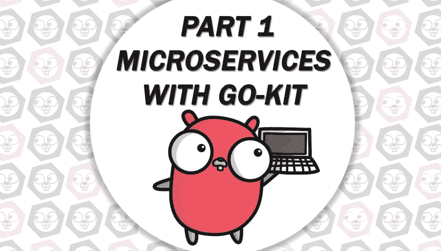

# 带有 go-kit 的微服务。第一部分

> 原文：<https://dev.to/plutov/microservices-with-go-kit-part-1-13dd>

这是“packagemain #12:带 go-kit 的微服务”的文本版本。第一部分"视频。

*   [第二部分](https://dev.to/plutov/packagemain-13-microservices-with-go-kit-part-2-4lgh)

[T2】](https://res.cloudinary.com/practicaldev/image/fetch/s--ChqY0k13--/c_limit%2Cf_auto%2Cfl_progressive%2Cq_auto%2Cw_880/https://thepracticaldev.s3.amazonaws.com/i/cg9nkmnnb38x5iubcs78.jpg)

如今，微服务是软件架构领域最流行的术语之一。

“微服务”这个词有不同的定义，我喜欢说微服务是单个程序员可以设计、实现、部署和维护的东西。

在整体式应用程序中，组件通过语言级别的方法或函数调用相互调用。相比之下，基于微服务的应用程序是在多台计算机上运行的分布式系统。每个服务实例通常是一个流程。因此服务必须使用进程间通信进行交互。

服务间通信最简单的可能解决方案是使用 HTTP 上的 JSON，然而还有更多选择:gRPC、pub/sub 等。

听起来很酷，但是微服务带来了一些挑战:

*   序列化
*   记录
*   断路器
*   请求跟踪
*   服务发现

如果你是一个 Go 开发者，go-kit 为我们提供了一套开发者的抽象、包和接口，所以你的服务的实现成为了标准。

我想开始一个关于使用 go-kit 工具的深入教程。我们将创建一个基于微服务的系统，设置环境，检查服务之间的交互方式。

我们将在一些微服务的帮助下创建一个虚构的 bug 追踪器系统:

*   用户
*   疯狂的
*   通知者

其中一些可以通过 JSON over HTTP 访问，内部通信将通过 gRPC 完成。

### go-kit 回顾

我们要明白，go-kit 不是一个框架，它是一个在 go 中构建微服务的工具包，包括包和接口。它类似于 Java Spring Boot，但范围较小。

让我们开始我们的项目。

有一个`kitgen`命令行工具可以从尚未准备好使用的模板生成服务。

### go-kit CLI

有一个单独的包用于从模板创建服务:

```
go get github.com/go-kit/kit
go get github.com/kujtimiihoxha/kit 
```

Enter fullscreen mode Exit fullscreen mode

让我们创建我们的服务:

```
kit new service users
kit new service bugs
kit new service notificator 
```

Enter fullscreen mode Exit fullscreen mode

这将生成初始文件夹结构和服务接口。默认情况下，接口是空的，让我们在接口中定义函数。我们需要一个用户创建功能，让我们从这个开始。

用户:

```
package service

import "context"

// UsersService describes the service.
type UsersService interface {
    Create(ctx context.Context, email string) error
} 
```

Enter fullscreen mode Exit fullscreen mode

bug:

```
package service

import "context"

// BugsService describes the service.
type BugsService interface {
    // Add your methods here
    Create(ctx context.Context, bug string) error
} 
```

Enter fullscreen mode Exit fullscreen mode

公证人:T0

```
package service

import "context"

// NotificatorService describes the service.
type NotificatorService interface {
    // Add your methods here
    SendEmail(ctx context.Context, email string, content string) error
} 
```

Enter fullscreen mode Exit fullscreen mode

然后我们需要运行一个命令来生成一个服务，它将创建服务样板、服务中间件和端点代码。它还创建了`cmd/`包来运行我们的服务。

```
kit generate service users --dmw
kit generate service bugs --dmw 
```

Enter fullscreen mode Exit fullscreen mode

- dmw 创建默认端点中间件，日志中间件。

这个命令已经向我们的代码添加了 go-kit 包:端点和 http 传输。我们现在需要做的是只在一个地方实现我们的业务逻辑。

我们将在下一个视频/文章中继续讨论业务逻辑。

Notificator 不应该有 REST API，因为它是一个内部服务，所以我们用 gRPC 传输生成服务。gRPC 代表 Google RPC framework，如果你以前没用过，查一下 [https://grpc.io](https://grpc.io) 。

为此，我们需要先安装 protoc 和 protobuf。

```
kit generate service notificator -t grpc --dmw 
```

Enter fullscreen mode Exit fullscreen mode

这也造就了。pb 文件，但我们会在下一个视频/文章中填充。

go-kit CLI 还可以创建一个样板 docker-compose 设置，让我们试试吧。

```
kit generate docker 
```

Enter fullscreen mode Exit fullscreen mode

所以它用端口映射创建了 Dockerfile，docker-compose.yml。让我们运行我们的环境并触发我们的`/create`端点。

```
docker-compose up 
```

Enter fullscreen mode Exit fullscreen mode

Dockerfiles 用的是`watcher` go 包，如果 go 代码被更改了，就在更新重启二进制文件，在本地环境上非常方便。

现在我们的服务运行在端口 8800、8801、8802 上。让我们调用用户的端点:

```
curl -XPOST http://localhost:8800/create -d '{"email": "test"}' 
```

Enter fullscreen mode Exit fullscreen mode

### 结论

我们还没有实现服务，但我们在几分钟内就准备好了一个良好的本地环境，稍后可以部署到您的基础架构中，因为我们用 Docker 对它进行了容器化。