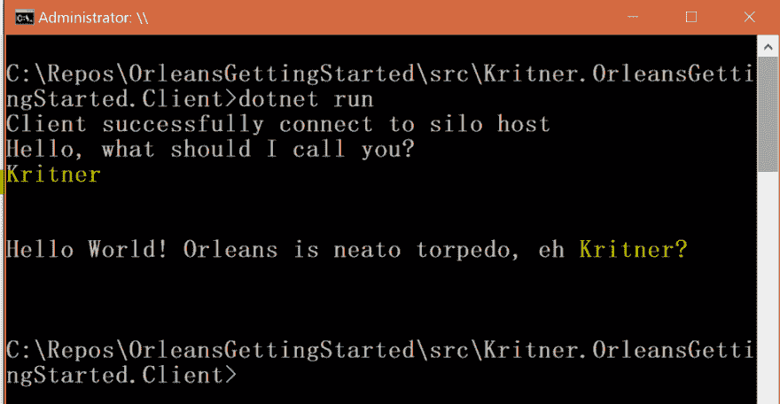
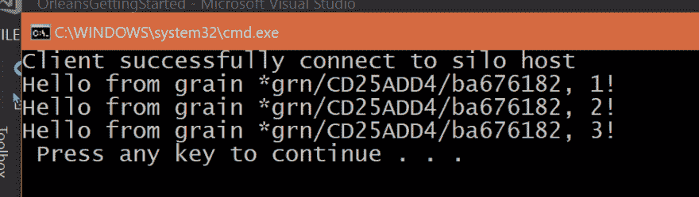
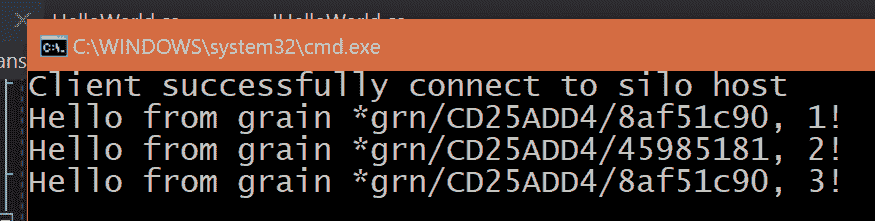
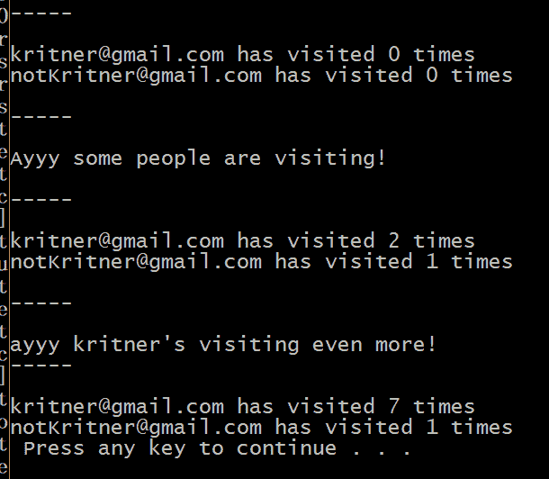
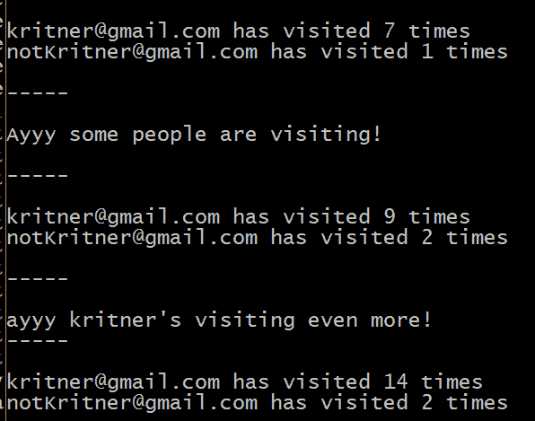

# 微软奥尔良——再利用谷物和谷物州

> 原文：<https://dev.to/kritner/microsoft-orleansreusing-grains-and-grain-state-339b>

### 微软奥尔良——再利用谷物和谷物州

我们已经[探索了跨集群分布应用程序逻辑的 Orleans](https://dev.to/kritner/getting-started-with-microsoft-orleans-1765) 。接下来，我们将了解谷物再利用和谷物状态…

### 概述

注意这段代码的起点可以在[这里](https://github.com/Kritner-Blogs/OrleansGettingStarted/releases/tag/v0.1)找到。如前所述，颗粒是为使用奥尔良编码而创建的“基元”。您调用 grains 的方式与您的“普通”代码非常相似，以使它尽可能简单。在前面的例子中，我们简单地称这个颗粒为一次；它接受一个值，并将其返回:

```
var grain = client.GetGrain<IHelloWorld>(Guid.NewGuid());
var response = await grain.SayHello(name); Console.WriteLine($"\n\n{response}\n\n"); 
```

退货:

[](https://res.cloudinary.com/practicaldev/image/fetch/s--sOk_uWkp--/c_limit%2Cf_auto%2Cfl_progressive%2Cq_auto%2Cw_880/https://cdn-images-1.medium.com/max/1006/1%2A7RQLAr2IdSfp7MUelAIXFQ.png) 

<figcaption>输入“克里特纳”会返回“克里特纳”以及一条信息，那只是蜜蜂的膝盖。</figcaption>

### 谷物再利用

谷物不一定只使用一次，在大多数情况下，我敢打赌它们会被使用成百上千次。尽管我们正在处理的当前颗粒没有多少被多次调用的用处，但它仍然可以产生(好吗？)举例。

让我们稍微改变一下我们的颗粒实现:

```
public class HelloWorld : Grain, IHelloWorld
{
 public Task<string> SayHello(string name)
 {
  return Task.FromResult($"Hello World! Orleans is neato torpedo, eh {name}?");
 }
} 
```

收件人:

```
public class HelloWorld : Grain, IHelloWorld
{
 public Task<string> SayHello(string name)
 {
  return Task.FromResult($"Hello from grain {this.GetGrainIdentity()}, {name}!");
 }
} 
```

在上面的例子中，我们现在打印出了颗粒的 uniqueId/主键。主键在当前的纹理实现状态下并不是非常重要，但是你必须有耐心，我年轻的学徒。

接下来，让我们改变我们的客户端调用一个单一的粮食，几次。原文:

```
private static async Task DoClientWork(IClusterClient client)
{
 Console.WriteLine("Hello, what should I call you?");
 var name = Console.ReadLine();

 if (string.IsNullOrEmpty(name))
 {
  name = "anon";
 }

 // example of calling grains from the initialized client
 var grain = client.GetGrain<IHelloWorld>(Guid.NewGuid());

 var response = await grain.SayHello(name);
 Console.WriteLine($"\n\n{response}\n\n");
} 
```

应改为:

```
private static async Task DoClientWork(IClusterClient client)
{
 // example of calling grains from the initialized client
 var grain = client.GetGrain<IHelloWorld>(Guid.NewGuid());

 Console.WriteLine($"{await grain.SayHello("1")}");
 Console.WriteLine($"{await grain.SayHello("2")}");
 Console.WriteLine($"{await grain.SayHello("3")}");
} 
```

运行上面的代码将向我们展示:

[](https://res.cloudinary.com/practicaldev/image/fetch/s--Mp4qYXUI--/c_limit%2Cf_auto%2Cfl_progressive%2Cq_auto%2Cw_880/https://cdn-images-1.medium.com/max/959/1%2ApK85Jbx72BpyW_QO3fD8Iw.png)

上面，我们可以看到相同的 grain(如`*grn/CD25ADD4/ba676182`所示)被用于所有三个对 grain.SayHello 的调用。

现在你可能会问自己:

> 我们可以有多个相同粒度的实例化，并有独立的主键吗？

我们当然可以！让我们来看看:

```
private static async Task DoClientWork(IClusterClient client)
{
 // example of calling grains from the initialized client
 var grain = client.GetGrain<IHelloWorld>(Guid.NewGuid());
 var grain2 = client.GetGrain<IHelloWorld>(Guid.NewGuid());

 Console.WriteLine($"{await grain.SayHello("1")}");
 Console.WriteLine($"{await grain2.SayHello("2")}");
 Console.WriteLine($"{await grain.SayHello("3")}");
} 
```

输出:

[](https://res.cloudinary.com/practicaldev/image/fetch/s--_8LXPZKQ--/c_limit%2Cf_auto%2Cfl_progressive%2Cq_auto%2Cw_880/https://cdn-images-1.medium.com/max/875/1%2AN_sEHr6Jwqv10dnNO2vrKg.png) 

<figcaption>同一粒的多个实例化。这里的代码。</figcaption>

以上都是什么意思？在某种程度上，这意味着可以根据需要实例化一次或多次。在多重实例化中我们会有什么样的需求？在这种谷物的情况下，我想不出什么，因为谷物总是回报它所接受的。当涉及到包含状态和/或上下文数据的粒度时，多实例化真正能够大放异彩。

### 有状态颗粒

颗粒可以有一个“状态”的概念，或者与颗粒内部或其上下文相关的实例变量。奥尔良有两种跟踪谷物状态的方法:

*   延长`Grain<T>`而不是`Grain`
*   你自己做吧

一般来说，我不喜欢写已经写好的代码，所以我会坚持第一种选择。

#### 颗粒持久性

为了跟踪颗粒状态，我们的颗粒状态需要被保存在某个地方。奥尔良提供了几种谷物状态持久化的方法( [doc](https://dotnet.github.io/orleans/Documentation/grains/grain_persistence/index.html) )。出于演示目的，我将使用 MemoryGrainStorage。请注意，当竖井关闭时，这种持久性方法会被破坏，因此在类似生产的场景中可能不是特别有用。

要利用有状态的颗粒，您需要一些东西:

*   已配置的持久性存储
*   有状态颗粒

#### 谷物持久性指南

我们需要配置我们的存储提供商—一些提供商可能“更多地参与”，因为您需要某种支持基础架构和/或云功能/资金(:D)。这是我选择内存提供商的一个重要原因！

要注册内存提供者，让我们从以下网址更新我们最初的 SiloHost 构建器:

```
private static async Task<ISiloHost> StartSilo()
{
 // define the cluster configuration
 var builder = new SiloHostBuilder()
  .UseLocalhostClustering()
  .Configure<ClusterOptions>(options =>
  {
   options.ClusterId = "dev";
   options.ServiceId = "HelloWorldApp";
  })
  .Configure<EndpointOptions>(options => options.AdvertisedIPAddress = IPAddress.Loopback)
  .ConfigureLogging(logging => logging.AddConsole());

 var host = builder.Build();
 await host.StartAsync();
 return host;
} 
```

收件人:

```
private static async Task<ISiloHost> StartSilo()
{
 // define the cluster configuration
 var builder = new SiloHostBuilder()
  .UseLocalhostClustering()
  .Configure<ClusterOptions>(options =>
  {
   options.ClusterId = "dev";
   options.ServiceId = "HelloWorldApp";
  })
  .Configure<EndpointOptions>(options => options.AdvertisedIPAddress = IPAddress.Loopback)
  .AddMemoryGrainStorage("OrleansStorage")
  .ConfigureLogging(logging => logging.AddConsole());

 var host = builder.Build();
 await host.StartAsync();
 return host;
} 
```

注意，由于上面使用了一个[构建器模式](https://en.wikipedia.org/wiki/Builder_pattern)，您可以只添加:

```
builder.AddMemoryGrainStorage("OrleansStorage"); 
```

作为构建器实例化和 var host = builder 之间的单独一行。build()；。

就是这样！

#### 持久的谷粒

接下来，让我们用某种状态来拼凑一粒谷物。

[T2】](https://res.cloudinary.com/practicaldev/image/fetch/s--A4_UF7_e--/c_limit%2Cf_auto%2Cfl_progressive%2Cq_auto%2Cw_880/https://cdn-images-1.medium.com/max/664/0%2A10UD2OnOlxZay8uW.jpg)

我们将创建一个可以跟踪用户访问我们的“站点”(假设它是一个网站)的次数的颗粒。第一件事是定义接口:

```
public interface IVisitTracker : IGrainWithStringKey
{
 Task<int> GetNumberOfVisits();
 Task Visit();
} 
```

上述内容的属性:

*   字符串键——因为我们用它来跟踪对我们网站的访问，使用帐户电子邮件作为唯一键似乎是有意义的
*   task getnumberofvisitors()—该方法将用于检索用户访问的次数。
*   Task Visit() —当用户访问站点时，将调用此方法。

粮食实施:

```
[StorageProvider(ProviderName = Constants.OrleansMemoryProvider)]
public class VisitTracker : Grain<VisitTrackerState>, IVisitTracker
{
 public Task<int> GetNumberOfVisits()
 {
  return Task.FromResult(State.NumberOfVisits);
 }

 public async Task Visit()
 {
  var now = DateTime.Now;

  if (!State.FirstVisit.HasValue)
  {
   State.FirstVisit = now;
  }

  State.NumberOfVisits++;
  State.LastVisit = now;

  await WriteStateAsync();
 }
}

public class VisitTrackerState
{
 public DateTime? FirstVisit { get; set; }
 public DateTime? LastVisit { get; set; }
 public int NumberOfVisits { get; set; }
} 
```

上面发生了一些新的事情:

*   将存储提供者指定为类级别属性—这是我们在前面对 SiloHost 的更改中定义的存储提供者。
*   扩展`Grain<T>`而不是 Grain，其中`<T>`是一个状态类。
*   操纵这个。状态，以便跟踪特定的实例化“状态”。
*   状态类 VisitTrackerState

#### 观看谷物状态的运行

最后，让我们看看使用新的有状态粒度，我们可以在客户端应用程序中做什么。

```
private static async Task DoStatefulWork(IClusterClient client)
{
 var kritnerGrain = client.GetGrain<IVisitTracker>("kritner@gmail.com");
 var notKritnerGrain = client.GetGrain<IVisitTracker>("notKritner@gmail.com");

 await PrettyPrintGrainVisits(kritnerGrain);
 await PrettyPrintGrainVisits(notKritnerGrain);

 PrintSeparatorThing();
 Console.WriteLine("Ayyy some people are visiting!");

 await kritnerGrain.Visit();
 await kritnerGrain.Visit();
 await notKritnerGrain.Visit();

 PrintSeparatorThing();

 await PrettyPrintGrainVisits(kritnerGrain);
 await PrettyPrintGrainVisits(notKritnerGrain);

 PrintSeparatorThing();
 Console.Write("ayyy kritner's visiting even more!");

 for (int i = 0; i < 5; i++)
 {
  await kritnerGrain.Visit();
 }

 PrintSeparatorThing();

 await PrettyPrintGrainVisits(kritnerGrain);
 await PrettyPrintGrainVisits(notKritnerGrain);
}

private static async Task PrettyPrintGrainVisits(IVisitTracker grain)
{
 Console.WriteLine($"{grain.GetPrimaryKeyString()} has visited {await grain.GetNumberOfVisits()} times");
}

private static void PrintSeparatorThing()
{
 Console.WriteLine($"{Environment.NewLine}-----{Environment.NewLine}");
} 
```

上面的内容我们以前都做过，使用两个独立的“用户”获取相同类型的 grain 的实例，对它们调用几次 grain 方法，并打印结果。

运行应用程序时，我们会看到:

[](https://res.cloudinary.com/practicaldev/image/fetch/s--WIfVTktm--/c_limit%2Cf_auto%2Cfl_progressive%2Cq_auto%2Cw_880/https://cdn-images-1.medium.com/max/610/1%2ABK5uR6wT4ZmVpZgLnSimDw.png) 

<figcaption>演示有状态颗粒，先运行</figcaption>

你可以在上面看到，我们的访问计数器随着每次访问而增加，kritner 的访问次数比 notKritner 多得多。

如果我们再次运行同样的应用程序，会发生什么？

[](https://res.cloudinary.com/practicaldev/image/fetch/s--qkrbx8XP--/c_limit%2Cf_auto%2Cfl_progressive%2Cq_auto%2Cw_880/https://cdn-images-1.medium.com/max/596/1%2AK83xtLxSdyk3QZ45A6Hbrg.png) 

<figcaption>第二次跑</figcaption>

你可以看到我们的访问计数器在第一次运行时就停止了——但它当然停止了；我们用的是有状态颗粒！再次提醒，因为我们使用的是内存提供者，一旦 SiloHost 关闭，颗粒的状态将不会被保留。当使用其他谷物存储供应商时，这种状态不会在筒仓关闭时被破坏。

希望这有助于其他人开始看到奥尔良提供的强大的可能性——演员、谷物和谷物之州仅仅触及了奥尔良所能做的表面。希望很快我会有更多关于奥尔良的东西可以写！

关于这一点的完整代码可以在[https://github . com/krit ner-Blogs/OrleansGettingStarted/releases/tag/v 0.11](https://github.com/Kritner-Blogs/OrleansGettingStarted/releases/tag/v0.11)找到

相关:

*   博文— [微软奥尔良入门](https://dev.to/kritner/getting-started-with-microsoft-orleans-1765)
*   GitHub repo 截止到本帖*开始*—[v 0.1](https://github.com/Kritner-Blogs/OrleansGettingStarted/releases/tag/v0.1)
*   本帖*末*的 GitHub 回购— [v0.11](https://github.com/Kritner-Blogs/OrleansGettingStarted/releases/tag/v0.11)
*   奥尔良文件— [谷物持久性](https://dotnet.github.io/orleans/Documentation/grains/grain_persistence/index.html)