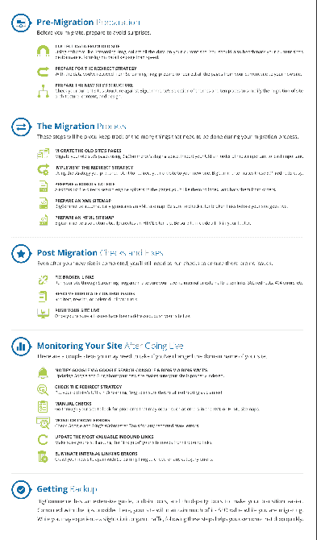

# 将您的商店从 SHOPIFY 迁移到 BIGCOMMERCE 的分步指南

> 原文：<https://dev.to/gurpreet3780/migrate-your-shop-from-shopify-to-bigcommerce-step-by-step-guide-42p3>

[T2】](https://res.cloudinary.com/practicaldev/image/fetch/s--oVUBYfkz--/c_limit%2Cf_auto%2Cfl_progressive%2Cq_auto%2Cw_880/https://thepracticaldev.s3.amazonaws.com/i/17ylhrdr8pzgtml885aq.png)

许多企业希望将其在线商店从 Shopify 迁移到 BigCommerce，但他们不确定这需要什么。BigCommerce 提供了一项服务，帮助将客户站点的某些方面迁移到他们的平台上。为了获得更完整的迁移，你可以考虑自己迁移或者在 BigCommerce SEO 专家的帮助下迁移。

如果您正在寻找一份全面的清单来审查迁移的各个方面，请继续阅读！