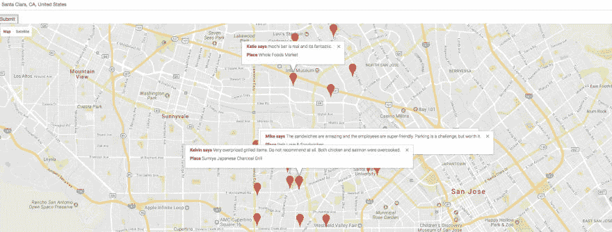

# 将实时签入发现应用程序从 React 迁移到 Preact

> 原文：<https://dev.to/apcelent/migrating-a-realtime-checkins-discovery-app-from-react-to-preact-4ghp>

在这篇文章中，我们将创建一个客户端 web 应用程序，根据用户的偏好实时呈现指定位置的 FourSquare 签到。我们将要使用的主要技术是 ReactJS、FourSquare API、Google Maps API。

在本教程的后面，我们将看到如何将预先编写的 react 应用程序迁移到 preact 应用程序。

## 概述

React-Checkins 是一个实时签到发现应用程序，使用谷歌地图 API 和 ReactJS 构建。

一旦渲染后，应用程序看起来如下

[T2】](https://res.cloudinary.com/practicaldev/image/fetch/s--YgfgJxrc--/c_limit%2Cf_auto%2Cfl_progressive%2Cq_auto%2Cw_880/https://blog.apcelent.cimg/preact-react-app.png)

## 设置和地图整合

我们将使用 npm 来管理我们所有的代码依赖。首先，让我们在项目的根目录下设置 npm。这将在项目根目录中生成一个名为 *package.json* 的文件。如果在安装软件包时使用- save 或- save-dev 标志，它会将软件包作为依赖项保存在 package.json 文件中。要重新安装软件包，我们需要做的就是运行 npm install。这些包将被安装在本地特定于我们项目的目录下，该目录名为 node_modules，如 virtualenv。

因此，让我们使用 npm init 在项目根目录中生成一个 package.json 文件。

```
npm init 
```

Enter fullscreen mode Exit fullscreen mode

让我们安装我们的第一个 npm 包。

NPM install-save react web pack babel babel-loader web pack-dev-server react-Google-maps react-addons-update class names

package.json 包含其他几个依赖项。

默认情况下，npm 应该将依赖项安装在 node_modules 文件夹结构下。

## 创建网络包配置

现在让我们创建一个 webpack 配置。创建配置文件的目的是连接所有的 js 文件。

```
mkdir -p src/js
touch webpack.config.js
touch dev/js/components/GoogleApp.js 
```

Enter fullscreen mode Exit fullscreen mode

让我们创建一个简单的 webpack 配置来加载。关于 webpack 配置的更多信息，请点击这里。

webpack.config 文件

```
var path = require('path');
var webpack = require('webpack');

module.exports = {
    devServer: {
        inline: true,
        contentBase: './src',
        port: 3000
    },
    devtool: 'cheap-module-eval-source-map',
    entry: './dev/js/components/GoogleApp.js', ///entry point of our app. 
    module: {
        loaders: [
            {
                test: /\.js$/,
                loaders: ['babel'],
                exclude: /node_modules/
            },
            {
                test: /\.scss/,
                loader: 'style-loader!css-loader!sass-loader'
            }
        ]
    },
    output: {
        path: 'src',
        filename: 'js/bundle.min.js'
    },
    plugins: [
        new webpack.optimize.OccurrenceOrderPlugin()
    ]
}; 
```

Enter fullscreen mode Exit fullscreen mode

此时，我们的目录结构将看起来像这样。

```
root
  |-- dev
    | |--js
    |     |--components
    |         |--GoogleApp.js
    |-- node_modules
    |-- src
    | |-- js
    |   | |-- bundle.min.js   ## will create after run npm start
    |   |-- index.html
    |-- webpack.config.js
    |-- package.json
    |-- .babelrc 
```

Enter fullscreen mode Exit fullscreen mode

索引文件相当简单，可以在这里找到

## 初始化 React 组件中的贴图

```
Import {
    withGoogleMap,
    GoogleMap,
    Marker,
    InfoWindow,
 } from "react-google-maps"; 
```

Enter fullscreen mode Exit fullscreen mode

如果要通过 index.html 文件加载地图，可以包含以下内容。

```
 <script src="https://maps.googleapis.com/maps/api/js?key=GOOGLE_API_KEY&callback=initMap&libraries=places"async defer></script> 
```

Enter fullscreen mode Exit fullscreen mode

### 动态检索谷歌地图库

```
const GettingStartedGoogleMap = withGoogleMap(props => (
    <GoogleMap
    ref={props.onMapLoad}
    defaultZoom={3}
    options={{ minZoom: 3, maxZoom: 15 }}
    center={{ lat: 20.5937, lng: 78.9629 }}
    >
    {props.markers.map(marker => (
        <Marker
          { ...marker }
          onRightClick={() => props.onMarkerRightClick(marker)}
          onMouseOver={() => props.onMouseOver(marker)}
          >
          {marker.showInfo && (
            <InfoWindow >
              <div className="">
              {marker.info ?
                <p><b>{marker.info[0].user.firstName} says </b>
                    {marker.info[0].text}</p>
                : null}
                <p><b>Place </b> {marker.key}</p>

                </div>
              </InfoWindow>
            )}

        </Marker>

    ))}
    </GoogleMap>
)); 
```

Enter fullscreen mode Exit fullscreen mode

### 获取标记的初始状态

```
constructor(props)
        {
            super(props);
            this.state = {
                markers: [{
                    position: {
                        lat: null,
                        lng: null,
                    },
                    key: null,
                    defaultAnimation: null,
                    showInfo:false,
                    info: []
                }],
                address: '',
                results: []
            };
            this.onChange = (address) => this.setState({ address })
        } 
```

Enter fullscreen mode Exit fullscreen mode

## 通过四方搜索地点

searchNearPlaces 函数从城市搜索查询中获取响应，并将所有结果放入一个数组对象中，这些结果带有各自的[lat，lng]坐标和 pin 的图标链接。

```
getUrl() {
    const clientID = YOUR_FOURSQUARE_CLIENT_ID,
         clientSecret = YOUR_FOURSQUARE_CLIENT_SECRET,
         version = 'v=20140806';
    let location = this.state.address,
    url = 'https://api.foursquare.com/v2/venues/explore?client_id=' +
      clientID + '&client_secret=' + clientSecret + '&near=' +
        location + '&' + version;
    return url;
}

searchNearPlaces() {
    let url = this.getUrl();
    axios.get(url)
        .then(response => {
            let results = response.data.response.groups[0].items;
            this.setState({ results:results });
            // Do with results

        })
} 
```

Enter fullscreen mode Exit fullscreen mode

让我们保存总结果中的前 20 个作为标记。

```
 var bounds = new google.maps.LatLngBounds();
 results.map((el, i) => {
    if (i < 20 ) {
    const nextMarkers = [
    ...this.state.markers,
    {
    position: {
        lat: el.venue.location.lat,
        lng: el.venue.location.lng  },
    defaultAnimation: 2,
    key: el.venue.name,
    showInfo: false,
    info: el.tips
    },
    ];
    this.setState({
    markers: nextMarkers,
    })

   bounds.extend(this.state.markers[i].position);
   }

})
this._mapComponent.fitBounds(bounds);   // bound the all markers of map 
```

Enter fullscreen mode Exit fullscreen mode

现在我们渲染组件

```
render() {
    const inputProps = {
        value: this.state.address,
        onChange: this.onChange
        type: 'search',
        placeholder: 'Search Places...',
        autoFocus: true,
    }
    const cssClasses = {
        root: 'form-group',
        input: 'form-control',
        autocompleteContainer: 'my-autocomplete-container'
    }
    const myStyles = {
        root: { position: 'absolute' },
        input: { width: '100%' },
        autocompleteContainer: { backgroundColor: 'green' },
        autocompleteItem: { color: 'black' },
        autocompleteItemActive: { color: 'blue' }
    }

    const AutocompleteItem = ({ suggestion }) => (<div>
      <i className="fa fa-map-marker"/>{suggestion}</div>)
    return (
        <div ref="map" style={{height: '600px'}}>
            <Helmet
              title="GoogleMap"
            />
            <form onSubmit={this.handleFormSubmit.bind(this)}>
                <PlacesAutocomplete
                    inputProps={inputProps}
                    classNames={cssClasses}
                    styles={myStyles}
                    autocompleteItem={AutocompleteItem}
                     />
                     <button type="submit">Submit</button>
            </form>

            <GettingStartedGoogleMap
              containerElement={
                 <div style={{ height: '650px' }} />
             }
             mapElement={
                <div style={{ height: '650px' }} />
             }
             onMapLoad={this.handleMapLoad.bind(this)}
             markers={this.state.markers}
             onMouseOver={this.handleOnMouseMarker.bind(this)}

             onMarkerRightClick={this.handleMarkerRightClick.bind(this)}
            />
        </div>
      );
  }
  /// google maps loaded with support of initMap
  window.initMap = () => {
  ReactDOM.render(
      <GettingStartedExample />,
  document.getElementById('root')
  )
} 
```

Enter fullscreen mode Exit fullscreen mode

我们现在将添加一个函数来显示鼠标悬停时的标记信息

```
var react_update = require('react-addons-update');

update[index_val] = {
    $merge: {showInfo: false}
   };
   var changedMarkers = react_update(this.state.markers, update);
   this.setState({ markers: changedMarkers }); 
```

Enter fullscreen mode Exit fullscreen mode

## 用 PreactJS 替换 ReactJS

最近，脸书将 ReactJS 的许可证从 BSD 修改为 BSD+专利许可证。增加专利条款意味着，如果它认为使用 ReactJS 的产品正在与 facebook 竞争，它的许可证将被撤销。因此，我们开始寻找 react as 的替代品，它将与现有的 react 应用程序无缝地工作。Preact 就是这样一种解决方案。

Preact 是一个轻量级的 javascript 库(3 kb ),可以用来替代 [Reactjs](https://reactjs.org/)

## 安装

preact-compat 是 preact 之上的另一层，它允许我们从 react 切换到 preact，而无需对现有代码进行太多更改。

首先，安装 preact 和 preact-compat 模块

```
npm i --save preact
npm i --save preact-compat 
```

Enter fullscreen mode Exit fullscreen mode

为了在 webpack 中使用 preact，我们在 webpack.config.js 文件
中为 react 和 react-dom 添加了一个别名

```
resolve: {
        extensions: ['', '.js', '.jsx'],
        "alias": {
            "react": "preact-compat",
            "react-dom": "preact-compat"
        }
   }, 
```

Enter fullscreen mode Exit fullscreen mode

在这个例子中，已经创建了一个简单的 [react hello world 应用程序](https://github.com/vibhash1083/react-map-checkins/tree/preact)。它有一个组件 HelloWorld.js

```
import React, { Component } from 'react';
import ReactDOM from "react-dom";

export default class HelloWorld extends Component {
    constructor(props)
    {
        super(props);
    }

  render()
  {

    return (
          <div>
          <h1>
            Hello World!
            </h1>
          </div>
     );

  }
}

ReactDOM.render(
    <HelloWorld />,
    document.getElementById('root')
) 
```

Enter fullscreen mode Exit fullscreen mode

更新 webpack.config.js 文件以添加 preact 和 preact-compat 的别名后，应用程序将以与 preact-compat 相同的方式工作，并提供与 react 和 react-dom 相同的导出。

```
var path = require('path');
var webpack = require('webpack');

module.exports = {
    devServer: {
        inline: true,
        contentBase: './src',
        port: 3000
    },
    devtool: 'cheap-module-eval-source-map',
    entry: './dev/js/components/HelloWorld.js',
    module: {
        loaders: [
            {
                test: /\.js$/,
                loaders: ['babel'],
                exclude: /node_modules/
            },
            {
                test: /\.scss/,
                loader: 'style-loader!css-loader!sass-loader'
            }
        ]
    },
    output: {
        path: 'src',
        filename: 'js/bundle.min.js'
    },
    resolve: {
        extensions: ['', '.js', '.jsx'],
        "alias": {
            "react": "preact-compat",
            "react-dom": "preact-compat"
        }
    },
    plugins: [
        new webpack.optimize.OccurrenceOrderPlugin()
    ]
}; 
```

Enter fullscreen mode Exit fullscreen mode

我们使用相同的配置更改来反应地图签入应用程序，并且签入发现像以前一样工作。

## 结论

这是一个工作中的 React-Checkins 应用程序，它提供了一个关于我们如何将谷歌地图与(P)ReactJS 集成的公平理解——所有这些都在 15 分钟之内完成。作为参考，整个代码是[这里是](https://github.com/apcelent/preact-reactjs)

这篇文章最初出现在 [Apcelent 技术博客上。](https://blog.apcelent.com/Migrating-a-realtime-Checkins-Discovery-App-from-React-to-Preact.html)