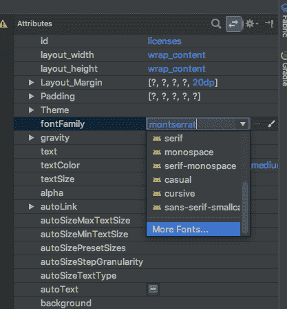

# 迁移到 Android 上的可下载字体

> 原文：<https://dev.to/ditn/migrating-to-downloadable-fonts-onandroid-4fjb>

这是我为[区块链工程博客](https://medium.com/blockchain-engineering)写的文章的转载。你可以在这里找到[的原文](https://medium.com/blockchain-engineering/migrating-to-downloadable-fonts-on-android-49f0a1c3d79b)。

* * *

在区块链，我们有许多移动用户在带宽受限的环境中，如发展中国家。因此，保持应用小巧轻便是 Android 团队的首要任务。较小的应用程序大小增加了安装量和转换率——这对任何专注于移动业务的公司来说都是重要的指标。在过去的一年中，我们使用了各种技术来防止应用程序膨胀，包括缩减我们仅有的几个 png，在每个可能的机会使用`VectorDrawables`，以及积极利用 ProGuard。

在该应用的早期版本中，我们捆绑了三种字体，并依赖名为[书法](https://github.com/chrisjenx/Calligraphy)的第三方库来为我们呈现所有 API 级别的字体。书法为我们提供了很好的服务，在很长一段时间里，它是字体应用的唯一可行的解决方案。但是这个库是另一个第三方依赖，已经将近一年没有更新了。

使用第三方解决方案的一个缺点是，区块链对这些字体没有完全的控制权——谷歌可能会在未来的某个时候打破这个库的工作方式。这种方法的另一个缺点是，必要的捆绑字体会占用空间。谢天谢地，这不再是必需的了。

Android Oreo 增加了[可下载字体](https://developer.android.com/guide/topics/ui/look-and-feel/downloadable-fonts)，允许应用程序向字体提供商请求字体，并在运行时加载它们，而不是从应用程序资产文件夹中加载。这带来了额外的好处，因为它减少了应用程序安装随机失败的机会，并且请求相同字体的多个应用程序可以共享这些资源。

从支持库 26.0.0 开始，谷歌支持字体提供商，这为我们提供了一个原生(或接近原生)的解决方案，一直到 API 14，这超出了我们在区块链这里所需要的。

添加一个可下载的字体很简单——进入布局编辑器，选择`fontFamily`->-T1，然后选择你可能需要的任何字体。然后，Android Studio 导入所有必要的文件，并向 Android Manifest 添加条目，生成相关的 XML 文件，声明所使用的字体，以及如何从字体提供程序检索它。

[T2】](https://res.cloudinary.com/practicaldev/image/fetch/s---uw_XUbO--/c_limit%2Cf_auto%2Cfl_progressive%2Cq_auto%2Cw_880/https://cdn-images-1.medium.com/max/1600/0%2AilZTsWot9dskcEjm.)