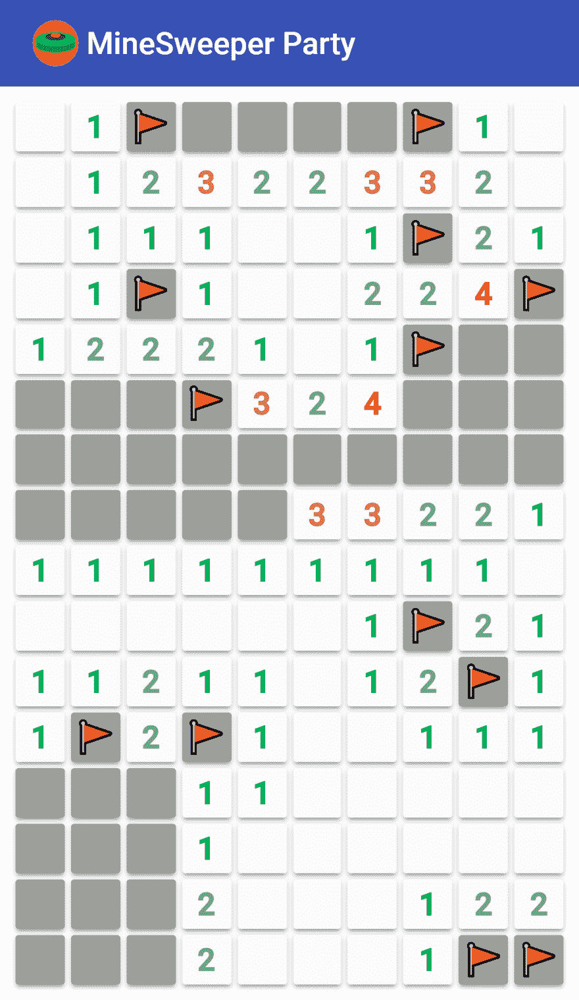

# 扫雷队

> 原文：<https://dev.to/titonobre/minesweeper-party-2d2h>

# 我造了什么

嗯，我做了一个扫雷游戏，允许多个玩家同时玩同一个游戏。没有转弯，没有等待。只需轻点轻点嘣！💥

[T2】](https://res.cloudinary.com/practicaldev/image/fetch/s--Il03YNKK--/c_limit%2Cf_auto%2Cfl_progressive%2Cq_auto%2Cw_880/https://thepracticaldev.s3.amazonaws.com/i/ayeq0kqlpg4xif3bjxam.png)

与经典版本一样，说明非常简单:

*   点击/单击一个单幅图块以显示它；
*   点击/单击并按住一个单幅图块，用标志锁定它🚩；
*   显示所有安全的牌以获胜。

## 工作原理

游戏在一个由 URL 标识的频道上进行。每个频道允许无限数量随机游戏，但一次只能玩一个。

有 4 个预定义的通道，难度逐渐增加:简单/中等/困难/极端。

其他频道可以用随机 id 创建，就像 YouTube 一样:[https://minesweeper-party.herokuapp.com/dQw4w9WgXcQ](https://minesweeper-party.herokuapp.com/dQw4w9WgXcQ)

所有这些频道都可以与其他用户共享。让游戏开始吧。

## 推杆是如何使用的

当用户加入游戏时，应用程序订阅推送通道，以接收来自玩同一游戏的其他用户的变化通知(显示/标记)。

当用户展示或标记一个区块时，向服务器发出请求，并且向同一游戏/频道的所有订户发送通知。由于客户端也有游戏引擎，本地状态在服务器响应之前乐观地更新。

## 演示链接

[https://minesweeper-party.herokuapp.com/](https://minesweeper-party.herokuapp.com/)

我用的是免费的 Heroku Dyno，不用一段时间就会进入睡眠状态。第一次唤醒它可能需要几秒钟。

## 链接到代码

[https://github.com/titonobre/minesweeper-party](https://github.com/titonobre/minesweeper-party)

# 我是如何建造的

这个项目是在 TypeScript 中实现的，使用 Angular 作为前端框架，Express 作为服务器。前端应用程序是一个 [PWA](https://dev.to/t/pwa) ，它使用一个 ServiceWorker 来缓存客户端设备上的资产。

分享按钮使用的是[网络分享 API](https://dev.to/philnash/the-web-share-api) ，仅在谷歌 Chrome for Android 的最新版本中受支持。

## 堆栈

**应用**

*   [角度](https://angular.io/)
*   [打字稿](https://www.typescriptlang.org/)
*   [RxJS](https://github.com/ReactiveX/rxjs)
*   [推送客户端](https://www.npmjs.com/package/pusher-js)

**服务器**

*   [Node.js](https://nodejs.org/en/)
*   [快递](https://expressjs.com/)
*   [推动器](https://www.npmjs.com/package/pusher)
*   [Heroku](https://heroku.com/)

**其他值得注意的工具**

*   [角度 CLI](https://cli.angular.io/)
*   [npm](https://www.npmjs.com/)
*   [dotenv](https://github.com/motdotla/dotenv)
*   [节点开发](https://github.com/fgnass/node-dev)
*   [imagemin](https://github.com/imagemin/imagemin)
*   [svge export](https://github.com/shakiba/svgexport)
*   [NPM-运行-全部](https://github.com/mysticatea/npm-run-all)

## 问题

### 项目的名称

> 计算机科学只有两个硬东西:缓存失效和事物命名。
> *——菲尔·卡尔顿*

此处不做评论！🙄

# 附加资源/信息

值得一提的是，游戏引擎的最初灵感是基于尤尔根·范·德·摩尔和 T2·克里斯蒂安·约翰森的工作。

# 未来的工作

*   游戏引擎支持可配置的网格大小，但我认为支持一种可扩展的网格(也许是“无限的”)将是一个巨大的挑战。

*   **有数据持久性** -目前游戏没有持久性，如果服务器重启或进入睡眠状态，游戏就会丢失。某种形式的存储会很好。

*   允许自定义难度 -可配置的网格大小和地雷数量可能是一个不错的补充。

*   **补充某种排名**——在别人玩同一游戏的情况下完成一个游戏并不容易。给频道里最好的玩家加分会让事情变得更有趣。

*   P2P - Pusher 允许客户端通过 websocket 向其他客户端发送消息。这可以很好地避免与游戏服务器的通信。

*   **在所有设备上共享** -尽管网络共享 API 很棒，也很容易使用。当其他浏览器不支持它时，使用一个替代品会很好。

*   **离线模式** -因为比赛的目的是使用 Pusher，所以我取消了离线模式，但添加回来非常简单。

* * *

当心，不要踩到地雷...

[T2】](https://res.cloudinary.com/practicaldev/image/fetch/s--JHDzohvC--/c_limit%2Cf_auto%2Cfl_progressive%2Cq_auto%2Cw_880/https://thepracticaldev.s3.amazonaws.com/i/i4o6yt8f5ld2a1edezfs.png)