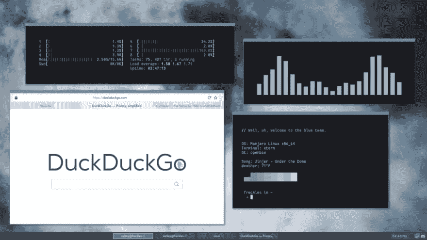
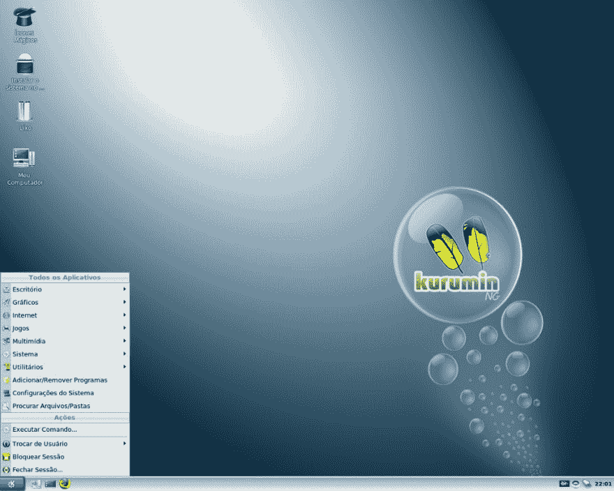
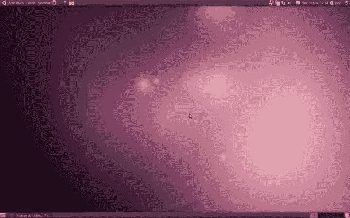
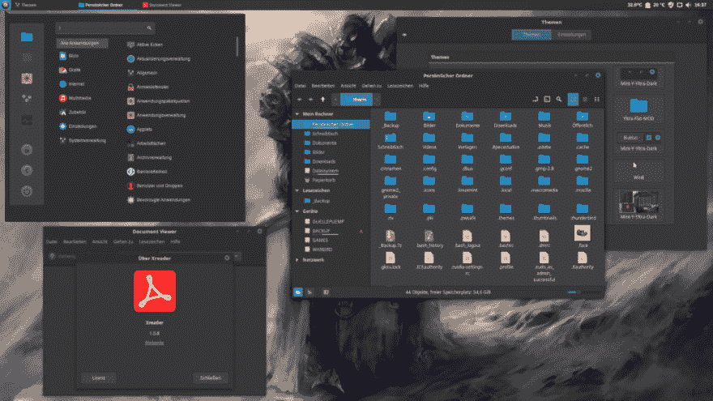
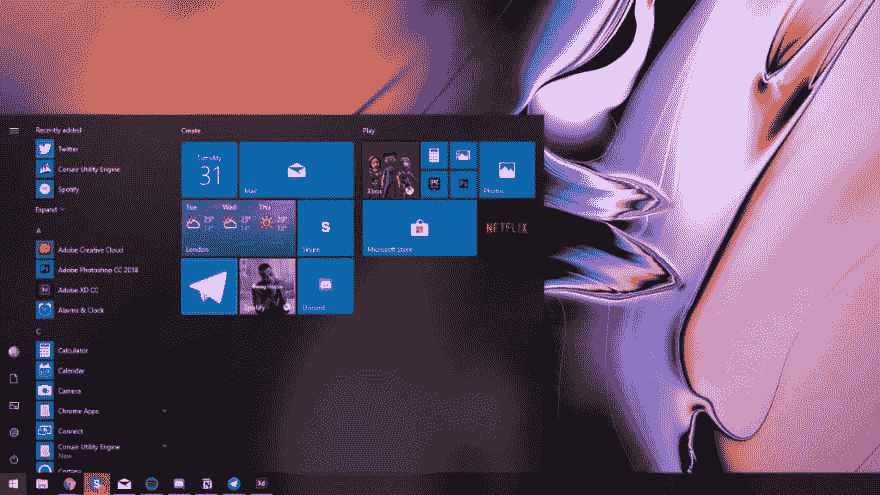
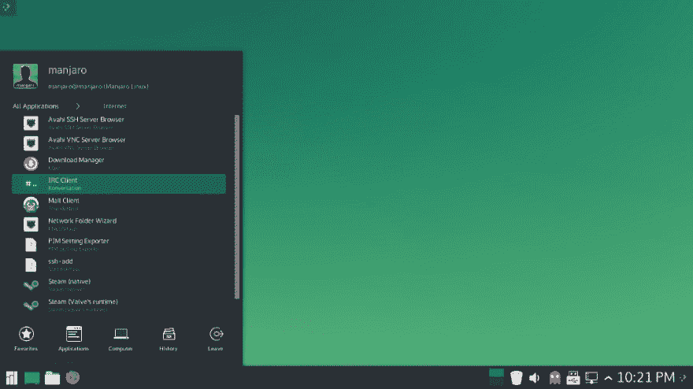
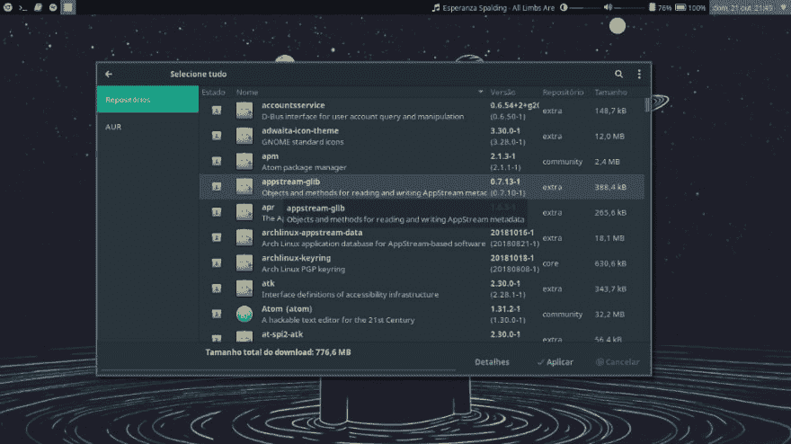
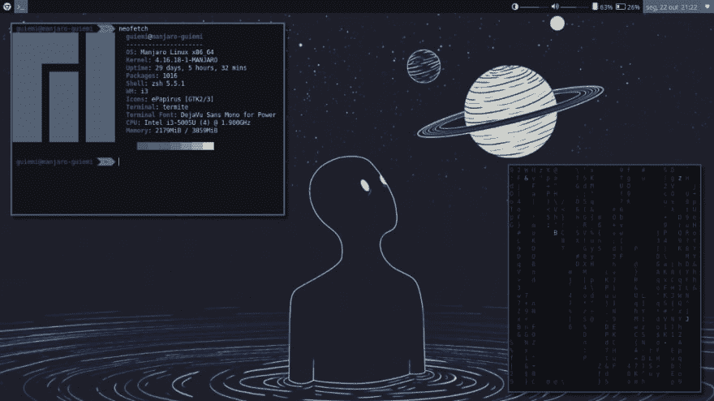

# 我在 Linux 上的故事

> 原文：<https://dev.to/guiteixeira/minha-historia-no-linux-17e8>

### 我在 Linux 上的轨迹

Linux 有分歧。如果他们一方面颂扬他们的稳定性和安全性，另一方面批评它和它的公园里的少量软件，呼吁审美先驱。也就是说， [*linux 丑陋，没有运行在其上的程序*](https://www.reddit.com/r/linux/comments/1zd1wx/honest_question_why_is_linux_so_ugly/) 虽然现在还能说是真的，但至少也曾努力将轻视高雅的指责抛诸脑后。下面的台式机就是其中的许多例子之一。

<figure> 

<figcaption>仍然没有节目，但至少很漂亮。(资料来源:[【https://www . Reddit . com/r/unixporn/comments/9 hiykh/openbox _ under _ the _ dome/](https://www.reddit.com/r/unixporn/comments/9hiykj/openbox_under_the_dome/))</figcaption>

</figure>

八年来我一直是 Linux 用户，这并不一定使我成为了解每一个系统体系结构细节的高级用户，也不一定成为福音传道者。我是一个正在经历这八年过渡期的热心人。你会发现，在这篇课文中，几乎没有什么是花；但这不是一个关于园艺的故事，而是关于决定哪种刺最值得。您还会发现，曾经有过更具敌意的时代，而现在对于好奇/热情的人来说，学习曲线非常低，甚至可以肯定地说，新用户学习使用‘t0’deeper OS’比使用‘T2’windows 10’T3’更容易，如本视频所示

[https://www.youtube.com/embed/U8Adzkyo4SM](https://www.youtube.com/embed/U8Adzkyo4SM)

考虑到这一点和一般的操作系统，我意识到我个人只认识 6 个 linux 用户，其中只有一个用户不直接从事技术工作。因为几乎每个人都有一个很好的故事来讲述他们是如何接触到一些陌生人的，所以我决定在这里讲一讲我的轨迹，包括四个转变及其原因。我希望你完成这篇熟悉并对主题感兴趣的课文。

### 第一部分:没有 Linux

我第一次看到一台不运行 Windows 的机器是在小学四年级，在教育、经济关系和技术(ERET)等学科。页:1。我学校电脑实验室的电脑安装了 kur umi。对我们来说，这是一个艰难的时期，孩子们知道如何打开油漆，并即将发现神奇的世界反罢工 1.6，Sims 和 MMORPGs。温杜斯比今天还专制霸权，所以我的兴趣并没有被库尔曼唤醒。但是，他有他自己的问题，一些 Linux 本身固有的问题，一些 Kurumin 自己的问题，这帮助他绝对不会在我们中间流行。

<figure>

<figcaption>【Kurumin Linux(丰泰:DistroWatch)</figcaption>

</figure>

我找不到他的桌面环境到底是什么样子的照片。谁记得，谁记得；现在，对于你从未见过的人来说，这就像是一个“t0”kde Zn，有一些图标试图用椰子向巴西动植物传递，还有“T2”tux 的照片。

在接下来的几年里，当我和我的朋友们发现计算机、PC 游戏和网络本身时，Windows 提供了乐趣。这一直持续到 2010 年年中，当时正在研究编程的朋友‘t0’在笔记本电脑上安装 Ubuntu，并给了我 Ubuntu 10.04 CD(lucid lynx)。一个新的世界诞生了。

### part 2:O Ubuntu

我记得很高兴知道 Windows 以外的东西有什么特别之处，可以免费向全世界分发 Ubuntu 和 Ubuntu Server 光盘。我安装，移动，玩，和普通的孩子一样，我弄坏了我最喜欢的新玩具。乌班图被摧毁并重新安装了无数次，这帮助我(1)失去了恐惧，(2)更好地了解了他。它速度更快、更稳定、更友好、更简单—而且是免费的。他唯一没有的是游戏和 Windows 软件，这在当时是一个负担，现在仍然是，虽然不是那么令人震惊。

因此，我被迫在双引导系统上运行两个操作系统一段时间，一个用于日常任务，另一个用于准备完全迁移。我刚到 Linux 的时候，就让它变得微妙而舒适。

<figure>

<figcaption>Ubuntu 10.4 Lucid Lynx，oúltimo SO da Canonical a vir com o Gnome 2(font e:Tecnoblog)</figcaption>

</figure>

### 第 3 部分:迁徙与狩猎他人

2015 年，我购买了我当前的笔记本电脑，实现了完全的过渡。最初，他带着 Windows 8 出厂时并没有三星那样麻烦。想要突破 Linux 的限制，加上三星出厂安装的性能优化软件，将机器改造成电动汽车，使我把压缩器卷过硬盘，销毁了 Samsung 原有的任何痕迹[(内部和外部)](https://imgur.com/a/zwV9YHt)【译者注:译者注:译者注:译者注:译者注:译者注:译者注:译者注:译者注:译者注:译者注:译者注:译者注:译者注:译者注:译者注:译者注:译者注:译者注:译者注:译者注:译者注:译者注:译者注:译者注:译者注:译者注:译者注:译者注:译者注:译者注:译者注:译者注:译者注:译者注:译者注:译者注:译者注:译者注:译者注:译者注)正是这一滴形成了*第一个过渡*。

这是我的笔记本电脑被格式化最多的时候，主要是因为我不支持虚拟机。我想感受到每一个系统在现实世界中运行，在我的日常工作流程中。我的三星已经不仅仅是一台工作和学习机器，而是一台测试机器。Linux Mint、初等 OS、Ubuntu Mate、linux deepin、Fedora、Ubuntu Gnome、kde neon 和 OpenSUSE 都已通过。甚至连 MacOS Sierra 也是通过 [Hackintosh](https://hackintosh.com/) 安装的。

<figure> 

<figcaption>Linux Mint(丰泰:[https://cinnamon-spices . Linux Mint . com/themes/view/Mint-Y-Yltra-Dark](https://cinnamon-spices.linuxmint.com/themes/view/Mint-Y-Yltra-Dark))</figcaption>

</figure>

当我选择 Mint 作为最能照顾我的人时 [*](https://www.techopedia.com/definition/28592/distro-linux) 的另类追逐就结束了。它的可定制性、稳定性、优雅性、轻便性和性能，以及开发人员对 Cinnamon 的关心使我受益匪浅。

### **第 4 部分:Windows 10、大学和生产力**

两年后，发生了一个巨大的变化:我必须回到 Windows 10。我不得不在一门我们被介绍给 Adobe Illustrator 的学科里使用 Inkscape，当时我刚把 johnson [*](https://www.dicionarioinformal.com.br/meter+o+johnson/) 。再加上为 Inkscape 的学习曲线而陷入的这种苦恼，有一个愿望，我不得不测试是否在电子笔记本上做课堂笔记比在纸质笔记本上更有效。是的，我退出 Linux Mint 是因为我想在那一学期使用 Illustrator 和 evernote—因此，Inkscape 太复杂了，Evernote Web 及其 Linux 客户都很尴尬。到 2017 年，Windows 10 已经整合为微软有史以来最好的 Windows 版本，所以这并不是一个艰难的决定。

<figure> 

<figcaption>Windows 10。(丰泰:[https://www . thurr ott . com/windows/windows-10/173920/Microsoft-release-patch-Tuesday-updates-for-windows-10 #](https://www.thurrott.com/windows/windows-10/173920/microsoft-release-patch-tuesday-updates-for-windows-10#))</figcaption>

</figure>

就像我说的，我不是传教士。我知道你们在我前面有两条路，既能带来好处，又能带来坏处；唯一的大问题是决定什么样的问题在当时最值得处理。这是*第二次转换*。

这种对 Windows 的第二次机会持续了一个学期，关于他没什么好说的。satya needle 的微软纠正了 Steve Ballmer 的微软的一些错误；其他人已经让她像往常一样呆着了。与此同时，出现了与 Ubuntu 集成的尝试，出现了[【创造者更新】](https://tecnoblog.net/209259/novidades-windows-10-creators-update/)。总的来说，我的体验相当令人满意，因为它对一般用户来说是很棒的。

### 到达满洲里

这次短途旅行结束时，发生了最意想不到的曲折情节:希望[在 GitHub](https://pages.github.com/) 上建立托管网站，我被阻止安装，因为它仅支持 Linux 系统和 macOS。莫名其妙，出乎意料地充耳不闻。从根本上来说，选择你愿意解决的问题类型总是一个问题。大约 6 个月后的某个下午，大概是一个典型的星期三(因为每个下午都像典型的星期三)，我格式化了我的机器来安装美丽的 deepin os，最终导致了我的第三次重大转变，因为我学到的教训是

不幸的是，deepin 在我手里花了几分钟多一点时间，因为第一次安装后的更新吃掉了他自己的登录屏幕，这一事件导致我再次尝试 KDE neon，然后是 kde 的 Manjaro。

一切都变了。

<figure> 

<figcaption>曼哈罗·KDE(丰泰:[https://www . diolinux . com . br/2016/05/um-leigo-no-man jaro-kde . html](https://www.diolinux.com.br/2016/05/um-leigo-no-manjaro-kde.html))</figcaption>

</figure>

Manjaro 是一个基于 Arch 的分支；他们共享同一个软件包管理器 Pacman。在另一方面，软件包管理器会告诉您如何与已安装的程序交互，因此它在用户的日常生活中非常重要。Deepin OS 和 Mint 等许多开发人员都很擅长利用应用程序商店自动安装、更新和卸载应用程序。不要再吃花生酱了：您的软件包管理工具就像商店一样。尽管如此，使用花生和 Pacman 据说是可喜可贺的。他的终端上的所有命令都比基于 Debian 的其他命令(Ubuntu、deepin os、Mint 等)简单。)，这让我不再害怕探索这个特殊的新宇宙。

<figure> 

<figcaption>帕马克。</figcaption>

</figure>

不久之后，我在 Manjaro i3 社区版，我现在的娱乐场所，这是第四个也是最后一个过渡时期。虽然不是完美的，也不是用户友好的，但他让我错过了我曾经用过的任何东西。此事值得特别为他写一篇文章，但这里可以总结一下要点:这个版本的 Manjaro 重量轻，开机后占用的 RAM 刚刚超过 300mb。另一个细节是它是 100%键盘驱动的:如名称所述，键盘上可以替换鼠标动作的任何内容都会获得特定的快捷键。体验如此令人满意，最近我也选择将其安装在工作电脑上。

<figure> 

<figcaption>Meu 桌面 atual。</figcaption>

</figure>

### 最后考虑事项

开源世界是个人计算机和计算本身的巨大成就，Linux 同时也是这场革命的工具和成果之一。如今，将驱动器插入计算机的 USB 端口并退出测试操作系统比 10 年前容易得多，10 年前比 20 年前容易得多(也因为当时 USB 端口尚未发明)。 *linux 难*不是真的，而 *windows 容易*也不是真的；你可能只是比较习惯于一个人而不是另一个人。正如我在这篇课文中所表明的，很长一段时间以来，我都使用了这两种方法，这使得最终的过渡几乎是自然的。

我希望这篇文章有助于您了解最新的主题，并扩展到足以推断出由于其流行性，Linux 通常限制 Ubuntu 的宇宙。我也希望这样的理解能在什么时候给你带来更大的安全性，如果你决定冒险去探索许多 Linux，现在很容易找到互联网。

**如果你喜欢这篇课文，别忘了给 50 鞭。这是一个小小的姿态，帮助这个博客接触更多的人！:)**

### 参考资料:

deep in OS:[https://www . deep in . org/en/](https://www.deepin.org/en/)

微软视窗 10:[https://www.microsoft.com/en-us/windows](https://www.microsoft.com/en-us/windows)

kur umi Linux:[https://www . hardware . com . br/kur umi/](https://www.hardware.com.br/kurumin/)

燕尾服:[https://pt.wikipedia.org/wiki/Tux](https://pt.wikipedia.org/wiki/Tux)

https://github.com/vitorprado 的熊伟·普拉多

ShipIt 告一段落:[https://blog.ubuntu.com/2011/04/05/shipit-comes-to-an-end](https://blog.ubuntu.com/2011/04/05/shipit-comes-to-an-end)

https://hackintosh.com/

意为“米阿·约翰逊”:[https://www.dicionarioinformal.com.br/meter+o+johnson/](https://www.dicionarioinformal.com.br/meter+o+johnson/)

Windows 10 Creators 更新:[https://tecnoblog . net/209259/novidades-windows-10-Creators-Update/](https://tecnoblog.net/209259/novidades-windows-10-creators-update/)

github pages:[https://pages . github . com/](https://pages.github.com/)

哲基尔:[https://jekyllrb.com/](https://jekyllrb.com/)

“为什么 Linux 这么丑？”:[https://www . Reddit . com/r/Linux/comments/1 zd1 wx/honest _ question _ why _ is _ Linux _ so _ ugly/](https://www.reddit.com/r/linux/comments/1zd1wx/honest_question_why_is_linux_so_ugly/)

* * *