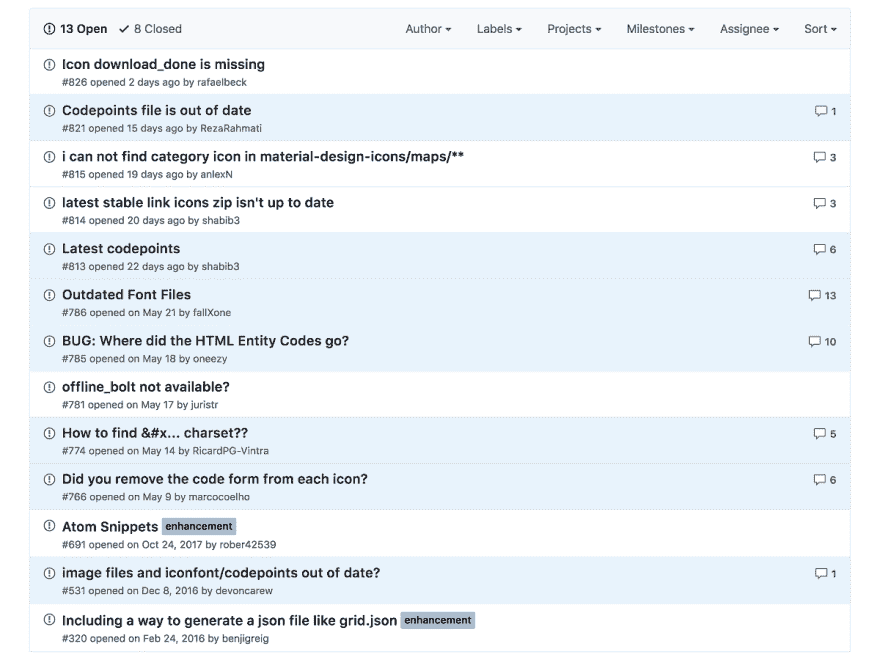
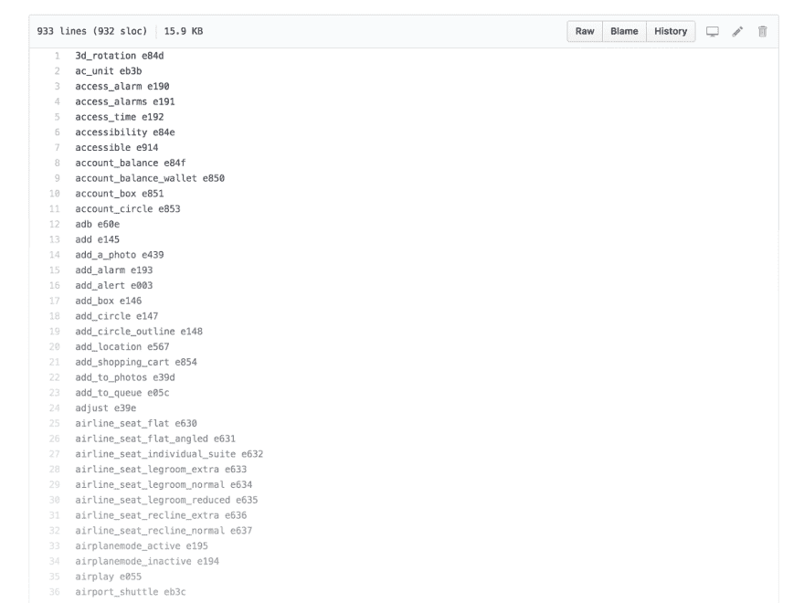
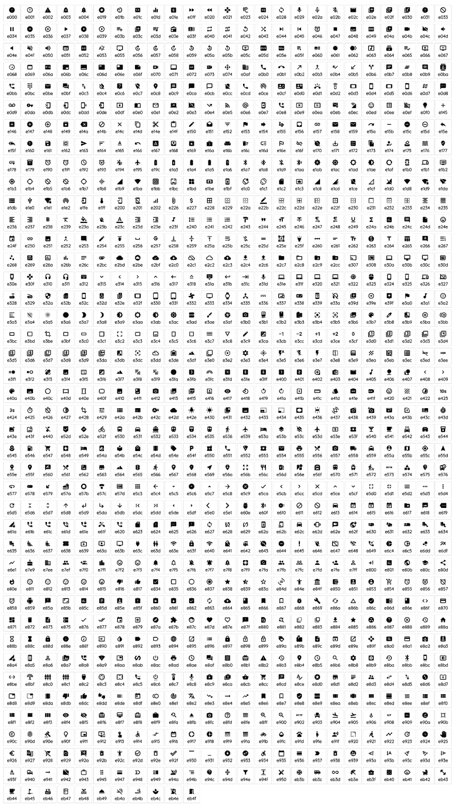

# 缺少代码点

> 原文：<https://dev.to/ijlee2/missing-codepoints-3ghk>

*原贴于[crunching numbers . live](https://crunchingnumbers.live/2018/07/21/missing-codepoints)T3】*

作为一个周六的项目，我从材料图标中挖掘出缺失的代码点，并向谷歌发出[拉取请求。](https://github.com/google/material-design-icons/pull/828)

## 问题:

由于最近的更新，开发者和设计者有大约 100 个额外的图标可以在他们的项目中使用。遗憾的是，他们在[官网](https://material.io/tools/icons/?style=baseline)上再也找不到代码点，只能找到图标名称。更糟糕的是，[谷歌回购](https://github.com/google/material-design-icons/blob/ac75e8329cc936816f1c5e2de182858efe7530ab/iconfont/codepoints)的 codepoints 文件没有更新以显示新图标。

我个人需要知道这些值才能在 D3 中渲染图标。拥有一个同时显示代码点和图标名称的网站可以帮助我节省时间。似乎有许多其他人也需要知道这两者。

<figure>

[T2】](https://res.cloudinary.com/practicaldev/image/fetch/s--7HwaGXER--/c_limit%2Cf_auto%2Cfl_progressive%2Cq_auto%2Cw_880/https://crunchingnumbersdotlive.files.wordpress.com/2018/07/github_issues.png)

<figcaption>There are many open issues on Google’s repo asking for codepoints to be updated.</figcaption>

</figure>

## 解:

为了解决这个问题，我创建了一个 Ember app，通过 3 个步骤找到所有图标:(1)将从 **e000** 到 **efff** (4096 种可能性)的每个值渲染为一个图标；(2)获取元素宽度(= 24px，如果定义了图标，<否则为 24px)，以及(3)移除不是图标的元素。因为我多次更新 DOM，所以搜索是一项相当慢的任务。

一旦完成，我有 *1036 个代码点*。我知道如何从现有的代码点文件中把其中的 932 个映射到一个图标名[。我必须找出*失踪的 104 个*的图标名称。](https://github.com/google/material-design-icons/blob/ac75e8329cc936816f1c5e2de182858efe7530ab/iconfont/codepoints)

<figure>

[T2】](https://res.cloudinary.com/practicaldev/image/fetch/s--bdSmgnH---/c_limit%2Cf_auto%2Cfl_progressive%2Cq_auto%2Cw_880/https://crunchingnumbersdotlive.files.wordpress.com/2018/07/existing_codepoints1.png)

<figcaption>Google’s codepoint file listed 932 icons but was missing 104 icons.</figcaption>

</figure>

在大多数情况下，我能够从网站的[中找到图标名称。手动搜索还是很慢，这让我希望我可以通过画图标来搜索，就像](https://material.io/tools/icons/?style=baseline)[我可以用乳胶符号](http://detexify.kirelabs.org/classify.html)一样。在 15 个例子中，网站没有列出图标，所以我不得不猜测图标名称，就像[猜测密码](https://crunchingnumbers.live/2016/11/18/passwords-part-1/)。

猜测变得有些有趣。谷歌经常(1)为图标类别使用特定的范围，(2)在正确的范围内为类别和代码点分配新图标，以及(3)遵循命名约定(简单明了，使用诸如**_ 添加**、**_ 圆圈**或**_ 轮廓**这样的词来描述外观)。

最终，我能够从 104 个丢失的图标中找到 97 个*的代码点和图标名称。请随意查看 https://material-icons.herokuapp.com/T2 的所有图标。*

[T2】](https://res.cloudinary.com/practicaldev/image/fetch/s--dX7-kzed--/c_limit%2Cf_auto%2Cfl_progressive%2Cq_auto%2Cw_880/https://crunchingnumbersdotlive.files.wordpress.com/2018/07/all_codepoints.png)

### 备注

您可以在这里找到完整的代码:

[从 GitHub 下载](https://github.com/ijlee2/material-design-icons-codepoints)