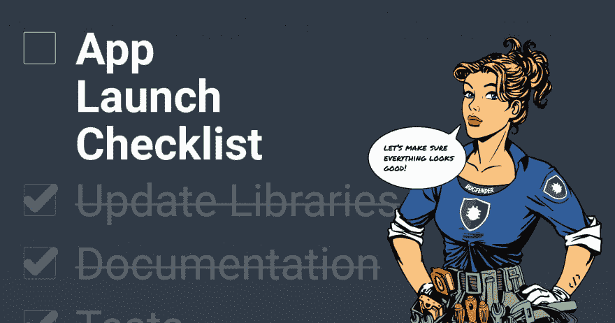

# 移动应用启动清单

> 原文：<https://dev.to/bugfenderapp/mobile-app-launch-checklist-7a7>

[T2】](https://res.cloudinary.com/practicaldev/image/fetch/s--pVmts6lg--/c_limit%2Cf_auto%2Cfl_progressive%2Cq_auto%2Cw_880/https://bugfender.com/wp-content/uploads/2018/06/app-launch-blog-post-featured.jpg)

*这篇文章最初发表在我们的[博客](https://bugfender.com/blog/mobile-app-launch-checklist/)上。*

我们创建这个资源是为了解决一个基本问题:一旦你完成了构建一个应用程序的所有工作，你怎么能确定能成功呢？

在匆忙推出应用程序的过程中，许多开发人员可能会忘记标记版本，或者丢失只需为未来更新指定的存储信息。需要采取一些最终的安全措施来保护您的应用程序。不管是因为兴奋还是疲劳，它都会发生。现在遵循一个协议将会为你以后节省很多时间。

在用户方面，你最不希望的就是一个简单但尚未解决的 bug 成为迎接新应用用户的第一件事。用户支持需要在整个过程中以多种形式提供，这样你就不会在用户下载应用后的几分钟内失去他们。

幸运的是，作为一个由[经验丰富的移动应用程序开发人员](https://mobilejazz.com/services)组成的团队，我们已经为发布一个应用程序创建了一个可靠的清单，现在我们将它发布给你。如果脑外科医生必须遵循协议，软件工程师可能会考虑寻找如何启动应用程序的路线图，以避免以后不必要的问题。

不要让你的移动应用程序发布成为事后想法。

清单将未来的用户记在心里。确保星星对齐，这样当客户第一次见到你的应用程序时，就会对它一见钟情，而不是在第一次下载时就删除。

## 手机 App 启动清单

对于任何版本，请确保您有必要的工具来为您的应用程序提供支持。我们建议采取以下步骤来取悦您的用户，让您的生活更加轻松:

*   安装[对讲机](https://www.intercom.com/)以提供与客户支持的聊天
*   将日志记录工具添加到您的应用程序:
    *   [Bugfender](https://bugfender.com/) 远程查看应用程序的日志并捕获崩溃
    *   [CocoaLumberjack(iOS)](https://github.com/CocoaLumberjack/CocoaLumberjack)/[Timber(Android)](https://github.com/JakeWharton/timber)捕获应用程序日志
    *   [Crashlytics](https://try.crashlytics.com/) 如果您只需要崩溃收集
*   检查与该版本对应的所有问题/票据/任务是否标记为已完成或已重新安排到另一个版本。
*   检查所有依赖库是否都是最新的:
    *   如果有可用的次要版本更新，请更新它们。
    *   如果有可用的主要版本更新，请创建一个新任务，以确保它们在应用程序的下一版本中得到更新。
*   编译您的应用程序代码，并检查是否有警告。
*   运行静态代码分析和 linter，并修复检测到的任何问题。
*   运行所有测试(单元、集成、系统等)并确保它们全部通过。
*   测试您的应用:
    *   在最常用你的应用的真实设备上。这些可能不是最新的设备，但你应该确保你的用户能够使用你的应用。
    *   最新版本的 iOS 和 Android 在没有真实设备的情况下使用模拟器。
*   如果您的应用程序需要一个数据库，而该数据库需要使用新版本的应用程序进行更新:
    *   从移动设备上删除应用程序的新测试版本。
    *   安装旧版本的应用程序，并输入一些测试数据。
    *   将应用程序的安装升级到最新版本，并检查数据迁移是否正常工作。
*   用版本号标记代码库的版本。
*   对于 iOS 应用程序，保留生成的 dSYM 文件的副本。
    *   出于安全考虑，确保调试符号不包含在二进制文件中(有一个编译设置)。如果不采取这种预防措施，它可能会被用来逆向工程或攻击应用程序。
*   如果你在 Android 上使用[Proguard](https://www.guardsquare.com/en/proguard)/[dex guard](https://www.guardsquare.com/en/dexguard)，保留一份映射文件(mapping.txt)。
*   通知开发团队关于新版本的信息，以便:
    *   测试部署并确保没有人遇到问题。
    *   确保每个人都将他们的本地工作库更新到新版本。
*   先发布一个测试版，然后才是正式版。也值得考虑分阶段推出。
*   文档:
    *   发布一个内部文档，其中包含已完成的任务列表以及对以前版本的更改。
    *   确保应用程序的文档、帮助页面和手册是最新的。
    *   为公众创建一个详细的变更日志。
*   在 App Store/Google Play store 上更新应用的描述和截图。
    *   提示:[浪子](https://fastlane.tools/)是一个很好的工具，可以自动截图，并将测试版和生产版发送到应用商店。
*   创建一个生产版本，并将其上传到应用商店。
    *   我们建议您也保留一份构建文件的副本(ipa 或 apk)。这将有助于您的团队轻松测试任何版本的应用程序。

**[点击此处下载手机 App 启动清单](https://bugfender.com/wp-content/themes/bugfender-wordpress-theme/assets/docs/App-Launch-Checklist.pdf)**

有了这个清单，你的团队就能实现它。无论我们帮助推出了多少次应用程序，总会有一些细节我们忘记了，或者在没有合适的工具和清单的情况下随意执行。

希望这个列表有所帮助！你还有其他有用的建议或流程吗？让我们知道！

*这篇文章最初发表在我们的[博客](https://bugfender.com/blog/mobile-app-launch-checklist/)上。*