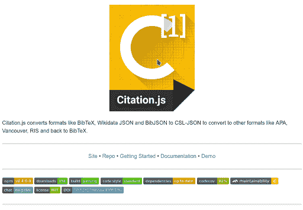

# 现代替代徽章

> 原文：<https://dev.to/larsgw/modern-altmetric-badges-43jk>

我最近发现自己又在使用 [Altmetric 徽章](http://api.altmetric.com/embeds.html)了，我意识到使用脚本有多麻烦。Altmetric 徽章只能通过使用其 JavaScript 库来添加，而如果有一个嵌入徽章的简单 URL，甚至是一个图像，将会对用户更加友好。我可能有点被开源社区的徽章生态系统宠坏了，包括 [Shields.io](https://shields.io) 。在那里，徽章是在服务器端动态生成的。

[](https://res.cloudinary.com/practicaldev/image/fetch/s--V8N-tH-x--/c_limit%2Cf_auto%2Cfl_progressive%2Cq_auto%2Cw_880/https://lh3.googleusercontent.com/UQg3vzcJxQfpfN-BxyrPL1mPXJA8DJuPbMaBT3f2j8OlO0rllgifKTGPIkTzKJFvEAWXNxXrNaGaHw) 

*开源 JavaScript 项目中的徽章*

遗憾的是，Shields 不支持 Altmetric。不过，它支持动态徽章，Altmetric 也有 API。基于 DOI 的访问的端点是`api.altmetric.com/v1/doi/`(这就是我们在这种情况下想要的)。所以徽章需要的参数是:

*   数据类型:JSON(API 的输出格式)
*   `label`:高度公制
*   `url` : `https://api.altmetric.com/v1/doi/<DOI>`
*   `query` : `$.score`
*   `style` : `social`

`logo`应该是`https://www.altmetric.com/wp-content/themes/altmetric/favicon.ico`，但是我不能让它工作。产生的 URL 是

```
https://img.shields.io/badge/dynamic/json.svg?url=https://api.altmetric.com/v1/doi/DOI&label=Altmetric&query=$.score&style=social 
```

哪个长得像这样: [](https://res.cloudinary.com/practicaldev/image/fetch/s--8QXoVVKt--/c_limit%2Cf_auto%2Cfl_progressive%2Cq_auto%2Cw_880/https://thepracticaldev.s3.amazonaws.com/i/jqhwmhokrwm7ij0kg6qm.png)

然而，请注意， [Altmetric API 的使用受到限制](http://api.altmetric.com/):

> 免费的限速 API
> 
> *   不需要钥匙。
> *   仅包括研究对象元数据和指标。
> *   仅适用于一次性的短期研究项目。
> *   最适合小型项目。
> *   速率限制为每秒 1 次通话。