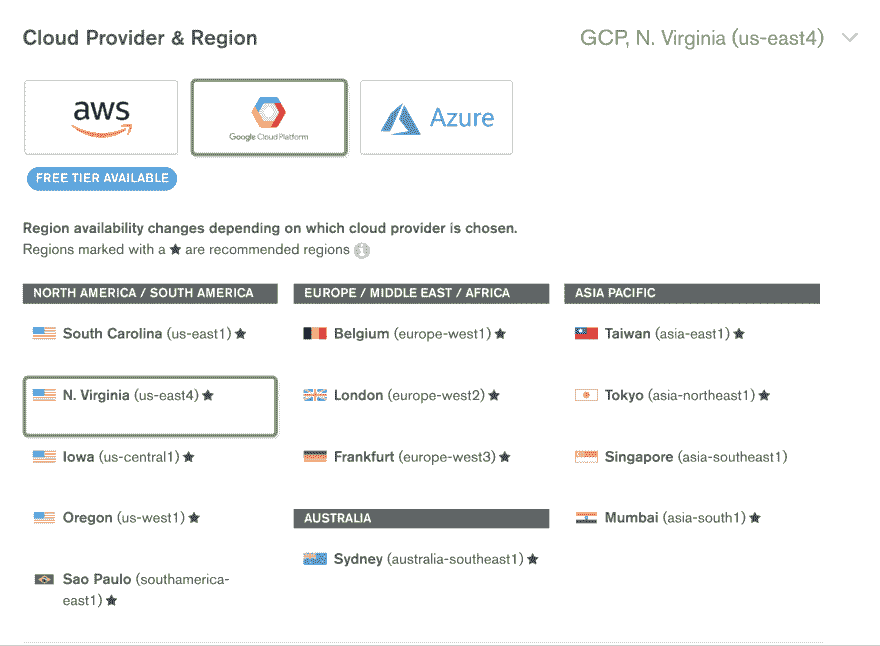
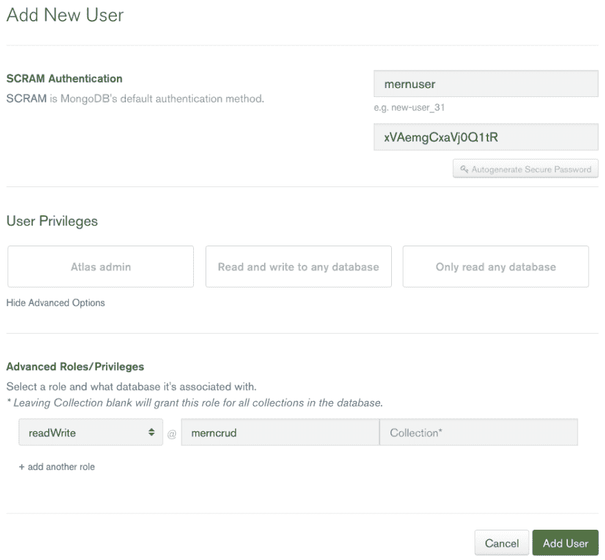
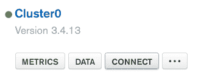
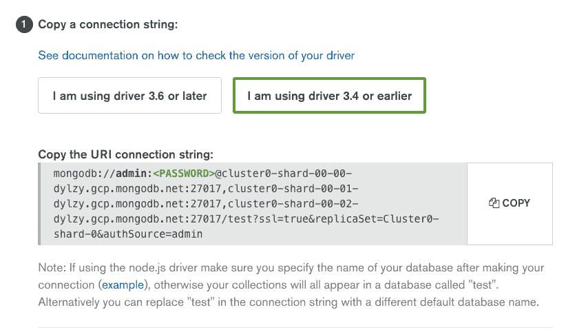
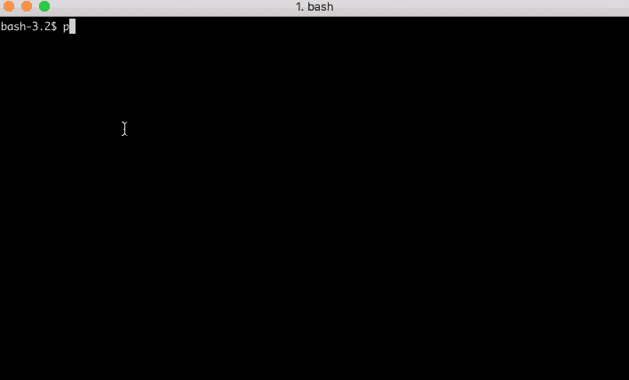
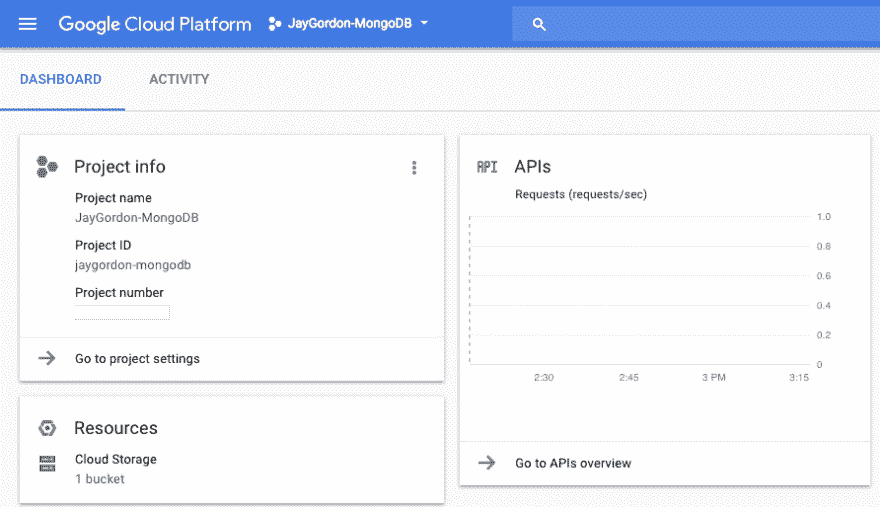
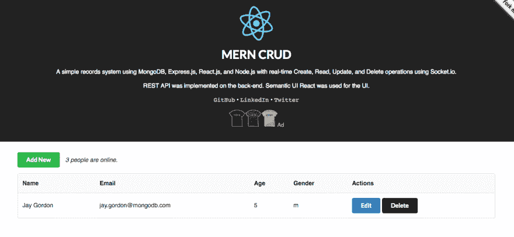
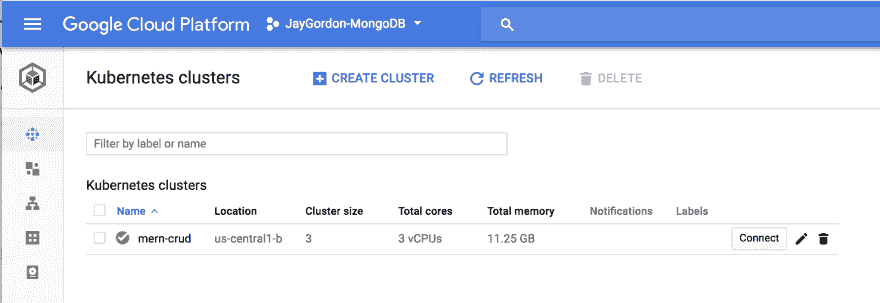
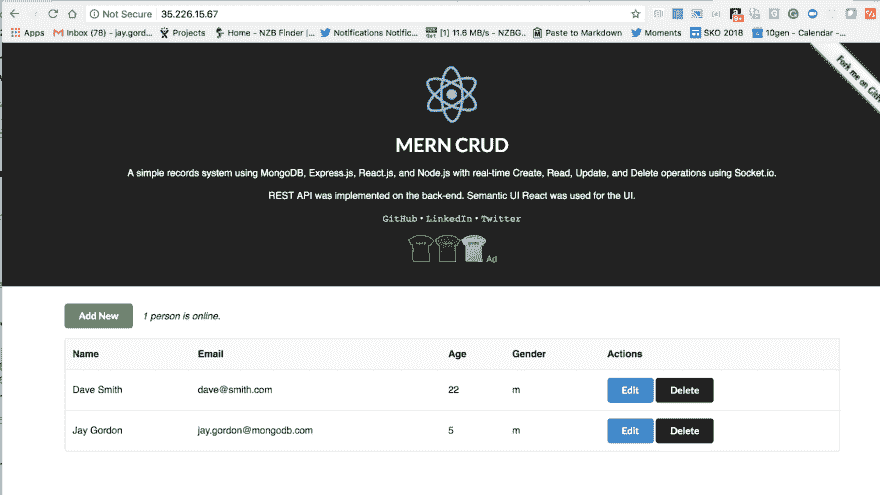

# 使用 Kubernetes 和 MongoDB Atlas 部署现代分布式应用程序

> 原文：<https://dev.to/mongodb/modern-distributed-application-deployment-with-kubernetes-and-mongodb-atlas-159j>

讲故事是作为一名开发者拥护者的一部分，我很喜欢。有时故事是关于团队聚在一起保持系统运行或更快构建系统的特殊时刻。但是，关于我参与的软件部署，没有什么光荣的故事可讲。对于我们需要一天部署几次的情况，现在我们说的是噩梦。

有一段时间，我在一家公司工作，该公司认为一天几次部署到生产对于项目速度是理想的。我们的团队致力于确保我们媒体平台上的广告软件始终得到更新和发布。其中一个问题是在向我们的应用服务器应用新代码的过程中缺乏真正的自动化。

运营团队和开发团队的共同点是希望提高应用程序和配置部署的易用性和敏捷性。在本文中，我将展示我的一些经验，并介绍如何将 MongoDB Atlas 和 Kubernetes 结合起来简化应用程序及其底层依赖项的部署和管理过程。

让我们来谈谈典型的软件部署是如何展开的:

1.  开发人员会发送一个请求部署的标签
2.  开发人员和我会商定部署最新软件版本的时间
3.  我们将使用适当的 git 存储库版本信息修改现有的 bash 脚本
4.  我们需要手动备份旧的部署
5.  我们需要手动创建当前数据库的备份
6.  我们会看到 bash 脚本在大约 6 台并行服务器上执行这种“部署”
7.  在我的键盘上挥舞一只死鸡

其中一些部署会失败，需要返回到应用程序代码的先前版本。这个“回滚”到先前版本的过程需要我手动将存储库复制到旧版本，执行手动数据库恢复，最后与使用该系统的团队确认一切正常。这真是一团糟，我真的没有能力去改变它。

我最终进入了一个职位，这个职位让我对其他开发团队，特别是开源领域的开发团队，为软件部署所做的事情有了更多的了解。我注意到了——惊喜！—人们不再对一遍又一遍地做同样的工作感兴趣。

在过去的几年中，通过利用容器和自动化平台，开发人员和他们的支持运营团队已经获得了一个全新世界的钥匙。由于有了 Kubernetes 这样的工具，您可以快速部署应用程序，而不是手工制作应用程序的环境。

#### 什么是立方？

Kubernetes 是一个用于自动化部署、扩展和管理容器化应用的开源系统。Kubernetes 可以帮助减少您的团队在部署应用程序时必须做的工作量。有了 MongoDB Atlas，您可以构建可伸缩且有弹性的应用程序，这些应用程序可以承受高流量，或者可以轻松地缩减规模以降低成本。Kubernetes 几乎可以在任何地方运行，几乎可以使用任何基础设施。如果您使用公共云、混合云甚至裸机解决方案，您可以利用 Kubernetes 快速部署和扩展您的应用程序。

Google Kubernetes 引擎内置在 Google 云平台中，可以帮助你快速部署你的容器化应用。

出于本教程的目的，我将把我们的[映像](https://docs.docker.com/engine/reference/commandliimg/)上传到 GCP，然后部署到一个 Kubernetes 集群，这样我就可以根据需要快速扩展或缩小我们的应用程序。当我创建我们的应用程序的新版本或进行增量更改时，我可以简单地创建一个新的映像并使用 Kubernetes 再次部署。

#### 为什么 Atlas 用 Kubernetes？

通过为您的 MongoDB 应用程序一起使用这些工具，[您可以快速生成和部署应用程序](https://www.mongodb.com/blog/post/running-mongodb-as-a-microservice-with-docker-and-kubernetes?utm_medium=dev-synd&utm_source=dev&utm_content=kubernetes&jmp=dev-ref),而不必担心基础设施管理。Atlas 为您的应用程序数据提供了持久的数据存储，而无需管理实际的数据库软件、复制、升级或监控。所有这些功能都是现成的，允许您快速构建和部署。

在本教程中，我将为一个简单的 Node.js 应用程序构建一个 MongoDB Atlas 集群，其中包含我们的数据。然后，我将用 Docker 将 Atlas 的应用程序和配置数据转换成一个容器就绪的映像。

MongoDB Atlas 在 GCP 的大部分地区都可以使用，因此无论您的应用程序位于何处，您都可以将数据保存在云中。

[T2】](https://res.cloudinary.com/practicaldev/image/fetch/s--xH0aESuC--/c_limit%2Cf_auto%2Cfl_progressive%2Cq_auto%2Cw_880/https://webassets.mongodb.com/_com_assets/cms/image11-9eaw6kd3bq.png)

#### 要求

要学习本教程，用户需要满足以下一些要求:

*   [谷歌云平台账户](https://cloud.google.com/)(启用计费或信用)
*   MongoDB Atlas 账户(M10+专用集群)
*   [码头工人](https://docs.docker.com/install/)
*   [Node.js](https://nodejs.org/en/download/)
*   [Kubernetes](https://kubernetes.io/)
*   [去](https://git-scm.com/)

首先，我将下载我将使用的代码的存储库。在这种情况下，它是一个使用 MongoDB、Express、React 和 Node ( [MERN](https://www.mongodb.com/blog/post/the-modern-application-stack-part-1-introducing-the-mean-stack) )的基本记录应用程序。

```
bash-3.2$ git clone git@github.com:cefjoeii/mern-crud.git Cloning into 'mern-crud'... remote: Counting objects: 326, done. remote: Total 326 (delta 0), reused 0 (delta 0), pack-reused 326 Receiving objects: 100% (326/326), 3.26 MiB | 2.40 MiB/s, done. Resolving deltas: 100% (137/137), done. cd mern-crud 
```

Enter fullscreen mode Exit fullscreen mode

接下来，我将`npm install`并安装使用我们的应用程序所需的所有 npm 包:

```
\> uws@9.14.0 install /Users/jaygordon/work/mern-crud/node\_modules/uws \> node-gyp rebuild \> build\_log.txt 2\>&1 || exit 0 
```

Enter fullscreen mode Exit fullscreen mode

#### 为地图集选择您的 GCP 地区

每个 GCP 地区包括一定数量的独立区域。每个区域都有与其他区域隔离的电源、冷却、网络和控制平面。对于至少有三个区域(3Z)的地区，Atlas 会跨三个区域部署集群。对于只有两个区域(2Z)的地区，Atlas 跨两个区域部署集群。

Atlas [Add New Cluster](https://docs.atlas.mongodb.com/create-new-cluster/) 表单将支持 3Z 集群的区域标记为**推荐的**，因为它们提供了更高的可用性。如果您的首选区域只有两个区域，请考虑启用跨区域复制，并将一个副本集成员放在另一个区域，以增加群集在部分区域停机期间可用的可能性。

一个区域中的区域数量对 Atlas 可以部署的 MongoDB 节点数量没有影响。MongoDB Atlas 集群总是由至少包含三个 MongoDB 节点的副本集组成。

有关 GCP 地区和区域的一般信息，请参见关于[地区和区域](https://cloud.google.com/compute/docs/regions-zones/regions-zones)的谷歌文档。

#### 创建集群并添加用户

在下面提供的图片中，你可以看到我选择了云提供商“谷歌云平台”接下来，我选择了一个实例大小，在本例中是 M10。使用 M10 实例的部署非常适合开发。如果我要立即将这个应用程序投入生产，我可能会考虑使用 M30 部署。由于这是一个演示，M10 对于我们的应用来说已经足够了。有关所有集群规模的完整视图，请查看 [Atlas 定价页面](https://www.mongodb.com/cloud/atlas/pricing?utm_medium=dev-synd&utm_source=dev&utm_content=kubernetes&jmp=dev-ref)。一旦我完成了这些步骤，我可以点击“确认&部署”按钮。Atlas 将在几分钟内自动启动我的部署。

[T2】](https://res.cloudinary.com/practicaldev/image/fetch/s--zgiWrlnl--/c_limit%2Cf_auto%2Cfl_progressive%2Cq_auto%2Cw_880/https://webassets.mongodb.com/_com_assets/cms/image5-ajs6tzndo6.png)

让我们为我们的数据库创建一个用户名和密码，我们的 Kubernetes 部署的应用程序将使用它来访问 MongoDB。

*   点击页面顶部的“安全”。
*   点击“MongoDB 用户”
*   单击“添加新用户”
*   单击“显示高级选项”
*   然后，我们将为我们的`mern-crud`应用程序添加一个用户“`mernuser`”，该用户只能访问名为“`mern-crud`”的数据库，并给它一个复杂的密码。我们将为该用户指定读写权限:

[T2】](https://res.cloudinary.com/practicaldev/image/fetch/s--HaqQefLy--/c_limit%2Cf_auto%2Cfl_progressive%2Cq_auto%2Cw_880/https://webassets.mongodb.com/_com_assets/cms/image4-7zj12s4cqg.png)

点击“添加用户”

[T2】](https://res.cloudinary.com/practicaldev/image/fetch/s--PkHNA7D3--/c_limit%2Cf_auto%2Cfl_progressive%2Cq_auto%2Cw_880/https://webassets.mongodb.com/_com_assets/cms/image3-cjbte3zdg0.png)

现在，您的数据库已经创建，您的用户也已添加。你仍然需要我们的连接字符串和通过网络访问白名单。

#### 连接字符串

点击“集群”，然后点击 Atlas 管理面板中集群详情旁边的“连接”,获取连接字符串。选择 connect 后，您可以使用几个选项来连接到您的集群。单击“连接您的应用程序”

[T2】](https://res.cloudinary.com/practicaldev/image/fetch/s--98xZqkIl--/c_limit%2Cf_auto%2Cfl_progressive%2Cq_auto%2Cw_880/https://webassets.mongodb.com/_com_assets/cms/image7-eamyhl5j2h.png)

给出了 MongoDB 驱动程序 3.6 或 3.4 版本的选项。我使用 3.4 驱动程序构建了我的，所以我将只选择这个版本的连接字符串。

[T2】](https://res.cloudinary.com/practicaldev/image/fetch/s--LdemPvD8--/c_limit%2Cf_auto%2Cfl_progressive%2Cq_auto%2Cw_880/https://webassets.mongodb.com/_com_assets/cms/image2-9j8etbr92r.png)

我通常将它粘贴到一个编辑器中，然后修改信息以匹配我的应用程序凭证和我的数据库名称:

[T2】](https://res.cloudinary.com/practicaldev/image/fetch/s--NsnJhQMA--/c_limit%2Cf_auto%2Cfl_progressive%2Cq_auto%2Cw_880/https://webassets.mongodb.com/_com_assets/cms/image6-2isshwlpf9.png)

我现在将它添加到应用程序的数据库配置文件，并保存它。

[T2】](https://res.cloudinary.com/practicaldev/image/fetch/s--k6KgpugQ--/c_limit%2Cf_auto%2Cfl_progressive%2Cq_66%2Cw_880/https://webassets.mongodb.com/_com_assets/cms/image10-55bh5gtvch.gif)

接下来，我将用 Docker 将它打包成一个图像，并将其发送到 Google Kubernetes 引擎！

#### Docker 和 Google Kubernetes 引擎

首先在 Google Cloud 上创建一个帐户，然后[按照快速入门创建一个 Google Kubernetes 项目](https://cloud.google.com/kubernetes-engine/docs/quickstart)。

项目创建完成后，您可以在 Google 云平台控制面板中找到它:

[T2】](https://res.cloudinary.com/practicaldev/image/fetch/s--F4tmQus6--/c_limit%2Cf_auto%2Cfl_progressive%2Cq_auto%2Cw_880/https://webassets.mongodb.com/_com_assets/cms/image12-3i4jewybqk.png)

是时候在本地工作站上创建一个容器了:

通过使用下面的命令检索 gcloud 上预先配置的项目 ID，在您的 shell 中设置环境变量【T0:】

```
export PROJECT\_ID="jaygordon-mongodb" gcloud config set project $PROJECT\_ID gcloud config set compute/zone us-central1-b 
```

Enter fullscreen mode Exit fullscreen mode

接下来，在您的存储库的根目录中放置一个`Dockerfile`,如下所示:

```
FROM node:boron RUN mkdir -p /usr/src/app WORKDIR /usr/src/app COPY . /usr/src/app EXPOSE 3000 CMD [npm, start] 
```

Enter fullscreen mode Exit fullscreen mode

要构建这个应用程序的容器映像并标记它以便上传，运行下面的命令:

```
bash-3.2$ docker build -t gcr.io/${PROJECT\_ID}/mern-crud:v1 . Sending build context to Docker daemon 40.66MB Successfully built b8c5be5def8f Successfully tagged gcr.io/jgordon-gc/mern-crud:v1 
```

Enter fullscreen mode Exit fullscreen mode

将容器映像上传到容器注册中心，这样我们就可以对其进行部署:

```
Successfully tagged gcr.io/jaygordon-mongodb/mern-crud:v1 bash-3.2$ gcloud docker -- push gcr.io/${PROJECT\_ID}/mern-crud:v1The push refers to repository [gcr.io/jaygordon-mongodb/mern-crud] 
```

Enter fullscreen mode Exit fullscreen mode

接下来，我将在我的工作站上本地测试它，以确保应用程序加载:

```
docker run --rm -p 3000:3000 gcr.io/${PROJECT\_ID}/mern-crud:v1 \> mern-crud@0.1.0 start /usr/src/app \> node server Listening on port 3000 
```

Enter fullscreen mode Exit fullscreen mode

[T2】](https://res.cloudinary.com/practicaldev/image/fetch/s--1SHFpVuh--/c_limit%2Cf_auto%2Cfl_progressive%2Cq_auto%2Cw_880/https://webassets.mongodb.com/_com_assets/cms/image13-en0z97dmj5.png)

太好了——将我的浏览器指向 http://localhost:3000 会把我带到这个网站。现在是时候创建一个 kubernetes 集群并在其上部署我们的应用程序了。

#### 使用 Google Kubernetes 引擎构建您的集群

我将使用谷歌云控制面板中的[谷歌云外壳](https://cloud.google.com/shell/)来管理我的部署。cloud shell 安装了所有需要的应用程序和工具，允许您部署我上传到 image registry 的 Docker 映像，而无需在我的本地工作站上安装任何其他软件。

现在，我将创建 kubernetes 集群，在其中部署映像，这将有助于将我们的应用程序投入生产。我将包括三个节点，以确保我们的应用程序正常运行。

**先设置我们的环境:**

```
export PROJECT\_ID="jaygordon-mongodb" gcloud config set project $PROJECT\_ID gcloud config set compute/zone us-central1-b 
```

Enter fullscreen mode Exit fullscreen mode

**启动集群**

```
gcloud container clusters create mern-crud --num-nodes=3 
```

Enter fullscreen mode Exit fullscreen mode

完成后，您将在控制面板中看到一个三节点 kubernetes 集群。几分钟后，控制台将响应以下输出:

```
Creating cluster mern-crud...done. Created [https://container.googleapis.com/v1/projects/jaygordon-mongodb/zones/us-central1-b/clusters/mern-crud]. To inspect the contents of your cluster, go to: https://console.cloud.google.com/kubernetes/workload\_/gcloud/us-central1-b/mern-crud?project=jaygordon-mongodb kubeconfig entry generated for mern-crud. NAME LOCATION MASTER\_VERSION MASTER\_IP MACHINE\_TYPE NODE\_VERSION NUM\_NODES STATUS mern-crud us-central1-b 1.8.7-gke.1 35.225.138.208 n1-standard-1 1.8.7-gke.1 3 RUNNING 
```

Enter fullscreen mode Exit fullscreen mode

[T2】](https://res.cloudinary.com/practicaldev/image/fetch/s--MN_Lcroy--/c_limit%2Cf_auto%2Cfl_progressive%2Cq_auto%2Cw_880/https://webassets.mongodb.com/_com_assets/cms/image9-8ick04i0id.png)

只剩几步了。现在，我们将使用 [kubectl](https://kubernetes.io/docs/reference/kubectl/overview/) 将我们的应用从谷歌云外壳
部署到我们的集群

```
kubectl run mern-crud --image=gcr.io/${PROJECT\_ID}/mern-crud:v1 --port 3000 
```

Enter fullscreen mode Exit fullscreen mode

**完成后的输出应该是:**

```
jay\_gordon@jaygordon-mongodb:~$ kubectl run mern-crud --image=gcr.io/${PROJECT\_ID}/mern-crud:v1 --port 3000 deployment "mern-crud" created 
```

Enter fullscreen mode Exit fullscreen mode

**现在查看应用程序部署状态:**

```
jay\_gordon@jaygordon-mongodb:~$ kubectl get pods NAME READY STATUS RESTARTS AGE mern-crud-6b96b59dfd-4kqrr 1/1 Running 0 1m jay\_gordon@jaygordon-mongodb:~$ 
```

Enter fullscreen mode Exit fullscreen mode

**我们将为集群中的三个节点创建一个负载平衡器，这样它们就可以为我们的应用程序的 web 服务:**

```
jay\_gordon@jaygordon-mongodb:~$ kubectl expose deployment mern-crud --type=LoadBalancer --port 80 --target-port 3000 service "mern-crud" exposed 
```

Enter fullscreen mode Exit fullscreen mode

现在获取负载均衡器的 IP 地址，如果需要的话，它可以绑定到一个 DNS 名称，您就可以开始工作了！

```
jay\_gordon@jaygordon-mongodb:~$ kubectl get service NAME TYPE CLUSTER-IP EXTERNAL-IP PORT(S) AGE kubernetes ClusterIP 10.27.240.1 <none> 443/TCP 11m
mern-crud LoadBalancer 10.27.243.208 35.226.15.67 80:30684/TCP 2m
</none> 
```

Enter fullscreen mode Exit fullscreen mode

快速卷曲测试显示我的应用程序在线！

```
bash-3.2$ curl -v 35.226.15.67 \* Rebuilt URL to: 35.226.15.67/ \* Trying 35.226.15.67... \* TCP\_NODELAY set \* Connected to 35.226.15.67 (35.226.15.67) port 80 (#0) \> GET / HTTP/1.1 \> Host: 35.226.15.67 \> User-Agent: curl/7.54.0 \> Accept: \*/\* \> \< HTTP/1.1 200 OK \< X-Powered-By: Express 
```

Enter fullscreen mode Exit fullscreen mode

[T2】](https://res.cloudinary.com/practicaldev/image/fetch/s--_PY0cTqz--/c_limit%2Cf_auto%2Cfl_progressive%2Cq_auto%2Cw_880/https://webassets.mongodb.com/_com_assets/cms/image8-n0exkoowr4.png)

我添加了一些测试数据，正如我们所看到的，这是我通过 Kubernetes 部署到 GCP 的应用程序的一部分，并将我的持久数据存储在 MongoDB Atlas 中。

当我使用完 Kubernetes 集群后，我可以轻松地销毁它:

`gcloud container clusters delete mern-crud`

#### 接下来是什么？

现在，您已经拥有了使用 MongoDB Atlas 和 Kubernetes 构建大型项目的所有工具。

查看剩余的 Google Kubernetes 引擎教程,了解更多关于如何使用 Kubernetes 构建应用程序的信息。关于 MongoDB Atlas 的更多信息，[点击这里](https://www.mongodb.com/cloud/atlas)。