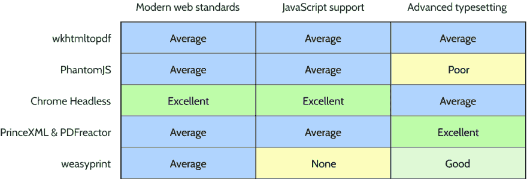

# 现代 HTML 到 PDF 的转换

> 原文：<https://dev.to/nickpad/modern-html-to-pdf-conversion-31i0>

许多 web 应用程序需要某种 PDF 功能。作为一名 web 开发人员，我们已经知道了一种布局文档的好方法——HTML！

但是将 HTML 转换成 PDF 有一系列令人困惑的选择。在本文中，我将考虑以下几点的利弊:

*   像 [wkhtmltopdf](https://wkhtmltopdf.org/) 这样已经使用多年的成熟工具
*   “无头”模式下的谷歌浏览器
*   专为将 HTML 转换为 PDF 而构建的专业软件

我应该提前声明，我最初是为 [Paperplane](https://www.paperplane.app/?utm_source=devto&utm_campaign=convert-html-to-pdf-2018) 博客写的这篇文章。Paperplane 是我为生成 pdf 而创建的云 API，但它只是众多可用选项中的一个。我试图对本文中介绍的每一种选择的利弊进行公平而准确的比较。

## 屡试不爽的方法

直到 2017 年，HTML 转换成 PDF 的常用方式有两种。第一个是使用[wkhtmltopdf](https://wkhtmltopdf.org/)——一个专门为该任务设计的开源命令行工具。第二个选择是 [PhantomJS](http://phantomjs.org/) ，一个开源的“无头”网络浏览器，可以用 JavaScript 控制。

尽管这些工具为许多人提供了极好的服务，但它们也有一些缺点。对最新 HTML5 和 JavaScript 功能的支持远远落后于我们习惯的现代浏览器，如 Chrome、Firefox 或 Safari。wkhtmltopdf [的一些用户报告了渲染](https://blog.rebased.pl/2018/07/12/wkhtmltopdf-considered-harmful.html)不一致的问题，并且不得不使用试错法来调整设置以实现期望的输出。与 wkhtmltopdf 相比，PhantomJS 提供的配置 PDF 输出的选项较少，并且该项目的开发于 2018 年 3 月暂停。

## 铬无头

2017 年 4 月，随着谷歌 Chrome 59 的[发布，事情发生了变化，其中包括一个“无头”模式。结合](https://developers.google.com/web/updates/2017/04/headless-chrome) [Chrome 的“dev tools”API](https://chromedevtools.github.io/devtools-protocol/)，headless mode 允许你在服务器环境中使用 Chrome，并编写脚本来执行任务——比如创建 pdf！

你可以从使用“print-to-pdf”命令行选项的[开始，但是为了对 pdf 进行更多的控制，你需要与 Chrome 的 devtools API 进行通信。](https://developers.google.com/web/updates/2017/04/headless-chrome#create_a_pdf_dom)

## 用木偶师控制铬

自从 headless mode 发布以来，一个强大的工具生态系统已经出现，用于与 devtools API 进行交互。其中最重要的是“[木偶师](https://github.com/GoogleChrome/puppeteer)”，一个由谷歌 Chrome 团队自己构建的 [Node.js](https://nodejs.org/) 库。您可以使用 Puppeteer 编写浏览器脚本来执行无数的任务，但是我们将重点讨论如何使用它来创建 pdf。

### 在自己的服务器上用 Chrome 操作木偶

当你在你的服务器或开发环境中安装了 Puppeteer，[它会自动为你下载它自己的 Chrome 版本](https://github.com/GoogleChrome/puppeteer#installation)！出奇的简单，对吧？请记住，Chrome 的安装容量高达 300MB，运行 Chrome 可能会占用大量的服务器资源。

### 通过 browserless.io 使用木偶师

如果你不想在自己的基础设施上安装 Chrome，但确实喜欢使用木偶师的想法，那么值得看看一个名为 [browserless.io](http://browserless.io/) 的服务。它可以让你连接到云中运行的浏览器，让你从安装、运行和更新 Chrome 的服务器管理中解脱出来。您还可以并行运行多达 20 个浏览器会话。

### 通过谷歌云功能使用木偶师

一个有趣的新选项是能够在谷歌云的“无服务器”平台上运行 headless Chrome 云功能。这项功能于 2018 年 8 月添加到云功能中，应该可以提供一种低成本和高度可扩展的生成 pdf 的方式。谷歌的公告帖子有一个很好的演示，解释了如何设置这一切。

## 创建自己的 PDF 微服务

如果你想在你自己的服务器上生成 pdf，但是不想让所有与 PDF 相关的东西出现在你的主应用程序中，你应该看看 [pdf-bot](https://github.com/esbenp/pdf-bot) 。这是一个 Node.js 微服务，可以通过它的 API 接收 URL，将它们添加到队列中，然后在 URL 被转换为 PDF 时通过 webhooks 通知您。它还支持在亚马逊 S3 上存储您的 PDF 文件。

## 使用云 API 生成 pdf

如果你不介意支付少量费用来外包你的 PDF 基础设施，并专注于更重要的功能，考虑使用云 API。

Paperplane 是这里的一个选项——你将 URL 发送到它的 API，它会使用 Chrome 将它们转换成 PDF。完成的 pdf 上传到你自己的亚马逊 S3 存储。您可以设置页面大小等选项，并包括页眉和页脚，就像您使用木偶师一样。最后，如果您要创建大量文档，Paperplane 可以并行生成多达 20 个 pdf。要了解更多信息，你可以查看[完整的特性列表](https://www.paperplane.app/?utm_source=devto&utm_campaign=convert-html-to-pdf-2018)或者[文档](https://docs.paperplane.app/?utm_source=devto&utm_campaign=convert-html-to-pdf-2018)。

## 细粒度控制——高级排版功能

如果 Chrome 不能生成您需要的 PDF 输出，那么有几个商业软件包您可能想研究一下。这些都对 [CSS 分页媒体](https://drafts.csswg.org/css-page-3/)有很大的支持——一个控制打印或 PDF 输出的 CSS 模块。Chrome 中的 CSS 分页媒体支持是合理的，但目前在某些领域还不完整。

PrinceXML 能够创建非常好的格式输出(在他们的网站上查看[的样本](https://www.princexml.com/samples/)),但是单服务器许可证的价格高达 3800 美元。然而，如果你需要一些只有它能提供的功能，如自动断字、脚注或打印裁剪标记，那么这笔费用可能是值得的。

Docraptor 是一个由 PrinceXML 支持的云 API，可以让你以更低的价格开始使用 PrinceXML。

[PDFreactor](https://www.pdfreactor.com/) 是 PrinceXML 的竞争对手，其价格与 prince XML 相似，并且同样关注打印质量的 PDF 输出。

最后， [weasyprint](https://weasyprint.org/) 在这一类别中脱颖而出，成为唯一的免费开源选项。它比 Chrome 更好地支持分页媒体，但缺少 JavaScript 引擎。

## 比较选项

总的来说，我试图根据三个标准对不同的 PDF 呈现引擎进行分级——对现代 web 标准的支持，对 JavaScript 的支持，以及对分页媒体和其他高级排版功能的支持。

[T2】](https://res.cloudinary.com/practicaldev/image/fetch/s--yybx-Kx9--/c_limit%2Cf_auto%2Cfl_progressive%2Cq_auto%2Cw_880/https://thepracticaldev.s3.amazonaws.com/i/3q6xw1qv6mgsm0k3b1ub.png)

我希望这能帮助你为你的项目选择正确的选项！如果你已经做到这一步，让我知道你在评论中使用什么😀。